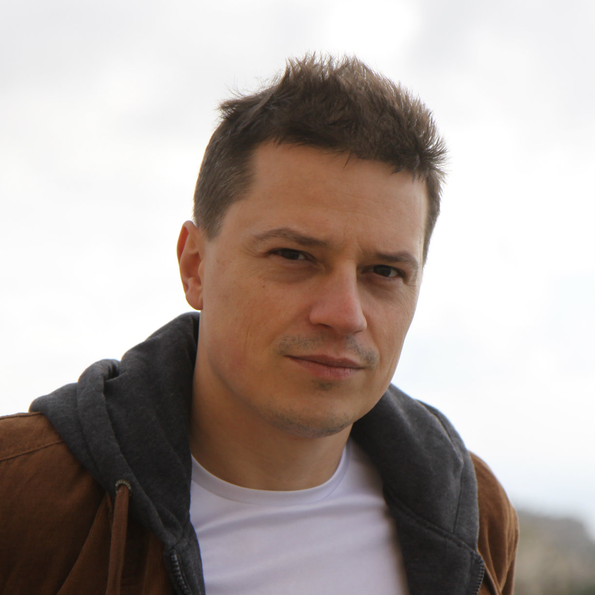

# ISO C++ Committee (WG21) Papers

That page hosts the list of WG21 papers that I created or co-authored with other C++ experts. Source versions
of those papers can be found on [GitHub](https://github.com/mpusz/wg21_papers).

## What is ISO C++ Committee?

Information on the ISO C++ Committee is available on [the Committee site](https://isocpp.org/std/the-committee).

## About me

Hi, my name is **Mateusz Pusz**. You can find more about me on my [LinkedIn](https://www.linkedin.com/in/mpusz) account.
To make a long story short I am doing C++ for fun and living for many years now. I am a C++ consultant, trainer,
and evangelist focused on Modern C++. I am also the founder of [Train IT](http://train-it.eu) created to provide
C++ training and consulting services all over the world. My main areas of interest and expertise are code performance,
low latency, stability, and security.

I am a member of the **ISO C++ Committee (WG21)** and **WG21 Study Group 14 (SG14)** and that page is dedicated to
that activity.

## My Papers

### Published

- [P0919: Heterogeneous lookup for unordered containers](papers/0919_heterogeneous_lookup_for_unordered_containers.html)
- [P0920: Precalculated hash values in lookup](papers/0920_precalculated_hash_values_in_lookup.html)

### Under Development

- [P1215: A C++ Approach to Physical Units](papers/1215_a_cpp_approach_to_physical_units.html)

## More Papers

All official ISO C++ Committee papers are available from [the C++ mailings](http://open-std.org/jtc1/sc22/wg21/docs/papers).
