# Revision history

## Changes since [@P2982R0]

- Fuel consumption example extended in [Converting between quantities of the same kind].
- [Dimension is not enough to describe a quantity] extended with [@MSRMT_DATA].
- [Lack of convertibility from fundamental types] added.
- Some small editorial fixes.


# Introduction

This document discusses the numeric and arithmetic aspects of the physical quantities and units
library. This subject is broader than it could be initially imagined. Arithmetic operations are not
only defined for user-facing types like `quantity` and `quantity_point`, but also for units and their
magnitudes, dimensions, quantity specifications, and references. Each has its own
requirements and constraints, and we will describe them in the following chapters.

_Note: The code examples presented in this paper may not exactly reflect the final interface
design that is going to be proposed in the follow-up papers. We are still doing some small
fine-tuning to improve the library._


# Terms and definitions

This document consistently uses the official metrology vocabulary defined in the [@ISO-GUIDE]
and [@BIPM-VIM].


# Systems of quantities

The physical units libraries on the market typically only focus on modeling one or more
systems of units. However, this is not the only system kind to model. Another, and maybe
even more important is a system of quantities. The most important example here is
the International System of Quantities (ISQ) defined by the series of [@ISO80000] documents.

## Dimension is not enough to describe a quantity

Most of the products on the market are aware of physical dimensions. However, a dimension is not
enough to describe a quantity. This has been known for a long time now. The [@MSRMT_DATA] report
from 1996 says explicitly, "Dimensional analysis does not adequately model the semantics of
measurement data".

A typical problem that most similar libraries struggle with is supporting quantities like work and
toque as being independent, strong types. The problem here arises from the fact that both of them
have exactly the same dimension `L²MT⁻²`, but a totally different physical meaning. As a result,
it is possible to mathematically add or compare them in a quantity equation even though such
an operation has no sense from the physical point of view.

A similar question that we could ask ourselves is what should be the result of:

```cpp
auto res = 1 * Hz + 1 * Bq + 1 * Bd;
```

where:

- `Hz` (hertz) - a unit of frequency
- `Bq` (becquerel) - a unit of activity
- `Bd` (baud) - a unit of modulation rate

All of those quantities have the same dimension, namely `T⁻¹`, but it is probably not wise to allow
adding, subtracting, or comparing them, as they describe vastly different physical properties.

It also is really tricky to separate handling of the quantities of dimension one. For example,
angular measure expressed in radians and solid angular measure expressed in steradians should
be independent. Any attempts to add or compare them should be detected at compile-time.

Last but not least, let's see the following implementation:

```cpp
class Box {
  quantity<square(si::metre)> base_;
  quantity<si::metre> height_;
public:
  Box(quantity<si::metre> l, quantity<si::metre> w, quantity<si::metre> h) : base_(l * w), height_(h) {}
  // ...
};

Box my_box(2 * m, 3 * m, 1 * m);
```

The above interface is far from being ideal. It does not provide any type-safety and enables
potentially severe errors caused by accidental reordering of the constructor's arguments.

It turns out that the above issues can't be solved correctly without proper modeling of
systems of quantities.

## Quantities of the same kind

The [@ISO-GUIDE] says:

- Quantities may be grouped together into categories of quantities that are **mutually comparable**
- Mutually comparable quantities are called **quantities of the same kind**
- Two or more quantities **cannot be added or subtracted unless they belong to the same category
  of mutually comparable quantities**
- Quantities of the **same kind** within a given system of quantities **have the same quantity
  dimension**
- Quantities of the **same dimension are not necessarily of the same kind**

[@ISO80000] also explicitly notes:

> **Measurement units of quantities of the same quantity dimension may be designated by the same name
> and symbol even when the quantities are not of the same kind**. For example, joule per kelvin and J/K
> are respectively the name and symbol of both a measurement unit of heat capacity and a measurement
> unit of entropy, which are generally not considered to be quantities of the same kind. **However,
> in some cases special measurement unit names are restricted to be used with quantities of specific
> kind only**. For example, the measurement unit ‘second to the power minus one’ (1/s) is called hertz
> (Hz) when used for frequencies and becquerel (Bq) when used for activities of radionuclides. As
> another example, the joule (J) is used as a unit of energy, but never as a unit of moment of force,
> i.e. the newton metre (N · m).

Those provide answers to all the issues mentioned above. More than one quantity may be defined for
the same dimension:

- quantities of different kinds (e.g. frequency, modulation rate, activity)
- quantities of the same kind (e.g. length, width, altitude, distance, radius, wavelength,
  position vector)

Two quantities can't be added, subtracted, or compared unless they belong to the same quantity kind.

## System of quantities is not only about kinds

The [@ISO80000] specifies hundreds of different quantities. Plenty of various kinds
are provided, and often, each kind contains more than one quantity. It turns out that such quantities
form a hierarchy of quantities of the same kind.

For example, here are all quantities of the kind length provided in [@ISO80000] (part 1):


Each of the above quantities expresses some kind of length, and each can be measured with meters,
which is the unit defined by the [@SI] for quantities of length. However, each has different
properties, usage, and sometimes even a different character (position vector and displacement
are vector quantities).

The below presents how such a hierarchy tree can be defined in the [@MP-UNITS] library:

```cpp
inline constexpr struct dim_length : base_dimension<"L"> {} dim_length;

inline constexpr struct length : quantity_spec<dim_length> {} length;
inline constexpr struct width : quantity_spec<length> {} width;
inline constexpr auto breadth = width;
inline constexpr struct height : quantity_spec<length> {} height;
inline constexpr auto depth = height;
inline constexpr auto altitude = height;
inline constexpr struct thickness : quantity_spec<width> {} thickness;
inline constexpr struct diameter : quantity_spec<width> {} diameter;
inline constexpr struct radius : quantity_spec<width> {} radius;
inline constexpr struct radius_of_curvature : quantity_spec<radius> {} radius_of_curvature;
inline constexpr struct path_length : quantity_spec<length> {} path_length;
inline constexpr auto arc_length = path_length;
inline constexpr struct distance : quantity_spec<path_length> {} distance;
inline constexpr struct radial_distance : quantity_spec<distance> {} radial_distance;
inline constexpr struct wavelength : quantity_spec<length> {} wavelength;
inline constexpr struct position_vector : quantity_spec<length, quantity_character::vector> {} position_vector;
inline constexpr struct displacement : quantity_spec<length, quantity_character::vector> {} displacement;
```

In the above code:

- `length` takes the base dimension to indicate that we are creating a base quantity that will serve
  as a root for a tree of quantities of the same kind,
- `width` and following quantities are branches and leaves of this tree with the parent always
  provided as the argument to `quantity_spec` class template,
- `breadth` is an alias name for the same quantity as `width`.

Please note that some quantities may be specified by [@ISO80000] as
vector or tensor quantities (e.g. `displacement`).

## Converting between quantities of the same kind

Quantity conversion rules can be defined based on the same hierarchy of quantities of kind length.

1. **Implicit conversions**

    - Every `width` is a `length`.
    - Every `radius` is a `width`.

    ```cpp
    static_assert(implicitly_convertible(isq::width, isq::length));
    static_assert(implicitly_convertible(isq::radius, isq::length));
    static_assert(implicitly_convertible(isq::radius, isq::width));
    ```

    In the [@MP-UNITS] library, implicit conversions are allowed on copy-initialization:

    ```cpp
    void foo(quantity<isq::length<m>> q);
    ```

    ```cpp
    quantity<isq::width<m>> q1 = 42 * m;
    quantity<isq::length<m>> q2 = q1;  // implicit quantity conversion
    foo(q1);                           // implicit quantity conversion
    ```

2. **Explicit conversions**

    - Not every `length` is a `width`.
    - Not every `width` is a `radius`.

    ```cpp
    static_assert(!implicitly_convertible(isq::length, isq::width));
    static_assert(!implicitly_convertible(isq::length, isq::radius));
    static_assert(!implicitly_convertible(isq::width, isq::radius));
    static_assert(explicitly_convertible(isq::length, isq::width));
    static_assert(explicitly_convertible(isq::length, isq::radius));
    static_assert(explicitly_convertible(isq::width, isq::radius));
    ```

    In the [@MP-UNITS] library, explicit conversions are forced by passing the quantity to a call
    operator of a `quantity_spec` type:

    ```cpp
    quantity<isq::length<m>> q1 = 42 * m;
    quantity<isq::height<m>> q2 = isq::height(q1);  // explicit quantity conversion
    ```

3. **Explicit casts**

    - `height` is never a `width`, and vice versa.
    - Both `height` and `width` are quantities of kind `length`.

    ```cpp
    static_assert(!implicitly_convertible(isq::height, isq::width));
    static_assert(!explicitly_convertible(isq::height, isq::width));
    static_assert(castable(isq::height, isq::width));
    ```

    In the [@MP-UNITS] library, explicit casts are forced with a dedicated `quantity_cast` function:

    ```cpp
    quantity<isq::width<m>> q1 = 42 * m;
    quantity<isq::height<m>> q2 = quantity_cast<isq::height>(q1);  // explicit quantity cast
    ```

4. **No conversion**

    - `time` has nothing in common with `length`.

    ```cpp
    static_assert(!implicitly_convertible(isq::time, isq::length));
    static_assert(!explicitly_convertible(isq::time, isq::length));
    static_assert(!castable(isq::time, isq::length));
    ```

    In the [@MP-UNITS] library, even the explicit casts will not force such a conversion:

    ```cpp
    void foo(quantity<isq::length[m]>);
    ```

    ```cpp
    foo(quantity_cast<isq::length>(42 * s)); // Compile-time error
    ```


With the above rules, one can write the following short application to calculate a fuel consumption:

```cpp
inline constexpr struct fuel_volume : quantity_spec<isq::volume> {} fuel_volume;
inline constexpr struct fuel_consumption : quantity_spec<fuel_volume / isq::distance> {} fuel_consumption;

const quantity fuel = fuel_volume(40. * l);
const quantity distance = isq::distance(550. * km);
const quantity<fuel_consumption[l / (mag<100> * km)]> q = fuel / distance;
std::cout << "Fuel consumption: " << q << "\n";
```

The above code prints:

```text
Fuel consumption: 7.27273 × 10⁻² l/km
```

Please note that, despite the dimensions of `fuel_consumption` and `isq::area` being the same (L²),
the constructor of a quantity `q` below will fail to compile when we pass an argument being the
quantity of area:

```cpp
static_assert(fuel_consumption.dimension == isq::area.dimension);

const quantity<isq::area[m2]> football_field = isq::length(105 * m) * isq::width(68 * m);
const quantity<fuel_consumption[l / (mag<100> * km)]> q2 = football_field;  // Compile-time error
const quantity q3 = q + football_field;                                     // Compile-time error
if (q == football_field) {                                                  // Compile-time error
  // ...
}
```

### Comparing, adding, and subtracting quantities of the same kind

[@ISO-GUIDE] explicitly states that `width` and `height` are quantities of the same kind and as such
they

- are mutually comparable, and
- can be added and subtracted.

If we take the above for granted, the only reasonable result of `1 * width + 1 * height` is `2 * length`,
where the result of `length` is known as a common quantity type. A result of such an equation is always
the first common node in a hierarchy tree of the same kind. For example:

```cpp
static_assert(common_quantity_spec(isq::width, isq::height) == isq::length);
static_assert(common_quantity_spec(isq::thickness, isq::radius) == isq::width);
static_assert(common_quantity_spec(isq::distance, isq::path_length) == isq::path_length);
```

```cpp
quantity q = isq::thickness(1 * m) + isq::radius(1 * m);
static_assert(q.quantity_spec == isq::width);
```

One could argue that allowing to add or compare quantities of height and width might be a safety
issue, but we need to be consistent with the requirements of [@ISO80000]. Moreover, from our
experience, disallowing such operations and requiring an explicit cast to a common quantity
in every single place makes the code so cluttered with casts that it nearly renders the library
unusable.

Fortunately, the above-mentioned conversion rules make the code safe by construction anyway.
Let's analyze the following example:

```cpp
inline constexpr struct horizontal_length : quantity_spec<isq::length> {} horizontal_length;

namespace christmas {

struct gift {
  quantity<horizontal_length[m]> length;
  quantity<isq::width[m]> width;
  quantity<isq::height[m]> height;
};

std::array<quantity<isq::length[m]>, 2> gift_wrapping_paper_size(const gift& g)
{
  const auto dim1 = 2 * g.width + 2 * g.height + 0.5 * g.width;
  const auto dim2 = g.length + 2 * 0.75 * g.height;
  return { dim1, dim2 };
}

}  // namespace christmas

int main()
{
  const christmas::gift lego = { horizontal_length(40 * cm), isq::width(30 * cm), isq::height(15 * cm) };
  auto paper = christmas::gift_wrapping_paper_size(lego);

  std::cout << "Paper needed to pack a lego box:\n";
  std::cout << "- " << paper[0] << " X " << paper[1] << "\n";  // - 1.05 m X 0.625 m
  std::cout << "- area = " << paper[0] * paper[1] << "\n";     // - area = 0.65625 m²
}
```

In the beginning, we introduce a custom quantity `horizontal_length` of a kind length, which then,
together with `isq::width` and `isq::height`, are used to define the dimensions of a Christmas gift.
Next, we provide a function that calculates the dimensions of a gift wrapping paper with some
wraparound. The result of both those expressions is a quantity of `isq::length`, as this is
the closest common quantity for the arguments used in this quantity equation.

Regarding safety, it is important to mention here, that thanks to the conversion rules provided above,
it would be impossible to accidentally do the following:

```cpp
void foo(quantity<horizontal_length[m]> q);

quantity<isq::width[m]> q1 = dim1;  // Compile-time error
quantity<isq::height[m]> q2{dim1};  // Compile-time error
foo(dim1);                          // Compile-time error
```

The reason of compilation errors above is the fact that `isq::length` is not implicitly convertible
to the quantities defined based on it. To make the above code compile, an explicit conversion of
a quantity type is needed:

```cpp
void foo(quantity<horizontal_length[m]> q);

quantity<isq::width[m]> q1 = isq::width(dim1);
quantity<isq::height[m]> q2{isq::height(dim1)};
foo(horizontal_length(dim1));
```

To summarize, rules for addition, subtraction, and comparison of quantities improve the library
usability, while the conversion rules enhance the safety of the library compared to the
libraries that do not model quantity kinds.

## Hierarchies of derived quantities

The same rules propagate to derived quantities. For example, we can define strongly typed horizontal
length and area:

```cpp
inline constexpr struct horizontal_length : quantity_spec<isq::length> {} horizontal_length;
inline constexpr struct horizontal_area : quantity_spec<isq::area, horizontal_length * isq::width> {} horizontal_area;
```

The first definition says that a horizontal length is a more specialized quantity than length and
belongs to the same quantity kind. The second line defines a horizontal area, which is a more
specialized quantity than area, so it has a more constrained recipe as well. Thanks to that:

```cpp
static_assert(implicitly_convertible(horizontal_length, isq::length));
static_assert(!implicitly_convertible(isq::length, horizontal_length));
static_assert(explicitly_convertible(isq::length, horizontal_length));

static_assert(implicitly_convertible(horizontal_area, isq::area));
static_assert(!implicitly_convertible(isq::area, horizontal_area));
static_assert(explicitly_convertible(isq::area, horizontal_area));

static_assert(implicitly_convertible(isq::length * isq::length, isq::area));
static_assert(!implicitly_convertible(isq::length * isq::length, horizontal_area));
static_assert(explicitly_convertible(isq::length * isq::length, horizontal_area));

static_assert(implicitly_convertible(horizontal_length * isq::width, isq::area));
static_assert(implicitly_convertible(horizontal_length * isq::width, horizontal_area));
```

Unfortunately, derived quantity equations often do not automatically form a hierarchy tree.
This is why sometimes it is not obvious what such a tree should look like. Also, the [@ISO-GUIDE]
explicitly states:

> The division of ‘quantity’ according to ‘kind of quantity’ is, to some extent, arbitrary.

The below presents some arbitrary hierarchy of derived quantities of kind energy:


Notice, that even though all of those quantities have the same dimension and can be expressed
in the same units, they have different quantity equations used to create them implicitly:

- `energy` is the most generic one and thus can be created from base quantities of `mass`, `length`,
  and `time`. As those are also the roots of quantities of their kinds and all other quantities are
  implicitly convertible to them, it means that an `energy` can be implicitly constructed from any
  quantity having proper powers of mass, length, and time.

    ```cpp
    static_assert(implicitly_convertible(isq::mass * pow<2>(isq::length) / pow<2>(isq::time), isq::energy));
    static_assert(implicitly_convertible(isq::mass * pow<2>(isq::height) / pow<2>(isq::time), isq::energy));
    ```

- `mechanical_energy` is a more "specialized" quantity than `energy` (not every `energy` is
  a `mechanical_energy`). It is why an explicit cast is needed to convert from either `energy` or
  the results of its quantity equation.

    ```cpp
    static_assert(!implicitly_convertible(isq::energy, isq::mechanical_energy));
    static_assert(explicitly_convertible(isq::energy, isq::mechanical_energy));
    static_assert(!implicitly_convertible(isq::mass * pow<2>(isq::length) / pow<2>(isq::time), isq::mechanical_energy));
    static_assert(explicitly_convertible(isq::mass * pow<2>(isq::length) / pow<2>(isq::time), isq::mechanical_energy));
    ```

- `gravitational_potential_energy` is not only even more specialized one but additionally,
  it is special in a way that it provides its own "constrained" quantity equation. Maybe not every
  `mass * pow<2>(length) / pow<2>(time)` is a `gravitational_potential_energy`, but every
  `mass * acceleration_of_free_fall * height` is.

    ```cpp
    static_assert(!implicitly_convertible(isq::energy, gravitational_potential_energy));
    static_assert(explicitly_convertible(isq::energy, gravitational_potential_energy));
    static_assert(!implicitly_convertible(isq::mass * pow<2>(isq::length) / pow<2>(isq::time), gravitational_potential_energy));
    static_assert(explicitly_convertible(isq::mass * pow<2>(isq::length) / pow<2>(isq::time), gravitational_potential_energy));
    static_assert(implicitly_convertible(isq::mass * isq::acceleration_of_free_fall * isq::height, gravitational_potential_energy));
    ```

## Modeling a quantity kind

In the physical units library, we also need an abstraction describing an entire family of
quantities of the same kind. Such quantities have not only the same dimension but also
can be expressed in the same units.

To annotate a quantity to represent its kind (and not just a hierarchy tree's root quantity),
in [@MP-UNITS] we introduced a `kind_of<>` specifier. For example, to express any quantity
of length, we need to specify `kind_of<isq::length>`. That entity behaves as any quantity of
its kind. This means that it is implicitly convertible to any quantity in a tree:

```cpp
static_assert(!implicitly_convertible(isq::length, isq::height));
static_assert(implicitly_convertible(kind_of<isq::length>, isq::height));
```

Additionally, the result of operations on quantity kinds is also a quantity kind:

```cpp
static_assert(same_type<kind_of<isq::length> / kind_of<isq::time>, kind_of<isq::length / isq::time>>);
```

However, if at least one equation's operand is not a quantity kind, the result becomes a "strong"
quantity where all the kinds are converted to the hierarchy tree's root quantities:

```cpp
static_assert(!same_type<kind_of<isq::length> / isq::time, kind_of<isq::length / isq::time>>);
static_assert(same_type<kind_of<isq::length> / isq::time, isq::length / isq::time>);
```

Please note that only a root quantity from the hierarchy tree or the one marked with `is_kind`
specifier in the `quantity_spec` definition can be put as a template parameter to the `kind_of`
specifier. For example, `kind_of<isq::width>` will fail to compile.


# Systems of units

Modeling a system of units is the most important feature and a selling point of every
physical units library. Thanks to that, the library can protect users from performing invalid
operations on quantities and provide automated conversion factors between various compatible units.

Probably all the libraries in the wild model the [@SI], and many of them provide support for
additional units belonging to various other systems (e.g. imperial).

## Systems of units are based on systems of quantities

Systems of quantities specify a set of quantities and equations relating to those quantities.
Those equations do not take any unit or a numerical representation into account at all. In order
to create a quantity, we need to add those missing pieces of information. This is where
a system of units kicks in.

The [@SI] is explicitly stated to be based on the ISQ. Among others, it defines seven base units,
one for each base quantity. In [@MP-UNITS], this is expressed by associating a quantity kind
to a unit being defined:

```cpp
inline constexpr struct metre : named_unit<"m", kind_of<isq::length>> {} metre;
```

The `kind_of<isq::length>` above states explicitly that this unit has an associated quantity
kind. In other words, `si::metre` (and scaled units based on it) can be used to express
the amount of any quantity of kind length.

Associated units are so useful and common in the [@MP-UNITS] library that they got their
own concepts `AssociatedUnit<T>` to improve the interfaces.

Please note that for some systems of units (e.g., natural units), a unit may not have an
associated quantity type. For example, if we define the speed of light constant as `c = 1`, we can
define a system where both length and time will be measured in seconds, and speed will be
a quantity measured with the unit `one`. In such case, the definition will look as follows:

```cpp
inline constexpr struct second : named_unit<"s"> {} second;
```

## Units compose

One of the strongest points of the [@SI] system is that its units compose. This allows providing
thousands of different units for hundreds of various quantities with a really small set of
predefined units and prefixes. For example, one can write:

```cpp
quantity<si::metre / si::second> q;
```

to express a quantity of speed. The resulting quantity type is implicitly inferred from
the unit equation by repeating exactly the same operations on the associated quantity kinds.

Also, as units are regular values, we can easily provide a helper ad-hoc unit with:

```cpp
constexpr auto mps = si::metre / si::second;
quantity<mps> q;
```


## Many shades of the same unit

The [@SI] provides the names for 22 common coherent units of 22 derived quantities.

Each such named derived unit is a result of a specific predefined unit equation.
For example, a unit of power quantity is defined as:

```cpp
inline constexpr struct watt : named_unit<"W", joule / second> {} watt;
```

However, a power quantity can be expressed in other units as well. For example,
the following:

```cpp
auto q1 = 42 * W;
std::cout << q1 << "\n";
std::cout << q1.in(J / s) << "\n";
std::cout << q1.in(N * m / s) << "\n";
std::cout << q1.in(kg * m2 / s3) << "\n";
```

prints:

```text
42 W
42 J/s
42 N m/s
42 kg m²/s³
```

All of the above quantities are equivalent and mean exactly the same.

## Constraining a derived unit to work only with a specific derived quantity

Some derived units are valid only for specific derived quantities. For example, [@SI] specifies
both `hertz` and `becquerel` derived units with the same unit equation `1/s`. However, it also
explicitly states:

> The hertz shall only be used for periodic phenomena and the becquerel shall only be used for
> stochastic processes in activity referred to a radionuclide.

This is why it is important for the library to allow constraining such units to be used only with
a specific quantity kind:

```cpp
inline constexpr struct hertz : named_unit<"Hz", one / second, kind_of<isq::frequency>> {} hertz;
inline constexpr struct becquerel : named_unit<"Bq", one / second, kind_of<isq::activity>> {} becquerel;
```

With the above, `hertz` can only be used for frequencies, while `becquerel` should only be used for
quantities of activity. This means that the following equation will not compile, improving
the type-safety of the library:

```cpp
auto q = 1 * Hz + 1 * Bq;   // Fails to compile
```

## Prefixed units

Besides named units, the [SI](../../appendix/glossary.md#si) specifies also 24 prefixes
(all being a power of `10`) that can be prepended to all named units to obtain various scaled
versions of them.

Implementation of `std::ratio` provided by all major compilers is able to express only
16 of them. This is why, in the [@MP-UNITS], we had to find an alternative way to represent
a unit's magnitude in a more flexible way.

Each prefix is implemented as:

```cpp
template<PrefixableUnit auto U> struct quecto_ : prefixed_unit<"q", mag_power<10, -30>, U> {};
template<PrefixableUnit auto U> inline constexpr quecto_<U> quecto;
```

and then a unit can be prefixed in the following way:

```cpp
inline constexpr auto qm = quecto<metre>;
```

The usage of `mag_power` not only enables providing support for SI prefixes, but it can also
efficiently represent any rational magnitude. For example, [@ISO80000] (part 13) prefixes used in the
IT industry can be implemented as:

```cpp
template<PrefixableUnit auto U> struct yobi_ : prefixed_unit<"Yi", mag_power<2, 80>, U> {};
template<PrefixableUnit auto U> inline constexpr yobi_<U> yobi;
```

_Please note that we need two lines with two definitions in the case of a class template and
an associated variable template. The C and C++ standards permit providing the same identifier for
a class and its variable and appending the variable name after the class definition.
None of this is allowed for class templates._

## Scaled units

In the [@SI], all units are either base or derived units or prefixed versions of those.
However, those are not the only options possible.

For example, there is a list of off-system units accepted for use with [@SI]. All of those
are scaled versions of the [@SI] units with ratios that can't be explicitly expressed with
predefined SI prefixes. Those include units like minute, hour, or electronvolt:

```cpp
inline constexpr struct minute : named_unit<"min", mag<60> * si::second> {} minute;
inline constexpr struct hour : named_unit<"h", mag<60> * minute> {} hour;
inline constexpr struct electronvolt : named_unit<"eV",
    mag<ratio{1'602'176'634, 1'000'000'000}> * mag_power<10, -19> * si::joule> {} electronvolt;
```

Also, units of other systems of units are often defined in terms of scaled versions of other
(often SI) units. For example, the international yard is defined as:

```cpp
inline constexpr struct yard : named_unit<"yd", mag<ratio{9'144, 10'000}> * si::metre> {} yard;
```

and then a `foot` can be defined as:

```cpp
inline constexpr struct foot : named_unit<"ft", mag<ratio{1, 3}> * yard> {} foot;
```

For some units, a magnitude might also be irrational. The best example here is a `degree` which
is defined using a floating-point magnitude having a factor of the number π (Pi):

```cpp
inline constexpr struct mag_pi : magnitude<std::numbers::pi_v<long double>> {} mag_pi;
```

```cpp
inline constexpr struct degree : named_unit<basic_symbol_text{"°", "deg"}, mag_pi / mag<180> * si::radian> {} degree;
```

## Unit symbols

In the [@MP-UNITS] library, units are available via their full names or through their short symbols.
To use a long version it is enough to type:

```cpp
#include <mp-units/systems/si/si.h>

using namespace mp_units;

quantity q = 42 * si::metre;
```

The same can be obtained using an optional unit symbol:

```cpp
#include <mp-units/systems/si/si.h>

using namespace mp_units;
using namespace mp_units::si::unit_symbols;

quantity q = 42 * m;
```

Unit symbols introduce a lot of short identifiers into the current namespace, and that is why they
are opt-in. A user has to explicitly "import" them from a dedicated `unit_symbols` namespace.


# Operations on units, dimensions, and quantity types

Modern C++ physical quantities and units library should expose compile-time constants for units,
dimensions, and quantity types. Each of such constants should be of a different type. Said otherwise,
every unit, dimension, and quantity type has a unique type and a compile-time instance.
This allows us to do regular algebra on such identifiers and get proper types as results of such
operations.

The operations exposed by such a library should include at least:

- multiplication (e.g. `newton * metre`),
- division (e.g. `metre / second`),
- power (e.g. `pow<2>(metre)` or `pow<1, 2>(metre * metre)`).

To improve the usability of the library, we also recommend adding:

- square root (e.g. `sqrt(metre * metre)` as equivalent to `pow<1, 2>(metre * metre)`),
- cubic root (e.g. `cbrt(metre * metre * metre)` as equivalent to `pow<1, 3>(metre * metre * metre)`),
- inversion (e.g. `inverse(second)` as equivalent to `one / second`).

Additionally, for units only, to improve the readability of the code, it makes sense to expose the following:

- square power (e.g. `square(metre)` is equivalent to `pow<2>(metre)`),
- cubic power (e.g. `cubic(metre)` is equivalent to `pow<3>(metre)`).

The above two functions could also be considered for dimensions and quantity types. However,
`cubic(length)` does not seem to make much sense, and probably `pow<3>(length)` should be
preferred instead.

## Expression templates

Modern C++ physical quantities and units libraries use opaque types to improve the user experience while
analyzing compile-time errors or inspecting types in a debugger. This is a huge usability improvement
over the older libraries that use aliases to refer to long instantiations of class templates.

### Derived entities

Having such strong types for entities is not enough. While doing arithmetics on them, we get derived
entities, and they also should be easy to understand and correlate with the code written by the user.
This is where expression templates come into play.

The library should use the same unified approach to represent the results of arithmetics on all
kinds of entities. It is worth mentioning that a generic purpose expression templates library
is not a good solution for a physical quantities and units library.

Let's assume that we want to represent the results of the following two unit equations:

- `metre / second * second`
- `metre * metre / metre`

Both of them should result in a type equivalent to `metre`. A general-purpose library will probably
result with the types similar to the below:

- `mul<div<metre, second>, second>`
- `div<mul<metre, metre>, metre>`

Comparing such types for equivalence would not only be very expensive at compile-time but would also
be really confusing to the users observing them in the compilation logs. This is why we need
a dedicated solution here.

In a physical quantities and units library, we need expression templates to express the results of

- dimension equations,
- quantity type equations,
- unit equations, and
- unit magnitude equations.

If the above equation results in a derived entity, we must create a type that clearly
describes what we are dealing with. We need to pack a simplified expression
template into some container for that. There are various possibilities here. The table below presents
the types generated from unit expressions by two leading products on the market in this subject:

<!-- markdownlint-disable MD013 -->

| Unit           | [@MP-UNITS]                                                            | [@AU]                                                                          |
|----------------|------------------------------------------------------------------------|--------------------------------------------------------------------------------|
| `N⋅m`          | `derived_unit<metre, newton>`                                          | `UnitProduct<Meters, Newtons>`                                                 |
| `1/s`          | `derived_unit<one, per<second>>`                                       | `Pow<Seconds, -1>`                                                             |
| `km/h`         | `derived_unit<kilo_<metre>, per<hour>>`                                | `UnitProduct<Kilo<Meters>, Pow<Hours, -1>>`                                    |
| `kg⋅m²/(s³⋅K)` | `derived_unit<kilogram, pow<metre, 2>, per<kelvin, power<second, 3>>>` | `UnitProduct<Pow<Meters, 2>, Kilo<Grams>, Pow<Seconds, -3>, Pow<Kelvins, -1>>` |
| `m²/m`         | `metre`                                                                | `Meters`                                                                       |
| `km/m`         | `derived_unit<kilo_<metre>, per<metre>>`                               | `UnitProduct<Pow<Meters, -1>, Kilo<Meters>>`                                   |
| `m/m`          | `one`                                                                  | `UnitProduct<>`                                                                |

<!-- markdownlint-enable MD013 -->

It is a matter of taste which solution is better. While discussing the pros and cons here, we
should remember that our users often do not have a scientific background. This is why
the [@MP-UNITS] library decided to use syntax that is as similar to the correct English language
as possible. It consistently uses the `derived_` prefix for types representing derived units,
dimensions, and quantity specifications. Those are instantiated first with the contents of
the numerator followed by the entities of the denominator (if present) enclosed in the
`per<...>` expression template.

### Identities

The arithmetics on units, dimensions, and quantity types require a special identity value. Such value
can be returned as a result of the division of the same entities, or using it should not modify the
expression template on multiplication.

The [@MP-UNITS] library chose the following names here:

- `one` in the domain of units,
- `dimension_one` in the domain of dimensions,
- `dimensionless` in the domain of quantity types.

The above names were selected based on the following quote from the [@ISO80000]:

> A quantity whose dimensional exponents are all equal to zero has the dimensional product denoted
> A<sup>0</sup>B<sup>0</sup>C<sup>0</sup>… = 1, where the symbol 1 denotes the corresponding
> dimension. There is no agreement on how to refer to such quantities. They have been called
> **dimensionless** quantities (although this term should now be avoided), quantities with
> **dimension one**, quantities with dimension number, or quantities with the **unit one**.
> Such quantities are dimensionally simply numbers. To avoid confusion, it is helpful to use
> explicit units with these quantities where possible, e.g., m/m, nmol/mol, rad, as specified
> in the SI Brochure.

### Supported operations and their results

The table below presents all the operations that can be done on units, dimensions, and quantity
types in a physical quantities and units library and corresponding expression templates chosen
by the [@MP-UNITS] project as their results:

|                   Operation                   | Resulting template expression arguments |
|:---------------------------------------------:|:---------------------------------------:|
|                    `A * B`                    |                 `A, B`                  |
|                    `B * A`                    |                 `A, B`                  |
|                    `A * A`                    |              `power<A, 2>`              |
|               `{identity} * A`                |                   `A`                   |
|               `A * {identity}`                |                   `A`                   |
|                    `A / B`                    |               `A, per<B>`               |
|                    `A / A`                    |              `{identity}`               |
|               `A / {identity}`                |                   `A`                   |
|               `{identity} / A`                |          `{identity}, per<A>`           |
|                  `pow<2>(A)`                  |              `power<A, 2>`              |
|             `pow<2>({identity})`              |              `{identity}`               |
|          `sqrt(A)` or `pow<1, 2>(A)`          |            `power<A, 1, 2>`             |
| `sqrt({identity})` or `pow<1, 2>({identity})` |              `{identity}`               |

### Simplifying the resulting expression templates

To limit the length and improve the readability of generated types, there are many rules to simplify
the resulting expression template.

1. **Ordering**

    The resulting comma-separated arguments of multiplication are always sorted according to
    a specific predicate. This is why:

    ```cpp
    static_assert(A * B == B * A);
    static_assert(std::is_same_v<decltype(A * B), decltype(B * A)>);
    ```

    This is probably the most important of all the steps, as it allows comparing types and enables
    the rest of the simplification rules.

    Units and dimensions have unique symbols, but ordering quantity types might not be that
    trivial. Although the ISQ defined in [@ISO80000] provides symbols for each
    quantity, there is little use for them in the C++ code. This is caused by the fact that
    such symbols use a lot of characters that are not available with the Unicode encoding.
    Most of the limitations correspond to Unicode providing only a minimal set of characters
    available as subscripts, which are often used to differentiate various quantities of the same
    kind. For example, it is impossible to encode the symbols of the following quantities:

    - _c_<sub>sat</sub> - specific heat capacity at saturated vapour pressure,
    - _μ_<sub>JT</sub> - Joule-Thomson coefficient,
    - _w_<sub>H<sub>2</sub>O</sub> - mass fraction of water,
    - _σ_<sub>Ω,E</sub> - direction and energy distribution of cross section,
    - _d_<sub>1/2</sub> - half-value thickness,
    - _Φ_<sub>e,λ</sub> - spectral radiant flux.

    This is why the [@MP-UNITS] library chose to use type name identifiers in such cases.

2. **Aggregation**

    In case two of the same type identifiers are found next to each other on the argument list, they
    will be aggregated in one entry:

    |              Before              |      After       |
    |:--------------------------------:|:----------------:|
    |              `A, A`              |  `power<A, 2>`   |
    |         `A, power<A, 2>`         |  `power<A, 3>`   |
    |  `power<A, 1, 2>, power<A, 2>`   | `power<A, 5, 2>` |
    | `power<A, 1, 2>, power<A, 1, 2>` |       `A`        |

3. **Simplification**

    In case two of the same type identifiers are found in the numerator and denominator argument lists,
    they are being simplified into one entry:

    |        Before         |        After         |
    |:---------------------:|:--------------------:|
    |      `A, per<A>`      |     `{identity}`     |
    | `power<A, 2>, per<A>` |         `A`          |
    | `power<A, 3>, per<A>` |    `power<A, 2>`     |
    | `A, per<power<A, 2>>` | `{identity}, per<A>` |

    It is important to notice here that only the elements with exactly the same type are being
    simplified. This means that, for example, `m/m` results in `one`, but `km/m` will not be
    simplified. The resulting derived unit will preserve both symbols and their relative
    magnitude. This allows us to properly print symbols of some units or constants that require
    such behavior. For example, the Hubble constant is expressed in `km⋅s⁻¹⋅Mpc⁻¹`, where both
    `km` and `Mpc` are units of length.

4. **Repacking**

    In case an expression uses two results of some other operations, the components of its arguments
    are repacked into one resulting type and simplified there.

    For example, assuming:

    ```cpp
    constexpr auto X = A / B;
    ```

    then:

    | Operation | Resulting template expression arguments |
    |:---------:|:---------------------------------------:|
    |  `X * B`  |                   `A`                   |
    |  `X * A`  |          `power<A, 2>, per<B>`          |
    |  `X * X`  |     `power<A, 2>, per<power<B, 2>>`     |
    |  `X / X`  |              `{identity}`               |
    |  `X / A`  |          `{identity}, per<B>`           |
    |  `X / B`  |          `A, per<power<B, 2>>`          |

Please note that for as long as for the ordering step in some cases, we use user-provided
symbols, the aggregation, and the next steps do not benefit from those. They always use type
identifiers to determine whether the operation should be performed.

Unit symbols are not guaranteed to be unique in the project. For example, someone may use `"s"`
as a symbol for a count of samples, which, when used in a unit expression with seconds, would
cause fatal consequences (e.g. `sample * second` would yield `s²`, or `sample / second` would
result in `one`).

Some units would provide worse text output if the ordering step used type identifiers rather
than unit symbols. For example, `si::metre * si::second * cgs::second` would result
in `s m s`, or `newton * metre` would result in `m N`, which is not how we typically spell this
unit. However, for the sake of consistency, we may also consider changing the algorithm used for
ordering to be based on type identifiers.

### Example

Thanks to all of the steps described above, a user may write the code like this one:

```cpp
using namespace mp_units::si::unit_symbols;
quantity speed = isq::speed(60. * km / h);
quantity duration = 8 * s;
quantity acceleration1 = speed / duration;
quantity acceleration2 = isq::acceleration(acceleration1.in(m / s2));
std::cout << "acceleration: " << acceleration1 << " (" << acceleration2 << ")\n";
```

the text output provides:

```text
acceleration: 7.5 km h⁻¹ s⁻¹ (2.08333 m/s²)
```

The above program will produce the following types for acceleration quantities
(after stripping the `mp_units` namespace for brevity):

- `acceleration1`

    ```text
    quantity<reference<derived_quantity_spec<isq::speed, per<isq::time>>{},
                      derived_unit<si::kilo_<si::metre{}>, per<non_si::hour, si::second>>{}>{},
             double>
    ```

- `acceleration2`

    ```text
    quantity<reference<isq::acceleration,
                       derived_unit<si::metre, per<power<si::second, 2>>>{}>{},
             double>>
    ```

## Scaled units

Another very common operation is to multiply an existing unit by a factor, creating a new, scaled
unit. For example, the unit _foot_ can be multiplied by 3, producing the unit _yard_.

The process also works in reverse; the ratio between any two units of the same dimension is a well-defined
number.  For example, the ratio between one foot and one inch is 12.

### Unit magnitudes

In principle, this scaling factor can be any positive real number.  In [@MP-UNITS] and [@AU],
we have used the term "magnitude" to refer to this scaling factor.
(This should not be confused with other uses of the term, such as the logarithmic "magnitude"
unit commonly used in astronomy).

In the library implementation, each unit is associated with a magnitude.  However, for most units,
the magnitude is a fully encapsulated implementation detail, not a user-facing value.

This is because the notion of "the" magnitude of a unit is not generally meaningful: it has no
physically observable consequence.  What _is_ meaningful is the _ratio_ of magnitudes between two
units of the same quantity kind.  We could associate the _foot_, say, with any magnitude $m_f$ that
we like --- but once we make that
choice, we must assign $3m_f$ to the _yard_, and $m_f/12$ to the _inch_.  Separately and independently,
we can assign any magnitude $m_s$ to the second, because it's an independent dimension --- but once
we make that choice, it fixes the magnitude for derived units, and we must assign, say,
$(5280 m_f) / (3600 m_s)$ to the _mile per hour_.

### Requirements and representation

A magnitude is a positive real number.  The best way to _represent_ it depends on how we will _use_
it.  To derive our requirements, note that magnitudes must support every operation which units do.

Units are closed under _products_ and _rational powers_.  Therefore, our magnitude representation
must support these operations natively and robustly; this is the most basic requirement.
We must also support certain _irrational_ "ratios", such as the factor of $\frac{\pi}{180}$ between
_degrees_ and _radians_.

The usual approach, `std::ratio`, fails to satisfy these requirements in multiple ways.

- It is not closed under rational powers (rather infamously, in the case of 2<sup>1/2</sup>).
- It cannot represent irrational factors such as $\pi$.
- It is too vulnerable to overflow when raised to powers.

One alternative is the _vector space magnitude_ representation.  Here, we represent each magnitude as
a _product of powers of "basis" numbers_.  This is the same representation we use for dimensions, so
it will naturally support all the same operations --- as long as we can find a suitable basis.

Each magnitude must have a unique representation.  This requirement constrains our choice of "basis"
vectors; they must not be able to represent any magnitude in more than one way.  Prime numbers have
this property. Take any arbitrarily large (but finite) collection of primes, raise each prime to
some chosen exponent, and compute the product: the result can't be expressed by any other collection
of exponents.

Already, this lets us represent every positive real number which `std::ratio` can represent, by
breaking the numerator and denominator into their prime factorizations.  But we can go further, and
handle irrational factors such as $\pi$ by introducing them as new basis vectors.  $\pi$ cannot be
represented by the product of powers of _any_ finite collection of primes, which means that it is
"linearly independent" in the sense of our vector space representation.

On the C++ implementation side, we use variadic templates to define our magnitude.  Each element is
a basis number raised to some rational power (which may be omitted or abbreviated as appropriate).

Here are some examples, using Astronomical Units (au), meters (m), degrees (deg), and radians (rad).

<!-- markdownlint-disable MD013 -->

| Unit ratio                                   | `std::ratio` representation   | vector space representation                                                                                             |
|----------------------------------------------|-------------------------------|-------------------------------------------------------------------------------------------------------------------------|
| $\left(\frac{\text{au}}{\text{m}}\right)$    | `std::ratio<149'597'870'700>` | `magnitude<power_v<2, 2>(), 3, power_v<5, 2>(), 73, 877, 7789>`                                                         |
| $\left(\frac{\text{au}}{\text{m}}\right)^2$  | Unrepresentable (overflow)    | `magnitude<power_v<2, 4>(), power_v<3, 2>(), power_v<5, 4>(), power_v<73, 2>(), power_v<877, 2>(), power_v<7789, 2>()>` |
| $\sqrt{\frac{\text{au}}{\text{m}}}$          | Unrepresentable               | `magnitude<2, power_v<3, 1, 2>(), 5, power_v<73, 1, 2>(), power_v<877, 1, 2>(), power_v<7789, 1, 2>()>`                 |
| $\left(\frac{\text{rad}}{\text{deg}}\right)$ | Unrepresentable               | `magnitude<power_v<2, 2>(), power_v<3, 2>(), power_v<3.14159265358979323851e+0l, -1>(), 5>`                             |

<!-- markdownlint-enable MD013 -->

The variadic magnitude types have one disadvantage: they are more verbose.  We may be able to hide
them via opaque types with nicer names, using a similar strategy as we have for units.  In any case,
their major advantage is that they fulfill the requirements stated above --- indeed, they are the
only solution we have seen which does.

### Construction helpers

We do not want end users to specify the variadic `magnitude` implementation manually.  That would be
too labor intensive and error prone.  Instead, we provide _construction helpers_ for end users.

`mag<N>` creates the vector space representation of the integer `N`.  This is a simple value, so we
can multiply and divide it with other magnitudes.

For example, `mag<180> / mag<240>` produces `magnitude<power_v<2, -2>(), 3>`, which is $3/4$.  Notice
how the result is always automatically represented in lowest terms, because a fraction _not_ in lowest
terms cannot be represented as a product of powers of primes.

### Common units

Some operations, such as addition or inequality comparison, are "common unit" operations.  In order
to execute them on quantities of the same dimension, we must first convert them to their _common unit_.

For units which are _commensurable_ --- that is, units whose ratio is a rational number --- the
"common unit" is the largest unit that evenly divides both.  For example, the common unit of the _foot_
and _inch_ is the inch.

This also includes instances where neither unit is an integer multiple of the other.  For example,
the common unit of the meter and the yard does not have a name, but is equivalent to 800 micrometers.
If we call this unit `U`, then there are 1250 `U` per meter, and 1143 `U` per yard.

The practical benefit of this definition is that this unit conversion will simply multiply each
participating quantity by an exact integer.  If we use integer types to begin with, we can continue
to use them without losing precision.

Unfortunately, not every unit conversion makes this possible.  No angular unit could evenly divide
both degrees and radians, for example.  In these instances, there is no uniquely defined notion of
a "common unit".

In our vector space representation, we can easily compute the magnitude of the common unit by taking
the smallest exponent, across all participating magnitudes, for each individual basis vector --- as
long as we remember to use the implicit "0" exponent for any basis vector that is omitted.

The following example may help make this clear.  If we use $\text{COM}\left[U_1, \cdots, U_n\right]$
as notation to represent "the common unit of $U_1, \cdots, U_n$", and we show only the magnitudes
for simplicity, here are the steps we would follow to find the magnitude of the common unit.

<!-- markdownlint-disable MD013 -->

$$
\begin{align}
\text{COM}\left[18, \frac{80}{3}\right] &= \text{COM}\left[(2 \cdot 3^2), (2^4 \cdot 3^{-1} \cdot 5)\right] \\
&= \text{COM}\left[(2^1 \cdot 3^2 \cdot 5^0), (2^4 \cdot 3^{-1} \cdot 5^1)\right] \\
&= 2^{\text{min}[1, 4]} \cdot 3^{\text{min}[2, -1]} \cdot 5^{\text{min}[0, 1]} \\
&= 2^1 \cdot 3^{-1} \cdot 5^0 \\
&= \frac{2}{3}
\end{align}
$$

<!-- markdownlint-enable MD013 -->

This procedure produces the unambiguous correct answer whenever it is well defined.  It also
produces an answer for irrational "ratios", where there is no uniquely defined result.  This provides
the practical benefit of making it easy to compare, say, an angle in degrees to one in radians, as
long as at least one of them is represented in a floating point type.

## Faster than lightspeed constants

In most libraries, physical constants are implemented as constant (possibly `constexpr`)
quantity values. Such an approach has some disadvantages, often resulting in longer
compilation times and a loss of precision.

### Simplifying constants in an equation

When dealing with equations involving physical constants, they often occur more than once
in an expression. Such a constant may appear both in a numerator and denominator of
a quantity equation. As we know from fundamental physics, we can simplify such an expression
by simply striking a constant out of the equation. Supporting such behavior allows a faster runtime
performance and often a better precision of the resulting value.

### Physical constants as units

The [@MP-UNITS] library allows and encourages implementing physical constants as
regular units. With that, the constant's value is handled at compile-time, and under
favorable circumstances, it can be simplified in the same way as all other repeated
units do. If it is not simplified, the value is stored in a type, and the expensive
multiplication or division operations can be delayed in time until a user selects
a specific unit to represent/print the data.

Such a feature often also allows the use of simpler or faster representation types in the equation.
For example, instead of always multiplying a small integral value with a big
floating-point constant number, we can just use the integral type all the way. Only
in case a constant will not simplify in the equation, and the user will require a specific
unit, such a multiplication will be lazily invoked, and the representation type will
need to be expanded to facilitate that. With that, addition, subtractions, multiplications,
and divisions will always be the fastest - compiled away or done on the fast arithmetic types
or in out-of-order execution.

To benefit from all of the above, in the [@MP-UNITS] library, constants (defined by SI or otherwise)
are implemented as units in the following way:

```cpp
namespace si {

namespace si2019 {

inline constexpr struct speed_of_light_in_vacuum :
  named_unit<"c", mag<299'792'458> * metre / second> {} speed_of_light_in_vacuum;

}  // namespace si2019

inline constexpr struct magnetic_constant :
  named_unit<basic_symbol_text{"μ₀", "u_0"}, mag<4> * mag_pi * mag_power<10, -7> * henry / metre> {} magnetic_constant;

}  // namespace mp_units::si
```

### Usage examples

With the above definitions, we can calculate vacuum permittivity as:

```cpp
constexpr auto permeability_of_vacuum = 1. * si::magnetic_constant;
constexpr auto speed_of_light_in_vacuum = 1 * si::si2019::speed_of_light_in_vacuum;

QuantityOf<isq::permittivity_of_vacuum> auto q = 1 / (permeability_of_vacuum * pow<2>(speed_of_light_in_vacuum));

std::cout << "permittivity of vacuum = " << q << " = " << q.in(F / m) << "\n";
```

The above first prints the following:

```text
permittivity of vacuum = 1  μ₀⁻¹ c⁻² = 8.85419e-12 F/m
```

As we can clearly see, all the calculations above were just about multiplying and dividing
the number `1` with the rest of the information provided as a compile-time type. Only when
a user wants a specific SI unit as a result, the unit ratios are lazily resolved.

Another similar example can be an equation for total energy:

```cpp
QuantityOf<isq::mechanical_energy> auto total_energy(QuantityOf<isq::momentum> auto p,
                                                     QuantityOf<isq::mass> auto m,
                                                     QuantityOf<isq::speed> auto c)
{
  return isq::mechanical_energy(sqrt(pow<2>(p * c) + pow<2>(m * pow<2>(c))));
}
```

```cpp
constexpr auto GeV = si::giga<si::electronvolt>;
constexpr QuantityOf<isq::speed> auto c = 1. * si::si2019::speed_of_light_in_vacuum;
constexpr auto c2 = pow<2>(c);

const auto p1 = isq::momentum(4. * GeV / c);
const QuantityOf<isq::mass> auto m1 = 3. * GeV / c2;
const auto E = total_energy(p1, m1, c);

std::cout << "in `GeV` and `c`:\n"
          << "p = " << p1 << "\n"
          << "m = " << m1 << "\n"
          << "E = " << E << "\n";

const auto p2 = p1.in(GeV / (m / s));
const auto m2 = m1.in(GeV / pow<2>(m / s));
const auto E2 = total_energy(p2, m2, c).in(GeV);

std::cout << "\nin `GeV`:\n"
          << "p = " << p2 << "\n"
          << "m = " << m2 << "\n"
          << "E = " << E2 << "\n";

const auto p3 = p1.in(kg * m / s);
const auto m3 = m1.in(kg);
const auto E3 = total_energy(p3, m3, c).in(J);

std::cout << "\nin SI base units:\n"
          << "p = " << p3 << "\n"
          << "m = " << m3 << "\n"
          << "E = " << E3 << "\n";
```

The above prints the following:

```text
in `GeV` and `c`:
p = 4 GeV/c
m = 3 GeV/c²
E = 5 GeV

in `GeV`:
p = 1.33426e-08 GeV s/m
m = 3.33795e-17 GeV s²/m²
E = 5 GeV

in SI base units:
p = 2.13771e-18 kg m/s
m = 5.34799e-27 kg
E = 8.01088e-10 J
```

## Equivalence

Units, dimensions, and quantity types can be checked for equivalence with `operator==`. However,
what it means to be an equivalent entity means something different for each case here.

### Dimensions

Equivalence is the simplest to reason about in the case of dimensions. The only thing to account for
here is the point when a user would like to derive its own strong type from a library-provided one.

Please note that the library never provides strong types for derived dimensions besides
the `dimension_one`. For example, ISQ defines length (`L`) and time (`T`) dimensions, but there is
no such thing as a speed dimension. It does not have its own symbol as well. There is only a derived
dimension of speed described with `LT⁻¹`. This is the reason why a user should also not derive strong
types from the derived dimensions.

The equality operator for dimensions can be implemented as:

```cpp
template<Dimension Lhs, Dimension Rhs>
[[nodiscard]] consteval bool operator==(Lhs, Rhs)
{
  return std::derived_from<Lhs, Rhs> || std::derived_from<Rhs, Lhs>;
}
```

### Quantity types

Equality for quantity types is similar to dimensions. Again, users are allowed to derive their own
types, but only from the named strong types provided by the library:

```cpp
template<QuantitySpec Lhs, QuantitySpec Rhs>
[[nodiscard]] consteval bool operator==(Lhs, Rhs)
{
  if constexpr (detail::NamedQuantitySpec<Lhs> && detail::NamedQuantitySpec<Rhs>)
    return std::derived_from<Lhs, Rhs> || std::derived_from<Rhs, Lhs>;
  else
    return is_same_v<Lhs, Rhs>;
}
```

### Units

Equality for units is a bit more complicated. Not only watt (`W`) should be equivalent to `J/s` or
`kg m²/s³` but also litre (`l`) should be equivalent to cubic decimetre (`dm³`). This is why in this
case we do not compare user-provided types but first convert each unit to its canonical representation
and then we compare if the reference unit and the magnitude is the same:

```cpp
[[nodiscard]] consteval bool operator==(Unit auto lhs, Unit auto rhs)
{
  auto canonical_lhs = detail::get_canonical_unit(lhs);
  auto canonical_rhs = detail::get_canonical_unit(rhs);
  return detail::have_same_canonical_reference_unit(canonical_lhs.reference_unit, canonical_rhs.reference_unit) &&
         canonical_lhs.mag == canonical_rhs.mag;
}
```

## Ordering

Please note that the ordering for dimensions and quantity types has no physical sense.

We could entertain adding ordering for units, but this would work only for quantities having the same
reference unit, which would be inconsistent with how equivalence works.

Let's see the following example:

```cpp
constexpr Unit auto my_unit = si::second;
if constexpr (my_unit == si::metre) {
  // ...
}
if constexpr (my_unit > si::metre) {
  // ...
}
if constexpr (my_unit > si::nano(si::second)) {
  // ...
}
```

In the above code, the first check could be useful for some use cases. However, the second
one is impossible to implement and should not compile. The third one could be considered useful,
but the current version of [@MP-UNITS] does not expose such an interface to limit
potential confusion. Also, it is really hard to mathematically prove that unit magnitude
representation that we us in the library is greater or smaller than the other one in some cases.


# Quantities

The `quantity` class template is the workhorse of the library. It can be considered a generalization
of `std::chrono::duration`, but is not directly compatible with it.

## Quantity references

_Note: We know that probably the term "reference" will not survive too long in the Committee,
but we couldn't find a better name for it in the [@MP-UNITS] library
(<https://github.com/mpusz/mp-units/issues/486>)._

[@ISO-GUIDE] says:

> **quantity** - property of a phenomenon, body, or substance, where the property has a magnitude
> that can be expressed as a number and a reference. ...
> A reference can be a measurement unit, a measurement procedure, a reference material, or
> a combination of such.

In the [@MP-UNITS] library a quantity reference represents all the domain-specific meta-data about
the quantity besides its representation type and its value. A `Reference` concept is
satisfied by either of:

- an associated unit (e.g. `si::metre`),
- an instantiation of the `reference<QuantitySpec, Unit>` class template explicitly specifying
  the quantity type and its unit.

A reference type is implicitly created as a result of the following expression:

```cpp
using namespace mp_units::si::unit_symbols;
constexpr auto ref = isq::height[m];
```

The above example defines a variable of type `reference<isq::height, si::metre>`.

The `reference` class template also exposes an arithmetic interface similar to the one that we have
already discussed in case of units and quantity types. It simply forwards the operation
to its quantity type and unit members. For example:

```cpp
template<QuantitySpec auto Q, Unit auto U>
struct reference {
  template<auto Q2, auto U2>
  [[nodiscard]] friend consteval bool operator==(reference, reference<Q2, U2>)
  {
    return Q == Q2 && U == U2;
  }

  template<AssociatedUnit U2>
  [[nodiscard]] friend consteval bool operator==(reference, U2 u2)
  {
    return Q == get_quantity_spec(u2) && U == u2;
  }

  template<auto Q2, auto U2>
  [[nodiscard]] friend consteval reference<Q * Q2, U * U2> operator*(reference, reference<Q2, U2>)
  {
    return {};
  }

  template<AssociatedUnit U2>
  [[nodiscard]] friend consteval reference<Q * get_quantity_spec(U2{}), U * U2{}> operator*(reference, U2)
  {
    return {};
  }

  // ...
};
```

Please note that all of the operators work on two `reference`s, or one `reference`
and a `AssociatedUnit`.

## `quantity` class template

Based on the ISO definition above, the `quantity` class template has the following signature:

```cpp
template<Reference auto R, RepresentationOf<get_quantity_spec(R).character> Rep = double>
class quantity;
```

It has only one data member of `Rep` type. Unfortunately, this data member is publicly exposed
to satisfy the C++ language requirements for structural types. Hopefully, the language rules
for structural types will improve with time before this library gets standardized.

## Quantity construction helpers

As we already noticed in many examples above, a numerical value multiplied or divided by
a `Reference` creates the value of `quantity` class template with the representation type
and reference deduced from the types used in the expression.

We have a few options to choose from:

- simple quantities (quantities of a quantity kind)

```cpp
quantity<si::metre / si::second, int> q1 = 42 * m / s;
quantity q2 = 42 * m / s;

static_assert(std::is_same_v<decltype(q1), decltype(q2)>);
static_assert(q1.quantity_spec == kind_of<isq::length / isq::time>);
```

- typed quantities (quantities of a specific type within a kind)

```cpp
quantity<isq::speed[si::metre / si::second], int> q3 = 42 * m / s;
quantity q4 = 42 * isq::speed[m / s];
quantity q5 = isq::speed(42 * m / s);

static_assert(std::is_same_v<decltype(q3), decltype(q4)>);
static_assert(std::is_same_v<decltype(q3), decltype(q5)>);
static_assert(q3.quantity_spec == isq::speed);
```

In case someone doesn't like the multiply syntax or there is an ambiguity between the `operator*`
provided by this and other libraries, a quantity can also be created with a dedicated factory
function:

```cpp
quantity q = make_quantity<isq::speed[m / s]>(42);
```

## Quantity constructors and value conversions

The `quantity` class template has a converting constructor that participates in the overload resolution
only when:

- The source quantity specification is implicitly convertible to the destination one,
- both units share the same reference unit, and
- the resulting value conversion will be value-preserving.

Additionally, this constructor becomes explicit if the source representation type is not convertible
to the destination one.

### Value-preserving conversions

As of today, the [@MP-UNITS] library follows [the rules of `std::chrono::duration` for
value-preserving conversions](https://en.cppreference.com/w/cpp/chrono/duration/duration).
We realize that some time has passed now and maybe we can improve in this domain. However,
to our knowledge, as of today, we do not have any tools we could use in the C++ Standard to
improve that.

Below we describe the current approach.

```cpp
auto q1 = 5 * km;
std::cout << q1.in(m) << '\n';
quantity<si::metre, int> q2 = q1;
```

The second line above converts the input quantity to be expressed in metres and prints its
value. The third line converts the quantity expressed in kilometers into one measured in
metres.

In both cases, it is assumed that we can convert a quantity into another one with a unit of a higher
resolution. There is no protection against overflow of the representation type built into the library.

If we try similar, but this time opposite, operations to the above, both conversions should fail
to compile:

```cpp
auto q1 = 5 * m;
std::cout << q1.in(km) << '\n';              // Compile-time error
quantity<si::kilo<si::metre>, int> q2 = q1;  // Compile-time error
```

We can't preserve the value of a source quantity when we convert it to one with a unit of
a lower resolution while dealing with an integral representation type for a quantity.
In the example above, converting `5` meters would result in `0` kilometers if internal conversion
is performed using regular integer arithmetic.

While this could be a valid behavior, the problem arises when the user expects to be able to convert
the quantity back to the original unit without loss of information.
So the library should prevent such conversions from happening implicitly;
[@MP-UNITS] offers the named cast `value_cast` for these conversions marked as unsafe.

To make the above conversions compile, we could use a floating-point representation type:

```cpp
auto q1 = 5. * m;    // source quantity uses `double` as a representation type
std::cout << q1.in(km) << '\n';
quantity<si::kilo<si::metre>> q2 = q1;
```

or:

```cpp
auto q1 = 5 * m;     // source quantity uses `int` as a representation type
std::cout << value_cast<double>(q1).in(km) << '\n';
quantity<si::kilo<si::metre>> q2 = q1;  // double by default
```

_The [@MP-UNITS] library follows `std::chrono::duration` logic and treats floating-point types as
value-preserving._

### Value-truncating conversions

Another possibility would be to force such a truncating conversion explicitly from the code:

```cpp
auto q1 = 5 * m;     // source quantity uses `int` as a representation type
std::cout << q1.force_in(km) << '\n';
quantity<si::kilo<si::metre>, int> q2 = value_cast<km>(q1);
```

The code above makes it clear that "something bad" may happen here if we are not extra careful.

Another case for truncation happens when we assign a quantity with a floating-point representation
type to the one using an integral representation type for its value:

```cpp
auto q1 = 2.5 * m;
quantity<si::metre, int> q2 = q1;
```

Such an operation should fail to compile as well. Again, to force such a truncation, we have to
be explicit in the code:

```cpp
auto q1 = 2.5 * m;
quantity<si::metre, int> q2 = value_cast<int>(q1);
```

As we can see, it is essential not to allow such truncating conversions to happen implicitly
and a good physical quantities and units library should fail at compile-time in case an user makes
such a mistake.

## Character of a quantity

This chapter is just a short preview to the feature that will get its own paper in the future if
the Committee is interested in exploring this path.

### Scalars, vectors, and tensors

[@ISO80000] explicitly states:

> Scalars, vectors and tensors are mathematical objects that can be used to denote certain physical
> quantities and their values. They are as such independent of the particular choice of a coordinate
> system, whereas each scalar component of a vector or a tensor and each component vector and
> component tensor depend on that choice.

Such distinction is important because each quantity character represents different properties
and allows different operations to be done on its quantities.

For example, imagine a physical units library that allows the creation of a `speed` quantity from both
`length / time` and `length * time`. It wouldn't be too safe to use such a product, right?

Now we have to realize that both of the above operations (multiplication and division) are not even
mathematically defined for linear algebra types such as vectors or tensors. On the other hand, two vectors
can be passed as arguments to dot and cross-product operations. The result of the first one is
a scalar. The second one results in a vector that is perpendicular to both input vectors.
Again, it wouldn't be safe to allow replacing those two operations with each other or expect the same
results from both cases. This simply can't work.

### ISQ defines quantities of all characters

While defining quantities, [@ISO80000] explicitly specifies when a quantity has a vector or tensor
character. Here are some examples:

| Quantity               |  Character   |                 Quantity Equation                 |
|------------------------|:------------:|:-------------------------------------------------:|
| `duration`             |    scalar    |                 _{base quantity}_                 |
| `mass`                 |    scalar    |                 _{base quantity}_                 |
| `length`               |    scalar    |                 _{base quantity}_                 |
| `path_length`          |    scalar    |                 _{base quantity}_                 |
| `radius`               |    scalar    |                 _{base quantity}_                 |
| `position_vector`      |  **vector**  |                 _{base quantity}_                 |
| `velocity`             |  **vector**  |           `position_vector / duration`            |
| `acceleration`         |  **vector**  |               `velocity / duration`               |
| `force`                |  **vector**  |               `mass * acceleration`               |
| `power`                |    scalar    |                `force ⋅ velocity`                 |
| `moment_of_force`      |  **vector**  |             `position_vector × force`             |
| `torque`               |    scalar    |         `moment_of_force ⋅ {unit-vector}`         |
| `surface_tension`      |    scalar    |                `|force| / length`                 |
| `angular_displacement` |    scalar    |              `path_length / radius`               |
| `angular_velocity`     |  **vector**  | `angular_displacement / duration * {unit-vector}` |
| `momentum`             |  **vector**  |                 `mass * velocity`                 |
| `angular_momentum`     |  **vector**  |           `position_vector × momentum`            |
| `moment_of_inertia`    | **_tensor_** |       `angular_momentum ⊗ angular_velocity`       |

In the above equations:

- `a * b` - regular multiplication where one of the arguments has to be scalar
- `a / b` - regular division where the divisor has to be scalar
- `a ⋅ b` - dot product of two vectors
- `a × b` - cross product of two vectors
- `|a|` - magnitude of a vector
- `{unit-vector}` - a special vector with the magnitude of `1`
- `a ⊗ b` - tensor product of two vectors or tensors

As of now, all of the C++ physical units libraries on the market besides [@MP-UNITS] do not
support the operations mentioned above. They expose only multiplication and division operators,
which do not work for linear algebra-based representation types. If a user of those libraries
would like to create the quantities provided in the above table properly, this would result in
a compile-time error stating that multiplication and division of two linear algebra vectors is
impossible.

Outside of C++, only [@PINT] provides great support in this domain.

### Characters don't apply to dimensions and units

[@ISO80000] explicitly states that dimensions are orthogonal to quantity characters:

> In deriving the dimension of a quantity, no account is taken of its scalar, vector, or tensor character.

Also, it explicitly states that:

> All units are scalars.

### Defining vector and tensor quantities

To specify a quantity as having a vector or tensor character, a value of the `quantity_character`
enumeration can be appended to the `quantity_spec` that describes it:

```cpp
inline constexpr struct position_vector : quantity_spec<length, quantity_character::vector> {} position_vector;
inline constexpr struct displacement : quantity_spec<length, quantity_character::vector> {} displacement;
```

With the above, all the quantities derived from `position_vector` or `displacement` will have a
correct character determined according to the kind of operations included in the quantity equation
defining a derived quantity.

For example, `velocity` in the below definition will be inferred to be a vector quantity (no explicit
character override is needed):

```cpp
inline constexpr struct velocity : quantity_spec<speed, position_vector / duration> {} velocity;
```

### Representation types for vector and tensor quantities

As we specified before, the `quantity` class template is defined as follows:

```cpp
template<Reference auto R,
         RepresentationOf<get_quantity_spec(R).character> Rep = double>
class quantity;
```

The second template parameter is constrained with a `RepresentationOf` concept that checks if
the provided representation type satisfies the requirements for the character associated with this
quantity type.

Unfortunately, the current version of the C++ Standard Library does not provide any types that could
be used as a representation type for vector and tensor quantities. This is why users are on their
own here.

However, thanks to the provided customization points, any linear algebra library type can be used
as a vector or tensor quantity representation type.

To enable the usage of a user-defined type as a representation type for vector or tensor quantities,
users need to provide a partial specialization of the `is_vector` or `is_tensor` customization points.

For example, here is how it can be done for the types in [P1385](https://wg21.link/p1385):

```cpp
#include <matrix>

using la_vector = STD_LA::fixed_size_column_vector<double, 3>;

template<>
inline constexpr bool mp_units::is_vector<la_vector> = true;
```

With the above, we can use `la_vector` as a representation type for our quantity:

```cpp
Quantity auto q = la_vector{1, 2, 3} * isq::velocity[m / s];
```

Please, note that the following does not work (but see the next section):

```cpp
Quantity auto q1 = la_vector{1, 2, 3} * m / s;
Quantity auto q2 = isq::velocity(la_vector{1, 2, 3} * m / s);
quantity<isq::velocity[m/s]> q3{la_vector{1, 2, 3} * m / s};
```

In all the cases above, the SI unit `m / s` has an associated scalar quantity of
`isq::length / isq::time`. `la_vector` is not a correct representation type for a scalar quantity
so the construction fails.

### Hacking the character

Sometimes, we want to use a vector quantity, but we don't care about its direction. For example,
the standard gravity acceleration constant always points down, so we might not care about this
in a particular scenario. In such a case, we may want to "hack" the library to allow scalar types
to be used as a representation type for scalar quantities.

For example, we can do the following:

```cpp
template<class T>
  requires mp_units::is_scalar<T>
inline constexpr bool mp_units::is_vector<T> = true;
```

which says that every type that can be used as a scalar representation is also allowed for vector
quantities.

Doing the above is actually not such a big "hack" as the [@ISO80000] explicitly allows it:

> A vector is a tensor of the first order and a scalar is a tensor of order zero.

Despite it being allowed by [@ISO80000], for type-safety reasons, we do not allow such a behavior
by default, and a user has to opt into such scenarios explicitly.

## Dimensionless quantities

The quantities we discussed so far always had some specific type and physical dimension.
However, this is not always the case. While performing various computations, we sometimes end up with
so-called "dimensionless" quantities, which [@ISO-GUIDE] correctly defines as quantities of dimension
one:

> - Quantity for which all the exponents of the factors corresponding to the base quantities in
>   its quantity dimension are zero.
> - The measurement units and values of quantities of dimension one are numbers, but such quantities
>   convey more information than a number.
> - Some quantities of dimension one are defined as the ratios of two quantities of the same kind.
> - Numbers of entities are quantities of dimension one.


### Dividing two quantities of the same kind

Dividing two quantities of the same kind always results in a quantity of dimension one. However,
depending on what type of quantities we divide or what their units are, we may end up with slightly
different types.

In the [@MP-UNITS] library, dividing two quantities of the same dimension always results in a quantity
with the dimension being `dimension_one`. This is often different for other physical units libraries,
which may return a raw representation type for such cases. A raw value is also always returned from
the division of two `std::chrono::duration` values.

In the initial design of this library, the resulting type of division of two quantities was their
common representation type (just like `std::chrono::duration`):

```cpp
static_assert(std::is_same_v<decltype(10 * km / (5 * km)), int>);
```

The reasoning behind it was not providing a false impression of a strong `quantity` type for
something that looks and feels like a regular number. Also, all of the mathematic and trigonometric
functions were working fine out of the box with such representation types, so we did not have to rewrite
`sin()`, `cos()`, `exp()`, and others.

However, the feedback we got from the production usage was that such an approach is really bad for
generic programming. It is hard to handle the result of the two quantities' division (or multiplication)
as it might be either a quantity or a fundamental type. If we want to raise such a result to some power,
we must use `units::pow` or `std::pow` depending on the resulting type
(`units::pow` takes the power as template arguments).
Those are only a few issues
related to such an approach.

Moreover, suppose we divide quantities of the same dimension, but with units of significantly different
magnitudes. In that case, we may end up with a really small or a huge floating-point value, which
may result in losing lots of precision. Returning a dimensionless quantity from such cases allows
us to benefit from all the properties of scaled units and is consistent with the rest of the library.

#### Dividing quantities of the same type

First, let's analyze what happens if we divide two quantities of the same type:

```cpp
constexpr QuantityOf<dimensionless> auto q = isq::height(200 * m) / isq::height(50 * m);
```

In such a case, we end up with a dimensionless quantity that has the following properties:

```cpp
static_assert(q.quantity_spec == dimensionless);
static_assert(q.dimension == dimension_one);
static_assert(q.unit == one);
```

In case we would like to print its value, we would see a raw value of `4` in the output with no unit
being printed.

#### Dividing quantities of different types

Now let's see what happens if we divide quantities of the same dimension and unit but which have
different quantity types:

```cpp
constexpr QuantityOf<dimensionless> auto q = isq::work(200 * J) / isq::heat(50 * J);
```

Again we end up with `dimension_one` and `one`, but this time:

```cpp
static_assert(q.quantity_spec == isq::work / isq::heat);
```

As shown above, the result is not of a `dimensionless` type anymore. Instead, we get a quantity type
derived from the performed quantity equation. According to the [@ISO80000], work divided by heat is
the recipe for the thermodynamic efficiency quantity, thus:

```cpp
static_assert(implicitly_convertible(q.quantity_spec, isq::efficiency_thermodynamics));
```

Please note that the quantity of `isq::efficiency_thermodynamics` is of a kind `dimensionless`,
so it is implicitly convertible to `dimensionless` and satisfies the `QuantityOf<dimensionless>`
concept.

#### Dividing quantities of different units

Now, let's see what happens when we divide two quantities of the same type but different units:

```cpp
constexpr QuantityOf<dimensionless> auto q = isq::height(4 * km) / isq::height(2 * m);
```

This time we still get a quantity of `dimensionless` type with a `dimension_one` as its dimension.
However, the resulting unit is not `one` anymore:

```cpp
static_assert(q.unit == mag_power<10, 3> * one);
```

In case we would print the text output of this quantity, we would not see a raw value of `2000`,
but `2 km/m`.

First, it may look surprising, but this is actually consistent with the division of quantities
of different dimensions. For example, if we divide `4 * km / (2 * s)`, we do not expect `km` to be
"expanded" to `m` before the division, right? We would expect the result of `2 * (km / s)`, which is
exactly what we get when we divide quantities of the same kind.

This is a compelling feature that allows us to express huge or tiny ratios without the need
for big and expensive representation types. With this, we can easily define things like
a [Hubble's constant](https://en.wikipedia.org/wiki/Hubble%27s_law#Dimensionless_Hubble_constant)
that uses a unit that is proportional to the ratio of kilometers per megaparsecs, which are both
units of length:

```cpp
inline constexpr struct hubble_constant :
    named_unit<basic_symbol_text{"H₀", "H_0"}, mag<ratio{701, 10}> * si::kilo<si::metre> / si::second / si::mega<parsec>> {
} hubble_constant;
```

### Counts of things

Another important use case for dimensionless quantities is to provide strong types for counts
of things. For example:

- [@ISO80000] (part 3) provides a `rotation` quantity defined as the number of revolutions,
- [@ISO80000] (part 6) provides a `number_of_turns_in_a_winding` quantity,
- [@ISO80000] (part 13) provides a `Hamming_distance` quantity defined as the number of digit positions
  in which the corresponding digits of two words of the same length are different.

Thanks to assigning strong names to such quantities,
they can be used in the quantity equation of other quantities.
For example, `rotational_frequency` is defined by `rotation / duration`.

### Lack of convertibility from fundamental types

As stated [before](#dividing-two-quantities-of-the-same-kind), the division of two quantities of the
same kind results in a quantity of dimension one. Even though it does not have a specific physical
dimension it still uses units with various ratios such as `one`, `percent`, `radian`, `degree`,
etc. It is essential to be explicit about which unit we want to use for such a quantity.

However, in some cases, this might look like an overkill. The [@P2980R0] provides the motivation
for standardizing this library and some examples to allow the reader to understand how the code
looks and feels when such a library is used.
[One of the examples provides the following line:](https://wg21.link/p2980r0#basic-quantity-equations)

```cpp
static_assert(10 * km / (5 * km) == 2 * one);
```

Another example could be subtracting a value `1` from the dimensionless quantity:

```cpp
const QuantityOf<isq::time> auto fill_time_left = (height / fill_level - 1 * one) * fill_time;
```

Some physical quantities and units libraries (e.g. [@BOOST-UNITS]) provide
[implicit conversions from the values of representation types to such quantities](https://www.boost.org/doc/libs/1_83_0/doc/html/boost_units/Quantities.html#boost_units.Quantities.Quantity_Construction_and_Conversion).

With such support, the above examples would look in the following way:

```cpp
static_assert(10 * km / (5 * km) == 2);
```

```cpp
const QuantityOf<isq::time> auto fill_time_left = (height / fill_level - 1) * fill_time;
```

Such simplification might look tempting, and the [@MP-UNITS] initially provided a special support
that allowed the above to compile. However, in the V2 version of the library, it was removed.
There are a few reasons for that:

- Such support has sense only for quantities of dimension one with a unit `one`. In the case of all
  the other units, the specific unit should still be provided.

- If we provide implicit conversions from the representation type to a quantity of dimension one
  with a unit `one` and we start depending on such a feature, we might end up with compile-time
  errors after refactoring the unit in a type of such a quantity. For example:

::: cmptable

#### Before

```cpp
struct my_data {
  quantity<dimensionless[one]> value;
};

my_data data1{.value = 42};
my_data data2{.value = 42 * one};
```

#### After

```cpp
struct my_data {
  quantity<dimensionless[percent]> value;
};

my_data data1{.value = 42};        // Compile-time error
my_data data2{.value = 42 * one};  // OK
```

:::

- Such support is purely additive (it can be added later) and requires a bunch of additional
  overloads not only for a constructor but for arithmetic operators and comparisons as well.

Please also note that we will still need to use explicit units to create a quantity for some cases.
For example, in the following code, `asin(-1)` would use the overload from the `<math>` header of
the C++ standard library rather than the one for quantities provided in `<mp-units/math.h>`
header file:

```cpp
REQUIRE_THAT(asin(-1 * one), AlmostEquals(-90. * deg));
```

### Predefined units of the dimensionless quantity

As we observed above, the most common unit for dimensionless quantities is `one`. It has the
ratio of `1` and does not output any textual symbol.

A unit `one` is special in the entire type system of units as it is considered to be an identity
operand in the unit expression templates. This means that, for example:

```cpp
static_assert(one * one == one);
static_assert(one * si::metre == si::metre);
static_assert(si::metre / si::metre == one);
```

The same is also true for `dimension_one` and `dimensionless` in the domains of dimensions
and quantity specifications, respectively.

Besides the unit `one`, there are a few other scaled units predefined in the library for usage
with dimensionless quantities:

```cpp
inline constexpr struct percent : named_unit<"%", mag<ratio{1, 100}> * one> {} percent;
inline constexpr struct per_mille : named_unit<basic_symbol_text{"‰", "%o"}, mag<ratio(1, 1000)> * one> {} per_mille;
```

### Angular quantities

Special, often controversial, examples of dimensionless quantities are the angular measure
and solid angular measure quantities that are defined in [@ISO80000] (part 3) to be the result of
a division of `arc_length / radius` and `area / pow<2>(radius)` respectively.
Moreover, [@ISO80000] also explicitly states that both can be expressed in the unit `one`.
This means that both `isq::angular_measure` and `isq::solid_angular_measure` should be of
a kind of `dimensionless`.

On the other hand, [@ISO80000] also specifies that the unit `radian` can be used for
`isq::angular_measure`, and the unit `steradian` can be used for `isq::solid_angular_measure`.
Those should not be mixed or used to express other types of dimensionless quantities. This means
that both `isq::angular_measure` and `isq::solid_angular_measure` should also be quantity kinds
by themselves.

_Many people claim that angle being a dimensionless quantity is a bad idea. There are proposals
submitted to make an angle a base quantity and `rad` to become a base unit in both [@SI] and
[@ISO80000]._

### Nested quantity kinds

Angular quantities are not the only ones with such a "strange" behavior. A similar
case is the `storage_capacity` quantity specified in [@ISO80000] (part 13) that again allows expressing it
in both `one` and `bit` units.

Those cases make dimensionless quantities an exceptional tree in the library. This is the only
quantity hierarchy that contains more than one quantity kind in its tree:


To provide such support in the library, we provided an `is_kind` specifier that can be appended
to the quantity specification:

```cpp
inline constexpr struct angular_measure : quantity_spec<dimensionless, arc_length / radius, is_kind> {} angular_measure;
inline constexpr struct solid_angular_measure : quantity_spec<dimensionless, area / pow<2>(radius), is_kind> {} solid_angular_measure;
inline constexpr struct storage_capacity : quantity_spec<dimensionless, is_kind> {} storage_capacity;
```

With the above, we can constrain `radian`, `steradian`, and `bit` to be allowed for usage with
specific quantity kinds only:

```cpp
inline constexpr struct radian : named_unit<"rad", metre / metre, kind_of<isq::angular_measure>> {} radian;
inline constexpr struct steradian : named_unit<"sr", square(metre) / square(metre), kind_of<isq::solid_angular_measure>> {} steradian;
inline constexpr struct bit : named_unit<"bit", one, kind_of<storage_capacity>> {} bit;
```

This still allows the usage of `one` (possibly scaled) for such quantities.

## Quantity arithmetics

### `quantity` is a numeric wrapper

If we think about it, the `quantity` class template is just a "smart" numeric wrapper. It exposes
properly constrained set of arithmetic operations on one or two operands.

Every single arithmetic operator is exposed by the `quantity` class template only if
the underlying representation type provides it as well and its implementation has proper
semantics (e.g. returns a reasonable type).

For example, in the following code, `-a` will compile only if `MyInt` exposes such an operation
as well:

```cpp
quantity a = MyInt{42} * m;
quantity b = -a;
```

Assuming that:

- `q` is our quantity,
- `qq` is a quantity implicitly convertible to `q`,
- `q2` is any other quantity,
- `kind` is a quantity of the same kind as `q`,
- `one` is a quantity of `dimension_one` with the unit `one`,
- `number` is a value of a type "compatible" with `q`'s representation type,

here is the list of all the supported operators:

- unary:
    - `+q`
    - `-q`
    - `++q`
    - `q++`
    - `--q`
    - `q--`
- compound assignment:
    - `q += qq`
    - `q -= qq`
    - `q %= qq`
    - `q *= number`
    - `q *= one`
    - `q /= number`
    - `q /= one`
- binary:
    - `q + kind`
    - `q - kind`
    - `q % kind`
    - `q * q2`
    - `q * number`
    - `number * q`
    - `q / q2`
    - `q / number`
    - `number / q`
- ordering and comparison:
    - `q == kind`
    - `q <=> kind`

As we can see, there are plenty of operations one can do on a value of a `quantity` type. As most
of them are obvious, in the following chapters, we will discuss only the most important or non-trivial
aspects of quantity arithmetics.

### Addition and subtraction

Quantities can easily be added or subtracted from each other:

```cpp
static_assert(1 * m + 1 * m == 2 * m);
static_assert(2 * m - 1 * m == 1 * m);
static_assert(isq::height(1 * m) + isq::height(1 * m) == isq::height(2 * m));
static_assert(isq::height(2 * m) - isq::height(1 * m) == isq::height(1 * m));
```

The above uses the same types for LHS, RHS, and the result, but in general, we can add, subtract,
or compare the values of any quantity type as long as both quantities are of the same kind.
The result of addition and subtraction will be the common type of the arguments:

```cpp
static_assert(1 * km + 1.5 * m == 1001.5 * m);
static_assert(isq::height(1 * m) + isq::width(1 * m) == isq::length(2 * m));
static_assert(isq::height(2 * m) - isq::distance(0.5 * m) == 1.5 * m);
static_assert(isq::radius(1 * m) - 0.5 * m == isq::radius(0.5 * m));
```

Please note that for the compound assignment operators, both arguments have to either be of
the same type or the RHS has to be implicitly convertible to the LHS, as the type of
LHS is always the result of such an operation:

```cpp
static_assert((1 * m += 1 * km) == 1001 * m);
static_assert((isq::height(1.5 * m) -= 1 * m) == isq::height(0.5 * m));
```

If we break those rules, the code will not compile:

```cpp
static_assert((1 * m -= 0.5 * m) == 0.5 * m);                       // Compile-time error (1)
static_assert((1 * km += 1 * m) == 1001 * m);                       // Compile-time error (2)
static_assert((isq::height(1 * m) += isq::length(1 * m)) == 2 * m); // Compile-time error (3)
```

1. Floating-point to integral representation type is considered narrowing.
2. Conversion of quantity with integral representation type from a unit of a higher resolution to
   the one with a lower resolution is considered narrowing.
3. Conversion from a more generic quantity type to a more specific one is considered unsafe.

### Multiplication and division

Multiplying or dividing a quantity by a number does not change its quantity type or unit. However,
its representation type may change. For example:

```cpp
static_assert(isq::height(3 * m) * 0.5 == isq::height(1.5 * m));
```

Unless we use a compound assignment operator, in which case truncating operations are again not allowed:

```cpp
static_assert((isq::height(3 * m) *= 0.5) == isq::height(1.5 * m)); // Compile-time error (1)
```

1. Floating-point to integral representation type is considered narrowing.

However, suppose we multiply or divide quantities of the same or different types, or we divide a raw
number by a quantity. In that case, we most probably will end up in a quantity of yet another type:

```cpp
static_assert(120 * km / (2 * h) == 60 * km / h);
static_assert(isq::width(2 * m) * isq::length(2 * m) == isq::area(4 * m2));
static_assert(50 / isq::time(1 * s) == isq::frequency(50 * Hz));
```

An exception from the above rule happens when one of the arguments is a dimensionless quantity.
If we multiply or divide by such a quantity, the quantity type will not change. If such a quantity
has a unit `one`, also the unit of a quantity will not change:

```cpp
static_assert(120 * m / (2 * one) == 60 * m);
```

An interesting special case happens when we divide the same quantity kinds or multiply a quantity
by its inverted type. In such a case, we end up with a dimensionless quantity.

```cpp
static_assert(isq::height(4 * m) / isq::width(2 * m) == 2 * one); // (1)!
static_assert(5 * h / (120 * min) == 0 * one);  // (2)!
static_assert(5. * h / (120 * min) == 2.5 * one);
```

1. The resulting quantity type of the LHS is `isq::height / isq::width`, which is a quantity of the
dimensionless kind.
2. The resulting quantity of the LHS is `0 * dimensionless[h / min]`. To be consistent with the division
of different quantity types, we do not convert quantity values to a common unit before the division.

#### Beware of integral division

The physical units library can't do any runtime branching logic for the division operator.
All logic has to be done at compile-time when the actual values are not known, and the quantity types
can't change at runtime.

If we expect `120 * km / (2 * h)` to return `60 km/h`, we have to agree with the fact that
`5 * km / (24 * h)` returns `0 km/h`. We can't do a range check at runtime to dynamically adjust scales
and types based on the values of provided function arguments.

**This is why we often prefer floating-point representation types when dealing with units.**
Some popular physical units libraries even
[forbid integer division at all](https://aurora-opensource.github.io/au/main/troubleshooting/#integer-division-forbidden).

### Modulo

Now that we know how addition, subtraction, multiplication, and division work, it is time to talk about
modulo. What would we expect to be returned from the following quantity equation?

```cpp
auto q = 5 * h % (120 * min);
```

Most of us would probably expect to see `1 h` or `60 min` as a result. And this is where the problems
start.

The C++ language defines its `/` and `%` operators with the [quotient-remainder theorem](https://eel.is/c++draft/expr.mul#4):

```text
q = a / b;
r = a % b;
q * b + r == a;
```

The important property of the modulo operator is that it only works for integral representation
types (it is undefined what modulo for floating-point types means). However, as we saw in the
previous chapter, integral types are tricky because they often truncate the value.

From the quotient-remainder theorem, the result of modulo operation is `r = a - q * b`.
Let's see what we get from such a quantity equation on integral representation types:

```cpp
const quantity a = 5 * h;
const quantity b = 120 * min;
const quantity q = a / b;
const quantity r = a - q * b;

std::cout << "reminder: " << r << "\n";
```

The above code outputs:

```text
reminder: 5 h
```

And now, a tough question needs an answer. Do we really want modulo operator on physical units
to be consistent with the quotient-remainder theorem and return `5 h` for `5 * h % (120 * min)`?

This is exactly why we decided not to follow this hugely surprising path in the [@MP-UNITS] library.
The selected approach was also consistent with the feedback from C++ experts. For example,
this is what Richard Smith said about this issue:

> I think the quotient-remainder property is a less important motivation here than other factors
> -- the constraints on `%` and `/` are quite different, so they lack the inherent connection they
> have for integers. In particular, I would expect that `A / B` works for all quantities `A` and `B`,
> whereas `A % B` is only meaningful when `A` and `B` have the same dimension. It seems like
> a nice-to-have for the property to apply in the case where both `/` and `%` are defined,
> but internal consistency of `/` across all cases seems much more important to me.
>
> I would expect `61 min % 1 h` to be `1 min`, and `1 h % 59 min` to also be `1 min`, so my
> intuition tells me that the result type of `A % B`, where `A` and `B` have the same dimension,
> should have the smaller unit of `A` and `B` (and if the smaller one doesn't divide
> the larger one, we should either use the `gcd / std::common_type` of the units of
> `A` and `B` or perhaps just produce an error). I think any other behavior for `%` is hard to
> defend.
>
> On the other hand, for division it seems to me that the choice of unit should probably not affect
> the result, and so if we want that `5 mm / 120 min = 0 mm/min`, then `5 h / 120 min == 0 hc`
> (where `hc` is a dimensionless "hexaconta", or `60x`, unit). I don't like the idea of taking
> SI base units into account; that seems arbitrary and like it would do the wrong thing as often
> as it does the right thing, especially when the units have a multiplier that is very large or
> small. We could special-case the situation of a dimensionless quantity, but that could lead to
> problematic overflow pretty easily: a calculation such as `10 s * 5 GHz * 2 uW` would overflow
> an `int` if it produces a dimensionless quantity for `10 s * 5 GHz`, but it could equally
> produce `50 G * 2 uW = 100 kW` without any overflow, and presumably would if the terms were merely
> reordered.
>
> If people want to use integer-valued quantities, I think it's fundamental that you need
> to know what the units of the result of an operation will be, and take that into account in how you
> express computations; the simplest rule for heterogeneous operators like `*` or `/` seems to be that
> the units of the result are determined by applying the operator to the units of the operands
> -- and for homogeneous operators like `+` or `%`, it seems like the only reasonable option is
> that you get the `std::common_type` of the units of the operands.

To summarize, the modulo operator on physical units has more in common with addition and
division operators than with the quotient-remainder theorem. To avoid surprising results, the
operation uses a common unit to do the calculation and provide its result:

```cpp
static_assert(5 * h / (120 * min) == 0 * one);
static_assert(5 * h % (120 * min) == 60 * min);
static_assert(61 * min % (1 * h) == 1 * min);
static_assert(1 * h % (59 * min) == 1 * min);
```

### Comparison against zero

Zero is special.  It is the only number that unambiguously defines the value of any kind of quantity,
regardless of its units: zero inches and zero meters and zero miles are all identical.  For this reason, it's
very common to compare the value of a quantity against zero --- for example, when checking the sign of
a quantity, or when making sure that it's nonzero.

We could implement such checks in the following way:

```cpp
if (q1 / q2 != 0 * m / s)
  // ...
```

The above would work (assuming we are dealing with the quantity of speed), but it's not ideal.  If the result
of `q1 / q2` is not expressed in `m / s`, we'll incur an extra unit conversion.  Even if it is in `m / s`,
it's cumbersome to repeat the unit in a context where it makes no difference.

We could avoid repeating the unit, and guarantee there won't be an extra conversion, by writing:

```cpp
if (auto q = q1 / q2; q != q.zero())
  // ...
```

But that is a bit inconvenient, and inexperienced users could be unaware of this technique and its reasons.

#### Named comparison functions

For the above reasons, the [@MP-UNITS] library provides dedicated interfaces to compare against zero
that follow the naming convention of
[named comparison functions](https://en.cppreference.com/w/cpp/utility/compare/named_comparison_functions)
in the C++ Standard Library:

- `is_eq_zero`
- `is_neq_zero`
- `is_lt_zero`
- `is_gt_zero`
- `is_lteq_zero`
- `is_gteq_zero`

Thanks to them, to save typing and not pay for unneeded conversions, our check could be implemented
as follows:

```cpp
if (is_neq_zero(q1 / q2))
  // ...
```

Those functions will work with any type `T` that exposes a `zero()` member function returning
something comparable to `T`. Thanks to that, we can use them not only with quantities but also
with `std::chrono::duration` or any other type that exposes such an interface.

This approach has a downside, though: it produces a set of new APIs which users must learn.  Nor are these six
the only such functions that will need to exist: for example, `max` and `min` are perfectly reasonable to use
with `0` regardless of the units, but supporting them under this strategy would require adding a new utility
function for each --- and coming up with a name for those functions.

It also introduces small opportunities for error and diffs that are harder to review, because we're replacing
a pattern that uses an operator (say, `a > 0`) with a named function call (say, `is_gt_zero(a)`).

These pitfalls motivate us to consider other approaches as well.

#### `Zero` type

The [@AU] library takes a different approach to this problem.  It provides an empty type, `Zero`, which
represents a value of exactly `0` (in any units).  It also provides an instance `ZERO` of this type.  Every
quantity is implicitly constructible from `Zero`.

Consider this example legacy (i.e., pre-units-library) code:

```cpp
if (speed_squared_m2ps2 > 0) { /* ... */ }
```

When users upgrade to a units library, they will replace the raw number `speed_squared_m2ps2` with a strongly
typed quantity `speed_squared`.  Unfortunately, this replacement won't compile, because quantities can't be
constructed from raw numeric values such as `0`.  They can fix this problem by using the instance, `ZERO`,
which encodes its value _in the type_:

```cpp
if (speed_squared > ZERO) { /* ... */ }
```

This has significant advantages.  It preserves the _form_ of the code, making the transition less error prone
than replacement with a function such as `is_gt_zero`.  It also reduces the number of new comparison APIs
a user must learn: `Zero` handles them all.

`Zero` has one downside: it will not work when passed across _generic quantity_ interfaces.  `Zero`'s value
comes in situations where the surrounding context makes it unambiguous which quantity type it should
construct.  While it converts to any _specific_ quantity type, it is not itself a quantity.  This could
confuse users.

This downside manifests in several different ways.  Here are some examples:

1. While refactoring the [@MP-UNITS] code to try out this approach, we found out a perfectly reasonable place
   where we could not replace the numerical value `0` with `ZERO`:

   ```cpp
   msl_altitude alt = mean_sea_level + 0 * si::metre;  // OK
   msl_altitude alt = mean_sea_level + ZERO;           // Compile-time error
   ```

   This would not work because the `mean_sea_level` is an absolute point origin that stores the information
   about the quantity type but not its value or unit, which `msl_altitude` needs, but none of which `ZERO` has.

2. Callsites passing `ZERO` can add friction when refactoring a concrete interface to be more generic.

    ```cpp
    namespace v1 { void foo(quantity<si::metre> q); }
    namespace v2 { void foo(QuantityOf<isq::length> auto q); }

    v1::foo(ZERO);   // OK
    v2::foo(ZERO);   // Compile-time error
    ```

   In practice, this issue will be discovered at the point of refactoring, so it mainly affects library
   authors, not their clients.  They can handle this by adding an overload for `Zero`, if appropriate.
   However, this wouldn't scale well for APIs with _multiple_ parameters where users would want to pass
   `Zero`.

3. For completeness, we mention that `Zero` works for addition but not multiplication.  When multiplying, we
   do not know what units (or even what dimension!) is desired for the result.  However, this is not a problem
   in practice because users would not be motivated to write this in the first place, as simple multiplication
   with `0` (including any necessary units, if the result has a different dimension) would work.

    ```cpp
    quantity q1 = 1 * m / s;
    quantity q2 = q1 + 0 * m / s;   // OK
    quantity q3 = q1 * (0 * s);     // OK
    ```

    ```cpp
    quantity q1 = 1 * m / s;
    quantity q2 = q1 + ZERO;        // OK
    quantity q3 = q1 * ZERO;        // Compile-time error
    ```

The main concern with the `Zero` feature is that novices might be tempted to replace every numeric value `0`
with the instance `ZERO`, becoming confused when it doesn't work.  We could address this with easy-to-read
documentation that clarifies its use cases and mental models.

#### Summary (comparison against zero)

Overall, these two approaches --- special functions, and a `Zero` type --- represent two local
optima in design space. Each has its strengths and weaknesses; each makes different tradeoffs.
It's currently an open question as to which approach would be best suited for a quantity type
in the standard library.

### Other maths

This chapter scoped only on the `quantity` type's operators. However, there are many named math
functions provided in the [@MP-UNITS] library. Among others, we can find there the following:

- `pow()`, `sqrt()`, and `cbrt()`,
- `exp()`,
- `abs()`,
- `epsilon()`,
- `floor()`, `ceil()`, `round()`,
- `inverse()`,
- `hypot()`,
- `sin()`, `cos()`, `tan()`,
- `asin()`, `acos()`, `atan()`.

In the library, we can also find the `<mp-units/random.h>` header file with all the pseudo-random number
generators.

We plan to provide a separate paper on those in the future.

# Generic Interfaces

Using a concrete unit in the interface often has a lot of sense. It is especially useful if we
store the data internally in the object. In such a case, we have to select a specific unit anyway.

For example, let's consider a simple storage tank:

```cpp
class StorageTank {
  quantity<horizontal_area[m2]> base_;
  quantity<isq::height[m]> height_;
  quantity<isq::mass_density[kg / m3]> density_ = air_density;
public:
  constexpr StorageTank(const quantity<horizontal_area[m2]>& base, const quantity<isq::height[m]>& height) :
      base_(base), height_(height)
  {
  }

  // ...
};
```

As the quantities provided in the function's interface are then stored in the class, there is probably
no sense in using generic interfaces here.

## The issues with unit-specific interfaces

However, in many cases, using a specific unit in the interface is counterproductive. Let's consider
the following function:

```cpp
quantity<isq::speed[km / h]> avg_speed(quantity<isq::length[km]> distance,
                                       quantity<isq::time[h]> duration)
{
  return distance / duration;
}
```

Everything seems fine for now. It also works great if we call it with:

```cpp
quantity<isq::speed[km / h]> s1 = avg_speed(220 * km, 2 * h);
```

However, if the user starts doing the following:

```cpp
quantity<isq::speed[mi / h]> s2 = avg_speed(140 * mi, 2 * h);
quantity<isq::speed[m / s]> s3 = avg_speed(20 * m, 2 * s);
```

some issues start to be clearly visible:

1. The arguments must be converted to units mandated by the function's parameters at each call.
   This involves potentially expensive multiplication/division operations at runtime.
2. After the function returns the speed in a unit of `km/h`, another potentially expensive
   multiplication/division operations have to be performed to convert the resulting quantity into
   a unit being the derived unit of the initial function's arguments.
3. Besides the obvious runtime cost, some unit conversions may result in a data truncation, which
   means that the result will not be exactly equal to a direct division of the function's arguments.
4. We have to use a floating-point representation type (the `quantity` class template by default uses
   `double` as a representation type) which is considered value preserving.
   Trying to use an integral type in this scenario will work only for `s1`, while `s2` and `s3`
   will fail to compile. Failing to compile is a good thing here as the library tries to prevent
   the user from doing a clearly wrong thing. To make the code compile, the user needs to use
   dedicated `value_cast` or `force_in` like this:

    ```cpp
    quantity<isq::speed[mi / h]> s2 = avg_speed(value_cast<km>(140 * mi), 2 * h);
    quantity<isq::speed[m / s]> s3 = avg_speed((20 * m).force_in(km), (2 * s).force_in(h));
    ```

    But the above will obviously provide an incorrect behavior (e.g. division by `0` in the evaluation
    of `s3`).

## A naive solution

A naive solution here would be to implement the function as an unconstrained function template:

```cpp
auto avg_speed(auto distance, auto duration)
{
  return distance / duration;
}
```

Beware that there are better solutions than this. The above code is too generic. Such a function template
accepts everything:

- quantities of other types
    - the compiler will not prevent accidental reordering of the function's arguments
    - quantities of different types can be passed as well
- plain `double` arguments
- `std::vector` and `std::lock_guard` will be accepted as well (of course, this will fail in the
  function's body later in the compilation process)

## Constraining function parameters with concepts

Much better generic code can be implemented using basic concepts provided with the library:

```cpp
auto avg_speed(QuantityOf<isq::length> auto distance,
               QuantityOf<isq::time> auto duration)
{
  return isq::speed(distance / duration);
}
```

This explicitly states that the arguments passed by the user must not only satisfy a `Quantity`
concept, but also that their quantity specification must be implicitly convertible to `isq::length`
and `isq::time`, respectively. This no longer leaves room for error while still allowing the compiler
to generate the most efficient code.

Please, note that now it is safe just to use integral types all the way, which again improves
the runtime performance as the multiplication/division operations are often faster on integral rather
than floating-point types.

## Constraining the function return type

The above function template resolves all of the issues described before. However, we can do even
better here by additionally constraining the return type:

```cpp
QuantityOf<isq::speed> auto avg_speed(QuantityOf<isq::length> auto distance,
                                      QuantityOf<isq::time> auto duration)
{
  return isq::speed(distance / duration);
}
```

Doing so has two important benefits:

1. It informs the users of our interface about what to expect to be the result of a function
   invocation. It is superior to just returning `auto`, which does not provide any hint about
   the thing being returned there.
2. Such a concept constrains the type returned from the function. This means that it works as
   a unit test to verify if our function actually performs what it is supposed to do. If there is
   an error in the quantity equation, we will learn about it right away.

## Constraining a variable on the stack

If we know exactly what the function does in its internals and if we know the exact argument types
passed to such a function, we often know the exact type that will be returned from its invocation.

However, if we care about performance, we should often use the generic interfaces described in this
chapter. A side effect is that we sometimes are unsure about the return type. Even if we know it
today, it might change a week from now due to some code refactoring.

In such cases, we can again use `auto` to denote the type:

```cpp
auto s1 = avg_speed(220 * km, 2 * h);
auto s2 = avg_speed(140 * mi, 2 * h);
auto s3 = avg_speed(20 * m, 2 * s);
```

In this case, it is probably OK to do so as the `avg_speed` function name explicitly provides
the information on what to expect as a result.

In other scenarios where the returned quantity type is not so obvious, it is again helpful to
constrain the type with a concept like so:

```cpp
QuantityOf<isq::speed> auto s1 = avg_speed(220 * km, 2 * h);
QuantityOf<isq::speed> auto s2 = avg_speed(140 * mi, 2 * h);
QuantityOf<isq::speed> auto s3 = avg_speed(20 * m, 2 * s);
```

Again, this explicitly provides additional information about the quantity we are dealing with in
the code, and it serves as a unit test checking if the "thing" returned from a function is actually
what we expected here.

## Basic concepts

Here are some more concepts exposed in the library and dependencies between them:




# Custom representation types

The library of physical quantities and units library should work with any custom representation type.
Those can be used to:

- Improve safety (e.g., prevent overflows, restrict the range of accepted values, etc.),
- provide additional information (e.g., not only a quantity value but also the uncertainty of the
  measurement), and
- enable linear algebra usage.

As of right now, we have two other concurrent proposals to SG6 in this subject on the fly
([@P2993_PRE] and [@P3003R0]), so we do not provide any concrete requirements or recommendations here.
Based on the results of discussions on the mentioned proposals, we will provide correct guidelines
in the next revisions of this paper.


# The affine space

The affine space has two types of entities:

- **_point_** - a position specified with coordinate values (e.g. location, address, etc.)
- **_vector_** - the difference between two points (e.g. shift, offset, displacement, duration, etc.)


The _vector_ described here is specific to the affine space theory and is not the same thing as
the quantity of a vector character that we discussed in the before (although, in some cases, those
terms may overlap).

## Operations in the affine space

Here are the primary operations one can do in the affine space:

- _vector_ + _vector_ -> _vector_
- _vector_ - _vector_ -> _vector_
- -_vector_ -> _vector_
- _vector_ * scalar -> _vector_
- scalar * _vector_ -> _vector_
- _vector_ / scalar -> _vector_
- _point_ - _point_ -> _vector_
- _point_ + _vector_ -> _point_
- _vector_ + _point_ -> _point_
- _point_ - _vector_ -> _point_

It is not possible to:

- add two _points_,
- subtract a _point_ from a _vector_,
- multiply nor divide _points_ with anything else.

## _Vector_ is modeled by `quantity`

Up until now, each time when we used a `quantity` in our code, we were modeling some kind of a
difference between two things:

- the distance between two points
- duration between two time points
- the difference in speed (even if relative to `0`)

As we already know, a `quantity` type provides all operations required for the _vector_ type in
an affine space.

## _Point_ is modeled by `PointOrigin` and `quantity_point`

In the [@MP-UNITS] library, the _point_ abstraction is modeled by:

- The `PointOrigin` concept that specifies a measurement's origin, and
- the `quantity_point` class template that specifies a _point_ relative to a specified origin.

### Absolute _point_ origin

The **absolute point origin** specifies where the "zero" of our measurement's scale is. Users can
specify such an origin by deriving from the `absolute_point_origin` class template:

```cpp
constexpr struct mean_sea_level : absolute_point_origin<isq::altitude> {} mean_sea_level;
```

### `quantity_point`

The `quantity_point` class template specifies an absolute quantity with respect to an origin:

```cpp
template<Reference auto R,
         PointOriginFor<get_quantity_spec(R)> auto PO,
         RepresentationOf<get_quantity_spec(R).character> Rep = double>
class quantity_point;
```

As we can see above, the `quantity_point` class template exposes one additional parameter compared
to `quantity`. The `PO` parameter satisfies a `PointOriginFor` concept and specifies the origin of
our measurement scale.

As a _point_ can be represented with a _vector_ from the origin, a `quantity_point` class
template can be created with the following operations:

```cpp
quantity_point qp1 = mean_sea_level + 42 * m;
quantity_point qp2 = 42 * m + mean_sea_level;
quantity_point qp3 = mean_sea_level - 42 * m;
```

It is not allowed to subtract a _point_ from a _vector_, thus `42 * m - mean_sea_level` is an
invalid operation.

Similarly to the creation of a quantity, if someone does not like the operator-based syntax to create
a `quantity_point`, the same results can be achieved with the `make_quantity_point` factory function:

```cpp
quantity_point qp4 = make_quantity_point<mean_sea_level>(42 * m);
quantity_point qp5 = make_quantity_point<mean_sea_level>(-42 * m);
```

The provided `quantity` representing an offset from the origin is stored inside the `quantity_point`
class template and can be obtained with the `quantity_from_origin()` member function:

```cpp
constexpr quantity_point everest_base_camp_alt = mean_sea_level + isq::altitude(5364 * m);
static_assert(everest_base_camp_alt.quantity_from_origin() == 5364 * m);
```

### Relative _point_ origin

We often do not have only one ultimate "zero" point when we measure things.

Continuing the Mount Everest trip example above, measuring all daily hikes from the `mean_sea_level`
might not be efficient. Maybe we know that we are not good climbers, so all our climbs can be
represented with an 8-bit integer type allowing us to save memory in our database of climbs?
Why not use `everest_base_camp_alt` as our reference point?

For this purpose, we can define a `relative_point_origin` in the following way:

```cpp
constexpr struct everest_base_camp : relative_point_origin<everest_base_camp_alt> {} everest_base_camp;
```

The above can be used as an origin for subsequent _points_:

```cpp
constexpr quantity_point first_climb_alt = everest_base_camp + isq::altitude(std::uint8_t{42} * m);
static_assert(first_climb_alt.quantity_from_origin() == 42 * m);
```

As we can see above, the `quantity_from_origin()` member function returns a relative distance from
the current point origin. In case we would like to know the absolute altitude that we reached on
this climb, we can subtract the absolute point origin from the current _point_:

```cpp
static_assert(first_climb_alt - mean_sea_level == 5406 * m);
static_assert(first_climb_alt - first_climb_alt.absolute_point_origin == 5406 * m);
```

### Converting between different representations of the same _point_

As we might represent the same _point_ with _vectors_ from various origins, the **mp-units** library
provides facilities to convert the _point_ to the `quantity_point` class templates expressed in terms
of different origins.

For this purpose, we can either use:

- A converting constructor:

    ```cpp
    constexpr quantity_point<isq::altitude[m], mean_sea_level, int> qp = first_climb_alt;
    static_assert(qp.quantity_from_origin() == 5406 * m);
    ```

- A dedicated conversion interface:

    ```cpp
    constexpr quantity_point qp = first_climb_alt.point_for(mean_sea_level);
    static_assert(qp.quantity_from_origin() == 5406 * m);
    ```

It is only allowed to convert between various origins defined in terms of the same
`absolute_point_origin`. Even if it is possible to express the same _point_ as a _vector_
from another `absolute_point_origin`, the library will not provide such a conversion.
A custom user-defined conversion function will be needed to add this functionality.

Said another way, in the [@MP-UNITS] library, there is no way to spell how two distinct
`absolute_point_origin` types relate to each other.

### _Point_ arithmetics

Let's assume we will attend the CppCon conference hosted in Aurora, CO, and we want to estimate
the distance we will travel. We have to take a taxi to a local airport, fly to DEN airport with
a stopover in FRA, and, in the end, get a cab to the Gaylord Rockies Resort & Convention Center:

```cpp
constexpr struct home : absolute_point_origin<isq::distance> {} home;

quantity_point<isq::distance[km], home> home_airport = home + 15 * km;
quantity_point<isq::distance[km], home> fra_airport = home_airport + 829 * km;
quantity_point<isq::distance[km], home> den_airport = fra_airport + 8115 * km;
quantity_point<isq::distance[km], home> cppcon_venue = den_airport + 10.1 * mi;
```

As we can see above, we can easily get a new point by adding a quantity to an origin or another
quantity point.

If we want to find out the distance traveled between two points, we simply subtract them:

```cpp
quantity<isq::distance[km]> total = cppcon_venue - home;
quantity<isq::distance[km]> flight = den_airport - home_airport;
```

If we would like to find out the total distance traveled by taxi as well, we have to do a bit
more calculations:

```cpp
quantity<isq::distance[km]> taxi1 = home_airport - home;
quantity<isq::distance[km]> taxi2 = cppcon_venue - den_airport;
quantity<isq::distance[km]> taxi = taxi1 + taxi2;
```

Now, if we print the results:

```cpp
std::cout << "Total distance:  " << total << "\n";
std::cout << "Flight distance: " << flight << "\n";
std::cout << "Taxi distance:   " << taxi << "\n";
```

we will see the following output:

```text
Total distance:  8975.25 km
Flight distance: 8944 km
Taxi distance:   31.2544 km
```

It is not allowed to subtract two point origins defined in terms of `absolute_point_origin`
(e.g. `mean_sea_level - mean_sea_level`). Those do not contain information about the unit,
so we are not able to determine the resulting `quantity` type.

### Temperature support

Another important example of relative point origins is support of temperature quantity points in
units different than kelvin (symbol K).

The [@SI] definition in the [@MP-UNITS] library provides two predefined point origins:

```cpp
namespace si {

inline constexpr struct absolute_zero : absolute_point_origin<isq::thermodynamic_temperature> {} absolute_zero;
inline constexpr struct ice_point : relative_point_origin<absolute_zero + 273.15 * kelvin> {} ice_point;

}
```

With the above, we can be explicit about the origin of our temperature point. For example, if
we want to implement the degrees Celsius scale, we can do it as follows:

```cpp
using Celsius_point = quantity_point<isq::Celsius_temperature[deg_C], si::ice_point>;
```

Notice that while stacking point origins, we can use not only different representation types,
but also different units for an origin and a _point_. In the above example, the relative
point origin is defined in terms of `si::kelvin`, while the quantity point uses
`si::degree_Celsius`.

To play a bit with temperatures, we can implement a simple room's AC temperature controller in
the following way:

```cpp
constexpr struct room_reference_temp : relative_point_origin<si::ice_point + 21 * deg_C> {} room_reference_temp;
using room_temp = quantity_point<isq::Celsius_temperature[deg_C], room_reference_temp>;

constexpr auto step_delta = isq::Celsius_temperature(0.5 * deg_C);
constexpr int number_of_steps = 6;

room_temp room_low = room_reference_temp - number_of_steps * step_delta;
room_temp room_high = room_reference_temp + number_of_steps * step_delta;

std::println("| {:<14} | {:^18} | {:^18} | {:^18} |", "Temperature", "Room reference", "Ice point", "Absolute zero");
std::println("|{0:=^16}|{0:=^20}|{0:=^20}|{0:=^20}|", "");

auto print = [&](std::string_view label, auto v){
  std::println("| {:<14} | {:^18} | {:^18} | {:^18} |",
               label, v - room_reference_temp, v - si::ice_point, v - si::absolute_zero);
};

print("Lowest", room_low);
print("Default", room_reference_temp);
print("Highest", room_high);
```

The above prints:

```text
| Temperature    |   Room reference   |     Ice point      |   Absolute zero    |
|================|====================|====================|====================|
| Lowest         |       -3 °C        |       18 °C        |     291.15 °C      |
| Default        |        0 °C        |       21 °C        |     294.15 °C      |
| Highest        |        3 °C        |       24 °C        |     297.15 °C      |
```

### No text output for _points_

The library does not provide text output for quantity points, as printing just a number and a unit
is not enough to adequately describe a quantity point. Often, an additional postfix is required.

For example, the text output of `42 m` may mean many things and can also be confused with an output
of a regular quantity. On the other hand, printing `42 m AMSL` for altitudes above mean sea level is
a much better solution, but the library does not have enough information to print it that way by itself.

## The affine space is about type-safety

The following operations are not allowed in the affine space:

- **adding** two `quantity_point` objects
    - It is physically impossible to add the positions of home and Denver airport.
- **subtracting** a `quantity_point` from a `quantity`
    - What would it mean to subtract the DEN airport location from a distance?
- **multiplying/dividing** a `quantity_point` with a scalar
    - What is the position of `2 *` DEN airport location?
- **multiplying/dividing** a `quantity_point` with a quantity
    - What would multiplying a distance with the DEN airport location mean?
- **multiplying/dividing** two `quantity_point` objects
    - What would multiplying the home and DEN airport location mean?
- **mixing** `quantity_points` of different quantity kinds
    - It is physically impossible to subtract ISQ time from ISQ length.
- **mixing** `quantity_points` of inconvertible quantities
    - What does it mean to subtract a distance point to DEN airport from the Mount Everest base camp
      altitude?
- **mixing** `quantity_points` of convertible quantities but with unrelated origins
    - How to subtract a point on our trip to CppCon measured relatively to our home location from
      a point measured relative to the center of the Solar System?

The usage of `quantity_point`, and affine space types in general, improves expressiveness and
type-safety of the code we write.


# Acknowledgements

Special thanks and recognition goes to [Epam Systems](http://www.epam.com) for supporting
Mateusz's membership in the ISO C++ Committee and the production of this proposal.

We would also like to thank Peter Sommerlad for providing valuable feedback that helped us shape
the final version of this document.

<!-- markdownlint-disable -->

---
references:
- id: AU
  citation-label: Au
  title: "The Au Units library"
  URL: <https://aurora-opensource.github.io/au>
- id: BIPM-VIM
  citation-label: JCGM 200:2012
  title: "International vocabulary of metrology - Basic and general concepts and associated terms (VIM) (JCGM 200:2012, 3rd edition)"
  URL: <https://jcgm.bipm.org/vim/en>
- id: BOOST-UNITS
  citation-label: Boost.Units
  author:
    - family: Schabel
      given: Matthias C.
    - family: Watanabe
      given: Steven
  title: "Boost.Units"
  URL: <https://www.boost.org/doc/libs/1_83_0/doc/html/boost_units.html>
- id: ISO80000
  citation-label: ISO/IEC 80000
  title: "ISO/IEC 80000: Quantities and units"
  URL: <https://www.iso.org/committee/46202/x/catalogue/>
- id: ISO-GUIDE
  citation-label: ISO/IEC Guide 99
  title: "ISO/IEC Guide 99: International vocabulary of metrology — Basic and general concepts and associated terms (VIM)"
  URL: <https://www.iso.org/obp/ui#iso:std:iso-iec:guide:99>
- id: MP-UNITS
  citation-label: mp-units
  title: "mp-units - A Physical Quantities and Units library for C++"
  URL: <https://mpusz.github.io/mp-units>
- id: MSRMT_DATA
  citation-label: Measurement Data
  author:
    - family: Kent
      given: William
    - family: Leichner Janowski
      given: Stephanie
    - family: Hamilton
      given: Bruce
    - family: Hepner
      given: Dan
  title: "Measurement Data (Archive Report)"
  URL: <https://www.bkent.net/Doc/mdarchiv.pdf>
- id: P2993_PRE
  citation-label: P2993
  author:
    - family: Valenty
      given: Luke
  title: "Constrained Numbers"
  URL: <https://wg21.link/p2993>
- id: PINT
  citation-label: Pint
  title: "Pint: makes units easy"
  URL: <https://pint.readthedocs.io/en/stable/index.html>
- id: SI
  citation-label: SI
  title: "SI Brochure: The International System of Units (SI)"
  URL: <https://www.bipm.org/en/publications/si-brochure>
---
