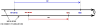

# Revision history

## Changes since [@P3045R1]

- [Scope of this proposal] chapter added.
- Dimensions, quantity specification, units, and point origins marked `final`.
- `delta` and `absolute` creation helpers added to improve readability of the affine space
  entities creation.
- `std::remove_const` was not needed in prefixes definitions.
- Compiler Explorer links updated to reflect the latest API changes.
- [Text output] and [Safety] chapters reordered.


## Changes since [@P3045R0]

- One more dependency added to the table in the [Dependencies on other proposals] chapter.
- [Safe unit conversions] chapter extended with more `value_cast` overloads.
- [The affine space] chapter rewritten nearly from scratch.
- [Magnitudes] chapter added.
- `qp.quantity_from_zero()` does not work for user's named origins anymore.
- `qp.quantity_from()` now works with other quantity points as well.
- `basic_symbol_text` renamed to `symbol_text`.
- `[[nodiscard]]` removed from `symbol_text`.
- `symbol_text` constructors taking string literals made `consteval`.
- `symbol_text` now always stores `char8_t` and `char` versions of symbols.
- In case UTF-8 symbol is used, now it has to be provided as an UTF-8 (`u8`) literal.
- [Symbols of derived dimensions] added and the entire symbols generation text refactored into
  the [Symbols for derived entities] chapter.
- Quantity formatting refactored to the new syntax agreed with Victor Zverovich.
- Minor editorial changes and additional clarifications added to the [Text output] chapter.
- `mag<ratio{N, D}>` replaced with `mag_ratio<N, D>` so the `ratio` type becomes the implementation
  detail rather than the public interface of the library
- Compiler Explorer links updated to reflect the latest design changes in the library


# Introduction

Several groups in the ISO C++ Committee reviewed the "P1935: A C++ Approach to Physical Units"
[@P1935R2] proposal in Belfast 2019 and Prague 2020. All those groups
expressed interest in the potential standardization of such a library and encouraged further
work. The authors also got valuable initial feedback that highly influenced the design of
the V2 version of the [@MP-UNITS] library.

In the following years, the library's authors focused on getting more feedback from the production
about the design and developed version 2 of the [@MP-UNITS] library that resolves the issues raised
by the users and Committee members. The features and interfaces of this version are close to
being the best we can get with the current version of the C++ language standard.

This paper is authored by the [@MP-UNITS] library developers, the authors of other actively
maintained similar libraries on the market, and other active members of the C++ physical quantities
and units community who have worked on this subject for many years. We join our forces to say with
one voice that we deeply care about standardizing such features as a part of the C++ Standard
Library. Based on our long and broad experience in the subject, we agree that the interfaces we
will provide in the upcoming proposals are the best we can get today in the C++ language.

During the Kona 2023 ISO C++ Committee meeting, we got repeating feedback that there should
be one big, unified paper with all the contents inside. Addressing this requirement, this
paper adds a detailed design description and also includes the most important parts of
[@P2980R1], [@P2981R1], and [@P2982R1]. With this, we assume that [@P2981R1] and [@P2982R1]
are superseded by this paper. The plan and scope described in [@P2980R1] might still be updated
based on the current progress and feedback from the upcoming discussions.

<!-- TODO remove this note in the future -->

_Note: This paper is incomplete and many chapters are still missing. It is published to gather
early feedback and possibly get acceptance for the major design decisions of the library.
More details will arrive in the next revisions of this paper._


# Scope of this proposal

This paper describes and defines a generic framework for quantities and units library. Such
framework should allow modelling various systems of quantities and units customized according
to specific user's needs. Such systems can be embraced with the affine space abstractions to
provide type-, unit-, and point origin-safe abstractions for many industries.

Even if mentioned, this paper does not propose standardizing any systems of quantities or units.
Such definitions will arrive in subsequent proposals.

In the extreme case, we can even discuss just providing a library framework in the first C++
standard and standardize systems and additional utilities (e.g., math) in the next iterations.


# Terms and definitions

This document consistently uses the official metrology vocabulary defined in the [@ISO-GUIDE]
and [@BIPM-VIM].


# Impact on the C++ standard

This change is purely additive. It does not change, fix, or break any of the existing tools
in the C++ standard library.

## Interaction with `std::chrono` types and `std::ratio`

The only interaction of this proposal with the C++ standard facilities is the compatibility
mode with `std::chrono` types (`duration` and `time_point`) described in
[Interoperability with the `std::chrono` abstractions].

We should also mention the potential confusion of users with having two different ways to deal
with time abstractions in the C++ standard library. If this proposal gets accepted:

- `std::chrono` abstractions together with `std::ratio` should be used primarily to deal
  with calendars and threading facilities,
- abstractions introduced in this proposal should be used in all other use cases (e.g.
  physical quantities equations).

## Dependencies on other proposals

The features in this chapter are heavily used in the library but are not domain-specific.
Having them standardized (instead of left as exposition-only) could not only improve
this library's specification, but also serve as an essential building block for tools
in other domains that we can get in the future from other authors.

<!-- markdownlint-disable MD013 -->

| Feature                      | Priority |         Papers         | Description                                                                                                |
|------------------------------|:--------:|:----------------------:|------------------------------------------------------------------------------------------------------------|
| `fixed_string`               |    1     |       [@P3094R0]       | String-like structural type with inline storage (can be used as an NTTP).                                  |
| Nested entities formatting   |    1     |          ???           | Possibility to override the format string in the parse and format contexts.                                |
| Compile-time prime numbers   |    2     |       [@P3133R0]       | Compile-time facilities to break any integral value to a product of prime numbers and their powers.        |
| Value-preserving conversions |    2     | [@P0870R5], [@P2509R0] | Type trait stating if the conversion from one type to another is value preserving or not.                  |
| Number concepts              |    2     |       [@P3003R0]       | Concepts for vector- and point-space numbers.                                                              |
| Bounded numeric types        |    3     |       [@P2993R0]       | Numerical type wrappers with values bounded to a provided interval (optionally with wraparound semantics). |

<!-- markdownlint-enable MD013 -->

Priorities used above:

1. Mandatory to implement the library or exposed in its public interfaces.
2. Functional extension/improvement to the framework design but worse alternatives are currently available.
3. Not needed for the library's implementation but improves its use cases.


# About authors

## Dominik Berner

Dominik is a strong believer that the C++ language can provide very high safety guarantees when
programming through strong typing; a type error caught during compilation saves hours of
debugging. For the last 15 years, he has mainly coded in C++ and actively follows its evolution
through the new standards.

When working on regulated projects at Med-Tech, there usually were very tight requirements on
which data types were to be used for what, which turned out to be lists of primitives to be
memorized by each developer. However, throughout his career, Dominik spent way too many hours
debugging and fixing issues caused by these types being incorrect. In an attempt to bring
a closer semantic meaning to these lists, he eventually wrote [@SI_LIB] as a side project.

While [@SI_LIB] provides many useful features, such as type-safe conversion between physical
quantities as well as zero-overhead computation for values of the same units, there are some
shortcomings which would require major rework. Instead of creating yet another library,
Dominik decided to join forces with the other authors of this paper to push for standardizing
support for more type-safety for physical quantities. He hopes that this will eventually lead
to a safer and more robust C++ and open many more opportunities for the language.

## Johel Ernesto Guerrero Peña

Johel got interested in the units domain while writing his first hundred lines of game development.
He got up to opening the game window, so this milestone was not reached until years later.
Instead, he looked for the missing piece of abstraction,
called "pixel" in the GUI framework, but modeled as an `int`.
He found out about [@NHOLTHAUS-UNITS], and
got fascinated with the idea of a library that succinctly allows expressing his domain's units
(<https://github.com/nholthaus/units/issues/124#issuecomment-390773279>).

Johel became a contributor to [@NHOLTHAUS-UNITS] v3 from 2018 to 2020.
He improved the interfaces and implementations by remodeling them after `std::chrono::duration`.
This included parameterizing the representation type with a template parameter instead of a macro.
He also improved the error messages by mapping a list of types to an user-defined name.

By 2020, Johel had been aware of [@MP-UNITS] v0 `quantity<dim_length, length, int>`, put off by its
verbosity.
But then, he watched a talk by Mateusz Pusz on [@MP-UNITS].
It described how good error messages was a stake in the ground for the library.
Thanks to his experience in the domain, Johel was convinced that [@MP-UNITS] was the future.

Since 2020, Johel has been contributing to [@MP-UNITS].
He added `quantity_point`, the generalization of `std::chrono::time_point`, closing #1.
He also added `quantity_kind`, which explored the need of representing distinct quantities of
the same dimension.
To help guide its evolution, he's been constantly pointing in the direction of [@BIPM-VIM] as a
source of truth.
And more recently, to [@ISO80000], also helping interpret it.

Computing systems engineering graduate.
(C++) programmer since 2014.
Lives at HEAD with C++Next and good practices.
Performs in-depth code reviews of familiarized code bases.
Has an eye for identifying automation opportunities, and acts on them.
Mostly at <https://github.com/JohelEGP/>.

## Charles Hogg

Chip Hogg is a Staff Software Engineer on the Motion Planning Team at Aurora Innovation, the
self-driving vehicle company that is developing the Aurora Driver.  After obtaining his PhD in
Physics from Carnegie Mellon in 2010, he was a postdoctoral researcher and then staff scientist at
the National Institute of Standards and Technology (NIST), doing Bayesian data analysis. He joined
Google in 2012 as a software engineer, leaving in 2016 to work on autonomous vehicles at Uber's
Advanced Technologies Group (ATG), where he stayed until their acquisition by Aurora in 2021.

Chip built his first C++ units library at Uber ATG in 2018, where he first developed the concept of
unit-safe interfaces.  At Aurora in 2021, he ported over only the test cases, writing a new and more
powerful units library from scratch.  This included novel features such as vector space magnitudes,
and an adaptive conversion policy which guards against overflow in integers.

He soon realized that there was a much broader need for Aurora's units library.  No publicly
available units library for C++14 or C++17 could match its ergonomics, developer experience, and
performance.  This motivated him to create [@AU] in 2022: a new, zero-dependency units library,
which was a drop-in replacement for Aurora's original units library, but offered far more composable
interfaces, and was built on simpler, stronger foundations.  Once Au proved its value internally,
Chip migrated it to a separate repository and led the open-sourcing process, culminating in its
public release in 2023.

While Au provides excellent ergonomics and robustness for pre-C++20 users, Chip also believes the
C++ community would benefit from a standard units library.  For that reason, he has joined forces
with the [@MP-UNITS] project, contributing code and design ideas.

## Nicolas Holthaus

Nicolas graduated Summa Cum Laude from Northwestern University with a B.S. in  Computer Engineering.
He worked for several years at the United States Naval Air Warfare Center - Manned Flight Simulator -
designing real-time C++ software for aircraft survivability simulation. He has subsequently continued
in the field at various start-ups, MIT Lincoln Laboratory, and most recently, STR (Science and
Technology Research).

Nicolas became obsessed with dimensional analysis as a high school JETS team member after learning
that the \$125M Mars Climate Orbiter was destroyed due to a simple feet-to-meters miscalculation. He
developed the widely adopted C++ [@NHOLTHAUS-UNITS] library based on the findings of the 2002 white
paper "Dimensional Analysis in C++" by Scott Meyers. Astounded that no one smarter had already
written such a library, he continued with `units` 2.0 and 3.0 based on modern C++. Those libraries
have been extensively adopted in many fields, including modeling & simulation, agriculture, and
geodesy.

In 2023, recognizing the limits of `units`, he joined forces with Mateusz Pusz in his effort to
standardize his evolutionary dimensional analysis library, with the goal of providing the
highest-quality dimensional analysis to all C++ users via the C++ standard library.

## Roth Michaels

Roth Michaels is a Principal Software Engineer at
[Native Instruments](https://www.native-instruments.com), a leading
manufacturer of audio, and music, software and hardware.  Working in
this domain, he has been involved with the creation of ad hoc typed
quantities/units for digital signal processing and GUI library
use-cases.  Seeing both the complexity of development and practical uses
where developers need to leave the safety of these simple wrappers
encouraged Roth to explore various quantity/units libraries to see if
they would apply to this domain.  He has been doing research into
defining and using digital audio and music domain-specific quantities
and units using first [@MP-UNITS] as proposed in [@P1935R2] and the new
V2 library described in this paper.

Before working for Native Instruments, Roth worked as a consultant in
multiple industries using a variety of programming languages.  He was
involved with the Swift Evolution community in its early days before
focusing primarily on C++ after joining
[iZotope](https://www.izotope.com) and now Native Instruments.

Holding a degree in music composition, Roth has over a decade of
experience working with quantities and units of measure related to
music, digital signal processing, analog audio, and acoustics.  He has
joined the [@MP-UNITS] project as a domain expert in these areas and to
provide perspective on logarithmic and non-linear quantity/unit
relationships.

## Mateusz Pusz

Mateusz got interested in the physical units subject while contributing to the [@LK8000]
Tactical Flight Computer Open Source project over 10 years ago. The project's code was far
from being "safe" in the C++ sense, and this is when Mateusz started to explore alternatives.

Through the following years, he tried to use several existing solutions, which were always
far from being user-friendly, so he also tried to write a better framework a few times from
scratch by himself.

Finally, with the availability of brand new Concepts TS in the gcc-7, the [@MP-UNITS] project
was created. It was designed with safety and user experience in mind. After many years
of working on the project, the [@MP-UNITS] library is probably the most modern and complete
solution in the C++ market.

Through the last few years, Mateusz has put much effort into building a community around physical
units. He provided many talks and workshops on this subject at various C++ conferences.
He also approached the authors of other actively maintained libraries to get their feedback
and invited them to work together to find and agree on the best solution for the C++ language.
This paper is the result of those actions.

## Vincent Reverdy

Vincent is an astrophysicist, computer scientist, and a member of the French delegation to
the ISO C++ Committee, currently working as a full researcher at the French National Centre
for Scientific Research (CNRS). He has been interested for years in units and quantities
for programming languages to ensure higher levels of both expressivity and safety in computational
physics codes. Back in 2019, he authored [@P1930R0] to provide some context of what could
be a quantity and unit library for C++.

After designing and implementing several Domain-Specific Language (DSL) demonstrators dedicated
to units of measurements in C++, he became more interested in the theoretical side of
the problem. Today, one of his research activities is dedicated to the mathematical formalization
of systems of quantities and systems of units as an interdisciplinary problem between physics,
mathematics, and computer science.


# Motivation

This chapter describes why we believe that physical quantities and units should be part of
a C++ Standard Library.

## Safety

It is no longer only the space industry or experienced pilots that benefit from the autonomous
operations of some machines. We live in a world where more and more ordinary people trust
machines with their lives daily. In the near future, we will be allowed to sleep while our
car autonomously drives us home from a late party. As a result, many more C++ engineers are
expected to write life-critical software today than it was a few years ago. However, writing
safety-critical code requires extensive training and experience, both of which are in short demand.
While there exists some standards and guidelines such as MISRA C++ [@MISRA_CPP] with the aim of
enforcing the creation of safe code in C++, they are cumbersome to use and tend to shift the burden
on the discipline of the programmers to enforce these. At the time of writing, the C++ language
does not change fast enough to enforce safe-by-construction code.


One of the ways C++ can significantly improve the safety of applications being written
by thousands of developers is by introducing a type-safe, well-tested, standardized way to handle
physical quantities and their units. The rationale is that people tend to have problems
communicating or using proper units in code and daily life. Numerous
expensive failures and accidents happened due to using an invalid unit or a quantity type.

The most famous and probably the most expensive example in the software engineering domain is
the Mars Climate Orbiter that in 1999 failed to enter Mars' orbit and crashed while entering
its atmosphere [@MARS_ORBITER]. This is one of many examples here. People tend to confuse units
quite often. We see similar errors occurring in various domains over the years:

- On October 12, 1492, Christopher Columbus unintentionally discovered the sea route from Europe
  to America because, during his travel preparations, he mixed the Arabic mile with a Roman mile,
  which led to the wrong estimation of the equator and his expected travel distance [@COLUMBUS].
- In 1628, a new warship, Vasa, accidentally had an asymmetrical hull (being thicker on the port side
  than the starboard side), which was one of the reasons for her sinking less than a mile into her maiden
  voyage, resulting in the death of 30 people on board. This asymmetry could have been caused by the
  use of different systems of measurement, as archaeologists have found four rulers used by the workers
  who built the ship. Two were calibrated in Swedish feet, which had 12 inches, while the other two
  measured Amsterdam feet, which had 11 inches [@VASA].
- Air Canada Flight 143 ran out of fuel on July 23, 1983, at an altitude of 41 000 feet
  (12 000 metres), midway through the flight because the fuel had been calculated in pounds
  instead of kilograms by the ground crew [@GIMLI_GLIDER].
- The British rock band Black Sabbath, during its Born Again tour in 1983, ordered a replica of Stonehenge
  as props for the scene. Unfortunately, they had to leave them in the storage area because, while
  submitting the order, their manager wrote dimensions down in meters when he meant feet, and so the
  stones didn't fit the scene. "It cost a fortune to make, but there was not a building on Earth that
  you could fit it into" [@STONEHENGE].
- On April 15, 1999, Korean Air Cargo Flight 6316 crashed due to a miscommunication between
  pilots about the desired flight altitude [@FLIGHT_6316].
- In February 2001, the crew of the Moorpark College Zoo built an enclosure for Clarence the Tortoise
  with a weight of 250 pounds instead of 250 kilograms [@CLARENCE].
- In December 2003, one of the roller coaster’s cars at Tokyo Disneyland’s Space Mountain attraction
  suddenly derailed due to a broken axle caused by confusion after upgrading the specification
  from imperial to metric units [@DISNEY].
- During the construction of the Hochrheinbrücke bridge to connect the small German town of Laufenburg
  with Swiss Laufenburg, the construction team made a sign error that resulted in a discrepancy
  of 54 cm between the two outer ends of the bridge [@HOCHRHEINBRÜCKE].
- An American company sold a shipment of wild rice to a Japanese customer, quoting a price of
  39 cents per pound, but the customer thought the quote was for 39 cents per kilogram [@WILD_RICE].
- On October 17, 2023, The Guardian published an article titled "Record Heat: Malawi swelters with
  temperatures nearly 68F above average" with many issues related to the affine space types and
  temperature units. Due to incorrect logic, probably during the translation of the article to
  the U.S.  market, `20 °C` above the average temperature was converted to `68 °F`. The actual
  temperature increase was `32 °F`, not `68 °F` [@THE_GUARDIAN].
- A whole set of [@MEDICATION_DOSE_ERRORS]...

The safety subject is so vast and essential by itself that we dedicated an entire [Safety features]
chapter of this paper that discusses all the nuances in detail.

## Vocabulary types

We standardized many library features mostly used in the implementation details
(fmt, ranges, random-number generators, etc.). However, we believe that the most important
role of the C++ Standard is to provide a standardized way of communication between different
vendors.

Let's imagine a world without `std::string` or `std::vector`. Every vendor has their version
of it, and of course, they are highly incompatible with each other. As a result, when someone
needs to integrate software from different vendors, it turns out to be an unnecessarily arduous task.

Introducing `std::chrono::duration` and `std::chrono::time_point` improved the interfaces a lot,
but time is only one of many quantities that we deal with in our software on a daily basis.
We desperately need to be able to express more quantities and units in a standardized way so
different libraries get means to communicate with each other.

If Lockheed Martin and NASA could have used standardized vocabulary types in their interfaces, maybe
they would not interpret pound-force seconds as newton seconds, and the [@MARS_ORBITER] would
not have crashed during the Mars orbital insertion maneuver.

## Certification

Mission and life-critical projects, or those for embedded devices, often have to obey the safety norms
that care about software for safety-critical systems (e.g., ISO 61508 is a basic functional safety
standard applicable to all industries, and ISO 26262 for automotive). As a result, their company policy
often forbid third-party tooling that lacks official certification. Such certification requires
a specification to be certified against, and those tools often do not have one. The risk and cost
of self-certifying an Open Source project is too high for many as well.

Companies often have a policy that the software they use must obey all the rules MISRA provides.
This is a common misconception, as many of those rules are intended to be deviated from.
However, those deviations require rationale and documentation, which is also considered to be risky
and expensive by many.

All of those reasons often prevent the usage of an Open Source product in a company, which is a huge
issue, as those companies typically are natural users of physical quantities and units libraries.

Having the physical quantities and units library standardized would solve those issues for many
customers, and would allow them to produce safer code for projects on which human life depends every
single day.

## Complex and complicated

Suppose vendors can't use an Open Source library in a production project for
the above reasons. They are forced to write their own abstractions by themselves.
Besides being costly and time-consuming, it also happens that writing a physical quantities and
units library by yourself is far from easy. Doing this is complex and complicated, especially for
engineers who are not experts in the domain. There are many exceptional corner cases to cover
that most developers do not even realize before falling into a trap in production. On the other
hand, domain experts might find it difficult to put their knowledge into code and create a correct
implementation in C++.
As a result, companies either use really simple and unsafe numeric wrappers, or abandon the effort
entirely and just use built-in types, such as `float` or `int`, to express quantity values, thus losing
all semantic categorization. This often leads to safety issues caused by accidentally using values
representing the wrong quantity or having an incorrect unit.

## Extensibility

Many applications of a quantity and units library may need to operate on a combination of
standard (e.g., SI) and domain-specific quantities and units. The complexity of developing
domain-specific solutions highlights the value in being able to define new quantities
and units that have all the expressivity and safety as those provided by the library.

Experience with writing ad hoc typed quantities without library support
that can be combined with or converted to `std::chrono::duration` has
shown the downside of bespoke solutions: If not all operations
or conversions are handled, users will need to leave the safety of typed
quantities to operate on primitive types.

The interfaces of the this library were designed with ease of extensibility in mind.
Each definition of a dimension, quantity type, or unit typically takes only a single line of
code. This is possible thanks to the extensive usage of C++20 class types as Non-Type Template
Parameters (NTTP). For example, the following code presents how second (a unit of time in the [@SI])
and hertz (a unit of frequency in the [@SI]) can be defined:

```cpp
inline constexpr struct second final : named_unit<"s", kind_of<isq::time>> {} second;
inline constexpr struct hertz final : named_unit<"Hz", 1 / second, kind_of<isq::frequency>> {} hertz;
```

## Broad industry value

When people think about industries that could use physical quantities
and unit libraries, they think of a few companies related to aerospace,
autonomous cars, or embedded industries. That is all true, but there are
many other potential users for such a library.

Here is a list of some less obvious candidates:

- Manufacturing,
- maritime industry,
- freight transport,
- military,
- astronomy,
- 3D design,
- robotics,
- audio,
- medical devices,
- national laboratories,
- scientific institutions and universities,
- all kinds of navigation and charting,
- GUI frameworks,
- finance (including HFT).

As we can see, the range of domains for such a library is vast and not
limited to applications involving specifically physical units. Any
software that involves measurements, or operations on counts of some
standard or domain-specific quantities, could benefit from a zero-cost
abstraction for operating on quantity values and their units. The library
also provides affine space abstractions, which may prove useful in many
applications.

## Standardizing existing practice

Plenty of physical units libraries have been available to the public for many years. In 1998
Walter Brown provided an "Introduction to the SI Library of Unit-Based Computation" paper
for the International Conference on Computing in High Energy Physics [@CHEP98]. It emphasizes
the importance of strong types and static type-checking. After that, it describes a library
modeling the [@SI] to provide "strict compile-time type-checking without run-time overhead".

It also states that at this time, "in numeric programming, programmers make heavy, near-exclusive,
use of a language's native numeric types (e.g., `double`)". Today, twenty-five years later,
plenty of "Modern C++" production code bases still use `double` to represent various quantities
and units. It is high time to change this.

Throughout the years, we have learned the best practices for handling specific cases in the domain.
Various products may have different scopes and support different C++ versions. Still, taking that
aside, they use really similar concepts, types, and operations under the hood. We know how to do
those things already.

The authors of this paper developed and delivered multiple successful C++ libraries for this domain.
Libraries developed by them [have more than 90% of all the stars on GitHub in the field of
physical units libraries for C++](https://github.com/topics/dimensional-analysis?l=c%2B%2B).
The [@MP-UNITS] library, which is the base of this proposal, has the most number of stars in this
list, making it the most popular project in the C++ industry.

The authors joined forces and are working together to propose the best quantities and units library
we can get with the latest version of the C++ language. They spend their private time and efforts
hoping that the ISO C++ Committee will be willing to include such a feature in the C++ standard library.


# Common smells when there is no library for quantities and units

In this chapter, we are going to review typical safety issues related to physical quantities and units
in the C++ code when a proper library is not used. Even though all the examples come from the
Open Source projects, expensive revenue-generating production source code often is similar.

## The proliferation of `double`

It turns out that in the C++ software, most of our calculations in the physical quantities and units
domain are handled with fundamental types like `double`. Code like below is a typical example here:

```cpp
double GlidePolar::MacCreadyAltitude(double MCREADY,
                                     double Distance,
                                     const double Bearing,
                                     const double WindSpeed,
                                     const double WindBearing,
                                     double *BestCruiseTrack,
                                     double *VMacCready,
                                     const bool isFinalGlide,
                                     double *TimeToGo,
                                     const double AltitudeAboveTarget=1.0e6,
                                     const double cruise_efficiency=1.0,
                                     const double TaskAltDiff=-1.0e6);
```

[Original code here](https://github.com/LK8000/LK8000/blob/af404168ff5f92b03ab0c5db336ed8f01a792cda/Common/Header/McReady.h#L7-L21).

There are several problems with such an approach: The abundance of `double` parameters
makes it easy to accidentally switch values and there is no way of noticing such a mistake
at compile-time. The code is not self-documenting in what units the parameters are expected. Is
`Distance` in meters or kilometers? Is `WindSpeed` in meters per second or knots?
Different code bases choose different ways to encode this information,
which may be internally inconsistent.
A strong type system would help answer these questions at the time the interface is written,
and the compiler would verify it at compile-time.

## The proliferation of magic numbers

There are a lot of constants and conversion factors involved in the quantity equations. Source code
responsible for such computations is often trashed with magic numbers:

```cpp
double AirDensity(double hr, double temp, double abs_press)
{
  return (1/(287.06*(temp+273.15)))*(abs_press - 230.617 * hr * exp((17.5043*temp)/(241.2+temp)));
}
```

[Original code here](https://github.com/LK8000/LK8000/blob/af404168ff5f92b03ab0c5db336ed8f01a792cda/Common/Source/Library/PressureFunctions.cpp#L134-L136).

Apart from the obvious readability issues, such code is hard to maintain, and it needs a lot of
domain knowledge on the developer's side. While it would be easy to replace these numbers with
named constants, the question of which unit the constant is in remains. Is `287.06` in
pounds per square inch (psi) or millibars (mbar)?

## The proliferation of conversion macros

The lack of automated unit conversions often results in handwritten conversion functions or macros
that are spread everywhere among the code base:

```cpp
#ifndef PI
static const double PI = (4*atan(1));
#endif
#define EARTH_DIAMETER    12733426.0    // Diameter of earth in meters
#define SQUARED_EARTH_DIAMETER  162140137697476.0 // Diameter of earth in meters (EARTH_DIAMETER*EARTH_DIAMETER)
#ifndef DEG_TO_RAD
#define DEG_TO_RAD  (PI / 180)
#define RAD_TO_DEG  (180 / PI)
#endif

#define NAUTICALMILESTOMETRES (double)1851.96
#define KNOTSTOMETRESSECONDS (double)0.5144

#define TOKNOTS (double)1.944
#define TOFEETPERMINUTE (double)196.9
#define TOMPH   (double)2.237
#define TOKPH   (double)3.6

// meters to.. conversion
#define TONAUTICALMILES (1.0 / 1852.0)
#define TOMILES         (1.0 / 1609.344)
#define TOKILOMETER     (0.001)
#define TOFEET          (1.0 / 0.3048)
#define TOMETER         (1.0)
```

[Original code here](https://github.com/LK8000/LK8000/blob/052bbc20a106fda4db41874e788e39020fb86512/Common/Header/Defines.h#L901-L924).

Again, the question of which unit the constant is in remains. Without looking at the code,
it is impossible to tell from which unit `TOMETER` converts. Also, macros have the problem that
they are not scoped to a namespace and thus can easily clash with other macros or functions,
especially if they have such common names like `PI` or `RAD_TO_DEG`. A quick search through open
source C++ code bases reveals that, for example, the `RAD_TO_DEG` macro is defined in a multitude
of different ways -- sometimes even within the same repository:

```cpp
#define RAD_TO_DEG (180 / PI)
#define RAD_TO_DEG 57.2957795131
#define RAD_TO_DEG ( radians ) ((radians ) * 180.0 / M_PI)
#define RAD_TO_DEG 57.2957805f
...
```

[Example search across multiple repositories](https://github.com/search?q=lang%3AC%2B%2B++%22%23define+RAD_TO_DEG%22&type=code)

[Multiple redefinitions in the same repository](https://github.com/search?q=repo%3ALK8000%2FLK8000%20rad_to_deg&type=code)

Another safety issue occurring here is the fact that macro values can be deliberately tainted
by compiler settings at built time and can acquire values that are not present in the source code.
Human reviews won't catch such issues.

Also, most of the macros do not follow best practices. Often, necessary parentheses are missing,
processing in a preprocessor ends up with redundant casts, or some compile-time constants use too
many digits for a value to be exact for a specific type (e.g., `float`).

## Lack of consistency

If we not only lack strong types to isolate the abstractions from each other, but also lack discipline
to keep our code consistent, we end up in an awful place:

```cpp
void DistanceBearing(double lat1, double lon1,
                     double lat2, double lon2,
                     double *Distance, double *Bearing);

double DoubleDistance(double lat1, double lon1,
                      double lat2, double lon2,
                      double lat3, double lon3);

void FindLatitudeLongitude(double Lat, double Lon,
                           double Bearing, double Distance,
                           double *lat_out, double *lon_out);

double CrossTrackError(double lon1, double lat1,
                       double lon2, double lat2,
                       double lon3, double lat3,
                       double *lon4, double *lat4);

double ProjectedDistance(double lon1, double lat1,
                         double lon2, double lat2,
                         double lon3, double lat3,
                         double *xtd, double *crs);
```

[Original code here](https://github.com/LK8000/LK8000/blob/af404168ff5f92b03ab0c5db336ed8f01a792cda/Common/Header/NavFunctions.h#L7C1-L27).

Users can easily make errors if the interface designers are not consistent in ordering parameters.
It is really hard to remember which function takes latitude or `Bearing` first and when a latitude
or `Distance` is in the front.

## Lack of a conceptual framework

The previous points mean that the fundamental types can't be leveraged to model the different concepts
of quantities and units frameworks. There is no shared vocabulary between different libraries.
User-facing APIs use ad-hoc conventions. Even internal interfaces are inconsistent between themselves.

Arithmetic types such as `int` and `double` are used to model different concepts.
They are used to represent any abstraction (be it a magnitude, difference, point, or kind) of any
quantity type of any unit.
These are weak types that make up weakly-typed interfaces.
The resulting interfaces and implementations built with these types
easily allow mixing up parameters and using operations that are not part of the represented quantity.


# Design goals

The library facilities that we plan to propose in the upcoming papers is designed with
the following goals in mind.

## Compile-time safety

The most important property of any such a library is the safety it brings to C++ projects.
The correct handling of physical quantities, units, and numerical values should be verifiable both by
the compiler and by humans with manual inspection
of each individual line.

In some cases, we are even eager to prioritize safe interfaces over the general usability experience
(e.g., getters of the underlying raw numerical value will always require a unit in which the value should
be returned in, which results in more typing and is sometimes redundant).

More information on this subject can be found in [Safety features].

## Performance

The library should be as fast or even faster than working with fundamental types. The should
be no runtime overhead, and no space size overhead should be needed to implement higher-level
abstractions.

## Great user experience

The primary purpose of the library is to generate compile-time errors. If users did not introduce
any bugs in the manual handling of quantities and units, the library would be of little use.
This is why the library is optimized for readable compilation errors and great debugging experience.

The library is easy to use and flexible. The interfaces are straight-forward
and safe by default. Users should be able to easily express any quantity and unit, which requires
them to compose.

The above constraints imply the usage of special implementation techniques. The library will not
only provide types, but also compile-time known values that will enable users to write easy
to understand and efficient equations on quantities and units.

## Scope

There are plenty of expectations from different parties regarding such a library. It should support
at least:

- Any unit's magnitude (huge, small, floating-point).
- Systems of Quantities.
- Systems of Units.
- The affine space.
- Highly adjustable text-output formatting.

Additionally, it would be good to also support the following features:

- Scalar, vector, and tensor quantities.
- Natural units systems.

## Easy to extend

The library's core framework does not assume the usage of any systems of quantities or units.
It is fully generic and allow defining any system abstraction on top of it.

Most entities in the library can be defined with a single line of code without
preprocessor macros. Users can easily extend provided systems with custom
dimensions, quantities, and units.

## Low standardization cost

The set of entities required for standardization should be limited to the bare minimum.

Most of the entities in systems definitions should be possible to implement with a single line of
code.

Derived units do not need separate library types. Instead, they can be obtained through the composition
of predefined named units. Units should not be associated with User-Defined Literals (UDLs), as it
is the case with `std::chrono::duration`. UDLs do not compose, have very limited scope and
functionality, and are expensive to standardize.

The user interface should have no preprocessor macros.

It should be possible for most proposed features (besides the text output) to be freestanding.


# Quick domain introduction

This chapter provides a very brief introduction to the quantities and units domain. Please refer to
[@ISO80000] and [@SI] for more details.

<!-- 
flowchart TD
    dimension --- quantity_type["quantity type"]
    quantity_type --- reference["quantity reference\n(e.g., unit)"]
    reference --- quantity
    number --- quantity
 -->



_Note: A more detailed graph of the framework's entities can be found in the [Framework entities]
chapter._

## Dimension

[Dimension](https://jcgm.bipm.org/vim/en/1.7.html) specifies the dependence of a quantity on the base
quantities of a particular system of quantities. It is represented as a product of powers of factors
corresponding to the base quantities, omitting any numerical factor.

Even though ISO does not officially define these, we find the below terms useful when discussing
the domain and its C++ implementation:

- **base dimension** is the dimension of a [base quantity](https://jcgm.bipm.org/vim/en/1.4.html),
- **derived dimension** is the dimension of a [derived quantity](https://jcgm.bipm.org/vim/en/1.5.html).

As stated above, ISO does not mention a "base dimension" term. Nevertheless, it treats dimensions
of base quantities in a special way by:

- assigning unique identifiers/symbols to all of them,
- stating that derived quantities have a dimension being a product of dimensions of base quantities.

For example:

- _length_ ($L$), _mass_ ($M$), _time_ ($T$), _electric current_ ($I$), _thermodynamic temperature_ ($Θ$),
  _amount of substance_ ($N$), and _luminous intensity_ ($J$) are the base dimensions of the ISQ.
- A derived dimension of _force_ in the ISQ is denoted by $dim\;F = LMT^{–2}$.
- [@ISO80000] (part 13) provides _traffic intensity_ quantity that is measured in erlangs but not in the unit one,
  which also implies that it should be introduced as a base quantity with its own dimension.

## Quantity type

Dimension is not enough to describe a quantity. This is why [@ISO80000] provides hundreds of
named quantity types. It turns out that there are many more quantity types in the ISQ than the named
units in the [@SI].

[@ISO80000] also defines the term **kind of quantity** as an aspect common to mutually comparable
quantities. It explicitly says that two or more quantities cannot be added or subtracted unless they
belong to the same category of mutually comparable quantities.

Quantities might be:

- of different dimensions (e.g., _length_, _time_, _speed_, _power_),
- of the same dimension but of a different kind (e.g., _work_ vs. _torque_, _frequency_ vs. _activity_,
   _area_ vs. _fuel consumption_),
- of the same dimension and kind but still distinct (e.g., _radius_ vs. _width_ vs. _height_ or
  _potential energy_ vs. _kinetic energy_ vs. _thermodynamic energy_).

Additionally, ISO explicitly specifies a quantity of dimension one, which is commonly known as
a dimensionless quantity. It is a quantity for which all the exponents of the factors corresponding
to the base quantities in its quantity dimension are zero. Typically, they represent ratios of two
quantities of the same dimension or counts of things.

## Quantity reference

[@ISO80000] defines a quantity as:

> property of a phenomenon, body, or substance, where the property has a magnitude that can be
> expressed as a number and a reference.
>
> NOTE 2 A reference can be a measurement unit, a measurement
> procedure, a reference material, or a combination of such.

The term "reference" is repeated several times in that ISO specification. For example:

- quantity value is defined as:

    > Number and reference together expressing magnitude of a quantity.

- numerical quantity value is defined as:

    > Number in the expression of a quantity value, other than any number serving as the reference

We realize that the term "reference" might be overloaded in the C++ domain. However, preserving
the official metrology terminology here is still worth trying.

Measurement units are designated by conventionally assigned names and symbols.

Measurement units of quantities of the same quantity dimension may be designated by the same name
and symbol even when the quantities are not of the same kind. For example, joule per kelvin and J/K
are, respectively, the name and symbol of both a measurement unit of _heat capacity_ and a measurement
unit of _entropy_, which are generally considered to not be quantities of the same kind.

However, in some cases, special measurement unit names are restricted to be used with quantities of
specific kind only. For example, the measurement unit 'second to the power minus one' (1/s) is
called hertz (Hz) when used for _frequencies_ and becquerel (Bq) when used for _activities of
radionuclides_.

Measurement units of quantities of dimension one are numbers. In some cases, these measurement
units are given special names, e.g., radian, steradian, and decibel, or are expressed by quotients
such as millimole per mole equal to $10^{−3}$ and microgram per kilogram equal to $10^{−9}$.

## Quantity

As stated above, [@ISO80000] defines a quantity as:

> property of a phenomenon, body, or substance, where the property has a magnitude that can be
> expressed as a number and a reference.

The above means that a quantity abstraction should store a runtime value representing the quantity
numerical value and a reference that might be represented as a unit. It is a common practice to
embed a reference into the C++ type expressing the quantity so it does not occupy a space/storage at
runtime.

It is also worth mentioning here that the distinction between a quantity and a quantity type is
not clearly defined in [@ISO80000]. [@ISO80000] even explicitly states:

> It is customary to use the same term, "quantity", to refer to both general quantities, such as
> length, mass, etc., and their instances, such as given lengths, given masses, etc. Accordingly,
> we are used to saying both that length is a quantity and that a given length is a quantity, by
> maintaining the specification – "general quantity, $Q$" or "individual quantity, $Q_a$" – implicit
> and exploiting the linguistic context to remove the ambiguity.

To prevent such ambiguities in this document, we will consistently use the term:

- "quantity type" when we mean a general quantity,
- "quantity" when we mean the instance of a quantity that also stores its numerical value.

It is also worth mentioning here that [@ISO80000] does not distinguish between point and
vector/interval quantities of [The affine space].


# API overview

This chapter is intended to be a short overview and present the proposed library's final look and
feel. We start with the most straightforward use cases and gradually introduce more complex
abstractions. Thanks to that, the readers can assess the [Teachability] effort of
this library by themselves.

More details about the design, rationale for it, and alternative syntaxes discussions can be found in
the [Design details and rationale] chapter.

## Unit-based quantities (simple mode)

Consistently with a [Quantity] definition, a `quantity` class template takes a reference and
a representation type as parameters:

```cpp
template<Reference auto R,
         RepresentationOf<get_quantity_spec(R).character> Rep = double>
class quantity;
```

### Constructing a quantity

If we want to set a value for a quantity, we always have to provide a number and a unit:

```cpp
quantity<si::metre, int> q{42, si::metre};
```

In case a quantity class template should use exactly the same unit and a representation type as
provided in the initializer, it is recommended to use CTAD:

```cpp
quantity q{42, si::metre};
```

Please, note that `double` is used as a default representation type, so the following does not
result with a quantity of integral representation type:

```cpp
quantity<si::metre> q2{42, si::metre};
```

This is why CTAD usage is recommended when the user wants to prevent potential conversion and
just deduce the `quantity` class template parameters from the initializer. This often prevents
unneeded conversions that can affect runtime performance or memory footprint.

CTAD-based spelling is shorter but is still quite verbose. Consider having to write:

```cpp
quantity q = quantity{1, si::kilo<si::metre>} + quantity{200, si::metre};
```

This is why the library offers an alternative way to construct a quantity.

The [@SI] says:

> The value of the quantity is the product of the number and the unit. The space between the number
> and the unit is regarded as a multiplication sign (just as a space between units implies
> multiplication).

Following the above, the value of a quantity can also be created by multiplying a number with
a predefined unit:

```cpp
quantity q = 42 * si::metre;
```

The above creates an instance of `quantity<si::metre(), int>`. It is worth noting here that the
syntax with the reversed order of arguments is invalid and will not compile (e.g., we can't write
`si::metre * 42`).

The same can be obtained using an optional unit symbol:

```cpp
using namespace si::unit_symbols;

quantity q = 42 * m;
```

Unit symbols introduce a lot of short identifiers into the current scope, which is why they
are opt-in. A user has to explicitly "import" them from a dedicated `unit_symbols` namespace.

[@SI] specifies 7 base and 22 coherent derived units with special names. Additionally, it specifies
24 prefixes. There are also non-SI units accepted for use with SI. Some of them are really popular,
for example, minute, hour, day, degree, litre, hectare, tonne. All of those entities compose to
allow the creation of a vast number of various derived units.

For example, we can create a quantity of speed with either:

```cpp
quantity speed1 = 60 * si::kilo<si::metre> / non_si::hour;
quantity speed2 = 60 * km / h;
```

In case a complex derived unit is used a lot in the project, for convenience, a user can quickly
provide a nicely named wrapper for it with:

```cpp
constexpr auto kmph = si::kilo<si::metre> / non_si::hour;
quantity speed3 = 60 * kmph;
```

The library is optimized to generate short and easy-to-understand types that highly improve
the analysis of compile-time errors and debugging experience. All of the above definitions will create
an instance of the type
`quantity<derived_unit<si::kilo_<si::metre>, per<non_si::hour>>{}, int>>`. As we can see, the
type generation is optimized to be easily understood even by non-experts in the domain.
The library tries to keep the type's readability as close to English as possible.

To learn find more discussion on a quantity creation syntax please refer to the following chapters:

- [`explicit` is not explicit enough],
- [Why don't we use UDLs to create quantities?],
- [Potential surprises during units composition].

### Typical operations on quantities

Various quantities can be multiplied or divided to obtain other derived quantities. Quantities of
the same kind can be added, subtracted, and compared to each other. Quantities can also be easily
printed with output streams or formatting facilities.

```cpp
quantity dist1 = 80 * km;
quantity dist2 = 105 * km;
quantity duration = 2 * h;
quantity speed_limit = 100 * km / h;

if ((dist1 + dist2) / duration < speed_limit)
  std::cout << "Thanks for driving within the speed limit of " << speed_limit << " :-)\n";
else
  std::println("Slow down! The speed limit here is {}!", speed_limit);
```

The above prints:

```text
Thanks for driving within the speed limit of 100 km/h :-)
```

#### Unit conversions

If we want to change the unit of a current quantity, we can use `.in(Unit)` member function:

```cpp
std::cout << "The total distance in meters is " << (dist1 + dist2).in(m) << "\n";
```

The `.in` utility has safety mechanisms to prevent accidentally losing precision.  For example, we
could try doing the same thing to express `speed_limit` in `m/s`, which is equivalent to multiplying
the underlying value by the non-integer factor $5 / 18$:

```cpp
std::cout << "The speed limit in m/s is " << speed_limit.in(m / s) << "\n";
// Compiler error!  Does not work.
```

However, scaling an integral type by a rational or irrational factor is considered not
value-preserving. To force such a conversion, we can use either a `.force_in(Unit)` member function
or an explicit `value_cast<Unit>(Quantity)`.

```cpp
std::cout << "The speed limit in m/s is " << speed_limit.force_in(m / s) << "\n";
std::cout << "The speed limit in m/s is " << value_cast<m / s>(speed_limit) << "\n";
```

We will get a truncated value of `27 m/s` in both cases.

To prevent truncation, we must explicitly change the quantity representation type to a
value-preserving one with `value_cast<Representation>(Quantity)` overload. For example:

```cpp
std::cout << "The speed limit in m/s is " << value_cast<double>(speed_limit).in(m / s) << "\n";
```

This time, we will see the following in the text output:

```text
The speed limit in m/s is 27.7778 m/s
```

More details about conversions can be found in the [Safe unit conversions] and
[Preventing truncation of data] chapters.

#### Obtaining a numerical value of a quantity

Last but not least, if we need to obtain the numerical value of a quantity and pass it to some
the legacy unsafe interface, we can use either `.numerical_value_in(Unit)` or
`.force_numerical_value_in(Unit)` member functions:

```cpp
void legacy_check_speed_limit(int speed_in_km_per_h);
```

```cpp
legacy_check_speed_limit(((dist1 + dist2) / duration).numerical_value_in(km / h));
```

Such a getter will explicitly enforce the usage of a correct unit required by the underlying
interface, which reduces a significant number of safety-related issues.

`numerical_value_in(Unit)` always returns by value as a quantity value conversion may be required
to adjust to the target unit. In case a user needs a reference to the underlying storage
`.numerical_value_ref_in(Unit)` should be used:

```cpp
void legacy_set_speed_limit(int* speed_in_km_per_h) { *speed_in_km_per_h = 100; }
```

```cpp
quantity<km / h, int> speed_limit;
legacy_set_speed_limit(&speed_limit.numerical_value_ref_in(km / h));
```

This member function again requires a target unit to enforce safety. This overload does not
participate in overload resolution if the provided unit has a different scaling factor than
the current one.

Please refer to the [Safe quantity numerical value getters] chapter for more details on this
subject.

## Typed quantities (safer mode)

Simple mode is all about and just about units. In case we care about a specific quantity type,
typed quantities should be preferred. Those store information not only about a unit but also
about a specific quantity type we want to model.

There a few ways to obtain such a quantity:

```cpp
quantity<isq::height[m], int> q1 = 42 * m;
quantity q2{42, isq::height[m]};
quantity q3 = 42 * isq::height[m];
quantity q4 = isq::height(42 * m);
```

All of the above cases use a slightly different approach to get the quantity, but all of them
result in exactly the same `quantity` class template instantiation.

In the above examples, an expression of `isq::height[m]` is called a quantity reference and
results in `reference<isq::height, si::metre>` class template instantiation.

_Note: The identifier `reference` is being used in the [@MP-UNITS] library but definitely will
need bikeshedding during the standardization process._

More about typed quantities can be found in the following chapters:

- [Why do we need typed quantities?] provides a detailed rationale.
- [Systems of quantities] describes their conversion and arithmetic rules.
- [Constraining a derived unit to work only with a specific derived quantity] provides a solution
  to the problem of units of quantities different kinds but the same dimension.
- [Quantity kinds improve safety] and [Additional safety introduced by modeling various quantities of the same kind]
  discuss the safety benefits of quantity kinds.
- [Limitations of systems of quantities] discusses cases that can't be addressed with the current
  design of systems of quantities.


## Generic interfaces

Using a concrete unit in the interface often has a lot of sense. It is especially useful if we
store the data internally in the object. In such a case, we have to select a specific unit anyway.

For example, let's consider a simple storage tank:

```cpp
class StorageTank {
  quantity<horizontal_area[m2]> base_;
  quantity<isq::height[m]> height_;
  quantity<isq::mass_density[kg / m3]> density_ = air_density;
public:
  constexpr StorageTank(const quantity<horizontal_area[m2]>& base, const quantity<isq::height[m]>& height) :
      base_(base), height_(height)
  {
  }

  // ...
};
```

As the quantities provided in the function's interface are then stored in the class, there is probably
no sense in using generic interfaces here.

### The issues with unit-specific interfaces

However, in many cases, using a specific unit in the interface is counterproductive. Let's consider
the following function:

```cpp
quantity<km / h> avg_speed(quantity<km> distance, quantity<h> duration)
{
  return distance / duration;
}
```

Everything seems fine for now. It also works great if we call it with:

```cpp
quantity<km / h> s1 = avg_speed(220 * km, 2 * h);
```

However, if the user starts doing the following:

```cpp
quantity<mi / h> s2 = avg_speed(140 * mi, 2 * h);
quantity<m / s> s3 = avg_speed(20 * m, 2 * s);
```

some issues start to be clearly visible:

1. The arguments must be converted to units mandated by the function's parameters at each call.
   This involves potentially expensive multiplication/division operations at runtime.
2. After the function returns the speed in a unit of `km/h`, another potentially expensive
   multiplication/division operations have to be performed to convert the resulting quantity into
   a unit being the derived unit of the initial function's arguments.
3. Besides the obvious runtime cost, some unit conversions may result in a data truncation, which
   means that the result will not be exactly equal to a direct division of the function's arguments.
4. We have to use a floating-point representation type (the `quantity` class template by default
   uses `double` as a representation type) which is considered value preserving.
   Trying to use an integral type in this scenario will work only for `s1`, while `s2` and `s3`
   will fail to compile. Failing to compile is a good thing here as the library tries to prevent
   the user from doing a clearly wrong thing. To make the code compile, the user needs to use
   dedicated `value_cast` or `force_in` like this:

    ```cpp
    quantity<mi / h> s2 = avg_speed(value_cast<km>(140 * mi), 2 * h);
    quantity<m / s> s3 = avg_speed((20 * m).force_in(km), (2 * s).force_in(h));
    ```

    But the above will obviously provide an incorrect behavior (e.g., division by `0` in the
    evaluation of `s3`).

### Constraining function parameters with concepts

Much better generic code can be implemented using basic concepts provided with the library:

```cpp
auto avg_speed(QuantityOf<isq::length> auto distance,
               QuantityOf<isq::time> auto duration)
{
  return isq::speed(distance / duration);
}
```

This explicitly states that the arguments passed by the user must not only satisfy a
[`Quantity`](#Quantity-concept) concept, but also that their quantity specification must be
implicitly convertible to `isq::length` and `isq::time`, respectively. This no longer leaves
room for error while still allowing the compiler to generate the most efficient code.

Please, note that now it is safe just to use integral types all the way, which again improves
the runtime performance as the multiplication/division operations are often faster on integral rather
than floating-point types.

### Constraining the function return type

The above function template resolves all of the issues described before. However, we can do even
better here by additionally constraining the return type:

```cpp
QuantityOf<isq::speed> auto avg_speed(QuantityOf<isq::length> auto distance,
                                      QuantityOf<isq::time> auto duration)
{
  return isq::speed(distance / duration);
}
```

Doing so has two important benefits:

1. It informs the users of our interface about what to expect to be the result of a function
   invocation. It is superior to just returning `auto`, which does not provide any hint about
   the thing being returned there.
2. Such a concept constrains the type returned from the function. This means that it works as
   a unit test to verify if our function actually performs what it is supposed to do. If there is
   an error in the quantity equation, we will learn about it right away.

### Constraining a variable on the stack

If we know exactly what the function does in its internals and if we know the exact argument types
passed to such a function, we often know the exact type that will be returned from its invocation.

However, if we care about performance, we should often use the generic interfaces described in this
chapter. A side effect is that we sometimes are unsure about the return type. Even if we know it
today, it might change a week from now due to some code refactoring.

In such cases, we can again use `auto` to denote the type:

```cpp
auto s1 = avg_speed(220 * km, 2 * h);
auto s2 = avg_speed(140 * mi, 2 * h);
auto s3 = avg_speed(20 * m, 2 * s);
```

In this case, it is probably OK to do so as the `avg_speed` function name explicitly provides
the information on what to expect as a result.

In other scenarios where the returned quantity type is not so obvious, it is again helpful to
constrain the type with a concept like so:

```cpp
QuantityOf<isq::speed> auto s1 = avg_speed(220 * km, 2 * h);
QuantityOf<isq::speed> auto s2 = avg_speed(140 * mi, 2 * h);
QuantityOf<isq::speed> auto s3 = avg_speed(20 * m, 2 * s);
```

Again, this explicitly provides additional information about the quantity we are dealing with in
the code, and it serves as a unit test checking if the "thing" returned from a function is actually
what we expected here.


## The affine space

The affine space has two types of entities:

- **_point_** - a position specified with coordinate values (e.g., location, address, etc.)
- **_displacement vector_** - the difference between two points (e.g., shift, offset,
  displacement, duration, etc.)

The _displacement vector_ described here is specific to the affine space theory and is not the same
thing as the quantity of a vector character that we discuss later (although, in some cases, those
terms may overlap).

In the following subchapters, we will often refer to _displacement vectors_ simply as _vectors_ for
brevity.

### Operations in the affine space

Here are the primary operations one can do in the affine space:

- _vector_ + _vector_ -> _vector_
- _vector_ - _vector_ -> _vector_
- -_vector_ -> _vector_
- _vector_ * scalar -> _vector_
- scalar * _vector_ -> _vector_
- _vector_ / scalar -> _vector_
- _point_ - _point_ -> _vector_
- _point_ + _vector_ -> _point_
- _vector_ + _point_ -> _point_
- _point_ - _vector_ -> _point_

It is not possible to:

- add two _points_,
- subtract a _point_ from a _vector_,
- multiply nor divide _points_ with anything else.

### _Points_ are more common than most of us imagine

_Point_ abstractions should be used more often in the C++ software.
They are not only about _temperature_ or _time_. _Points_ are everywhere around us and should become
more popular in the products we implement. They can be used to implement:

- _temperature_ points,
- timestamps,
- daily _mass_ readouts from the scale,
- _altitudes_ of mountain peaks on a map,
- current _path length_ measured by the car's odometer,
- today's _price_ of instruments on the market,
- and many more.

Improving the affine space's _Points_ intuition will allow us to write better and safer software.

### _Displacement vector_ is modeled by `quantity`

Up until now, each time when we used a `quantity` in our code, we were modeling some kind of a
difference between two things:

- the _distance_ between two points,
- _duration_ between two time points,
- the difference in _speed_ (even if relative to `0`).

As we already know, a `quantity` type provides all operations required for the _displacement vector_
abstraction in the affine space. It can be constructed with:

- the multiply syntax which works for most of the units besides the ones that provide a point origin
  in their definition (i.e., units of temperature like `K`, `deg_C`, and `deg_F`),
- `delta<Reference>` construction helper (e.g., `delta<isq::height[m]>(42)`, `delta<deg_C>(3)`),
- two-parameter constructor taking a number and a quantity reference/unit.

A rationale for `delta` and disabling the multiply syntax for some units can be found in the
[`delta` and `absolute` creation helpers] chapter.


### _Point_ is modeled by `quantity_point` and `PointOrigin`

In the library, the _point_ abstraction is modeled by:

- the [`PointOrigin`](#PointOrigin-concept) concept that specifies a measurement's origin, and
- the `quantity_point` class template that specifies a _point_ relative to a predefined origin.

#### `quantity_point`

The `quantity_point` class template specifies an absolute quantity measured from a predefined
origin:

```cpp
template<Reference auto R,
         PointOriginFor<get_quantity_spec(R)> auto PO = default_point_origin(R),
         RepresentationOf<get_quantity_spec(R).character> Rep = double>
class quantity_point;
```

As we can see above, the `quantity_point` class template exposes one additional parameter compared
to `quantity`. The `PO` parameter satisfies a [`PointOriginFor`](#PointOriginFor-concept) concept
and specifies the origin of our measurement scale.

Each `quantity_point` internally stores a `quantity` object, which represents a _displacement vector_
from the predefined origin. Thanks to this, an instantiation of a `quantity_point` can be considered
as a model of a vector space from such an origin.

Forcing the user to manually predefine an origin for every domain may be cumbersome and discourage
users from using such abstractions at all. This is why, by default, the `PO` template
parameter is initialized with the `default_point_origin(R)` that provides the quantity points'
scale zeroth point using the following rules:

- if the measurement unit of a quantity specifies its point origin in its definition
  (e.g., degree Celsius), then this origin is being used,
- otherwise, an instantiation of `zeroth_point_origin<QuantitySpec>` is being used which
  provides a well-established zeroth point for a specific quantity type.

Quantity points with default point origins may be constructed with the `absolute` construction
helper or forcing an explicit conversion from the `quantity`:

```cpp
// quantity_point qp1 = 42 * m;           // Compile-time error
// quantity_point qp2 = 42 * K;           // Compile-time error
// quantity_point qp3 = delta<deg_C>(42); // Compile-time error
quantity_point qp4(42 * m);
quantity_point qp5(42 * K);
quantity_point qp6(delta<deg_C>(42));
quantity_point qp7 = absolute<m>(42);
quantity_point qp8 = absolute<K>(42);
quantity_point qp9 = absolute<deg_C>(42);
```

#### `zeroth_point_origin<QuantitySpec>`

`zeroth_point_origin<QuantitySpec>` is meant to be used in cases where the specific domain has
a well-established, non-controversial, and unique zeroth point on the measurement scale.
This saves the user from the need to write a boilerplate code that would predefine such a type
for this domain.


```cpp
quantity_point<isq::distance[si::metre]> qp1(100 * m);
quantity_point<isq::distance[si::metre]> qp2 = absolute<m>(120);

assert(qp1.quantity_from_zero() == 100 * m);
assert(qp2.quantity_from_zero() == 120 * m);
assert(qp2.quantity_from(qp1) == 20 * m);
assert(qp1.quantity_from(qp2) == -20 * m);

assert(qp2 - qp1 == 20 * m);
assert(qp1 - qp2 == -20 * m);

// auto res = qp1 + qp2;   // Compile-time error
```

In the above code `100 * m` and `120 * m` still create two quantities that serve as _displacement
vectors_ here. Quantity point objects can be explicitly constructed from such quantities only when
their origin is an instantiation of the `zeroth_point_origin<QuantitySpec>`.

It is really important to understand that even though we can use `.quantity_from_zero()` to obtain
the _displacement vector_ of a point from the origin, the point by itself does not represent or have
any associated physical value. It is just a point in some space. The same point can be expressed
with different _displacement vectors_ from different origins.

It is also worth mentioning that simplicity comes with a safety cost here. For some users, it
might be surprising that the usage of `zeroth_point_origin<QuantitySpec>` makes various quantity
point objects compatible as long as quantity types used in the origin and reference are
compatible:

```cpp
quantity_point<si::metre> qp1{isq::distance(100 * m)};
quantity_point<si::metre> qp2 = absolute<isq::height[m]>(120);

assert(qp2.quantity_from(qp1) == 20 * m);
assert(qp1.quantity_from(qp2) == -20 * m);
assert(qp2 - qp1 == 20 * m);
assert(qp1 - qp2 == -20 * m);
```

#### Absolute _point_ origin

In cases where we want to implement an isolated independent space in which points are not compatible
with other spaces, even of the same quantity type, we should manually predefine an absolute point
origin.


```cpp
inline constexpr struct origin final : absolute_point_origin<isq::distance> {} origin;

// quantity_point<si::metre, origin> qp1{100 * m};        // Compile-time error
// quantity_point<si::metre, origin> qp2{delta<m>(120)};  // Compile-time error
quantity_point<si::metre, origin> qp1 = origin + 100 * m;
quantity_point<si::metre, origin> qp2 = 120 * m + origin;

// assert(qp1.quantity_from_zero() == 100 * m);   // Compile-time error
// assert(qp2.quantity_from_zero() == 120 * m);   // Compile-time error
assert(qp1.quantity_from(origin) == 100 * m);
assert(qp2.quantity_from(origin) == 120 * m);
assert(qp2.quantity_from(qp1) == 20 * m);
assert(qp1.quantity_from(qp2) == -20 * m);

assert(qp1 - origin == 100 * m);
assert(qp2 - origin == 120 * m);
assert(qp2 - qp1 == 20 * m);
assert(qp1 - qp2 == -20 * m);

assert(origin - qp1 == -100 * m);
assert(origin - qp2 == -120 * m);

// assert(origin - origin == 0 * m);   // Compile-time error
```

We can't construct a quantity point directly from the quantity anymore when a custom, named origin
is used. To prevent potential safety and maintenance issues, we always need to
explicitly provide both a compatible origin and a quantity measured from it to construct a quantity
point.

Said otherwise, a quantity point defined in terms of a specific origin is the result of adding
the origin and the _displacement vector_ measured from it to the point we create.

Similarly to quantities, if someone does not like the arithmetic way to construct a quantity
point a two-parameter constructor can be used:

```cpp
quantity_point qp1{100 * m, origin};
```

Again, CTAD always helps to use precisely the type we need in a current case.

We can't construct a quantity point directly from the quantity anymore when a custom, named origin
is used. To prevent potential safety and maintenance issues, we always need to
explicitly provide both a compatible origin and a quantity measured from it to construct a quantity
point.

Said otherwise, a quantity point defined in terms of a specific origin is the result of adding
the origin and the _displacement vector_ measured from it to the point we create.

Finally, please note that it is not allowed to subtract two point origins defined in terms of
`absolute_point_origin` (e.g., `origin - origin`) as those do not contain information about the
unit, so we cannot determine a resulting `quantity` type.

##### Modeling independent spaces in one domain

Absolute point origins are also perfect for establishing independent spaces even if the same quantity
type and unit is being used:



```cpp
inline constexpr struct origin1 final : absolute_point_origin<isq::distance> {} origin1;
inline constexpr struct origin2 final : absolute_point_origin<isq::distance> {} origin2;

quantity_point qp1 = origin1 + 100 * m;
quantity_point qp2 = origin2 + 120 * m;

assert(qp1.quantity_from(origin1) == 100 * m);
assert(qp2.quantity_from(origin2) == 120 * m);

assert(qp1 - origin1 == 100 * m);
assert(qp2 - origin2 == 120 * m);
assert(origin1 - qp1 == -100 * m);
assert(origin2 - qp2 == -120 * m);

// assert(qp2 - qp1 == 20 * m);                    // Compile-time error
// assert(qp1 - origin2 == 100 * m);               // Compile-time error
// assert(qp2 - origin1 == 120 * m);               // Compile-time error
// assert(qp2.quantity_from(qp1) == 20 * m);       // Compile-time error
// assert(qp1.quantity_from(origin2) == 100 * m);  // Compile-time error
// assert(qp2.quantity_from(origin1) == 120 * m);  // Compile-time error
```

#### Relative _point_ origin

We often do not have only one ultimate "zero" point when we measure things. Often, we have one
common scale, but we measure various quantities relative to different points and expect
those points to be compatible. There are many examples here, but probably the most common are
temperatures, timestamps, and altitudes.

For such cases, relative point origins should be used:


```cpp
inline constexpr struct A final : absolute_point_origin<isq::distance> {} A;
inline constexpr struct B final : relative_point_origin<A + 10 * m> {} B;
inline constexpr struct C final : relative_point_origin<B + 10 * m> {} C;
inline constexpr struct D final : relative_point_origin<A + 30 * m> {} D;

quantity_point qp1 = C + 100 * m;
quantity_point qp2 = D + 120 * m;

assert(qp1.quantity_ref_from(qp1.point_origin) == 100 * m);
assert(qp2.quantity_ref_from(qp2.point_origin) == 120 * m);

assert(qp2.quantity_from(qp1) == 30 * m);
assert(qp1.quantity_from(qp2) == -30 * m);
assert(qp2 - qp1 == 30 * m);
assert(qp1 - qp2 == -30 * m);

assert(qp1.quantity_from(A) == 120 * m);
assert(qp1.quantity_from(B) == 110 * m);
assert(qp1.quantity_from(C) == 100 * m);
assert(qp1.quantity_from(D) == 90 * m);
assert(qp1 - A == 120 * m);
assert(qp1 - B == 110 * m);
assert(qp1 - C == 100 * m);
assert(qp1 - D == 90 * m);

assert(qp2.quantity_from(A) == 150 * m);
assert(qp2.quantity_from(B) == 140 * m);
assert(qp2.quantity_from(C) == 130 * m);
assert(qp2.quantity_from(D) == 120 * m);
assert(qp2 - A == 150 * m);
assert(qp2 - B == 140 * m);
assert(qp2 - C == 130 * m);
assert(qp2 - D == 120 * m);

assert(B - A == 10 * m);
assert(C - A == 20 * m);
assert(D - A == 30 * m);
assert(D - C == 10 * m);

assert(B - B == 0 * m);
// assert(A - A == 0 * m);  // Compile-time error
```

Even though we can't subtract two absolute point origins from each other, it is possible to
subtract relative ones or relative and absolute ones.

#### Converting between different representations of the same _point_

As we might represent the same _point_ with _displacement vectors_ from various origins, the
library provides facilities to convert the same _point_ to the `quantity_point` class templates
expressed in terms of different origins.


For this purpose, we can use either:

- A converting constructor:

    ```cpp
    quantity_point<si::metre, C> qp2C = qp2;
    assert(qp2C.quantity_ref_from(qp2C.point_origin) == 130 * m);
    ```

- A dedicated conversion interface:

    ```cpp
    quantity_point qp2B = qp2.point_for(B);
    quantity_point qp2A = qp2.point_for(A);

    assert(qp2B.quantity_ref_from(qp2B.point_origin) == 140 * m);
    assert(qp2A.quantity_ref_from(qp2A.point_origin) == 150 * m);
    ```

It is important to understand that all such translations still describe exactly the same point
(e.g., all of them compare equal):

```cpp
assert(qp2 == qp2C);
assert(qp2 == qp2B);
assert(qp2 == qp2A);
```

It is only allowed to convert between various origins defined in terms of the same
`absolute_point_origin`. Even if it is possible to express the same _point_ as a
_displacement vector_ from another `absolute_point_origin`, the library will not provide such
a conversion. A custom user-defined conversion function will be needed to add such a functionality.

Said another way, in the library, there is no way to spell how two distinct `absolute_point_origin`
types relate to each other.

#### Temperature support

Support for temperature quantity points is probably one of the most common examples of relative
point origins in action that we use in daily life.

The [@SI] definition in the library provides a few predefined point origins for this purpose:

```cpp
namespace si {

inline constexpr struct absolute_zero final : absolute_point_origin<isq::thermodynamic_temperature> {} absolute_zero;
inline constexpr auto zeroth_kelvin = absolute_zero;

inline constexpr struct ice_point final : relative_point_origin<absolute<milli<kelvin>>(273'150)> {} ice_point;
inline constexpr auto zeroth_degree_Celsius = ice_point;

}

namespace usc {

inline constexpr struct zeroth_degree_Fahrenheit final :
  relative_point_origin<absolute<mag_ratio<5, 9> * si::degree_Celsius>(-32)> {} zeroth_degree_Fahrenheit;

}
```

The above is a great example of how point origins can be stacked on top of each other:

- `usc::zeroth_degree_Fahrenheit` is defined relative to `si::zeroth_degree_Celsius`
- `si::zeroth_degree_Celsius` is defined relative to `si::zeroth_kelvin`.

_Note: Notice that while stacking point origins, we can use different representation types
and units for origins and a point. In the above example, the relative point origin for degree
Celsius is defined in terms of `si::kelvin`, while the quantity point for it will use
`si::degree_Celsius` as a unit._

The temperature point origins defined above are provided explicitly in the respective units'
definitions:

```cpp
namespace si {

inline constexpr struct kelvin final : named_unit<"K", kind_of<isq::thermodynamic_temperature>, zeroth_kelvin> {} kelvin;
inline constexpr struct degree_Celsius final : named_unit<{u8"℃", "`C"}, kelvin, zeroth_degree_Celsius> {} degree_Celsius;

}

namespace usc {

inline constexpr struct degree_Fahrenheit final :
    named_unit<{u8"℉", "`F"}, mag_ratio<5, 9> * si::degree_Celsius, zeroth_degree_Fahrenheit> {} degree_Fahrenheit;

}
```

As it was described above, `default_point_origin(R)` returns a `zeroth_point_origin<QuantitySpec>`
when a unit does not provide any origin in its definition. As of today, the units of temperature
are the only ones in the entire library that provide such origins.

Now, let's see how we can benefit from the above definitions. We have quite a few alternatives to
choose from here. Depending on our needs or tastes, we can:

- be explicit about the unit and origin:

    ```cpp
    quantity_point<si::degree_Celsius, si::zeroth_degree_Celsius> q1 = si::zeroth_degree_Celsius + delta<deg_C>(20.5);
    quantity_point<si::degree_Celsius, si::zeroth_degree_Celsius> q2{delta<deg_C>(20.5), si::zeroth_degree_Celsius};
    quantity_point<si::degree_Celsius, si::zeroth_degree_Celsius> q3{delta<deg_C>(20.5)};
    quantity_point<si::degree_Celsius, si::zeroth_degree_Celsius> q4 = absolute<deg_C>(20.5);
    ```

- specify a unit and use its zeroth point origin implicitly:

    ```cpp
    quantity_point<si::degree_Celsius> q5 = si::zeroth_degree_Celsius + delta<deg_C>(20.5);
    quantity_point<si::degree_Celsius> q6{delta<deg_C>(20.5), si::zeroth_degree_Celsius};
    quantity_point<si::degree_Celsius> q7{delta<deg_C>(20.5)};
    quantity_point<si::degree_Celsius> q8 = absolute<deg_C>(20.5);
    ```

- benefit from CTAD:

    ```cpp
    quantity_point q9 = si::zeroth_degree_Celsius + delta<deg_C>(20.5);
    quantity_point q10{delta<deg_C>(20.5), si::zeroth_degree_Celsius};
    quantity_point q11{delta<deg_C>(20.5)};
    quantity_point q12 = absolute<deg_C>(20.5);
    ```

In all of the above cases, we end up with the `quantity_point` of the same type and value.

To play a bit more with temperatures, we can implement a simple room AC temperature controller in
the following way:


```cpp
constexpr struct room_reference_temp final : relative_point_origin<absolute<deg_C>(21)> {} room_reference_temp;
using room_temp = quantity_point<isq::Celsius_temperature[deg_C], room_reference_temp>;

constexpr auto step_delta = delta<isq::Celsius_temperature<deg_C>>(0.5);
constexpr int number_of_steps = 6;

room_temp room_ref{};
room_temp room_low = room_ref - number_of_steps * step_delta;
room_temp room_high = room_ref + number_of_steps * step_delta;

std::println("Room reference temperature: {} ({}, {::N[.2f]})\n",
             room_ref.quantity_from_zero(),
             room_ref.in(deg_F).quantity_from_zero(),
             room_ref.in(K).quantity_from_zero());

std::println("| {:<18} | {:^18} | {:^18} | {:^18} |",
             "Temperature delta", "Room reference", "Ice point", "Absolute zero");
std::println("|{0:=^20}|{0:=^20}|{0:=^20}|{0:=^20}|", "");

auto print_temp = [&](std::string_view label, auto v) {
  std::println("| {:<18} | {:^18} | {:^18} | {:^18:N[.2f]} |", label,
               v - room_reference_temp, (v - si::ice_point).in(deg_C), (v - si::absolute_zero).in(deg_C));
};

print_temp("Lowest", room_low);
print_temp("Default", room_ref);
print_temp("Highest", room_high);
```

The above prints:

```text
Room reference temperature: 21 ℃ (69.8 ℉, 294.15 K)

| Temperature delta  |   Room reference   |     Ice point      |   Absolute zero    |
|====================|====================|====================|====================|
| Lowest             |       -3 ℃        |       18 ℃        |     291.15 ℃      |
| Default            |        0 ℃        |       21 ℃        |     294.15 ℃      |
| Highest            |        3 ℃        |       24 ℃        |     297.15 ℃      |
```

More about temperatures can be found in the [Potential surprises while working with temperatures]
chapter.

## User-defined representation types

The library of physical quantities and units library should work with any custom representation type.
Those can be used to:

- improve safety (e.g., prevent overflows, restrict the range of accepted values, etc.),
- provide additional information (e.g., not only a quantity value but also the uncertainty of the
  measurement), and
- enable linear algebra usage.

As of right now, we have two other concurrent proposals to SG6 in this subject on the fly
([@P2993R0] and [@P3003R0]), so we do not provide any concrete requirements or recommendations here
so far.

Based on the results of discussions on the mentioned proposals, we will provide correct guidelines
in the next revisions of this paper.

By default all floating-point and integral (besides `bool`) types are treated as scalars.

## Vector and tensor quantities

TBD

## Logarithmic quantities and units

TBD


# Usage examples

## Basic quantity equations

Let's start with a really simple example presenting basic operations that every physical quantities
and units library should provide:

```cpp
import mp_units;

using namespace mp_units;
using namespace mp_units::si::unit_symbols;

// simple numeric operations
static_assert(10 * km / 2 == 5 * km);

// conversions to common units
static_assert(1 * h == 3600 * s);
static_assert(1 * km + 1 * m == 1001 * m);

// derived quantities
static_assert(1 * km / (1 * s) == 1000 * m / s);
static_assert(2 * km / h * (2 * h) == 4 * km);
static_assert(2 * km / (2 * km / h) == 1 * h);

static_assert(2 * m * (3 * m) == 6 * m2);

static_assert(10 * km / (5 * km) == 2 * one);

static_assert(1000 / (1 * s) == 1 * kHz);
```

Try it in [the Compiler Explorer](https://godbolt.org/z/8acPeq743).

## Hello units

The next example serves as a showcase of various features available in the [@MP-UNITS] library.

```cpp
import mp_units;
import std;

using namespace mp_units;

constexpr QuantityOf<isq::speed> auto avg_speed(QuantityOf<isq::length> auto d,
                                                QuantityOf<isq::time> auto t)
{
  return d / t;
}

int main()
{
  using namespace mp_units::si::unit_symbols;
  using namespace mp_units::international::unit_symbols;

  constexpr quantity v1 = 110 * km / h;
  constexpr quantity v2 = 70 * mph;
  constexpr quantity v3 = avg_speed(220. * isq::distance[km], 2 * h);
  constexpr quantity v4 = avg_speed(isq::distance(140. * mi), 2 * h);
  constexpr quantity v5 = v3.in(m / s);
  constexpr quantity v6 = value_cast<m / s>(v4);
  constexpr quantity v7 = value_cast<int>(v6);

  std::cout << v1 << '\n';                                        // 110 km/h
  std::cout << std::setw(10) << std::setfill('*') << v2 << '\n';  // ***70 mi/h
  std::cout << std::format("{:*^10}\n", v3);                      // *110 km/h*
  std::println("{:%N in %U of %D}", v4);                          // 70 in mi/h of LT⁻¹
  std::println("{::N[.2f]}", v5);                                 // 30.56 m/s
  std::println("{::N[.2f]U[dn]}", v6);                            // 31.29 m⋅s⁻¹
  std::println("{:%N}", v7);                                      // 31
}
```

Try it in [the Compiler Explorer](https://godbolt.org/z/nhqhT8Mzb).

## Storage tank

This example estimates the process of filling a storage tank with some contents. It presents:

- [The importance of supporting more than one distinct quantity of the same kind](https://mpusz.github.io/mp-units/2.0/users_guide/framework_basics/systems_of_quantities/#system-of-quantities-is-not-only-about-kinds),
- [faster-than-lightspeed constants](https://mpusz.github.io/mp-units/2.0/users_guide/framework_basics/faster_than_lightspeed_constants/),
- how easy it is to [add custom quantity types](https://mpusz.github.io/mp-units/2.0/users_guide/framework_basics/systems_of_quantities/#defining-quantities)
when needed, and
- [interoperability with `std::chrono::duration`](https://mpusz.github.io/mp-units/2.1/users_guide/framework_basics/concepts/#QuantityLike).

```cpp
import mp_units;
import std;

// allows standard gravity (acceleration) and weight (force) to be expressed with scalar representation
// types instead of requiring the usage of Linear Algebra library for this simple example
template<class T>
  requires mp_units::is_scalar<T>
inline constexpr bool mp_units::is_vector<T> = true;

namespace {

using namespace mp_units;
using namespace mp_units::si::unit_symbols;

// add a custom quantity type of kind isq::length
inline constexpr struct horizontal_length final : quantity_spec<isq::length> {} horizontal_length;

// add a custom derived quantity type of kind isq::area
// with a constrained quantity equation
inline constexpr struct horizontal_area final : quantity_spec<horizontal_length * isq::width> {} horizontal_area;

inline constexpr auto g = 1 * si::standard_gravity;
inline constexpr auto air_density = isq::mass_density(1.225 * kg / m3);

class StorageTank {
  quantity<horizontal_area[m2]> base_;
  quantity<isq::height[m]> height_;
  quantity<isq::mass_density[kg / m3]> density_ = air_density;
public:
  constexpr StorageTank(const quantity<horizontal_area[m2]>& base, const quantity<isq::height[m]>& height) :
      base_(base), height_(height)
  {
  }

  constexpr void set_contents_density(const quantity<isq::mass_density[kg / m3]>& density)
  {
    assert(density > air_density);
    density_ = density;
  }

  [[nodiscard]] constexpr QuantityOf<isq::weight> auto filled_weight() const
  {
    const auto volume = isq::volume(base_ * height_);
    const QuantityOf<isq::mass> auto mass = density_ * volume;
    return isq::weight(mass * g);
  }

  [[nodiscard]] constexpr quantity<isq::height[m]> fill_level(const quantity<isq::mass[kg]>& measured_mass) const
  {
    return height_ * measured_mass * g / filled_weight();
  }

  [[nodiscard]] constexpr quantity<isq::volume[m3]> spare_capacity(const quantity<isq::mass[kg]>& measured_mass) const
  {
    return (height_ - fill_level(measured_mass)) * base_;
  }
};


class CylindricalStorageTank : public StorageTank {
public:
  constexpr CylindricalStorageTank(const quantity<isq::radius[m]>& radius, const quantity<isq::height[m]>& height) :
      StorageTank(quantity_cast<horizontal_area>(std::numbers::pi * pow<2>(radius)), height)
  {
  }
};

class RectangularStorageTank : public StorageTank {
public:
  constexpr RectangularStorageTank(const quantity<horizontal_length[m]>& length, const quantity<isq::width[m]>& width,
                                   const quantity<isq::height[m]>& height) :
      StorageTank(length * width, height)
  {
  }
};

}  // namespace


int main()
{
  const quantity height = isq::height(200 * mm);
  auto tank = RectangularStorageTank(horizontal_length(1'000 * mm), isq::width(500 * mm), height);
  tank.set_contents_density(1'000 * kg / m3);

  const auto duration = std::chrono::seconds{200};
  const quantity fill_time = value_cast<int>(quantity{duration});  // time since starting fill
  const quantity measured_mass = 20. * kg;                         // measured mass at fill_time

  const quantity fill_level = tank.fill_level(measured_mass);
  const quantity spare_capacity = tank.spare_capacity(measured_mass);
  const quantity filled_weight = tank.filled_weight();

  const QuantityOf<isq::mass_change_rate> auto input_flow_rate = measured_mass / fill_time;
  const QuantityOf<isq::speed> auto float_rise_rate = fill_level / fill_time;
  const QuantityOf<isq::time> auto fill_time_left = (height / fill_level - 1 * one) * fill_time;

  const quantity fill_ratio = fill_level / height;

  std::println("fill height at {} = {} ({} full)", fill_time, fill_level, fill_ratio.in(percent));
  std::println("fill weight at {} = {} ({})", fill_time, filled_weight, filled_weight.in(N));
  std::println("spare capacity at {} = {}", fill_time, spare_capacity);
  std::println("input flow rate = {}", input_flow_rate);
  std::println("float rise rate = {}", float_rise_rate);
  std::println("tank full E.T.A. at current flow rate = {}", fill_time_left.in(s));
}
```

The above code outputs:

```text
fill height at 200 s = 0.04 m (20% full)
fill weight at 200 s = 100 g₀ kg (980.665 N)
spare capacity at 200 s = 0.08 m³
input flow rate = 0.1 kg/s
float rise rate = 2e-04 m/s
tank full E.T.A. at current flow rate = 800 s
```

Try it in [the Compiler Explorer](https://godbolt.org/z/5M54z45aa).

## Bridge across the Rhine

The following example codifies the history of a famous issue during the construction of a bridge across
the Rhine River between the German and Swiss parts of the town Laufenburg [@HOCHRHEINBRÜCKE].
It also nicely presents how [the Affine Space is being modeled in the library](https://mpusz.github.io/mp-units/latest/users_guide/framework_basics/the_affine_space/).

```cpp
import mp_units;
import std;

using namespace mp_units;
using namespace mp_units::si::unit_symbols;

inline constexpr struct amsterdam_sea_level final : absolute_point_origin<isq::altitude> {
} amsterdam_sea_level;

inline constexpr struct mediterranean_sea_level final : relative_point_origin<amsterdam_sea_level - 27 * cm> {
} mediterranean_sea_level;

using altitude_DE = quantity_point<isq::altitude[m], amsterdam_sea_level>;
using altitude_CH = quantity_point<isq::altitude[m], mediterranean_sea_level>;

template<auto R, typename Rep>
std::ostream& operator<<(std::ostream& os, quantity_point<R, altitude_DE::point_origin, Rep> alt)
{
  return os << alt.quantity_ref_from(altitude_DE::point_origin) << " AMSL(DE)";
}

template<auto R, typename Rep>
std::ostream& operator<<(std::ostream& os, quantity_point<R, altitude_CH::point_origin, Rep> alt)
{
  return os << alt.quantity_ref_from(altitude_CH::point_origin) << " AMSL(CH)";
}

template<auto R, typename Rep>
struct std::formatter<quantity_point<R, altitude_DE::point_origin, Rep>> : formatter<quantity<R, Rep>> {
  template<typename FormatContext>
  auto format(const quantity_point<R, altitude_DE::point_origin, Rep>& alt, FormatContext& ctx) const
  {
    formatter<quantity<R, Rep>>::format(alt.quantity_ref_from(altitude_DE::point_origin), ctx);
    return std::format_to(ctx.out(), " AMSL(DE)");
  }
};

template<auto R, typename Rep>
struct std::formatter<quantity_point<R, altitude_CH::point_origin, Rep>> : formatter<quantity<R, Rep>> {
  template<typename FormatContext>
  auto format(const quantity_point<R, altitude_CH::point_origin, Rep>& alt, FormatContext& ctx) const
  {
    formatter<quantity<R, Rep>>::format(alt.quantity_ref_from(altitude_CH::point_origin), ctx);
    return std::format_to(ctx.out(), " AMSL(CH)");
  }
};

int main()
{
  // expected bridge altitude in a specific reference system
  quantity_point expected_bridge_alt = amsterdam_sea_level + 330 * m;

  // some nearest landmark altitudes on both sides of the river
  // equal but not equal ;-)
  altitude_DE landmark_alt_DE = altitude_DE::point_origin + 300 * m;
  altitude_CH landmark_alt_CH = altitude_CH::point_origin + 300 * m;

  // artifical deltas from landmarks of the bridge base on both sides of the river
  quantity delta_DE = isq::height(3 * m);
  quantity delta_CH = isq::height(-2 * m);

  // artificial altitude of the bridge base on both sides of the river
  quantity_point bridge_base_alt_DE = landmark_alt_DE + delta_DE;
  quantity_point bridge_base_alt_CH = landmark_alt_CH + delta_CH;

  // artificial height of the required bridge pilar height on both sides of the river
  quantity bridge_pilar_height_DE = expected_bridge_alt - bridge_base_alt_DE;
  quantity bridge_pilar_height_CH = expected_bridge_alt - bridge_base_alt_CH;

  std::println("Bridge pillars height:");
  std::println("- Germany:     {}", bridge_pilar_height_DE);
  std::println("- Switzerland: {}", bridge_pilar_height_CH);

  // artificial bridge altitude on both sides of the river in both systems
  quantity_point bridge_road_alt_DE = bridge_base_alt_DE + bridge_pilar_height_DE;
  quantity_point bridge_road_alt_CH = bridge_base_alt_CH + bridge_pilar_height_CH;

  std::println("Bridge road altitude:");
  std::println("- Germany:     {}", bridge_road_alt_DE);
  std::println("- Switzerland: {}", bridge_road_alt_CH);

  std::println("Bridge road altitude relative to the Amsterdam Sea Level:");
  std::println("- Germany:     {}", bridge_road_alt_DE.quantity_from(amsterdam_sea_level));
  std::println("- Switzerland: {}", bridge_road_alt_CH.quantity_from(amsterdam_sea_level));
}
```

The above provides the following text output:

```text
Bridge pillars height:
- Germany:     27 m
- Switzerland: 3227 cm
Bridge road altitude:
- Germany:     330 m AMSL(DE)
- Switzerland: 33027 cm AMSL(CH)
Bridge road altitude relative to the Amsterdam Sea Level:
- Germany:     330 m
- Switzerland: 33000 cm
```

Try it in [the Compiler Explorer](https://godbolt.org/z/zv6eenqq3).

## User defined quantities and units

Users can easily define new quantities and units for domain-specific use-cases. This example from
digital signal processing domain will show how to define custom strongly typed dimensionless
quantities, units for them, and how they can be converted to time measured in milliseconds:

```cpp
import mp_units;
import std;

using namespace mp_units;

namespace ni {

// quantities
inline constexpr struct SampleCount final : quantity_spec<dimensionless, is_kind> {} SampleCount;
inline constexpr struct SampleDuration final : quantity_spec<isq::time> {} SampleDuration;
inline constexpr struct SamplingRate final : quantity_spec<isq::frequency, SampleCount / isq::time> {} SamplingRate;

inline constexpr struct UnitSampleAmount final : quantity_spec<dimensionless, is_kind> {} UnitSampleAmount;
inline constexpr auto Amplitude = UnitSampleAmount;
inline constexpr auto Level = UnitSampleAmount;
inline constexpr struct Power final : quantity_spec<Level * Level> {} Power;

inline constexpr struct MIDIClock final : quantity_spec<dimensionless, is_kind> {} MIDIClock;

inline constexpr struct BeatCount final : quantity_spec<dimensionless, is_kind> {} BeatCount;
inline constexpr struct BeatDuration final : quantity_spec<isq::time> {} BeatDuration;
inline constexpr struct Tempo final : quantity_spec<isq::frequency, BeatCount / isq::time> {} Tempo;

// units
inline constexpr struct Sample final : named_unit<"Smpl", one, kind_of<SampleCount>> {} Sample;
inline constexpr struct SampleValue final : named_unit<"PCM", one, kind_of<UnitSampleAmount>> {} SampleValue;
inline constexpr struct MIDIPulse final : named_unit<"p", one, kind_of<MIDIClock>> {} MIDIPulse;

inline constexpr struct QuarterNote final : named_unit<"q", one, kind_of<BeatCount>> {} QuarterNote;
inline constexpr struct HalfNote final : named_unit<"h", mag<2> * QuarterNote> {} HalfNote;
inline constexpr struct DottedHalfNote final : named_unit<"h.", mag<3> * QuarterNote> {} DottedHalfNote;
inline constexpr struct WholeNote final : named_unit<"w", mag<4> * QuarterNote> {} WholeNote;
inline constexpr struct EightNote final : named_unit<"8th", mag_ratio<1, 2> * QuarterNote> {} EightNote;
inline constexpr struct DottedQuarterNote final : named_unit<"q.", mag<3> * EightNote> {} DottedQuarterNote;
inline constexpr struct QuarterNoteTriplet final : named_unit<"qt", mag_ratio<1, 3> * HalfNote> {} QuarterNoteTriplet;
inline constexpr struct SixteenthNote final : named_unit<"16th", mag_ratio<1, 2> * EightNote> {} SixteenthNote;
inline constexpr struct DottedEightNote final : named_unit<"q.", mag<3> * SixteenthNote> {} DottedEightNote;

inline constexpr auto Beat = QuarterNote;

inline constexpr struct BeatsPerMinute final : named_unit<"bpm", Beat / si::minute> {} BeatsPerMinute;
inline constexpr struct MIDIPulsePerQuarter final : named_unit<"ppqn", MIDIPulse / QuarterNote> {} MIDIPulsePerQuarter;

namespace unit_symbols {

inline constexpr auto Smpl = Sample;
inline constexpr auto pcm = SampleValue;
inline constexpr auto p = MIDIPulse;

inline constexpr auto n_wd = 3 * HalfNote;
inline constexpr auto n_w = WholeNote;
inline constexpr auto n_hd = DottedHalfNote;
inline constexpr auto n_h = HalfNote;
inline constexpr auto n_qd = DottedQuarterNote;
inline constexpr auto n_q = QuarterNote;
inline constexpr auto n_qt = QuarterNoteTriplet;
inline constexpr auto n_8thd = DottedEightNote;
inline constexpr auto n_8th = EightNote;
inline constexpr auto n_16th = SixteenthNote;

}

quantity<BeatsPerMinute, float> GetTempo()
{
  return 110 * BeatsPerMinute;
}

quantity<MIDIPulsePerQuarter, unsigned> GetPPQN()
{
  return 960 * MIDIPulse / QuarterNote;
}

quantity<MIDIPulse, unsigned> GetTransportPos()
{
  return 15836 * MIDIPulse;
}

quantity<SamplingRate[si::hertz], float> GetSampleRate()
{
  return 44100.f * si::hertz;
}

}

int main()
{
  using namespace ni::unit_symbols;
  using namespace mp_units::si::unit_symbols;

  const auto sr1 = ni::GetSampleRate();
  const auto sr2 = 48000.f * Smpl / s;

  const auto samples = 512 * Smpl;

  const auto sampleTime1 = (samples / sr1).in(s);
  const auto sampleTime2 = (samples / sr2).in(ms);

  const auto sampleDuration1 = (1 / sr1).in(ms);
  const auto sampleDuration2 = (1 / sr2).in(ms);

  const auto rampTime = 35.f * ms;
  const auto rampSamples1 = value_cast<int>((rampTime * sr1).in(Smpl));
  const auto rampSamples2 = value_cast<int>((rampTime * sr2).in(Smpl));

  std::println("Sample rate 1 is: {}", sr1);
  std::println("Sample rate 2 is: {}", sr2);

  std::println("{} @ {} is {::N[.5f]}", samples, sr1, sampleTime1);
  std::println("{} @ {} is {::N[.5f]}", samples, sr2, sampleTime2);

  std::println("One sample @ {} is {::N[.5f]}", sr1, sampleDuration1);
  std::println("One sample @ {} is {::N[.5f]}", sr2, sampleDuration2);

  std::println("{} is {} @ {}", rampTime, rampSamples1, sr1);
  std::println("{} is {} @ {}", rampTime, rampSamples2, sr2);

  auto sampleValue = -0.4f * pcm;
  auto power1 = sampleValue * sampleValue;
  auto power2 = -0.2 * pow<2>(pcm);

  auto tempo = ni::GetTempo();
  auto reverbBeats = 1 * n_qd;
  auto reverbTime = reverbBeats / tempo;

  auto pulsePerQuarter = value_cast<float>(ni::GetPPQN());
  auto transportPosition = ni::GetTransportPos();
  auto transportBeats = (transportPosition / pulsePerQuarter).in(n_q);
  auto transportTime = (transportBeats / tempo).in(s);

  std::println("SampleValue is: {}", sampleValue);
  std::println("Power 1 is: {}", power1);
  std::println("Power 2 is: {}", power2);

  std::println("Tempo is: {}", tempo);
  std::println("Reverb Beats is: {}", reverbBeats);
  std::println("Reverb Time is: {}", reverbTime.in(s));
  std::println("Pulse Per Quarter is: {}", pulsePerQuarter);
  std::println("Transport Position is: {}", transportPosition);
  std::println("Transport Beats is: {}", transportBeats);
  std::println("Transport Time is: {}", transportTime);

  // auto error = 1 * Smpl + 1 * pcm + 1 * p + 1 * Beat;  // Compile-time error
}
```

The above code outputs:

```text
Sample rate 1 is: 44100 Hz
Sample rate 2 is: 48000 Smpl/s
512 Smpl @ 44100 Hz is 0.01161 s
512 Smpl @ 48000 Smpl/s is 10.66667 ms
One sample @ 44100 Hz is 0.02268 ms
One sample @ 48000 Smpl/s is 0.02083 ms
35 ms is 1543 Smpl @ 44100 Hz
35 ms is 1680 Smpl @ 48000 Smpl/s
SampleValue is: -0.4 PCM
Power 1 is: 0.16000001 PCM²
Power 2 is: -0.2 PCM²
Tempo is: 110 bpm
Reverb Beats is: 1 q.
Reverb Time is: 0.8181818 s
Pulse Per Quarter is: 960 ppqn
Transport Position is: 15836 p
Transport Beats is: 16.495832 q
Transport Time is: 8.997726 s
```

Try it in [the Compiler Explorer](https://godbolt.org/z/zfbxx8M7E).

_Note: More about this example can be found in
["Exploration of Strongly-typed Units in C++: A Case Study from Digital Audio"](https://www.youtube.com/watch?v=oxnCdIfC4Z4)
CppCon 2023 talk by Roth Michaels._


# Why do we need typed quantities?

## Limitations of units-only solutions

Units-only is not a good design for a quantities and units library. It works to some extent, but
plenty of use cases can't be addressed, and for those that somehow work, we miss important safety
improvements provided by additional abstractions in this chapter. But before we talk about those
extensions, let's first discuss some limitations of the units-only solution.

_Note: The issues described below do not apply to the proposed library, because with the proposed
interfaces, even if we decide to only use the simple mode, units are still backed up by quantity
kinds under the framework's hood._

### No way to specify a quantity type in generic interfaces

A common requirement in the domain is to write unit-agnostic generic interfaces. For example,
let's try to implement a generic `avg_speed` function template that takes a quantity of any
unit and produces the result. So if we call it with _distance_ in `km` and _time_ in `h`, we will
get `km / h` as a result, but if we call it with `mi` and `h`, we expect `mi / h` to be returned.

```cpp
template<Unit auto U1, typename Rep1, Unit auto U2, typename Rep2>
auto avg_speed(quantity<U1, Rep1> distance, quantity<U2, Rep2> time)
{
  return distance / time;
}

quantity speed = avg_speed(120 * km, 2 * h);
```

This function works but does not provide any type safety to the users. The function arguments
can be easily reordered on the call site. Also, we do not get any information about the
return type of the function and any safety to ensure that the function logic actually returns
a quantity of _speed_.

With a units-only library, we have to write the function in the following way:

```cpp
quantity<si::metre / si::second> avg_speed(quantity<si::metre> distance, quantity<si::second> time)
{
  return distance / time;
}

avg_speed(120 * km, 2 * h).in(km / h);
```

The above code decreased the performance because we always pay for the conversion at the function's
input and output. Moreover, we had to force `double` as a representation type to prevent narrowing,
which can affect not only the performance, but also precision and memory footprint.

We could try to provide concepts like `ScaledUnitOf<si::metre>` that will try to constrain
somehow the arguments, but it leads to even more problems with the unit definitions. For example,
are Hz and Bq scaled versions of 1 / s? What about radian and steradian or a litre and a cubic meter?

### Disjoint units of the same quantity type do not work

Sometimes, we need to define several units describing the same quantity but which do not convert
to each other. A typical example can be a currency use case. A user may want to define EURO and
USD as units of currency, but do not provide any predefined conversion factor and handle such
a conversion at runtime with custom logic. In such a case, how we can specify that EURO and
USD are quantities of the same type/dimension?

## Limitations of dimensions

To prevent the above issues, most of the libraries on the market introduce dimension abstraction.
Thanks to that, we could solve the first issue of the previous chapter with:

```cpp
QuantityOf<dim_speed> auto avg_speed(QuantityOf<dim_length> auto distance, 
                                     QuantityOf<dim_time> auto time)
{
  return distance / time;
}
```

and the second one by specifying that both EURO and USD are units of `dim_currency`. This is
a significant improvement but still has some issues.

Let's first look again at the above solution. A domain expert seeing this code will immediately
say there is no such thing as a speed dimension. The ISQ specifies only 7 dimensions with
unique symbols assigned, and the dimensions of all the ISQ quantities are created as a
vector product of those. For example, a quantity of _speed_ has a dimension of $L^1T^{-1}$.
So, to be physically correct, the above code should be rewritten as:

```cpp
QuantityOf<dim_length / dim_time> auto avg_speed(QuantityOf<dim_length> auto distance, 
                                                 QuantityOf<dim_time> auto time)
{
  return distance / time;
}
```

Most of the libraries on the market ignore this fact and try to model distinct quantities through
their dimensions, giving a false sense of safety. A dimension is not enough to describe a quantity.
This has been known for a long time now. The [@MSRMT_DATA] report from 1996 says explicitly,
"Dimensional analysis does not adequately model the semantics of measurement data".

In the following chapters, we will see a few use cases that can't be solved with an approach
that only relies on units or dimensions.

### SI units of quantities of the same dimension but different kinds

The [@SI] provides several units for distinct quantities of the same dimension but different kinds.
For example:

- hertz (Hz) is a unit of _frequency_ and becquerel (Bq) is a unit of _activity_.
  Both are defined as $s^{-1}$, and have the same dimension of $T^{-1}$.
- gray (Gy) is a unit of _absorbed dose_ and sievert (Sv) is a unit of _dose equivalent_.
  Both are defined as $m^2 s^{-2}$, and have the same dimension of $L^2T^{-2}$
- radian (rad) is a unit of _plane angle_ defined as $m/m$, and
  steradian (sr) is a unit of _solid angle_ defined as $m^2/m^2$.
  Both are quantities of dimension one, which also has its own units like one (1) and percent (%).

There are many more similar examples in [@ISO80000]. For example, _storage capacity_
quantity can be measured in units of one, bit, octet, and byte.

The above conflicts can't be solved with dimensions, and they yield many safety issues. For example,
we can ask ourselves what should be the result of the following:

1. `quantity q = 1 * Hz + 1 * Bq;`
2. `quantity<Gy> q = 42 * Sv;`
3. `bool b = (1 * rad + 1 * bit) == 2 * sr;`

None of the above code should compile, but most of the libraries on the market happily accept it
and provide meaningless results. Some of them decide not to define one or more of the above
units at all to avoid potential safety issues. For example,
[the Au library does not define `Sv` to avoid mixing it up with Gy](https://github.com/aurora-opensource/au/pull/157).

### Derived quantities of the same dimension but different kinds

Even if some quantities do not have a specially assigned unit, they may still have a totally
different physical meaning even if they share the same dimension:

- _work_ vs. _moment of force_ both of the same dimension $L^2MT^{-2}$
- _fuel consumption_ expressed in $\frac{l}{100\;km}$ vs. _area_ expressed in $m^2$ both of the same
  dimension $L^2$

Again, we don't want to accidentally mix those.

### Various quantities of the same dimension and kinds

Even if we somehow address all the above, there are still plenty of use cases that still can't be
safely implemented with such abstractions.

Let's consider that we want to implement a freight transport application to position cargo in the
container. In such a scenario, we need to be able to discriminate between _length_, _width_, and
_height_ of the package. Also, often, we can find a "This side up" arrow on the box.

A similar but also really important use case is in aviation. The current _altitude_ is a totally
different quantity than the _distance_ to the destination. The same is true for _forward speed_
and _sink rate_. We do not want to accidentally mix those.

When we deal with _energy_, we should be able to implicitly construct it from a proper product of
any _mass_, _length_, and _time_. However, when we want to calculate _gravitational potential energy_,
we may not want it to be implicitly initialized from any expression of matching dimensions.
Such an implicit construction should be allowed only if we multiply a _mass_ with
_acceleration of free fall_ and _height_. All other conversions should happen explicitly.

Yet another example comes from the audio industry. In the audio software, we want to treat specific
counts (e.g., _beats_, _samples_) as separate quantities, but if we divide them, we should obtain a
quantity convertible to _frequency_. The latter has the dimension of $T^{-1}$, which
prevents us from assigning dedicated dimensions to such counts.

The last example that we want to mention here comes from finance. This time, we need to model _volume_
as a special quantity of _currency_. _volume_ can be obtained by multiplying _currency_ by the
dimensionless _market quantity_. Of course, both _currency_ and _volume_ should be expressed in
the same units (e.g., USD).

None of the above scenarios can be addressed with just units and dimensions. We need a better
abstraction to safely implement them.


# Systems of quantities and units

<!-- 
flowchart TD
    system_of_quantities["System of Quantities"] --- system_of_units1[System of Units #1]
    system_of_quantities["System of Quantities"] --- system_of_units2[System of Units #2]
    system_of_quantities["System of Quantities"] --- system_of_units3[System of Units #3]
 -->



A [system of quantities](https://jcgm.bipm.org/vim/en/1.3.html) is a set of quantities together with
a set of noncontradictory equations relating those quantities.

The [International System of Quantities (ISQ)](https://jcgm.bipm.org/vim/en/1.6.html) is a
system of quantities based on the seven base quantities: _length_, _mass_, _time_, _electric current_,
_thermodynamic temperature_, _amount of substance_, and _luminous intensity_. This system of quantities
is published in [@ISO80000], "Quantities and units".

A [system of units](https://jcgm.bipm.org/vim/en/1.13.html) is a set of base units and derived units,
together with their multiples and submultiples, defined in accordance with given rules, for a given
system of quantities.

The [International System of Units (SI)](https://jcgm.bipm.org/vim/en/1.16.html) is a system of units,
based on the International System of Quantities, their names and symbols, including a series of
prefixes and their names and symbols, together with rules for their use, adopted by the General
Conference on Weights and Measures (CGPM).

## Systems of quantities

The physical units libraries on the market typically only focus on modeling one or more
systems of units. However, this is not the only system kind to model. Another, and maybe
even more important, is a system of quantities. The most important example here is
the International System of Quantities (ISQ) defined by [@ISO80000].

### Quantities of the same kind

As it was described in [Limitations of dimensions], dimension is not enough to describe a quantity.
We need a better abstraction to provide safety to our calculations.

The [@ISO-GUIDE] says:

- Quantities may be grouped together into categories of quantities that are **mutually comparable**
- Mutually comparable quantities are called **quantities of the same kind**
- Two or more quantities **cannot be added or subtracted unless they belong to the same category
  of mutually comparable quantities**
- Quantities of the **same kind** within a given system of quantities **have the same quantity
  dimension**
- Quantities of the **same dimension are not necessarily of the same kind**

[@ISO80000] also explicitly notes:

> **Measurement units of quantities of the same quantity dimension may be designated by the same name
> and symbol even when the quantities are not of the same kind**. For example, joule per kelvin and J/K
> are respectively the name and symbol of both a measurement unit of heat capacity and a measurement
> unit of entropy, which are generally not considered to be quantities of the same kind. **However,
> in some cases special measurement unit names are restricted to be used with quantities of specific
> kind only**. For example, the measurement unit ‘second to the power minus one’ (1/s) is called hertz
> (Hz) when used for frequencies and becquerel (Bq) when used for activities of radionuclides. As
> another example, the joule (J) is used as a unit of energy, but never as a unit of moment of force,
> i.e. the newton metre (N · m).

Those provide answers to all the issues mentioned above. More than one quantity may be defined for
the same dimension:

- quantities of different kinds (e.g., _frequency_, _modulation rate_, _activity_)
- quantities of the same kind (e.g., _length_, _width_, _altitude_, _distance_, _radius_,
  _wavelength_, _position vector_)

Two quantities can't be added, subtracted, or compared unless they belong to the same quantity kind.

### System of quantities is not only about kinds

[@ISO80000] specifies hundreds of different quantities. Plenty of various kinds are provided,
and often, each kind contains more than one quantity. It turns out that such quantities form
a hierarchy of quantities of the same kind.

For example, here are all quantities of the kind _length_ provided in [@ISO80000] (part 1):



Each of the above quantities expresses some kind of _length_, and each can be measured with meters,
which is the unit defined by the [@SI] for quantities of _length_. However, each has different
properties, usage, and sometimes even a different character (_position vector_ and _displacement_
are vector quantities).

The below presents how such a hierarchy tree can be defined in the library:

```cpp
inline constexpr struct dim_length final : base_dimension<"L"> {} dim_length;

inline constexpr struct length final : quantity_spec<dim_length> {} length;
inline constexpr struct width final : quantity_spec<length> {} width;
inline constexpr auto breadth = width;
inline constexpr struct height final : quantity_spec<length> {} height;
inline constexpr auto depth = height;
inline constexpr auto altitude = height;
inline constexpr struct thickness final : quantity_spec<width> {} thickness;
inline constexpr struct diameter final : quantity_spec<width> {} diameter;
inline constexpr struct radius final : quantity_spec<width> {} radius;
inline constexpr struct radius_of_curvature final : quantity_spec<radius> {} radius_of_curvature;
inline constexpr struct path_length final : quantity_spec<length> {} path_length;
inline constexpr auto arc_length = path_length;
inline constexpr struct distance final : quantity_spec<path_length> {} distance;
inline constexpr struct radial_distance final : quantity_spec<distance> {} radial_distance;
inline constexpr struct wavelength final : quantity_spec<length> {} wavelength;
inline constexpr struct position_vector final : quantity_spec<length, quantity_character::vector> {} position_vector;
inline constexpr struct displacement final : quantity_spec<length, quantity_character::vector> {} displacement;
```

In the above code:

- `length` takes the base dimension to indicate that we are creating a base quantity that will serve
  as a root for a tree of quantities of the same kind,
- `width` and following quantities are branches and leaves of this tree with the parent always
  provided as the argument to `quantity_spec` class template,
- `breadth` is an alias name for the same quantity as `width`.

Please note that some quantities may be specified by [@ISO80000] as vector or tensor quantities
(e.g., `displacement`).

### Converting between quantities of the same kind

Quantity conversion rules can be defined based on the same hierarchy of quantities of kind length.

1. **Implicit conversions**

    - Every _width_ is a _length_.
    - Every _radius_ is a _width_.

    ```cpp
    static_assert(implicitly_convertible(isq::width, isq::length));
    static_assert(implicitly_convertible(isq::radius, isq::length));
    static_assert(implicitly_convertible(isq::radius, isq::width));
    ```

    Implicit conversions are allowed on copy-initialization:

    ```cpp
    void foo(quantity<isq::length<m>> q);
    ```

    ```cpp
    quantity<isq::width<m>> q1 = 42 * m;
    quantity<isq::length<m>> q2 = q1;  // implicit quantity conversion
    foo(q1);                           // implicit quantity conversion
    ```

2. **Explicit conversions**

    - Not every _length_ is a _width_.
    - Not every _width_ is a _radius_.

    ```cpp
    static_assert(!implicitly_convertible(isq::length, isq::width));
    static_assert(!implicitly_convertible(isq::length, isq::radius));
    static_assert(!implicitly_convertible(isq::width, isq::radius));
    static_assert(explicitly_convertible(isq::length, isq::width));
    static_assert(explicitly_convertible(isq::length, isq::radius));
    static_assert(explicitly_convertible(isq::width, isq::radius));
    ```

    Explicit conversions are forced by passing the quantity to a call operator of a `quantity_spec`
    type:

    ```cpp
    quantity<isq::length<m>> q1 = 42 * m;
    quantity<isq::height<m>> q2 = isq::height(q1);  // explicit quantity conversion
    ```

3. **Explicit casts**

    - _height_ is never a _width_, and vice versa.
    - Both _height_ and _width_ are quantities of kind _length_.

    ```cpp
    static_assert(!implicitly_convertible(isq::height, isq::width));
    static_assert(!explicitly_convertible(isq::height, isq::width));
    static_assert(castable(isq::height, isq::width));
    ```

    Explicit casts are forced with a dedicated `quantity_cast` function:

    ```cpp
    quantity<isq::width<m>> q1 = 42 * m;
    quantity<isq::height<m>> q2 = quantity_cast<isq::height>(q1);  // explicit quantity cast
    ```

4. **No conversion**

    - _time_ has nothing in common with _length_.

    ```cpp
    static_assert(!implicitly_convertible(isq::time, isq::length));
    static_assert(!explicitly_convertible(isq::time, isq::length));
    static_assert(!castable(isq::time, isq::length));
    ```

    Even the explicit casts will not force such a conversion:

    ```cpp
    void foo(quantity<isq::length[m]>);
    ```

    ```cpp
    foo(quantity_cast<isq::length>(42 * s)); // Compile-time error
    ```

### Comparing, adding, and subtracting quantities of the same kind

[@ISO-GUIDE] explicitly states that _width_ and _height_ are quantities of the same kind and as such
they:

- are mutually comparable, and
- can be added and subtracted.

If we take the above for granted, the only reasonable result of `1 * width + 1 * height` is `2 * length`,
where the result of `length` is known as a common quantity type. A result of such an equation is always
the first common node in a hierarchy tree of the same kind. For example:

```cpp
static_assert(common_quantity_spec(isq::width, isq::height) == isq::length);
static_assert(common_quantity_spec(isq::thickness, isq::radius) == isq::width);
static_assert(common_quantity_spec(isq::distance, isq::path_length) == isq::path_length);
```

```cpp
quantity q = isq::thickness(1 * m) + isq::radius(1 * m);
static_assert(q.quantity_spec == isq::width);
```

One could argue that allowing to add or compare quantities of _height_ and _width_ might be a safety
issue, but we need to be consistent with the requirements of [@ISO80000]. Moreover, from our
experience, disallowing such operations and requiring an explicit cast to a common quantity
in every single place makes the code so cluttered with casts that it nearly renders the library
unusable.

Fortunately, the above-mentioned conversion rules make the code safe by construction anyway.
Let's analyze the following example:

```cpp
inline constexpr struct horizontal_length final : quantity_spec<isq::length> {} horizontal_length;

namespace christmas {

struct gift {
  quantity<horizontal_length[m]> length;
  quantity<isq::width[m]> width;
  quantity<isq::height[m]> height;
};

std::array<quantity<isq::length[m]>, 2> gift_wrapping_paper_size(const gift& g)
{
  const auto dim1 = 2 * g.width + 2 * g.height + 0.5 * g.width;
  const auto dim2 = g.length + 2 * 0.75 * g.height;
  return { dim1, dim2 };
}

}  // namespace christmas

int main()
{
  const christmas::gift lego = { horizontal_length(40 * cm), isq::width(30 * cm), isq::height(15 * cm) };
  auto paper = christmas::gift_wrapping_paper_size(lego);

  std::cout << "Paper needed to pack a lego box:\n";
  std::cout << "- " << paper[0] << " X " << paper[1] << "\n";  // - 1.05 m X 0.625 m
  std::cout << "- area = " << paper[0] * paper[1] << "\n";     // - area = 0.65625 m²
}
```

In the beginning, we introduce a custom quantity `horizontal_length` of a kind _length_, which then,
together with `isq::width` and `isq::height`, are used to define the dimensions of a Christmas gift.
Next, we provide a function that calculates the dimensions of a gift wrapping paper with some
wraparound. The result of both those expressions is a quantity of `isq::length`, as this is
the closest common quantity for the arguments used in this quantity equation.

Regarding safety, it is important to mention here, that thanks to the conversion rules provided above,
it would be impossible to accidentally do the following:

```cpp
void foo(quantity<horizontal_length[m]> q);

quantity<isq::width[m]> q1 = dim1;  // Compile-time error
quantity<isq::height[m]> q2{dim1};  // Compile-time error
foo(dim1);                          // Compile-time error
```

The reason of compilation errors above is the fact that `isq::length` is not implicitly convertible
to the quantities defined based on it. To make the above code compile, an explicit conversion of
a quantity type is needed:

```cpp
void foo(quantity<horizontal_length[m]> q);

quantity<isq::width[m]> q1 = isq::width(dim1);
quantity<isq::height[m]> q2{isq::height(dim1)};
foo(horizontal_length(dim1));
```

To summarize, rules for addition, subtraction, and comparison of quantities improve the library
usability, while the conversion rules enhance the safety of the library compared to the
libraries that do not model quantity kinds.

### Hierarchies of derived quantities

The same rules propagate to derived quantities. For example, we can define strongly typed horizontal
length and area:

```cpp
inline constexpr struct horizontal_length final : quantity_spec<isq::length> {} horizontal_length;
inline constexpr struct horizontal_area final : quantity_spec<isq::area, horizontal_length * isq::width> {} horizontal_area;
```

The first definition says that a `horizontal_length` is a more specialized quantity than
`isq::length` and belongs to the same quantity kind. The second line defines a `horizontal_area`,
which is a more specialized quantity than `isq::area`, so it has a more constrained recipe as well.
Thanks to that:

```cpp
static_assert(implicitly_convertible(horizontal_length, isq::length));
static_assert(!implicitly_convertible(isq::length, horizontal_length));
static_assert(explicitly_convertible(isq::length, horizontal_length));

static_assert(implicitly_convertible(horizontal_area, isq::area));
static_assert(!implicitly_convertible(isq::area, horizontal_area));
static_assert(explicitly_convertible(isq::area, horizontal_area));

static_assert(implicitly_convertible(isq::length * isq::length, isq::area));
static_assert(!implicitly_convertible(isq::length * isq::length, horizontal_area));
static_assert(explicitly_convertible(isq::length * isq::length, horizontal_area));

static_assert(implicitly_convertible(horizontal_length * isq::width, isq::area));
static_assert(implicitly_convertible(horizontal_length * isq::width, horizontal_area));
```

Unfortunately, derived quantity equations often do not automatically form a hierarchy tree.
This is why sometimes it is not obvious what such a tree should look like. Also, the [@ISO-GUIDE]
explicitly states:

> The division of ‘quantity’ according to ‘kind of quantity’ is, to some extent, arbitrary.

The below presents some arbitrary hierarchy of derived quantities of kind _energy_:



Notice, that even though all of those quantities have the same dimension and can be expressed
in the same units, they have different quantity equations used to create them implicitly:

- `energy` is the most generic one and thus can be created from base quantities of `mass`, `length`,
  and `time`. As those are also the roots of quantities of their kinds and all other quantities are
  implicitly convertible to them, it means that an `energy` can be implicitly constructed from any
  quantity having proper powers of _mass_, _length_, and _time_.

    ```cpp
    static_assert(implicitly_convertible(isq::mass * pow<2>(isq::length) / pow<2>(isq::time), isq::energy));
    static_assert(implicitly_convertible(isq::mass * pow<2>(isq::height) / pow<2>(isq::time), isq::energy));
    ```

- `mechanical_energy` is a more "specialized" quantity than `energy` (not every `energy` is
  a `mechanical_energy`). It is why an explicit cast is needed to convert from either `energy` or
  the results of its quantity equation.

    ```cpp
    static_assert(!implicitly_convertible(isq::energy, isq::mechanical_energy));
    static_assert(explicitly_convertible(isq::energy, isq::mechanical_energy));
    static_assert(!implicitly_convertible(isq::mass * pow<2>(isq::length) / pow<2>(isq::time), isq::mechanical_energy));
    static_assert(explicitly_convertible(isq::mass * pow<2>(isq::length) / pow<2>(isq::time), isq::mechanical_energy));
    ```

- `gravitational_potential_energy` is not only even more specialized one but additionally,
  it is special in a way that it provides its own "constrained" quantity equation. Maybe not every
  `mass * pow<2>(length) / pow<2>(time)` is a `gravitational_potential_energy`, but every
  `mass * acceleration_of_free_fall * height` is.

    ```cpp
    static_assert(!implicitly_convertible(isq::energy, gravitational_potential_energy));
    static_assert(explicitly_convertible(isq::energy, gravitational_potential_energy));
    static_assert(!implicitly_convertible(isq::mass * pow<2>(isq::length) / pow<2>(isq::time), gravitational_potential_energy));
    static_assert(explicitly_convertible(isq::mass * pow<2>(isq::length) / pow<2>(isq::time), gravitational_potential_energy));
    static_assert(implicitly_convertible(isq::mass * isq::acceleration_of_free_fall * isq::height, gravitational_potential_energy));
    ```

### Modeling a quantity kind

In the physical units library, we also need an abstraction describing an entire family of
quantities of the same kind. Such quantities have not only the same dimension but also
can be expressed in the same units.

To annotate a quantity to represent its kind (and not just a hierarchy tree's root quantity),
we introduced a `kind_of<>` specifier. For example, to express any quantity of _length_, we need to
specify `kind_of<isq::length>`. That entity behaves as any quantity of its kind. This means that
it is implicitly convertible to any quantity in a tree:

```cpp
static_assert(!implicitly_convertible(isq::length, isq::height));
static_assert(implicitly_convertible(kind_of<isq::length>, isq::height));
```

Additionally, the result of operations on quantity kinds is also a quantity kind:

```cpp
static_assert(same_type<kind_of<isq::length> / kind_of<isq::time>, kind_of<isq::length / isq::time>>);
```

However, if at least one equation's operand is not a quantity kind, the result becomes a "strong"
quantity where all the kinds are converted to the hierarchy tree's root quantities:

```cpp
static_assert(!same_type<kind_of<isq::length> / isq::time, kind_of<isq::length / isq::time>>);
static_assert(same_type<kind_of<isq::length> / isq::time, isq::length / isq::time>);
```

Please note that only a root quantity from the hierarchy tree or the one marked with `is_kind`
specifier in the `quantity_spec` definition can be put as a template parameter to the `kind_of`
specifier. For example, `kind_of<isq::width>` will fail to compile. However, we can call
`get_kind(q)` to obtain a kind of any quantity:

```cpp
static_assert(get_kind(isq::width) == kind_of<isq::length>);
```


## Systems of units

Modeling a system of units is the most important feature and a selling point of every
physical units library. Thanks to that, the library can protect users from performing invalid
operations on quantities and provide automated conversion factors between various compatible units.

Probably all the libraries in the wild model the [@SI] or at least most of it (refer to
[SI units of quantities of the same dimension but different kinds] for more details) and
many of them provide support for additional units belonging to various other systems
(e.g., imperial).

### Systems of units are based on systems of quantities

Systems of quantities specify a set of quantities and equations relating to those quantities.
Those equations do not take any unit or a numerical representation into account at all. In order
to create a quantity, we need to add those missing pieces of information. This is where
a system of units kicks in.

The [@SI] is explicitly stated to be based on the ISQ. Among others, it defines seven base units,
one for each base quantity. In the library, this is expressed by associating a quantity kind to
a unit being defined:

```cpp
inline constexpr struct metre final : named_unit<"m", kind_of<isq::length>> {} metre;
```

The `kind_of<isq::length>` above states explicitly that this unit has an associated quantity
kind. In other words, `si::metre` (and scaled units based on it) can be used to express
the amount of any quantity of kind _length_.

Associated units are so useful and common in the library that they got their own
[`AssociatedUnit<T>`](#AssociatedUnit-concept) concept to improve the interfaces.

Please note that for some systems of units (e.g., natural units), a unit may not have an
associated quantity type. For example, if we define the speed of light constant as `c = 1`, we can
define a system where both _length_ and _time_ will be measured in seconds, and _speed_ will be
a quantity measured with the unit `one`. In such case, the definition will look as follows:

```cpp
inline constexpr struct second final : named_unit<"s"> {} second;
```

### Units compose

One of the strongest points of the [@SI] system is that its units compose. This allows providing
thousands of different units for hundreds of various quantities with a really small set of
predefined units and prefixes. For example, one can write:

```cpp
quantity<si::metre / si::second> q;
```

to express a quantity of speed. The resulting quantity type is implicitly inferred from
the unit equation by repeating exactly the same operations on the associated quantity kinds.

Also, as units are regular values, we can easily provide a helper ad-hoc unit with:

```cpp
constexpr auto mps = si::metre / si::second;
quantity<mps> q;
```

### Many shades of the same unit

The [@SI] provides the names for 22 common coherent units of 22 derived quantities.

Each such named derived unit is a result of a specific predefined unit equation.
For example, a unit of power quantity is defined as:

```cpp
inline constexpr struct watt final : named_unit<"W", joule / second> {} watt;
```

However, a power quantity can be expressed in other units as well. For example,
the following:

```cpp
auto q1 = 42 * W;
std::cout << q1 << "\n";
std::cout << q1.in(J / s) << "\n";
std::cout << q1.in(N * m / s) << "\n";
std::cout << q1.in(kg * m2 / s3) << "\n";
```

prints:

```text
42 W
42 J/s
42 N m/s
42 kg m²/s³
```

All of the above quantities are equivalent and mean exactly the same.

### Constraining a derived unit to work only with a specific derived quantity

Some derived units are valid only for specific derived quantities. For example, [@SI] specifies
both hertz and becquerel derived units with the same unit equation $s^{-1}$. However, it also
explicitly states:

> The hertz shall only be used for periodic phenomena and the becquerel shall only be used for
> stochastic processes in activity referred to a radionuclide.

This is why it is important for the library to allow constraining such units to be used only with
a specific quantity kind:

```cpp
inline constexpr struct hertz final : named_unit<"Hz", one / second, kind_of<isq::frequency>> {} hertz;
inline constexpr struct becquerel final : named_unit<"Bq", one / second, kind_of<isq::activity>> {} becquerel;
```

With the above, `hertz` can only be used for _frequencies_, while `becquerel` should only be used for
quantities of _activity_. This means that the following equation will not compile, improving
the type-safety of the library:

```cpp
auto q = 1 * Hz + 1 * Bq;   // Fails to compile
```

### Prefixed units

Besides named units, the [SI](../../appendix/glossary.md#si) specifies also 24 prefixes
(all being a power of `10`) that can be prepended to all named units to obtain various scaled
versions of them.

Implementation of `std::ratio` provided by all major compilers is able to express only 16 of them.
This is why, we had to find an alternative way to represent a unit's magnitude in a more flexible
way.

Each prefix is implemented as:

```cpp
template<PrefixableUnit U> struct quecto_ : prefixed_unit<"q", mag_power<10, -30>, U{}> {};
template<PrefixableUnit auto U> inline constexpr quecto_<decltype(U)> quecto;
```

and then a unit can be prefixed in the following way:

```cpp
inline constexpr auto qm = quecto<metre>;
```

The usage of `mag_power` not only enables providing support for SI prefixes, but it can also
efficiently represent any rational magnitude. For example, [@ISO80000] (part 13) prefixes used in
the IT industry can be implemented as:

```cpp
template<PrefixableUnit U> struct yobi_ : prefixed_unit<"Yi", mag_power<2, 80>, U{}> {};
template<PrefixableUnit auto U> inline constexpr yobi_<decltype(U)> yobi;
```

_Please note that to improve the readability of generated types that are exposed in compiler errors
and debugger, the variable template takes an NTTP and converts it to its type before passing the
argument to the associated class template._

### Scaled units

In the [@SI], all units are either base or derived units or prefixed versions of those.
However, those are not the only options possible.

For example, there is a list of off-system units accepted for use with [@SI]. All of those
are scaled versions of the [@SI] units with ratios that can't be explicitly expressed with
predefined SI prefixes. Those include units like minute, hour, or electronvolt:

```cpp
inline constexpr struct minute final : named_unit<"min", mag<60> * si::second> {} minute;
inline constexpr struct hour final : named_unit<"h", mag<60> * minute> {} hour;
inline constexpr struct electronvolt final : named_unit<"eV",
    mag_ratio<1'602'176'634, 1'000'000'000> * mag_power<10, -19> * si::joule> {} electronvolt;
```

Also, units of other systems of units are often defined in terms of scaled versions of other
(often SI) units. For example, the international yard is defined as:

```cpp
inline constexpr struct yard final : named_unit<"yd", mag_ratio<9'144, 10'000> * si::metre> {} yard;
```

and then a `foot` can be defined as:

```cpp
inline constexpr struct foot final : named_unit<"ft", mag_ratio<1, 3> * yard> {} foot;
```

For some units, a magnitude might also be irrational. The best example here is a `degree` which
is defined using a floating-point magnitude having a factor of the number π (Pi):

```cpp
inline constexpr struct mag_pi : magnitude<std::numbers::pi_v<long double>> {} mag_pi;
```

```cpp
inline constexpr struct degree final : named_unit<{u8"°", "deg"}, mag_pi / mag<180> * si::radian> {} degree;
```

### Unit symbols

Units are available via their full names or through their short symbols.
To use a long version it is enough to type:

```cpp
quantity q = 42 * si::metre;
```

The same can be obtained using an optional unit symbol:

```cpp
using namespace si::unit_symbols;

quantity q = 42 * m;
```

Unit symbols introduce a lot of short identifiers into the current namespace, and that is why they
are opt-in. A user has to explicitly "import" them from a dedicated `unit_symbols` namespace.

# Text output

A quantity value contains a numerical value and a unit. Both of them may have various text
representations. Not only numbers but also units can be formatted in many different ways.
Additionally, every dimension can be represented as a text as well.

This chapter will discuss the different options we have here.

_Note: For now, there is no standardized way to handle formatted text input in the C++ standard
library, so this paper does not propose any approach to convert text to quantities. If
[@P1729R3] will be accepted by the LEWG, then we will add a proper "Text input" chapter as well._

## Symbols

The definitions of dimensions, units, prefixes, and constants require unique text symbols to be
assigned for each entity. Those symbols can be composed to express dimensions and units of base and
derived quantities.

### Symbol definition examples

_Note: The below code examples are based on the latest version of the [@MP-UNITS] library and
might not be the final version proposed for standardization._

Dimensions:

```cpp
inline constexpr struct dim_length final : base_dimension<"L"> {} dim_length;
inline constexpr struct dim_mass final : base_dimension<"M"> {} dim_mass;
inline constexpr struct dim_time final : base_dimension<"T"> {} dim_time;
inline constexpr struct dim_electric_current final : base_dimension<"I"> {} dim_electric_current;
inline constexpr struct dim_thermodynamic_temperature final : base_dimension<{u8"Θ", "O"}> {} dim_thermodynamic_temperature;
inline constexpr struct dim_amount_of_substance final : base_dimension<"N"> {} dim_amount_of_substance;
inline constexpr struct dim_luminous_intensity final : base_dimension<"J"> {} dim_luminous_intensity;
```

Units:

```cpp
inline constexpr struct second final : named_unit<"s", kind_of<isq::time>> {} second;
inline constexpr struct metre final : named_unit<"m", kind_of<isq::length>> {} metre;
inline constexpr struct gram final : named_unit<"g", kind_of<isq::mass>> {} gram;
inline constexpr auto kilogram = kilo<gram>;

inline constexpr struct newton final : named_unit<"N", kilogram * metre / square(second)> {} newton;
inline constexpr struct joule final : named_unit<"J", newton * metre> {} joule;
inline constexpr struct watt final : named_unit<"W", joule / second> {} watt;
inline constexpr struct coulomb final : named_unit<"C", ampere * second> {} coulomb;
inline constexpr struct volt final : named_unit<"V", watt / ampere> {} volt;
inline constexpr struct farad final : named_unit<"F", coulomb / volt> {} farad;
inline constexpr struct ohm final : named_unit<{u8"Ω", "ohm"}, volt / ampere> {} ohm;
```

Prefixes:

```cpp
template<PrefixableUnit U> struct micro_ : prefixed_unit<{u8"µ", "u"}, mag_power<10, -6>, U{}> {};
template<PrefixableUnit U> struct milli_ : prefixed_unit<"m", mag_power<10, -3>, U{}> {};
template<PrefixableUnit U> struct centi_ : prefixed_unit<"c", mag_power<10, -2>, U{}> {};
template<PrefixableUnit U> struct deci_  : prefixed_unit<"d", mag_power<10, -1>, U{}> {};
template<PrefixableUnit U> struct deca_  : prefixed_unit<"da", mag_power<10, 1>, U{}> {};
template<PrefixableUnit U> struct hecto_ : prefixed_unit<"h", mag_power<10, 2>, U{}> {};
template<PrefixableUnit U> struct kilo_  : prefixed_unit<"k", mag_power<10, 3>, U{}> {};
template<PrefixableUnit U> struct mega_  : prefixed_unit<"M", mag_power<10, 6>, U{}> {};
```

Constants:

```cpp
inline constexpr struct hyperfine_structure_transition_frequency_of_cs final :
  named_unit<{u8"Δν_Cs", "dv_Cs"}, mag<9'192'631'770> * hertz> {} hyperfine_structure_transition_frequency_of_cs;
inline constexpr struct speed_of_light_in_vacuum final :
  named_unit<"c", mag<299'792'458> * metre / second> {} speed_of_light_in_vacuum;
inline constexpr struct planck_constant final :
  named_unit<"h", mag_ratio<662'607'015, 100'000'000> * mag_power<10, -34> * joule * second> {} planck_constant;
inline constexpr struct elementary_charge final :
  named_unit<"e", mag_ratio<1'602'176'634, 1'000'000'000> * mag_power<10, -19> * coulomb> {} elementary_charge;
inline constexpr struct boltzmann_constant final :
  named_unit<"k", mag_ratio<1'380'649, 1'000'000> * mag_power<10, -23> * joule / kelvin> {} boltzmann_constant;
inline constexpr struct avogadro_constant final :
  named_unit<"N_A", mag_ratio<602'214'076, 100'000'000> * mag_power<10, 23> / mole> {} avogadro_constant;
inline constexpr struct luminous_efficacy final :
  named_unit<"K_cd", mag<683> * lumen / watt> {} luminous_efficacy;
```

_Note: Two symbols always have to be provided if the primary symbol contains characters outside of
the [basic literal character set](https://en.cppreference.com/w/cpp/language/charset).
The first must be provided as a UTF-8 literal and may contain any Unicode characters.
The second one must provide an alternative spelling and only use characters from within of
[basic literal character set](https://en.cppreference.com/w/cpp/language/charset)._

### Lack of Unicode subscript characters

Unicode provides only a minimal set of characters available as subscripts, which are often used to
differentiate various constants and quantities of the same kind. To workaround this issue,
[@MP-UNITS] uses '_' character to specify that the following characters should be considered
a subscript of the symbol.

### Symbols for quantity types

Although the ISQ defined in [@ISO80000] provides symbols for each quantity type, there is little use
for them in the C++ code. In the [@MP-UNITS] project, we never had a request to provide such symbol
definitions. Even though having them for completeness could be nice, they seem to not be required
by the domain experts for their daily jobs. Also, it is worth noting that providing those raises
some additional standardization and implementation challenges.

If we decide to provide symbols, the rest of this chapter provides the domain information to assess
the complexity and potential issues with standardization and implementation of those.

All ISQ quantities have an official symbol assigned in their definitions, and how those
should be printed is exactly specified. [@ISO80000] explicitly states:

> The quantity symbols shall be written in italic (sloping) type, irrespective of the type used
> in the rest of the text.

Additionally, [@ISO80000] provides additional requirements for printing quantities of vector
and tensor characters:

- vectors should be printed with a boldface type or have a right arrow above the letter symbol
  (e.g., **_a_** or $\mathit{\overrightarrow{a}}$),
- tensors should use either boldface sans serif type or have two arrows above the letter symbol
  (e.g., **_T_** or $\overrightarrow{\overrightarrow{T}}$).

_Note: In the above examples, the second symbol with arrows above should also use letters written
       in italics. The author could not find a way to format it properly in this document._

There are also a few requirements for printing subscripts of quantity types.
[@ISO80000] states:

> The following principles for the printing of subscripts apply:
>
> - A subscript that represents a physical quantity or a mathematical variable, such as a running
>   number, is printed in italic (sloping) type.
> - Other subscripts, such as those representing words or fixed numbers, are printed in roman
>   (upright) type.

It is worth noting that only a limited set of Unicode characters are available as subscripts.
Those are often used to differentiate various quantities of the same kind.

For example, it is impossible to encode the symbols of the following quantities:

- _c_<sub>sat</sub> - _specific heat capacity at saturated vapour pressure_,
- _μ_<sub>JT</sub> - _Joule-Thomson coefficient_,
- _w_<sub>H<sub>2</sub>O</sub> - _mass fraction of water_,
- _σ_<sub>Ω,E</sub> - _direction and energy distribution of cross section_,
- _d_<sub>1/2</sub> - _half-value thickness_,
- _Φ_<sub>e,λ</sub> - _spectral radiant flux_.

It is important to state that the same issues are related to constant definitions. For them,
in the [Symbol definition examples] chapter, we proposed to use the '_' character instead, as
stated in [Lack of Unicode subscript characters]. We could use the same practice here.

Another challenge here might be related to the fact that [@ISO80000] often provides more than
one symbol for the same quantity. For example:

- _frequency_ can use _f_ or _ν_,
- _time constant_ can use _τ_ or _T_ (_T_ is also the only symbol provided for the
  _period duration_ quantity),
- _thickness_ can use _d_ or _δ_,
- _diameter_ can use _d_ or _D_ (which again conflicts with the _diameter_ symbol).

Last but not least, it is worth noting that symbols of ISQ base quantities are not necessary
the same as official dimension symbols of those quantities:

| Quantity type               |  Quantity type symbol  | Dimension symbol |
|-----------------------------|:----------------------:|:----------------:|
| _length_                    |        _l_, _L_        |        L         |
| _mass_                      |          _m_           |        M         |
| _time_                      |          _t_           |        T         |
| _electric current_          |        _I_, _i_        |        I         |
| _thermodynamic temperature_ |        _T_, _Θ_        |        Θ         |
| _amount of substance_       |         _n_(X)         |        N         |
| _luminous intensity_        | _I_<sub>v</sub>, (_I_) |        J         |

Founding a way to define, use, and print named quantity types is not enough. What should also
be covered here is the text output of derived quantities. There are plenty of operations that one
might do on scalar, vector, and tensor quantities, and all of them result in another quantity type,
which should also be able to be printed in the console text output.

Taking all the challenges and issues mentioned above, we do not propose providing quantity type
symbols in their definitions and any text input/output support for those.

### `fixed_string`

As shown above, symbols are provided as class NTTPs in the library. This means that the string
type used for such a purpose has to satisfy the structural type requirements of the C++ language.
One of such requirements is to expose all the data members publicly. So far, none of the existing
string types in the C++ standard library satisfies such requirements. This is why we need to
introduce a new type.

Such type should:

- satisfy structural type requirements,
- be equality comparable and potentially totally ordered,
- store and provide concatenation support for zero-ended strings,
- provide storage that, if set at compile time, would also be available for read-only access at
  runtime,
- provide at least read-only access to the contained storage.

Such a type does not need to expose a string-like interface. In case its interface is immutable, we
can easily wrap it with `std::string_view` to get such an interface for free.

This type is being proposed separately in [@P3094R0].

### `symbol_text`

Many symbols of units, prefixes, and constants require using a Unicode character set.
For example:

- Θ - thermodynamic temperature dimension
- µ - micro
- Ω - ohm
- ℃ - degree Celsius
- ℉ - degree Fahrenheit
- ° - degree
- ′ - arcminute
- ″ - arcsecond
- ᵍ - gradian
- Å - angstrom
- M_☉ - solar mass
- Δν_Cs - hyperfine structure transition frequency of Cs
- g₀ - standard gravity
- μ₀ - magnetic constant
- c₀ - speed of light
- H₀ - hubble constant

The library should provide such Unicode output by default to be consistent with official systems'
specifications.

On the other hand, plenty of terminals do not support Unicode characters. Also, general engineering
experience shows that people often prefer to work with a basic literal character set. This is why
all such entities should provide an alternative spelling in their definitions.

This is where `symbol_text` comes into play. It is a simple wrapper over the two `fixed_string`
objects:

```cpp
template<std::size_t N, std::size_t M>
class symbol_text {
public:
  fixed_u8string<N> unicode_;  // exposition only
  fixed_string<M> ascii_;      // exposition only

  constexpr explicit(false) symbol_text(char ch);
  consteval explicit(false) symbol_text(const char (&txt)[N + 1]);
  constexpr explicit(false) symbol_text(const fixed_string<N>& txt);
  consteval symbol_text(const char8_t (&u)[N + 1], const char (&a)[M + 1]);
  constexpr symbol_text(const fixed_u8string<N>& u, const fixed_string<M>& a);

  constexpr const auto& unicode() const;
  constexpr const auto& ascii() const;

  constexpr bool empty() const;

  template<std::size_t N2, std::size_t M2>
  constexpr friend symbol_text<N + N2, M + M2> operator+(const symbol_text& lhs, const symbol_text<N2, M2>& rhs);

  template<std::size_t N2, std::size_t M2>
  friend constexpr auto operator<=>(const symbol_text& lhs, const symbol_text<N2, M2>& rhs) noexcept;

  template<std::size_t N2, std::size_t M2>
  friend constexpr bool operator==(const symbol_text& lhs, const symbol_text<N2, M2>& rhs) noexcept;
};

symbol_text(char) -> symbol_text<1, 1>;

template<std::size_t N>
symbol_text(const char (&)[N]) -> symbol_text<N - 1, N - 1>;

template<std::size_t N>
symbol_text(const fixed_string<N>&) -> symbol_text<N, N>;

template<std::size_t N, std::size_t M>
symbol_text(const char8_t (&)[N], const char (&)[M]) -> symbol_text<N - 1, M - 1>;

template<std::size_t N, std::size_t M>
symbol_text(const fixed_u8string<N>&, const fixed_string<M>&) -> symbol_text<N, M>;
```

### Symbols for derived entities

#### `text_encoding`

ISQ and [@SI] standards always specify symbols using Unicode encoding. This is why it is a default
and primary target for text output. However, in some applications or environments, a standard
ASCII-like text output using only the characters from the
[basic literal character set](https://en.cppreference.com/w/cpp/language/charset) can be preferred
by users.

This is why the library provides an option to change the default encoding to the ASCII one with:

```cpp
enum class text_encoding : std::int8_t {
  unicode,  // µs; m³;  L²MT⁻³
  ascii,    // us; m^3; L^2MT^-3
  default_encoding = unicode
};
```

#### Symbols of derived dimensions

##### `dimension_symbol_formatting`

`dimension_symbol_formatting` is a data type describing the configuration of the symbol generation
algorithm.

```cpp
struct dimension_symbol_formatting {
  text_encoding encoding = text_encoding::default_encoding;
};
```

##### `dimension_symbol()`

Returns a `std::string_view` with the symbol of a dimension for the provided configuration:

```cpp
template<dimension_symbol_formatting fmt = dimension_symbol_formatting{}, typename CharT = char, Dimension D>
consteval std::string_view dimension_symbol(D);
```

_Note: It could be refactored to `dimension_symbol(D, fmt)` when [@P1045R1] is available._

For example:

```cpp
static_assert(dimension_symbol<{.encoding = text_encoding::ascii}>(isq::power.dimension) == "L^2MT^-3");
```

##### `dimension_symbol_to()`

Inserts the generated dimension symbol into the output text iterator at runtime.

```cpp
template<typename CharT = char, std::output_iterator<CharT> Out, Dimension D>
constexpr Out dimension_symbol_to(Out out, D d, dimension_symbol_formatting fmt = dimension_symbol_formatting{});
```

For example:

```cpp
std::string txt;
dimension_symbol_to(std::back_inserter(txt), isq::power.dimension, {.encoding = text_encoding::ascii});
std::cout << txt << "\n";
```

The above prints:

```text
L^2MT^-3
```

#### Symbols of derived units

##### `unit_symbol_formatting`

`unit_symbol_formatting` is a data type describing the configuration of the symbol generation
algorithm. It contains three orthogonal fields, each with a default value.

```cpp
enum class unit_symbol_solidus : std::int8_t {
  one_denominator,  // m/s;   kg m⁻¹ s⁻¹
  always,           // m/s;   kg/(m s)
  never,            // m s⁻¹; kg m⁻¹ s⁻¹
  default_denominator = one_denominator
};

enum class unit_symbol_separator : std::int8_t {
  space,          // kg m²/s²
  half_high_dot,  // kg⋅m²/s²  (valid only for Unicode encoding)
  default_separator = space
};

struct unit_symbol_formatting {
  text_encoding encoding = text_encoding::default_encoding;
  unit_symbol_solidus solidus = unit_symbol_solidus::default_denominator;
  unit_symbol_separator separator = unit_symbol_separator::default_separator;
};
```

`unit_symbol_solidus` impacts how the division of unit symbols is being presented in the text
output. By default, the '/' will be printed if only one unit component is in the
denominator. Otherwise, the exponent syntax will be used.

`unit_symbol_separator` specifies how multiple multiplied units should be separated from each
other. By default, the space (' ') will be used as a separator.

##### `unit_symbol()`

Returns a `std::string_view` with the symbol of a unit for the provided configuration:

```cpp
template<unit_symbol_formatting fmt = unit_symbol_formatting{}, typename CharT = char, Unit U>
consteval std::string_view unit_symbol(U);
```

_Note: It could be refactored to `unit_symbol(U, fmt)` when [@P1045R1] is available._

For example:

```cpp
static_assert(unit_symbol<{.solidus = unit_symbol_solidus::never,
                           .separator = unit_symbol_separator::half_high_dot}>(kg * m / s2) == "kg⋅m⋅s⁻²");
```

##### `unit_symbol_to()`

Inserts the generated unit symbol into the output text iterator at runtime.

```cpp
template<typename CharT = char, std::output_iterator<CharT> Out, Unit U>
constexpr Out unit_symbol_to(Out out, U u, unit_symbol_formatting fmt = unit_symbol_formatting{});
```

For example:

```cpp
std::string txt;
unit_symbol_to(std::back_inserter(txt), kg * m / s2,
               {.solidus = unit_symbol_solidus::never, .separator = unit_symbol_separator::half_high_dot});
std::cout << txt << "\n";
```

The above prints:

```text
kg⋅m⋅s⁻²
```


## `space_before_unit_symbol` customization point

The [@SI] says:

> The numerical value always precedes the unit and a space is always used to separate the unit from
> the number. ... The only exceptions to this rule are for the unit symbols for degree, minute and
> second for plane angle, `°`, `′` and `″`, respectively, for which no space is left between the
> numerical value and the unit symbol.

There are more units with such properties. For example, percent (`%`) and per mille(`‰`).

To support the above, the library exposes `space_before_unit_symbol` customization point.
By default, its value is `true` for all the units. This means that a number and a unit will be
separated by the space in the output text. To change this behavior, a user should provide
a partial specialization for a specific unit:

```cpp
template<>
inline constexpr bool space_before_unit_symbol<non_si::degree> = false;
```

The above works only for the default formatting or for the format strings that use `%?` placement
field (`std::format("{}", q)` is equivalent to `std::format("{:%N%?%U}", q)`).

In case a user provides custom format specification (e.g., `std::format("{:%N %U}", q)`),
the library will always obey this specification for all the units (no matter what the actual
value of the `space_before_unit_symbol` customization point is) and the separating space will always
be used in this case.


## Output streams

The easiest way to print a dimension, unit, or quantity is to provide its object to the output
stream:

```cpp
const quantity v1 = avg_speed(220. * km, 2 * h);
const quantity v2 = avg_speed(140. * mi, 2 * h);
std::cout << v1 << '\n';            // 110 km/h
std::cout << v2 << '\n';            // 70 mi/h
std::cout << v2.unit << '\n';       // mi/h
std::cout << v2.dimension << '\n';  // LT⁻¹
```

The text output will always print the value using the default formatting for this entity.

### Output stream formatting

Only basic formatting can be applied for output streams. It includes control over width, fill,
and alignment.

The numerical value of the quantity will be printed according to the current stream state and standard
manipulators may be used to customize that (assuming that the underlying representation type
respects them).

```cpp
std::cout << "|" << std::setw(10) << 123 * m << "|\n";                       // |     123 m|
std::cout << "|" << std::setw(10) << std::left << 123 * m << "|\n";          // |123 m     |
std::cout << "|" << std::setw(10) << std::setfill('*') << 123 * m << "|\n";  // |123 m*****|
```

Detailed formatting of any entity may be obtained with `std::format()` usage and then provided
to the stream output if needed.

_Note: Custom stream manipulators may be provided to control a dimension and unit symbol output
if requested by WG21._


## Text formatting

The library provides custom formatters for `std::format` facility, which allows fine-grained control
over what and how it is being printed in the text output.

### Controlling width, fill, and alignment

Formatting grammar for all the entities provides control over width, fill, and alignment. The C++
standard grammar tokens `fill-and-align` and `width` are being used. They treat the entity as
a contiguous text to be aligned. For example, here are a few examples of the quantity numerical
value and symbol formatting:

```cpp
std::println("|{:0}|", 123 * m);     // |123 m|
std::println("|{:10}|", 123 * m);    // |     123 m|
std::println("|{:<10}|", 123 * m);   // |123 m     |
std::println("|{:>10}|", 123 * m);   // |     123 m|
std::println("|{:^10}|", 123 * m);   // |  123 m   |
std::println("|{:*<10}|", 123 * m);  // |123 m*****|
std::println("|{:*>10}|", 123 * m);  // |*****123 m|
std::println("|{:*^10}|", 123 * m);  // |**123 m***|
```

It is important to note that in the second line above, the quantity text is aligned to the right
by default, which is consistent with the formatting of numeric types. Units and dimensions behave
as text and, thus, are aligned to the left by default.

### Dimension formatting

```ebnf
dimension-format-spec = [fill-and-align], [width], [dimension-spec];
dimension-spec        = [text-encoding];
text-encoding         = 'U' | 'A';
```

In the above grammar:

- `fill-and-align` and `width` tokens are defined in the [format.string.std]{.sref}
  chapter of the C++ standard specification,
- `text-encoding` token specifies the symbol text encoding:
    - `U` (default) uses the **Unicode** symbols defined by [@ISO80000] (e.g., `LT⁻²`),
    - `A` forces non-standard **ASCII**-only output (e.g., `LT^-2`).

Dimension symbols of some quantities are specified to use Unicode signs by the ISQ (e.g., `Θ`
symbol for the _thermodynamic temperature_ dimension). The library follows this by default.
From the engineering point of view, sometimes Unicode text might not be the best solution
as terminals of many (especially embedded) devices can output only letters from the basic
literal character set only. In such a case, the dimension symbol can be forced to be printed
using such characters thanks to `text-encoding` token:

```cpp
std::println("{}", isq::dim_thermodynamic_temperature);   // Θ
std::println("{:A}", isq::dim_thermodynamic_temperature); // O
std::println("{}", isq::power.dimension);                 // L²MT⁻³
std::println("{:A}", isq::power.dimension);               // L^2MT^-3
```


### Unit formatting

```ebnf
unit-format-spec      = [fill-and-align], [width], [unit-spec];
unit-spec             = [text-encoding], [unit-symbol-solidus], [unit-symbol-separator], [L]
                      | [text-encoding], [unit-symbol-separator], [unit-symbol-solidus], [L]
                      | [unit-symbol-solidus], [text-encoding], [unit-symbol-separator], [L]
                      | [unit-symbol-solidus], [unit-symbol-separator], [text-encoding], [L]
                      | [unit-symbol-separator], [text-encoding], [unit-symbol-solidus], [L]
                      | [unit-symbol-separator], [unit-symbol-solidus], [text-encoding], [L];
unit-symbol-solidus   = '1' | 'a' | 'n';
unit-symbol-separator = 's' | 'd';
```

In the above grammar:

- `fill-and-align` and `width` tokens are defined in the [format.string.std]{.sref}
  chapter of the C++ standard specification,
- `unit-symbol-solidus` token specifies how the division of units should look like:
    - '1' (default) outputs `/` only when there is only **one** unit in the denominator, otherwise
      negative exponents are printed (e.g., `m/s`, `kg m⁻¹ s⁻¹`)
    - 'a' **always** uses solidus (e.g., `m/s`, `kg/(m s)`)
    - 'n' **never** prints solidus, which means that negative exponents are always used
      (e.g., `m s⁻¹`, `kg m⁻¹ s⁻¹`)
- `unit-symbol-separator` token specifies how multiplied unit symbols should be separated:
    - 's' (default) uses **space** as a separator (e.g., `kg m²/s²`)
    - 'd' uses half-high **dot** (`⋅`) as a separator (e.g., `kg⋅m²/s²`) (requires the Unicode encoding)
- 'L' is reserved for possible future localization use in case C++ standard library gets access to
  the ICU-like database.

_Note: The intent of the above grammar was that the elements of `unit-spec` can appear in
any order as they have unique characters. Users shouldn't have to remember the order of those tokens
to control the formatting of a unit symbol._

Unit symbols of some quantities are specified to use Unicode signs by the [@SI] (e.g., `Ω` symbol
for the _resistance_ quantity). The library follows this by default. From the engineering point of
view, sometimes Unicode text might not be the best solution as terminals of many (especially
embedded) devices can output only letters from the basic literal character set only. In such a case,
the unit symbol can be forced to be printed using such characters thanks to `text-encoding` token:

```cpp
std::println("{}", si::ohm);      // Ω
std::println("{:A}", si::ohm);    // ohm
std::println("{}", us);           // µs
std::println("{:A}", us);         // us
std::println("{}", m / s2);       // m/s²
std::println("{:A}", m / s2);     // m/s^2
```

Additionally, both [@ISO80000] and [@SI] leave some freedom on how to print unit symbols.
This is why two additional tokens were introduced.

`unit-symbol-solidus` specifies how the division of units should look like. By default,
`/` will be used only when the denominator contains only one unit. However, with the 'a' or 'n'
options, we can force the facility to print the `/` character always (even when there are more units
in the denominator), or never, in which case a parenthesis will be added to enclose all denominator
units.

```cpp
std::println("{}", m / s);          // m/s
std::println("{}", kg / m / s2);    // kg m⁻¹ s⁻²
std::println("{:a}", m / s);        // m/s
std::println("{:a}", kg / m / s2);  // kg/(m s²)
std::println("{:n}", m / s);        // m s⁻¹
std::println("{:n}", kg / m / s2);  // kg m⁻¹ s⁻²
```

Also, there are a few options to separate the units being multiplied. [@ISO80000] (part 1) says:

> When symbols for quantities are combined in a product of two or more quantities, this combination
> is indicated in one of the following ways: `ab`, `a b`, `a · b`, `a × b`
>
> _NOTE 1_ In some fields, e.g., vector algebra, distinction is made between `a ∙ b` and `a × b`.

The library supports `a b` and `a · b` only. Additionally, we decided that the extraneous space
in the latter case makes the result too verbose, so we decided just to use the `·` symbol as
a separator.

The `unit-symbol-separator` token allows us to obtain the following outputs:

```cpp
std::println("{}", kg * m2 / s2);    // kg m²/s²
std::println("{:d}", kg * m2 / s2);  // kg⋅m²/s²
```

_Note: 'd' requires the Unicode encoding to be set._


### Quantity formatting

```ebnf
quantity-format-spec        = [fill-and-align], [widt4h], [quantity-specs], [defaults-specs];
quantity-specs              = conversion-spec;
                            | quantity-specs, conversion-spec;
                            | quantity-specs, literal-char;
literal-char                = ? any character other than '{', '}', or '%' ?;
conversion-spec             = '%', placement-type;
placement-type              = subentity-id | '?' | '%';
defaults-specs              = ':', default-spec-list;
default-spec-list           = default-spec;
                            | default-spec-list, default-spec;
default-spec                = subentity-id, '[' format-spec ']';
subentity-id                = 'N' | 'U' | 'D';
format-spec                 = ? as specified by the formatter for the argument type ?;
```

In the above grammar:

- `fill-and-align` and `width` tokens are defined in the [format.string.std]{.sref}
  chapter of the C++ standard specification,
- `placement-type` token specifies which entity should be put and where:
    - 'N' inserts a default-formatted numerical value of the quantity,
    - 'U' inserts a default-formatted unit of the quantity,
    - 'D' inserts a default-formatted dimension of the quantity,
    - '?' inserts an optional separator between the number and a unit based on the value of
      `space_before_unit_symbol` for this unit,
    - '%' just inserts '%' character.
- `defaults-specs` token allows overwriting defaults for the underlying formatters with the custom
  format string. Each override starts with a subentity identifier ('N', 'U', or 'D') followed by
  the format string enclosed in square brackets.

#### Default formatting

To format `quantity` values, the formatting facility uses `quantity-format-spec`. If left empty,
the default formatting is applied. The same default formatting is also applied to the output streams.
This is why the following code lines produce the same output:

```cpp
std::cout << "Distance: " << 123 * km << "\n";
std::cout << std::format("Distance: {}\n", 123 * km);
std::cout << std::format("Distance: {:%N%?%U}\n", 123 * km);
```

Please note that for some quantities the `{:%N %U}` format may provide a different output than
the default one, as some units have `space_before_unit_symbol` customization point explicitly
set to `false` (e.g., `%` and `°`).

#### Quantity numerical value, unit symbol, or both?

Thanks to the grammar provided above, the user can easily decide to either:

- print a whole quantity:

    ```cpp
    std::println("Speed: {}", 120 * km / h);
    ```

    ```text
    Speed: 120 km/h
    ```

- provide custom quantity formatting:

    ```cpp
    std::println("Speed: {:%N in %U}", 120 * km / h);
    ```

    ```text
    Speed: 120 in km/h
    ```

- provide custom formatting for components:

    ```cpp
    std::println("Speed: {::N[.2f]U[n]}", 100. * km / (3 * h));
    ```

    ```text
    Speed: 33.33 km h⁻¹
    ```

- print only specific components (numerical value, unit, or dimension):

    ```cpp
    std::println("Speed:\n- number: {0:%N}\n- unit: {0:%U}\n- dimension: {0:%D}", 120 * km / h);
    ```

    ```text
    Speed:
    - number: 120
    - unit: km/h
    - dimension: LT⁻¹
    ```

`placement-type` greatly simplify element access to the elements of the quantity. Without them
the second case above would require the following:

```cpp
const auto q = 120 * km / h;
std::println("Speed:\n- number: {}\n- unit: {}\n- dimension: {}",
             q.numerical_value_ref_in(q.unit), q.unit, q.dimension);
```

`default-spec` is crutial to provide formatting of user-defined representation types. Initially,
[@MP-UNITS] library was providing numerical value modifiers inplace of its format specification
similarly to `std::chrono::duration` formatter. However, it:

- worked only with fundamental arithmetic types and was not able to adjust to different format
  specifications of custom representation types,
- was quite hard to parse and format everything in a 100% compatible way with the formatting
  specified in the C++ standard and already implemented in the underlying standard library.

#### Formatting of the quantity numerical value

The representation type used as a numerical value of a quantity must provide its own formatter
specialization. It will be called by the quantity formatter with the format-spec provided
by the user in the `N` defaults specification.

In case we use C++ fundamental arithmetic types with our quantities the standard formatter
specified in [format.string.std](https://wg21.link/format.string.std) will be used. The rest
of this chapter assumes that it is the case and provides some usage examples.

`sign` token allows us to specify how the value's sign is being printed:

```cpp
std::println("{0},{0::N[+]},{0::N[-]},{0::N[ ]}", 1 * m);   // 1 m,+1 m,1 m, 1 m
std::println("{0},{0::N[+]},{0::N[-]},{0::N[ ]}", -1 * m);  // -1 m,-1 m,-1 m,-1 m
```

where:

- `+` indicates that a sign should be used for both non-negative and negative numbers,
- `-` indicates that a sign should be used for negative numbers and negative zero only
  (this is the default behavior),
- `<space>` indicates that a leading space should be used for non-negative numbers other
  than negative zero, and a minus sign for negative numbers and negative zero.

`precision` token is allowed only for floating-point representation types:

```cpp
std::println("{::N[.0]}", 1.2345 * m);   // 1 m
std::println("{::N[.1]}", 1.2345 * m);   // 1 m
std::println("{::N[.2]}", 1.2345 * m);   // 1.2 m
std::println("{::N[.3]}", 1.2345 * m);   // 1.23 m
std::println("{::N[.0f]}", 1.2345 * m);  // 1 m
std::println("{::N[.1f]}", 1.2345 * m);  // 1.2 m
std::println("{::N[.2f]}", 1.2345 * m);  // 1.23 m
```

`type` specifies how a value of the representation type is being printed.
For integral types:

```cpp
std::println("{::N[b]}", 42 * m);    // 101010 m
std::println("{::N[B]}", 42 * m);    // 101010 m
std::println("{::N[d]}", 42 * m);    // 42 m
std::println("{::N[o]}", 42 * m);    // 52 m
std::println("{::N[x]}", 42 * m);    // 2a m
std::println("{::N[X]}", 42 * m);    // 2A m
```

The above can be printed in an alternate version thanks to the `#` token:

```cpp
std::println("{::N[#b]}", 42 * m);   // 0b101010 m
std::println("{::N[#B]}", 42 * m);   // 0B101010 m
std::println("{::N[#o]}", 42 * m);   // 052 m
std::println("{::N[#x]}", 42 * m);   // 0x2a m
std::println("{::N[#X]}", 42 * m);   // 0X2A m
```

For floating-point values, the `type` token works as follows:

```cpp
std::println("{::N[a]}",   1.2345678 * m);      // 1.3c0ca2a5b1d5dp+0 m
std::println("{::N[.3a]}", 1.2345678 * m);      // 1.3c1p+0 m
std::println("{::N[A]}",   1.2345678 * m);      // 1.3C0CA2A5B1D5DP+0 m
std::println("{::N[.3A]}", 1.2345678 * m);      // 1.3C1P+0 m
std::println("{::N[e]}",   1.2345678 * m);      // 1.234568e+00 m
std::println("{::N[.3e]}", 1.2345678 * m);      // 1.235e+00 m
std::println("{::N[E]}",   1.2345678 * m);      // 1.234568E+00 m
std::println("{::N[.3E]}", 1.2345678 * m);      // 1.235E+00 m
std::println("{::N[g]}",   1.2345678 * m);      // 1.23457 m
std::println("{::N[g]}",   1.2345678e8 * m);    // 1.23457e+08 m
std::println("{::N[.3g]}", 1.2345678 * m);      // 1.23 m
std::println("{::N[.3g]}", 1.2345678e8 * m);    // 1.23e+08 m
std::println("{::N[G]}",   1.2345678 * m);      // 1.23457 m
std::println("{::N[G]}",   1.2345678e8 * m);    // 1.23457E+08 m
std::println("{::N[.3G]}", 1.2345678 * m);      // 1.23 m
std::println("{::N[.3G]}", 1.2345678e8 * m);    // 1.23E+08 m
```


## Quantity point text output

The library does not provide a text output for quantity points. The quantity stored inside
is just an implementation detail of this type. It is a vector from a specific origin.
Without the knowledge of the origin, the vector by itself is useless as we can't determine
which point it describes.

In the current library design, point origin does not provide any text in its definition.
Even if we could add such information to the point's definition, we would not
know how to output it in the text. There may be many ways to do it. For example, should we
prepend or append the origin part to the quantity text?

For example, the text output of `42 m` for a quantity point may mean many things. It may be
an offset from the mountain top, sea level, or maybe the center of Mars.
Printing `42 m AMSL` for altitudes above mean sea level is a much better solution, but the
library does not have enough information to print it that way by itself.


# Safety

## Safety features

This chapter describes the features that enforce safety in our code bases. It starts with obvious
things, but then it moves to probably less known benefits of using physical quantities
and units libraries. This chapter also serves as a proof that it is not easy to implement such a
library correctly, and that there are many cases where the lack of experience or time for the development
of such a utility may easily lead to safety issues as well.

Before we go through all the features, it is essential to note that they do not introduce any runtime
overhead over the raw unsafe code doing the same thing. This is a massive benefit of C++ compared
to other programming languages (e.g., Python, Java, etc.).

### Safe unit conversions

The first thing that comes to our mind when discussing the safety of such libraries is
automated unit conversions between values of the same physical quantity.
This is probably the most important subject here. We learned about its huge benefits long ago
thanks to the `std::chrono::duration` that made conversions of time durations error-proof.

Unit conversions are typically performed either via a converting constructor or a dedicated conversion
function:

```cpp
auto q1 = 5 * km;
std::cout << q1.in(m) << '\n';
quantity<si::metre, int> q2 = q1;
```

Such a feature benefits from the fact that the library knows about the magnitudes of the source and
destination units at compile-time, and may use that information to calculate and apply a conversion
factor automatically for the user.

In `std::chrono::duration`, the magnitude of a unit is always expressed with `std::ratio`. This is
not enough for a general-purpose physical units library. Some of the derived units have huge
or tiny ratios. The difference from the base units is so huge that it cannot be expressed with
`std::ratio`, which is implemented in terms of `std::intmax_t`. This makes it impossible to define
units like electronvolt (eV), where 1 eV = 1.602176634×10<sup>−19</sup> J, or Dalton (Da), where
1 Da = 1.660539040(20)×10<sup>−27</sup> kg. Moreover, some conversions, such as radian to a degree,
require a conversion factor based on an irrational number like pi.

### Preventing truncation of data

The second safety feature of such libraries is preventing accidental truncation of a quantity value.
If we try the operations above with swapped units, both conversions should fail to compile:

```cpp
auto q1 = 5 * m;
std::cout << q1.in(km) << '\n';              // Compile-time error
quantity<si::kilo<si::metre>, int> q2 = q1;  // Compile-time error
```

We can't preserve the value of a source quantity when we convert it to one with a unit of
a lower resolution while dealing with an integral representation type for a quantity.
In the example above, converting `5` meters would result in `0` kilometers if internal conversion
is performed using regular integer arithmetic.

While this could be a valid behavior, the problem arises when the user expects to be able to convert
the quantity back to the original unit without loss of information.
So the library should prevent such conversions from happening implicitly. This is why it offers
the named cast `value_cast` for these conversions marked as unsafe.

To make the above conversions compile, we could use a floating-point representation type:

```cpp
auto q1 = 5. * m;    // source quantity uses `double` as a representation type
std::cout << q1.in(km) << '\n';
quantity<si::kilo<si::metre>> q2 = q1;
```

or:

```cpp
auto q1 = 5 * m;     // source quantity uses `int` as a representation type
std::cout << value_cast<double>(q1).in(km) << '\n';
quantity<si::kilo<si::metre>> q2 = q1;  // `double` by default
```

Another possibility would be to force such a truncating conversion explicitly from the code:

```cpp
auto q1 = 5 * m;     // source quantity uses `int` as a representation type
std::cout << q1.force_in(km) << '\n';
quantity<si::kilo<si::metre>, int> q2 = value_cast<km>(q1);
```

The code above makes it clear that "something bad" may happen here if we are not extra careful.

Another case for truncation happens when we assign a quantity with a floating-point representation
type to the one using an integral representation type for its value:

```cpp
auto q1 = 2.5 * m;
quantity<si::metre, int> q2 = q1;  // Compile-time error
```

Such an operation should fail to compile as well. Again, to force such a truncation, we have to
be explicit in the code:

```cpp
auto q1 = 2.5 * m;
quantity<si::metre, int> q2 = value_cast<int>(q1);
```

As we can see, it is essential not to allow such truncating conversions to happen implicitly,
and a good physical quantities and units library should fail at compile-time in case an user makes
such a mistake.

The same conversion utilities are also available for quantity points described in the next chapter.

In some cases there is also a need to change both a unit and a representation type in one step.
This is why the library also exposes the following functions:

- `value_cast<Unit, Representation>(Quantity)`,
- `value_cast<Unit, Representation>(QuantityPoint)`.

Exposing such functions:

- makes the code easier to write, understand, and maintain compared to nesting two independent
  function calls,
- allows the library to try to order those operations in the best way to prevent data truncation
  or overflow.

Additionally, in cases where users have typedefs for their quantity or quantity point types,
the following two functions are provided to save unnecessary typing to obtain the contents of
respective types:

- `value_cast<Quantity>(Quantity)`,
- `value_cast<QuantityPoint>(QuantityPoint)`.

The above functions are constrained to accept destination types that have exactly the same quantity
specification as the source function argument. This means that in case quantity specifications do
not match, explicit `quantity_cast` should be used first.

### Safety introduced by the affine space abstractions

The affine space has two types of entities:

- point - a position specified with coordinate values (e.g., _location_, _address_, etc.)
- vector - the difference between two points (e.g., _shift_, _offset_, _displacement_, _duration_, etc.)

One can do a limited set of operations in affine space on points and vectors. This greatly
helps to prevent quantity equations that do not have physical sense.

People often think that affine space is needed only to model _temperatures_ and maybe _time_ points
(following the [`std::chrono::time_point`](https://en.cppreference.com/w/cpp/chrono/time_point) example).
Still, the applicability of this concept is much wider.

For example, if we would like to model a Mount Everest climbing expedition, we would deal with
two kinds of altitude-related entities. The first would be absolute _altitudes above the mean sea
level_ (points) like _base camp altitude_, _mount peak altitude_, etc. The second one would be the
_heights of daily climbs_ (vectors). Although it makes physical sense to add _heights of daily climbs_,
there is no sense in adding _altitudes_. What does adding the _altitude_ of a base camp and
the mountain peak mean after all?

Modeling such affine space entities with the `quantity` (vector) and `quantity_point` (point) class
templates improves the overall project's safety by only providing the operators defined by the concepts.

The following operations are not allowed in the affine space:

- **adding** two `quantity_point` objects
    - It is physically impossible to add the positions of home and Denver airport.
- **subtracting** a `quantity_point` from a `quantity`
    - What would it mean to subtract the DEN airport location from a distance?
- **multiplying/dividing** a `quantity_point` with a scalar
    - What is the position of `2 *` DEN airport location?
- **multiplying/dividing** a `quantity_point` with a quantity
    - What would multiplying a distance with the DEN airport location mean?
- **multiplying/dividing** two `quantity_point` objects
    - What would multiplying the home and DEN airport location mean?
- **mixing** `quantity_points` of different quantity kinds
    - It is physically impossible to subtract ISQ time from ISQ length.
- **mixing** `quantity_points` of inconvertible quantities
    - What does it mean to subtract a distance point to DEN airport from the Mount Everest base camp
      altitude?
- **mixing** `quantity_points` of convertible quantities but with unrelated origins
    - How to subtract a point on our trip to CppCon measured relatively to our home location from
      a point measured relative to the center of the Solar System?

The usage of `quantity_point`, and affine space types in general, improves expressiveness and
type-safety of the code we write.


### `explicit` is not explicit enough

Consider the following structure and a code using it:

```cpp
struct X {
  std::vector<std::chrono::milliseconds> vec;
  // ...
};
```

```cpp
X x;
x.vec.emplace_back(42);
```

Everything works fine for years until, at some point, someone changes the structure to:

```cpp
struct X {
  std::vector<std::chrono::microseconds> vec;
  // ...
};
```

The code continues to compile fine, but all the calculations are now off by orders of magnitude.
This is why a good quantities and units library should not provide an explicit quantity constructor
taking a raw value.

To solve this issue, a quantity always requires information about both a number and a unit during
construction:

```cpp
struct X {
  std::vector<quantity<si::milli<si::second>>> vec;
  // ...
};
```

```cpp
X x;
x.vec.emplace_back(42);       // Compile-time error
x.vec.emplace_back(42 * ms);  // OK
```

For consistency and to prevent similar safety issues, the `quantity_point` using explicit point
origins can't be created from a standalone value of a `quantity` (contrary to the
`std::chrono::time_point` design). Such a point has to always be associated with an explicit origin:

```cpp
quantity_point qp1 = mean_sea_level + 42 * m;
quantity_point qp2 = default_ac_temperature + 2 * delta<deg_C>;
```

### Safe quantity numerical value getters

Continuing our previous example, let's assume that we have an underlying "legacy" API that
requires us to pass a raw numerical value of a quantity and that we do the following to use it:

```cpp
void legacy_func(std::int64_t seconds);
```

```cpp
X x;
x.vec.emplace_back(42s);
legacy_func(x.vec[0].count());
```

The preceding code is incorrect. Even though the duration stores a quantity equal to 42 s, it
is not stored in seconds (it's either microseconds or milliseconds, depending on which
of the interfaces from the previous chapter is the current one). Such issues
can be prevented with the usage of `std::chrono::duration_cast`:

```cpp
legacy_func(duration_cast<seconds>(x.vec[0]).count());
```

However, users often forget about this step, especially when, at the moment of writing such code,
the duration stores the underlying raw value in the expected unit. But as we know, the interface can
be refactored at any point to use a different unit, and the code using an underlying numerical value
without the usage of an explicit cast will become incorrect.

To prevent such safety issues, the library exposes only the interface that returns a quantity
numerical value in the required unit to ensure that no data truncation happens:

```cpp
X x;
x.vec.emplace_back(42 * s);
legacy_func(x.vec[0].numerical_value_in(si::second));
```

or in case we are fine with data truncation:

```cpp
X x;
x.vec.emplace_back(42 * s);
legacy_func(x.vec[0].force_numerical_value_in(si::second));
```

As the above member functions may need to do a conversion to provide a value in the expected unit,
their results are prvalues.

### Preventing dangling references

Besides returning prvalues, sometimes users need to get an actual reference to the underlying
numerical value stored in a `quantity`. For those cases, the library exposes
`quantity::numerical_value_ref_in(Unit)` that participates in overload resolution only:

- for lvalues (rvalue reference qualified overload is explicitly deleted),
- when the provided `Unit` has the same magnitude as the one currently used by the quantity.

The first condition above aims to limit the possibility of dangling references. We want to increase
the chances that the reference/pointer provided to an underlying API remains valid for the time of
its usage. (We're much less concerned about performance aspects for a `quantity` here, as we expect
the majority (if not all) of representation types to be cheap to copy.)

That said, we acknowledge that this approach to preventing dangling references conflates value
category with lifetime.  While it may prevent the majority of dangling references, it also admits
both false positives and false negatives, as explained in [@VCINL]. We want to highlight this
dilemma for the committee's consideration.

In case we do decide to keep this policy of deleting rvalue overloads, here's an example of code
that it would prevent from compiling.

```cpp
void legacy_func(const int& seconds);
```

```cpp
legacy_func((4 * s + 2 * s).numerical_value_ref_in(si::second));  // Compile-time error
```

The library also goes one step further, by implementing all compound assignments, pre-increment,
and pre-decrement operators as non-member functions that preserve the initial value category.
Thanks to that, the following will also not compile:

```cpp
quantity<si::second, int> get_duration();
```

```cpp
legacy_func((4 * s += 2 * s).numerical_value_ref_in(si::second));    // Compile-time error
legacy_func((++get_duration()).numerical_value_ref_in(si::second));  // Compile-time error
```

The second condition above enables the usage of various equivalent units. For example, `J` is
equivalent to `N * m`, and `kg * m2 / s2`. As those have the same magnitude, it does not
matter exactly which one is being used here, as the same numerical value should be returned
for all of them.

```cpp
void legacy_func(const int& joules);
```

```cpp
quantity q1 = 42 * J;
quantity q2 = 42 * N * (2 * m);
quantity q3 = 42 * kJ;
legacy_func(q1.numerical_value_ref_in(si::joule)); // OK
legacy_func(q2.numerical_value_ref_in(si::joule)); // OK
legacy_func(q3.numerical_value_ref_in(si::joule)); // Compile-time error
```

### Quantity kinds improve safety

What should be the result of the following quantity equation?

```cpp
auto res = 1 * Hz + 1 * Bq + 1 * Bd;
```

We have checked a few leading libraries on the market, and here are the results:

- [@BOOST-UNITS] claims the answer to be 2 Hz (bauds are not supported by it, so we removed it from
  the equation),
- [@NHOLTHAUS-UNITS] claims it is 2 s<sup>-1</sup> (no support for bauds as well),
- [@PINT] library in Python claims that the result is 3.0 Hz,
- [@JSR-385] library in Java throws an exception saying that we can't add those quantities.

Now let's check what [@ISO-GUIDE] says about quantity kinds:

- Quantities may be grouped together into categories of quantities that are **mutually comparable**
- Mutually comparable quantities are called **quantities of the same kind**
- Two or more quantities **cannot be added or subtracted unless they belong to the same category
  of mutually comparable quantities**
- Quantities of the **same kind** within a given system of quantities **have the same quantity
  dimension**
- Quantities of the **same dimension are not necessarily of the same kind**

[@ISO80000] also explicitly notes:

> **Measurement units of quantities of the same quantity dimension may be designated by the same name
> and symbol even when the quantities are not of the same kind**. For example, joule per kelvin and J/K
> are respectively the name and symbol of both a measurement unit of heat capacity and a measurement
> unit of entropy, which are generally not considered to be quantities of the same kind. **However,
> in some cases special measurement unit names are restricted to be used with quantities of specific
> kind only**. For example, the measurement unit ‘second to the power minus one’ (1/s) is called hertz
> (Hz) when used for frequencies and becquerel (Bq) when used for activities of radionuclides. As
> another example, the joule (J) is used as a unit of energy, but never as a unit of moment of force,
> i.e. the newton metre (N · m).

To summarize the above, [@ISO80000] explicitly states that _frequency_ is measured in Hz and _activity_
is measured in Bq, which are quantities of different kinds. As such, they should not be able to be
compared, added, or subtracted. So, the only library from the above that was correct was [@JSR-385].
The rest of them are wrong to allow such operations. Doing so may lead to vulnerable safety issues
when two unrelated quantities of the same dimension are accidentally added or assigned to each other.

The reason for most of the libraries on the market to be wrong in this field is the fact that their
quantities are implemented only in terms of the concept of dimension. However, we've learned that
a dimension is not enough to describe a quantity.

The library goes beyond that and properly models quantity kinds. We believe that it is a significant
feature that improves the safety of the library.

### Additional safety introduced by modeling various quantities of the same kind

Proper modeling of distinct kinds for quantities of the same dimension is often not enough from the
safety point of view. Most of the libraries allow us to write the following code in the type-safe
way:

```cpp
quantity<isq::speed[m/s]> avg_speed(quantity<isq::length[m]> l, quantity<isq::time[s]> t)
{
  return l / t;
}
```

However, they fail when we need to model an abstraction using more than one quantity of
the same kind:

```cpp
class Box {
  quantity<isq::area[m2]> base_;
  quantity<isq::length[m]> height_;
public:
  Box(quantity<isq::length[m]> l, quantity<isq::length[m]> w, quantity<isq::length[m]> h)
    : base_(l * w), height_(h)
  {}
  // ...
};
```

This does not provide strongly typed interfaces anymore.

Again, it turns out that [@ISO80000] has an answer. This specification standardizes hundreds
of quantities, many of which are of the same kind. Various quantities of the same kind are
not a flat set. They form a hierarchy tree which influences:

- conversion rules,
- the quantity type being the result of adding or subtracting different quantities of the same kind.

More information on this subject can be found in the [Systems of quantities] chapter.

### Non-negative quantities

<!-- TODO refactor this to state that we can benefit for points -->

Some quantity types are defined by [@ISO80000] as explicitly non-negative. Those include quantities
like width, thickness, diameter, and radius. However, it turns out that it is possible to have negative
values of quantities defined as non-negative. For example, `-1 * isq::diameter[mm]` could represent
a change in the diameter of some object. Also, a subtraction `4 * width[mm] - 6 * width[mm]` results
in a negative value as the width of the second argument is larger than the first one.

Non-negative quantities are not limited to those explicitly stated as being non-negative in
[@ISO80000]. Some quantities are implicitly non-negative from their definition. The most
obvious example here might be scalar quantities specified as magnitudes of a vector quantity.
For example, speed is defined as the magnitude of velocity. Again, `-1 * speed[m/s]` could represent
a change in average speed between two measurements.

This means that enforcing such constraints for quantity types might be impossible as those typically
are used to represent a difference between two states or measurements. However, we could apply
such constraints to quantity points, which, by definition, describe the absolute quantity values.
For example, when height is the measure of an object, a negative value is physically meaningless.

Such logic errors could be detected at runtime with contracts or some other preconditions or
invariants checks.

<!-- Lots of exciting discussion at https://github.com/mpusz/mp-units/issues/468 -->


### Safe operations of vector and tensor quantities

<!-- TODO revise after POC is done -->

While talking about quantities and units libraries, everyone expects that the library will protect
(preferably at compile-time) from accidentally replacing multiplication with division operations
or vice versa. Everyone knows and expects that the multiplication of _length_ and _time_ should not
result in _speed_. It does not mean that such a quantity equation is invalid. It just results in
a quantity of a different type.

If we expect the above protection for scalar quantities, we should also strive to provide similar
guarantees for vector and tensor quantities. First, the multiplication or division of two vectors
or tensors is not even mathematically defined. Such operations should be impossible on quantities
using vector or tensor representation types.

What multiplication and division are for scalars, the dot and cross products are for vector
quantities. The result of the first one is a scalar. The second one results in a vector
perpendicular to both vectors passed as arguments. A good quantities and units library should
protect the user from making such an error of accidentally replacing those operations.

Vector and tensor quantities can be implemented in two ways:

1. Encapsulating multiple quantities into a homogeneous vector or tensor representation type

    This solution is the most common in the C++ market. It requires the quantities library to provide
    only basic arithmetic operations (addition, subtraction, multiplication, and division) which
    are being used to calculate the result of linear algebra math. However, this solution can't
    provide any compile-time safety described above, and will also crash when someone passes
    a proper vector and tensor representation type to a quantity, expecting it to work.

2. Encapsulating a vector or tensor as a representation type of a quantity

    This provides all the required type safety, but requires the library to implement more operations
    on quantities and properly constrain them so they are selectively enabled when needed. Besides
    [@MP-UNITS], the only library that supports such an approach is [@PINT]. Such a solution requires
    the following operations to be exposed for quantity types
    (note that character refers to the algebraic structure of either scalar, vector and tensor):

    - `a + b` - addition where both arguments should be of the same quantity kind and character
    - `a - b` - subtraction where both arguments should be of the same quantity kind and character
    - `a % b` - modulo where both arguments should be of the same quantity kind and character
    - `a * b` - multiplication where one of the arguments has to be a scalar
    - `a / b` - division where the divisor has to be scalar
    - `a ⋅ b` - dot product of two vectors
    - `a × b` - cross product of two vectors
    - `|a|` - magnitude of a vector
    - `a ⊗ b` - tensor product of two vectors or tensors
    - `a ⋅ b` - inner product of two tensors
    - `a ⋅ b` - inner product of tensor and vector
    - `a : b` - scalar product of two tensors

Additionally, the library knows the expected quantity character, which is provided (implicitly
or explicitly) in the definition of each quantity type. Thanks to that, it prevents the user,
for example, from providing a scalar representation type for _force_ or a vector representation
for _power_ quantities.

```cpp
QuantityOf<isq::velocity> q1 = 60 * km / h;                             // Compile-time error
QuantityOf<isq::velocity> q2 = la_vector{0, 0, -60} * km / h;           // OK
QuantityOf<isq::force> q3 = 80 * kg * (10 * m / s2);                    // Compile-time error
QuantityOf<isq::force> q4 = 80 * kg * (la_vector{0, 0, -10} * m / s2);  // OK
QuantityOf<isq::power> q5 = q2 * q4;                                    // Compile-time error
QuantityOf<isq::power> q5 = dot(q2, q4);                                // OK
```

_Note: `q1` and `q3` can be permitted to compile by explicitly specializing the `is_vector<T>`
trait for the representation type._

As we can see above, such features additionally improves the compile-time safety of the library
by ensuring that quantities are created with proper quantity equations and are using correct
representation types.


## Safety pitfalls

### Integer division

The physical units library can't do any runtime branching logic for the division operator.
All logic has to be done at compile-time when the actual values are not known, and the quantity types
can't change at runtime.

If we expect `120 * km / (2 * h)` to return `60 km / h`, we have to agree with the fact that
`5 * km / (24 * h)` returns `0 km/h`. We can't do a range check at runtime to dynamically adjust scales
and types based on the values of provided function arguments.

The same applies to:

```cpp
static_assert(5 * h / (120 * min) == 0 * one);
```

This is why floating-point representation types are recommended as a default to store the numerical
value of a quantity. Some popular physical units libraries even
[forbid integer division at all](https://aurora-opensource.github.io/au/main/troubleshooting/#integer-division-forbidden).

The problem is similar to the one described in the section about accidental truncation of values
through conversion. While the consequent use of floating-point representation types may be a good idea,
it is not always possible. Especially in close-to-the-metal applications and small embedded systems,
the use of floating-point types is sometimes not an option, either for performance reasons or lack
of hardware support.
Having different operators for safe floating-point operations and unsafe integer operations would
hurt generic programming.
As such, users should instead use safer representation types.

### Lack of safe numeric types

Integers can overflow on arithmetics. This has already caused some expensive failures in engineering
[@ARIANE].

Integers can also be truncated during assignment to a narrower type.

Floating-point types may lose precision during assignment to a narrower type.
Conversion from `std::int64_t` to `double` may also lose precision.

If we had safe numeric types in the C++ standard library, they could easily be used as a `quantity`
representation type in the physical quantities and units library, which would address these safety
concerns.

Also, having a type trait informing if a conversion from one type to another is value-preserving
would help to address some of the issues mentioned above.

### Potential surprises during units composition

One of the most essential requirements for a good physical quantities and units library is to
implement units in such a way that they compose. With that, one can easily create any derived
unit using a simple unit equation on other base or derived units. For example:

```cpp
constexpr Unit auto kmph = km / h;
```

We can also easily obtain a quantity with:

```cpp
quantity q = 60 * km / h;
```

Such a solution is an industry standard and is implemented not only in this library, but also is
available for many years now in both [@BOOST-UNITS] and [@PINT].

We believe that is the correct thing to do. However, we want to make it straight in this paper that
some potential issues are associated with such a syntax. Inexperienced users are often surprised by
the results of the following expression:

```cpp
quantity q = 60 * km / 2 * h;
```

This looks like like `30 km/h`, right? But it is not. Thanks to the order of operations, it results
in `30 km⋅h`. In case we want to divide `60 km` by `2 h`, parentheses are needed:

```cpp
quantity q = 60 * km / (2 * h);
```

Another surprising issue may result from the following code:

```cpp
template<typename T>
auto make_length(T v) { return v * si::metre; }

auto v = 42;
quantity q = make_length(v);
```

This might look like a good idea, but let's consider what would happen if the user provided a
quantity as input:

```cpp
auto v = 42 * m;
quantity q = make_length(v);
```

The above function call will result in a quantity of _area_ instead of the expected quantity
of _length_.

The issues mentioned above could be turned into compilation errors by disallowing multiplying or
dividing a quantity by a unit. The [@MP-UNITS] library initially provided such an approach, but with
time, we decided this to not be user-friendly. Forcing the user to put the parenthesis around all
derived units in quantity equations like the one below, was too verbose and confusing:

```cpp
quantity q = 60 * (km / h);
```

It is important to notice that the problems mentioned above will always surface with a compile-time
error at some point in the user's code when they assign the resulting quantity to one with an
explicitly provided quantity type.

Below, we provide a few examples that correctly detect such issues at compile-time:

```cpp
quantity<si::kilo<si::metre> / non_si::hour, int> q1 = 60 * km / 2 * h;             // Compile-time error
quantity<isq::speed[si::kilo<si::metre> / non_si::hour], int> q2 = 60 * km / 2 * h; // Compile-time error
QuantityOf<isq::speed> auto q3 = 60 * km / 2 * h;                                   // Compile-time error
```

```cpp
template<typename T>
auto make_length(T v) { return v * si::metre; }

auto v = 42 * m;
quantity<si::metre, int> q1 = make_length(v);           // Compile-time error
quantity<isq::length[si::metre]> q2 = make_length(v);   // Compile-time error
QuantityOf<isq::length> q3 = make_length(v);            // Compile-time error
```

```cpp
template<typename T>
QuantityOf<isq::length> auto make_length(T v) { return v * si::metre; }

auto v = 42 * m;
quantity q = make_length(v);  // Compile-time error
```

```cpp
template<Representation T>
auto make_length(T v) { return v * si::metre; }

auto v = 42 * m;
quantity q = make_length(v);  // Compile-time error
```

### Limitations of systems of quantities

As stated before, modeling systems of quantities and various quantities of the same kind
significantly improves the safety of the project. However, it is essential to mention here
that such modeling is not ideal and there might be some pitfalls and surprises associated with
some corner cases.

#### Allowing irrational quantity combinations

Everyone probably agrees that multiplying two _lengths_ is an _area_, and that area should be
implicitly convertible to the result of such a multiplication:

```cpp
static_assert(implicitly_convertible(isq::length * isq::length, isq::area));
static_assert(implicitly_convertible(isq::area, isq::length * isq::length));
```

Also, probably no one would be surprised by the fact that the multiplication of _width_ and
_height_ is also convertible to _area_. Still, the reverse operation is not valid in this case.
Not every _area_ is an _area_ over _width_ and _height_, so we need an explicit cast to force
such a conversion:

```cpp
static_assert(implicitly_convertible(isq::width * isq::height, isq::area));
static_assert(!implicitly_convertible(isq::area, isq::width * isq::height));
static_assert(explicitly_convertible(isq::area, isq::width * isq::height));
```

However, it might be surprising to some that the similar behavior will also be observed for the
product of two _heights_:

```cpp
static_assert(implicitly_convertible(isq::height * isq::height, isq::area));
static_assert(!implicitly_convertible(isq::area, isq::height * isq::height));
static_assert(explicitly_convertible(isq::area, isq::height * isq::height));
```

For humans, it is hard to imagine how two _heights_ form an _area_, but the library's logic
has no way to prevent such operations.

#### Arithmetic and compatibility of quantities of dimension one

Some pitfalls might also arise when dealing with quantities of dimension one
(also known as dimensionless quantities).

If we divide two quantities of the same kind, we end up with a quantity of dimension one.
For example, we can divide two _lengths_ to get a _slope of the ramp_ or two _durations_ to get
the _clock accuracy_. Those ratios mean something fundamentally different, but from the dimensional
analysis standpoint, they are mutually comparable.

The above means that the following code is valid:

```cpp
quantity q1 = 1 * m / (10 * m) + 1 * us / (1 * h);
quantity q2 = isq::length(1 * m) / isq::length(10 * m) + isq::time(1 * us) / isq::time(1 * h);
quantity q3 = isq::height(1 * m) / isq::length(10 * m) + isq::time(1 * us) / isq::time(1 * h);
```

The fact that the above code compiles fine might again be surprising to some users of such a library.
The result of all such quantity equations is a `dimensionless` quantity as it is the root of this
hierarchy tree.

Now, let's try to convert such results to some quantities of dimension one. The `q1` was obtained
from the expression that only used units in the equation, which means that the actual result of it
is a quantity of `kind_of<dimensionless>`, which behaves like any quantity from the tree.
Because of it, all of the below will compile for `q1`:

```cpp
quantity<si::metre / si::metre> ok1 = q1;
quantity<(isq::length / isq::length)[m / m]> ok2 = q1;
quantity<(isq::height / isq::length)[m / m]> ok3 = q1;
```

For `q2` and `q3`, the two first conversions also succeed. The first one passes because
all quantities of a kind are convertible to such kind. The type of the second quantity is
`quantity<dimensionless[one]>` in disguise. Such a quantity is a root of the kind tree, so
again, all the quantities from such a tree are convertible to it.

The third conversion fails in both cases, though. Not every dimensionless quantity
is a result of dividing height and length, so an explicit conversion would be needed to
force it to work.

```cpp
quantity<si::metre / si::metre> ok4 = q2;
quantity<(isq::length / isq::length)[m / m]> ok5 = q2;
quantity<(isq::height / isq::length)[m / m]> bad1 = q2;  // Compile-time error

quantity<si::metre / si::metre> ok6 = q3;
quantity<(isq::length / isq::length)[m / m]> ok7 = q3;
quantity<(isq::height / isq::length)[m / m]> bad2 = q3;  // Compile-time error
```

### Potential surprises while working with temperatures

_Temperature_ support is one the most challenging parts of any physical quantities and units library
design. This is why it is probably reasonable to dedicate a chapter to this subject to describe how
they are intended to work and what are the potential pitfalls or surprises.

First, let's run the following code:

```cpp
quantity q1 = delta<isq::thermodynamic_temperature[K]>(30.);
quantity q2 = delta<isq::Celsius_temperature[deg_C]>(30.);

std::println("q1: {}, {}, {}", q1, q1.in(deg_C), q1.in(deg_F));
std::println("q2: {}, {}, {}", q2.in(K), q2, q2.in(deg_F));
```

This outputs:

```text
q1: 30 K, 30 ℃, 54 ℉
q2: 30 K, 30 ℃, 54 ℉
```

Also doing the following:

```cpp
quantity q3 = isq::Celsius_temperature(q1);
quantity q4 = isq::thermodynamic_temperature(q2);
```

outputs:

```text
q3: 30 K
q4: 30 ℃
```

Even though [@ISO80000] provides dedicated quantity types for _thermodynamic temperature_
and _Celsius temperature_, it explicitly states in the description of the first one:

> Differences of thermodynamic temperatures or changes may be expressed either in kelvin,
> symbol K, or in degrees Celsius, symbol °C

In the description of the second quantity type, we can read:

> The unit degree Celsius is a special name for the kelvin for use in stating values of Celsius
> temperature. The unit degree Celsius is by definition equal in magnitude to the kelvin. A
> difference or interval of temperature may be expressed in kelvin or in degrees Celsius.

As the `quantity` is a differential quantity type, it is okay to use any _temperature_ unit for
those, and the results should differ only by the conversion factor. No offset should be applied
here to convert between the origins of different unit scales.

It is important to mention here that the existence of _Celsius temperature_ quantity type
in [@ISO80000] is controversial.

[@ISO80000] (part 1) says:

> The system of quantities presented in this document is named the International System of
> Quantities (ISQ), in all languages. This name was not used in ISO 31 series, from which
> the present harmonized series has evolved. However, the ISQ does appear in ISO/IEC Guide 99
> and is the system of quantities underlying the International System of Units, denoted “SI”,
> in all languages according to the SI Brochure.

According to the [@ISO-GUIDE], a system of quantities is a "set of quantities together with
a set of non-contradictory equations relating those quantities". It also defines the
system of units as "set of base units and derived units, together with their multiples
and submultiples, defined in accordance with given rules, for a given system of quantities".

To say it explicitly, the system of quantities should not assume or use any specific units
in its definitions. It is essential as various systems of units can be defined on top of it,
and none of those should be favored.

However, the _Celsius temperature_ quantity type is defined in [@ISO80000] (part 5) as:

> temperature difference from the thermodynamic temperature of the ice point is called the
> Celsius temperature $t$, which is defined by the quantity equation:
>
> $t = T − T_0$
>
> where $T$ is thermodynamic temperature (item 5-1) and $T_0 = 273,15\:K$

_Celsius temperature_ is an exceptional quantity in the ISQ as it uses specific SI units in
its definition. This breaks the direction of dependencies between systems of quantities and
units and imposes significant implementation issues.

As [@MP-UNITS] implementation clearly distinguishes between systems of quantities
and units and assumes that the latter directly depends on the former, this quantity
definition does not enforce any units or offsets. It is defined as just a more specialized
quantity of the kind of _thermodynamic temperature_. We have added the Celsius temperature
quantity type for completeness and to gain more experience with it. Still, maybe a good
decision would be to skip it in the standardization process to not confuse users.

After quoting the official definitions and terms and presenting how quantities
work, let's discuss quantity points. Those describe specific points and are measured
relative to a provided origin:

```cpp
quantity_point qp1 = si::zeroth_kelvin + delta<isq::thermodynamic_temperature[K]>(300.);
quantity_point qp2 = si::zeroth_degree_Celsius + delta<isq::Celsius_temperature[deg_C]>(30.);
```

The above provides two different temperature points. The first one is measured as a relative
quantity to the absolute zero (`0 K`), and the second one stores the value relative to
the ice point being the beginning of the degree Celsius scale.

Thanks to the `default_point_origin` used in the `quantity_point` class template definition,
and benefiting from the fact that units of temperature have point origins provided in their
definitions, we can obtain exactly the same quantity points with the following:

```cpp
quantity_point qp3 = absolute<isq::thermodynamic_temperature[K]>(300.);
quantity_point qp4 = absolute<isq::Celsius_temperature[deg_C]>(30.);
```

It is essential to understand that the origins of quantity points will not change if
we convert their units:

```cpp
quantity_point qp3 = qp1.in(deg_C);
quantity_point qp4 = qp2.in(K);

static_assert(std::is_same_v<decltype(qp3.point_origin), decltype(si::absolute_zero)>);
static_assert(std::is_same_v<decltype(qp4.point_origin), decltype(si::ice_point)>);
```

If we want to obtain the values of quantities in specific units relative to the origins
of their scales, we have to be explicit. We can do it in several ways:

1. Subtracting points to obtain the quantity:

    ```cpp
    std::println("qp1: {}, {}, {}",
                qp1 - si::zeroth_kelvin,
                (qp1 - si::zeroth_degree_Celsius).in(deg_C),
                (qp1 - usc::zeroth_degree_Fahrenheit).in(deg_F));
    std::println("qp2: {::N[.2f]}, {}, {}",
                (qp2 - si::zeroth_kelvin).in(K),
                qp2 - si::zeroth_degree_Celsius,
                (qp2 - usc::zeroth_degree_Fahrenheit).in(deg_F));
    ```

2. Using `quantity_from(PointOrigin)` member function:

    ```cpp
    std::println("qp1: {}, {}, {}",
                qp1.quantity_from(si::zeroth_kelvin),
                qp1.quantity_from(si::zeroth_degree_Celsius).in(deg_C),
                qp1.quantity_from(usc::zeroth_degree_Fahrenheit).in(deg_F));
    std::println("qp2: {::N[:.2f]}, {}, {}",
                qp2.quantity_from(si::zeroth_kelvin).in(K),
                qp2.quantity_from(si::zeroth_degree_Celsius),
                qp2.quantity_from(usc::zeroth_degree_Fahrenheit).in(deg_F));
    ```

3. Using `quantity_from_zero()` member function that will use the point origin defined for
   the current unit:

    ```cpp
    fmt::println("qp1: {}, {}, {}",
                qp1.quantity_from_zero(),
                qp1.in(deg_C).quantity_from_zero(),
                qp1.in(deg_F).quantity_from_zero());
    fmt::println("qp2: {::N[.2f]}, {}, {}",
                qp2.in(K).quantity_from_zero(),
                qp2.quantity_from_zero(),
                qp2.in(deg_F).quantity_from_zero());
    ```

All of the cases above will provide the same output:

```text
qp1: 300 K, 26.85 ℃, 80.33 ℉
qp2: 303.15 K, 30 ℃, 86 ℉
```

Of course, all other combinations are also possible. For example, nothing should prevent us
from checking how many degrees of Celsius are there starting from the `zeroth_degree_Fahrenheit`
for a quantity point using kelvins with the `zeroth_kelvin` origin:

```cpp
quantity q = qp1.quantity_from(usc::zeroth_degree_Fahrenheit).in(deg_C);
```

### Structural types

The `quantity` and `quantity_point` class templates are structural types to allow them to be passed
as template arguments. For example, we can write the following:

```cpp
constexpr struct amsterdam_sea_level final : absolute_point_origin<isq::altitude> {
} amsterdam_sea_level;

constexpr struct mediterranean_sea_level final : relative_point_origin<amsterdam_sea_level + isq::altitude(-27 * cm)> {
} mediterranean_sea_level;

using altitude_DE = quantity_point<isq::altitude[m], amsterdam_sea_level>;
using altitude_CH = quantity_point<isq::altitude[m], mediterranean_sea_level>;
```

Unfortunately, current language rules require that all member data of a structural type are public.
This could be considered a safety issue. We try really hard to provide unit-safe interfaces, but
at the same time expose the public "naked" data member that can be freely read or manipulated by
anyone.

Hopefully, this requirement on structural types will be relaxed before the library gets
standardized.


# Design details and rationale

_Note: This chapter provides more design details and rationale for them. It tries to not repeat
information already provided in the previous chapters so a reader is expected to be familar with
them already._

## Conventions

### New style of definitions

The [@MP-UNITS] library decided to use a rather unusual pattern to define entities, but it proved
really successful, and we got great feedback from users so far.

Here is how we define metre and second [@SI] base units:

```cpp
inline constexpr struct metre final : named_unit<"m", kind_of<isq::length>> {} metre;
inline constexpr struct second final : named_unit<"s", kind_of<isq::time>> {} second;
```

Please note that the above reuses the same identifier for a type and its value. The rationale
behind this is that:

- Users always work with values and never have to spell such a type name.
- The types appear in the compilation errors and during debugging.

To improve compiler errors' readability and make it easier to correlate them with a user's written
code, a new idiom in the library is to use the same identifier for a type and its instance.

Also, to prevent possible issues in compile-time logic, all of the library's entities must be
marked `final`. This prevents the users to derive own strong types from them, which would
prevent expression template simplification of equivalent entities.

### Strong types instead of aliases

Let's look again at the above units definitions. Another essential point to notice is that
all the types describing entities in the library are short, nicely named identifiers
that derive from longer, more verbose class template instantiations. This is really important
to improve the user experience while debugging the program or analyzing the compilation error.

_Note: Such a practice is rare in the industry. Some popular C++ physical units libraries generate
enormously long error messages._

### Entities composability

Many physical units libraries (in C++ or any other programming language) assign strong types
to library entities (e.g., derived units). While `metre_per_second` as a type may not look too
scary, consider, for example, units of angular momentum. If we followed this path, its
coherent unit would look like `kilogram_metre_sq_per_second`. Now, consider how many scaled
versions of this unit you would predefine in the library to ensure that all users are happy with
your choice? How expensive would it be from the implementation point of view? How expensive would
it be to standardize?

This is why, in this library, we put a strong requirement to make everything as composable as
possible. For example, to create a quantity with a unit of _speed_, one may write:

```cpp
quantity<si::metre / si::second> q;
```

In case we use such a unit often and would prefer to have a handy helper for it, we can
always do something like this:

```cpp
constexpr auto metre_per_second = si::metre / si::second;
quantity<metre_per_second> q;
```

or choose any shorter identifier of our choice.

Coming back to the angular momentum case, thanks to the composability of units, a user can
create such a quantity in the following way:

```cpp
using namespace mp_units::si::unit_symbols;
auto q = la_vector{1, 2, 3} * isq::angular_momentum[kg * m2 / s];
```

It is a much better solution. It is terse and easy to understand. Please also notice how
easy it is to obtain any scaled version of such a unit (e.g., `mg * square(mm) / min`)
without having to introduce hundreds of types to predefine them.

### Value-based equations

This library is based on C++20, significantly improving user experience. One such improvement
is the usage of value-based equations.

As we have learned above, the entities are being used as values in the code, and they compose.
Moreover, derived entities can be defined in the library using such value-based equations.
This is a considerable improvement compared to what we can find in other physical units libraries or
what we have to deal with when we want to write some equations for `std::ratio`.

For example, below are a few definitions of the [@SI] derived units showing the power of C++20
extensions to Non-Type Template Parameters, which allow us to directly pass a result of
the value-based unit equation to a class template definition:

```cpp
inline constexpr struct newton final : named_unit<"N", kilogram * metre / square(second)> {} newton;
inline constexpr struct pascal final : named_unit<"Pa", newton / square(metre)> {} pascal;
inline constexpr struct joule final : named_unit<"J", newton * metre> {} joule;
```

## Framework entities

The below graph presents the most important entities of the library's framework and how they
relate to each other.



Some of the entities were already introduced in the [Quick domain introduction] chapter. Below
we describe the remaining ones.

### Quantity character

[@ISO80000] explicitly states that quantities (even of the same kind) may have different characters:

- scalar,
- vector,
- tensor.

The quantity character in the library is implemented with the `quantity_character` enumeration:

```cpp
enum class quantity_character { scalar, vector, tensor };
```

More information on quantity characters can be found in the [Character of a quantity] chapter.

### Quantity specification

Dimension is not enough to describe a quantity. This is why [@ISO80000] provides hundreds of named
quantity types. It turns out that there are many more quantity types in the ISQ than the named
units in the [@SI].

This is why the library introduces a quantity specification entity that stores:

- [Dimension],
- [Quantity type],
- [Quantity character],
- the quantity equation being the recipe to create this quantity (only for derived quantities that
  specify such a recipe).

For example:

- `isq::length`, `isq::mass`, `isq::time`, `isq::electric_current`, `isq::thermodynamic_temperature`,
  `isq::amount_of_substance`, and `isq::luminous_intensity` are the specifications of base quantities
  in the ISQ.
- `isq::width`, `isq::height`, `isq::radius`, and `isq::position_vector` are only a few of many
   quantities of a kind length specified in the ISQ.
- `isq::area`, `isq::speed`, `isq::moment_of_force` are only a few of many derived quantities provided
  in the ISQ.

### Unit

A unit is a concrete amount of a quantity that allows us to measure the values of quantities of
the same kind and represent the result as a number being the ratio of the two quantities.

For example:

- `si::second`, `si::metre`, `si::kilogram`, `si::ampere`, `si::kelvin`, `si::mole`, and `si::candela`
  are the base units of the [@SI].
- `si::kilo<si::metre>` is a prefixed unit of length.
- `si::radian`, `si::newton`, and `si::watt` are examples of named derived units within the [@SI].
- `non_si::minute` is an example of a scaled unit of time.
- `si::si2019::speed_of_light_in_vacuum` is a physical constant standardized by the SI in 2019.

_Note: In this library, physical constants are also implemented as units._

### Quantity representation

Quantity representation defines the type used to store the numerical value of a quantity. Such
a type should be of a specific quantity character provided in the quantity specification.

_Note: By default, all floating-point and integral (besides `bool`) types are treated as scalars._

### Point origin

In the affine space theory, the point origin specifies where the "zero" of our measurement's scale
is.

In this library, we have two types of point origins:

- absolute - defines an absolute "zero" for our point,
- relative - defines an origin that has some "offset" relative to an absolute point.

_Note: More information on this subject can be found in [The affine space] chapter._

### Quantity point

Quantity point implements a point in the affine space theory. Its value can be easily created by
adding/subtracting the quantity with a point origin.

_Note: More information on this subject can be found in [The affine space] chapter._


## Concepts

This chapter enumerates all the user-facing concepts in the library.

<!-- TODO Remove this note in the future -->

_Note 1: We understand that at this stage of the paper, without a detailed synopsis, it might be too
early to review exact definitions of concepts. We list them here so the reader can familiarize
with the count and granularity of them, so to have a better idea about the scope and look and feel
of the library._

_Note 2: Initially, C++20 was meant to use `CamelCase` for all the concept identifiers.
Frustratingly, `CamelCase` concepts got dropped from the C++ standard at the last moment before
releasing C++20. Now, we are facing the predictable consequences of running out of names.
As long as some concepts in the library could be easily named with a `standard_case` there are
some that are hard to distinguish from the corresponding type names, such as `Quantity`,
`QuantityPoint`, `QuantitySpec`, or `Reference`. This is why we decided to use `CamelCase`
consistently for all the concept identifiers to make it clear when we are talking about a type
or concept identifier. However, we are aware that this might be a temporary solution. In case
the library gets standardized, we can expect the LEWG to bikeshed/rename all of the concept
identifiers to a `standard_case`, even if it will result in a harder to understand code._

### `Dimension<T> concept` { #Dimension-concept }

`Dimension` concept matches a dimension of either a base or derived quantity:

- Base dimensions are explicitly defined by the user by inheriting from the instantiation of
  a `base_dimension` class template. It should be instantiated with a unique symbol identifier
  describing this dimension in a specific system of quantities.
- Derived dimensions are implicitly created by the library's framework based on the quantity
  equation provided in the quantity specification.

#### `DimensionOf<T, V>` concept { #DimensionOf-concept }

`DimensionOf` concept is satisfied when both arguments satisfy a [`Dimension`](#Dimension-concept)
concept and when they compare equal.

### `QuantitySpec<T> concept` { #QuantitySpec-concept }

`QuantitySpec` concept matches all the quantity specifications including:

- Base quantities defined by a user by inheriting from the `quantity_spec` class template
  instantiated with a base dimension argument.
- Derived named quantities defined by a user by inheriting from the `quantity_spec` class template
  instantiated with a result of a quantity equation passed as an argument.
- Other named quantities forming a hierarchy of quantities of the same kind defined by a user by
  inheriting from the `quantity_spec` class template instantiated with another "parent" quantity
  specification passed as an argument.
- Quantity kinds describing a family of mutually comparable quantities.
- Intermediate derived quantity specifications being a result of a quantity equations on other
  specifications.

#### `QuantitySpecOf<T, V>` concept { #QuantitySpecOf-concept }

`QuantitySpecOf` concept is satisfied when both arguments satisfy a
[`QuantitySpec`](#QuantitySpec-concept) concept and when `T` is implicitly convertible to `V`.

Additionally:

- `T` should not be a nested quantity specification of `V`
- either `T` is quantity kind or `V` should not be a
  nested quantity specification of `T`

Those additional conditions are required to make the following work:

```cpp
static_assert(ReferenceOf<si::radian, isq::angular_measure>);
static_assert(!ReferenceOf<si::radian, dimensionless>);
static_assert(!ReferenceOf<isq::angular_measure[si::radian], dimensionless>);
static_assert(ReferenceOf<one, isq::angular_measure>);
static_assert(!ReferenceOf<dimensionless[one], isq::angular_measure>);
```

### `Unit<T>` concept { #Unit-concept }

`Unit` concept matches all the units in the library including:

- Base units defined by a user by inheriting from the `named_unit` class template instantiated with
  a unique symbol identifier describing this unit in a specific system of units.
- Named scaled units defined by a user by inheriting from the `named_unit` class template instantiated
  with a unique symbol identifier and a product of multiplying another unit with some magnitude.
- Prefixed units defined by a user by inheriting from the `prefixed_unit` class template instantiated
  with a prefix symbol, a magnitude, and a unit to be prefixed.
- Derived named units defined by a user by inheriting from the `named_unit` class template
  instantiated with a unique symbol identifier and a result of unit equation passed as an argument.
- Derived unnamed units being a result of a unit equations on other units.

_Note: Physical constants are also implemented as units._

#### `AssociatedUnit<T>` concept { #AssociatedUnit-concept }

`AssociatedUnit` concept describes a unit with an associated quantity and is satisfied by:

- All units derived from a `named_unit` class template instantiated with a unique symbol identifier
  and a [`QuantitySpec`](#QuantitySpec-concept) of a quantity kind.
- All units being a result of unit equations on other associated units.

All units in the [@SI] have associated quantities. For example, `si::second` is specified to measure
`isq::time`.

Natural units typically do not have an associated quantity. For example, if we assume `c = 1`,
a `natural::second` unit can be used to measure both `time` and `length`. In such case, `speed`
would have a unit of `one`.

#### `PrefixableUnit<T>` concept { #PrefixableUnit-concept }

`PrefixableUnit` concept is satisfied by all units derived from a `named_unit` class template for
which a customization point `unit_can_be_prefixed<T{}>` was not explicitly set to `false`. Such
units can be passed as an argument to a `prefixed_unit` class template.

All units in the [@SI] can be prefixed with SI-defined prefixes.

Some off-system units like `non_si::day` can't be prefixed. To enforce that, the following has to
be provided:

```cpp
template<> inline constexpr bool unit_can_be_prefixed<non_si::day> = false;
```

#### `UnitOf<T, V>` concept { #UnitOf-concept }

`UnitOf` concept is satisfied for all units `T` matching an
[`AssociatedUnit`](#AssociatedUnit-concept) concept with an associated quantity type implicitly
convertible to `V`.

Additionally, the kind of `V` and the kind of quantity type associated with `T` must be the same,
or the quantity type associated with `T` may not be derived from the kind of `V`.

This condition is required to make `dimensionless[si::radian]` invalid as `si::radian` should
be only used for `isq::angular_measure`, which is a nested quantity kind within the dimensionless
quantities tree.

#### `UnitCompatibleWith<T, V1, V2>` concept { #UnitCompatibleWith-concept }

`UnitCompatibleWith` concept is satisfied for all units `T` when:

- `V1` is a [`Unit`](#Unit-concept),
- `V2` is a [`QuantitySpec`](#QuantitySpec-concept),
- `T` and `V1` are defined in terms of the same reference unit,
- if `T` is an [`AssociatedUnit`](#AssociatedUnit-concept) it should satisfy
  [`UnitOf<V2>`](#UnitOf-concept).

### `Reference<T>` concept { #Reference-concept }

`Reference` concept is satisfied by all quantity reference types. Such types provide all the
meta-information required to create a [`Quantity`](#Quantity-concept).

A `Reference` can either be:

- An [`AssociatedUnit`](#AssociatedUnit-concept).
- The instantiation of a `reference` class template with a [`QuantitySpec`](#QuantitySpec-concept)
  passed as the first template argument and a [`Unit`](#Unit-concept) passed as the second one.

#### `ReferenceOf<T, V>` concept { #ReferenceOf-concept }

`ReferenceOf` concept is satisfied by references `T` which have a quantity specification that
satisfies [`QuantitySpecOf<V>`](#QuantitySpecOf-concept) concept.          |

### `Representation<T>` concept { #Representation-concept }

`Representation` concept constraints a type of a number that stores the value of a quantity.


#### `RepresentationOf<T, Ch>` concept { #RepresentationOf-concept }

`RepresentationOf` concept is satisfied by all [`Representation`](#Representation-concept) types
that are of a specified quantity character `Ch`.

A user can declare a custom representation type to be of a specific character by providing
the specialization with `true` for one or more of the following variable templates:

- `is_scalar<T>`
- `is_vector<T>`
- `is_tensor<T>`

If we want to use scalar types to also express vector quantities (e.g., ignoring the "direction"
of the vector) the following definition can be provided to enable such a behavior:

```cpp
template<class T>
  requires is_scalar<T>
inline constexpr bool is_vector<T> = true;
```

### `Quantity<T>` concept { #Quantity-concept }

`Quantity` concept matches every quantity in the library and is satisfied by all types being or
deriving from an instantiation of a `quantity` class template.

#### `QuantityOf<T, V>` concept { #QuantityOf-concept }

`QuantityOf` concept is satisfied by all the quantities for which a
[`QuantitySpecOf<V>`](#QuantitySpecOf-concept) is `true`.

### `PointOrigin<T>` concept { #PointOrigin-concept }

`PointOrigin` concept matches all quantity point origins in the library. It is satisfied by either:

- All types derived from an `absolute_point_origin` class template.
- All types derived from a `relative_point_origin` class template.

#### `PointOriginFor<T, V>` concept { #PointOriginFor-concept }

`PointOriginFor` concept is satisfied by all [`PointOrigin`](#PointOrigin-concept) types that
have quantity type implicitly convertible from quantity specification `V`, which means that `V`
must satisfy [`QuantitySpecOf<T::quantity_spec>`](#QuantitySpecOf-concept).

For example, `si::ice_point` can serve as a point origin for _points_ of `isq::Celsius_temperature`
because this quantity type implicitly converts to `isq::thermodynamic_temperature`.

However, if we define `mean_sea_level` in the following way:

```cpp
inline constexpr struct mean_sea_level final : absolute_point_origin<isq::altitude> {} mean_sea_level;
```

then it can't be used as a point origin for _points_ of `isq::length` or `isq::width` as none of
them is implicitly convertible to `isq::altitude`:

- not every _length_ is an _altitude_,
- _width_ is not compatible with _altitude_.

### `QuantityPoint<T>` concept { #QuantityPoint-concept }

`QuantityPoint` concept is satisfied by all types being either a specialization or derived from
`quantity_point` class template.


#### `QuantityPointOf<T, V>` concept { #QuantityPointOf-concept }

`QuantityPointOf` concept is satisfied by all the quantity points `T` that match the following
value `V`:

| `V`            | Condition                                                                                                   |
|----------------|-------------------------------------------------------------------------------------------------------------|
| `QuantitySpec` | The quantity point quantity specification satisfies [`QuantitySpecOf<V>`](#QuantitySpecOf-concept) concept. |
| `PointOrigin`  | The _point_ and `V` have the same absolute point origin.                                                    |

### `QuantityLike<T>` concept { #QuantityLike-concept }

`QuantityLike` concept provides interoperability with other libraries and is satisfied by a type `T`
for which an instantiation of `quantity_like_traits` type trait yields a valid type that provides:

- Static data member `reference` that matches the [`Reference`](#Reference-concept) concept,
- `rep` type that matches [`RepresentationOf`](#RepresentationOf-concept) concept with the
  character provided in `reference`.
- `to_numerical_value(T)` static member function returning a raw value of the quantity packed in
  either `convert_explicitly` or `convert_implicitly` wrapper that enables implicit conversion in
  the latter case.
- `from_numerical_value(rep)` static member function returning `T` packed in either `convert_explicitly`
  or `convert_implicitly` wrapper that enables implicit conversion in the latter case.


For example, this is how support for `std::chrono::seconds` can be provided:

```cpp
template<>
struct quantity_like_traits<std::chrono::seconds> {
  static constexpr auto reference = si::second;
  using rep = std::chrono::seconds::rep;

  [[nodiscard]] static constexpr convert_implicitly<rep> to_numerical_value(const std::chrono::seconds& q)
  {
    return q.count();
  }

  [[nodiscard]] static constexpr convert_implicitly<std::chrono::seconds> from_numerical_value(const rep& v)
  {
    return std::chrono::seconds(v);
  }
};

quantity q = 42s;
std::chrono::seconds dur = 42 * s;
```

### `QuantityPointLike<T>` concept { #QuantityPointLike-concept }

`QuantityPointLike` concept provides interoperability with other libraries and is satisfied by
a type `T` for which an instantiation of `quantity_point_like_traits` type trait yields a valid
type that provides:

- Static data member `reference` that matches the [`Reference`](#Reference-concept) concept.
- Static data member `point_origin` that matches the [`PointOrigin`](#PointOrigin-concept) concept.
- `rep` type that matches [`RepresentationOf`](#RepresentationOf-concept) concept with the character
  provided in `reference`.
- `to_quantity(T)` static member function returning the `quantity` being the offset of the point
  from the origin packed in either `convert_explicitly` or `convert_implicitly` wrapper that enables
  implicit conversion in the latter case.
- `from_quantity(quantity<reference, rep>)` static member function returning `T` packed in either
  `convert_explicitly` or `convert_implicitly` wrapper that enables implicit conversion in the latter
  case.

For eample, this is how support for a `std::chrono::time_point` of `std::chrono::seconds` can be
provided:

```cpp
template<typename C>
struct quantity_point_like_traits<std::chrono::time_point<C, std::chrono::seconds>> {
  using T = std::chrono::time_point<C, std::chrono::seconds>;
  static constexpr auto reference = si::second;
  static constexpr struct point_origin final : absolute_point_origin<isq::time> {} point_origin{};
  using rep = std::chrono::seconds::rep;

  [[nodiscard]] static constexpr convert_implicitly<quantity<reference, rep>> to_quantity(const T& qp)
  {
    return quantity{qp.time_since_epoch()};
  }

  [[nodiscard]] static constexpr convert_implicitly<T> from_quantity(const quantity<reference, rep>& q)
  {
    return T(q);
  }
};

quantity_point qp = time_point_cast<std::chrono::seconds>(std::chrono::system_clock::now());
std::chrono::sys_seconds q = qp + 42 * s;
```

## Operations on units, dimensions, and quantity types

Modern C++ physical quantities and units library should expose compile-time constants for units,
dimensions, and quantity types. Each of such constants should be of a different type. Said otherwise,
every unit, dimension, and quantity type has a unique type and a compile-time instance.
This allows us to do regular algebra on such identifiers and get proper types as results of such
operations.

The operations exposed by such a library should include at least:

- multiplication (e.g. `newton * metre`),
- division (e.g. `metre / second`),
- power (e.g. `pow<2>(metre)` or `pow<1, 2>(metre * metre)`).

To improve the usability of the library, we also recommend adding:

- square root (e.g. `sqrt(metre * metre)` as equivalent to `pow<1, 2>(metre * metre)`),
- cubic root (e.g. `cbrt(metre * metre * metre)` as equivalent to `pow<1, 3>(metre * metre * metre)`),
- inversion (e.g. `inverse(second)` as equivalent to `one / second`).

Additionally, for units only, to improve the readability of the code, it makes sense to expose the following:

- square power (e.g. `square(metre)` is equivalent to `pow<2>(metre)`),
- cubic power (e.g. `cubic(metre)` is equivalent to `pow<3>(metre)`).

The above two functions could also be considered for dimensions and quantity types. However,
`cubic(length)` does not seem to make much sense, and probably `pow<3>(length)` should be
preferred instead.

## Expression templates

Modern C++ physical quantities and units libraries use opaque types to improve the user experience while
analyzing compile-time errors or inspecting types in a debugger. This is a huge usability improvement
over the older libraries that use aliases to refer to long instantiations of class templates.

### Derived entities

Having such strong types for entities is not enough. While doing arithmetics on them, we get derived
entities, and they also should be easy to understand and correlate with the code written by the user.
This is where expression templates come into play.

The library should use the same unified approach to represent the results of arithmetics on all
kinds of entities. It is worth mentioning that a generic purpose expression templates library
is not a good solution for a physical quantities and units library.

Let's assume that we want to represent the results of the following two unit equations:

- `metre / second * second`
- `metre * metre / metre`

Both of them should result in a type equivalent to `metre`. A general-purpose library will probably
result with the types similar to the below:

- `mul<div<metre, second>, second>`
- `div<mul<metre, metre>, metre>`

Comparing such types for equivalence would not only be very expensive at compile-time but would also
be really confusing to the users observing them in the compilation logs. This is why we need
a dedicated solution here.

In a physical quantities and units library, we need expression templates to express the results of

- dimension equations,
- quantity type equations,
- unit equations, and
- unit magnitude equations.

If the above equation results in a derived entity, we must create a type that clearly
describes what we are dealing with. We need to pack a simplified expression
template into some container for that. There are various possibilities here. The table below presents
the types generated from unit expressions by two leading products on the market in this subject:

<!-- markdownlint-disable MD013 -->

| Unit           | [@MP-UNITS]                                                            | [@AU]                                                                          |
|----------------|------------------------------------------------------------------------|--------------------------------------------------------------------------------|
| `N⋅m`          | `derived_unit<metre, newton>`                                          | `UnitProduct<Meters, Newtons>`                                                 |
| `1/s`          | `derived_unit<one, per<second>>`                                       | `Pow<Seconds, -1>`                                                             |
| `km/h`         | `derived_unit<kilo_<metre>, per<hour>>`                                | `UnitProduct<Kilo<Meters>, Pow<Hours, -1>>`                                    |
| `kg⋅m²/(s³⋅K)` | `derived_unit<kilogram, pow<metre, 2>, per<kelvin, power<second, 3>>>` | `UnitProduct<Pow<Meters, 2>, Kilo<Grams>, Pow<Seconds, -3>, Pow<Kelvins, -1>>` |
| `m²/m`         | `metre`                                                                | `Meters`                                                                       |
| `km/m`         | `derived_unit<kilo_<metre>, per<metre>>`                               | `UnitProduct<Pow<Meters, -1>, Kilo<Meters>>`                                   |
| `m/m`          | `one`                                                                  | `UnitProduct<>`                                                                |

<!-- markdownlint-enable MD013 -->

It is a matter of taste which solution is better. While discussing the pros and cons here, we
should remember that our users often do not have a scientific background. This is why
we recommend to use syntax that is as similar to the correct English language as possible.
It consistently uses the `derived_` prefix for types representing derived units,
dimensions, and quantity specifications. Those are instantiated first with the contents of
the numerator followed by the entities of the denominator (if present) enclosed in the
`per<...>` expression template.

### Identities

The arithmetics on units, dimensions, and quantity types require a special identity value. Such value
can be returned as a result of the division of the same entities, or using it should not modify the
expression template on multiplication.

We chose the following names here:

- `one` in the domain of units,
- `dimension_one` in the domain of dimensions,
- `dimensionless` in the domain of quantity types.

The above names were selected based on the following quote from [@ISO80000]:

> A quantity whose dimensional exponents are all equal to zero has the dimensional product denoted
> A<sup>0</sup>B<sup>0</sup>C<sup>0</sup>… = 1, where the symbol 1 denotes the corresponding
> dimension. There is no agreement on how to refer to such quantities. They have been called
> **dimensionless** quantities (although this term should now be avoided), quantities with
> **dimension one**, quantities with dimension number, or quantities with the **unit one**.
> Such quantities are dimensionally simply numbers. To avoid confusion, it is helpful to use
> explicit units with these quantities where possible, e.g., m/m, nmol/mol, rad, as specified
> in the SI Brochure.

### Supported operations and their results

The table below presents all the operations that can be done on units, dimensions, and quantity
types in a quantities and units library. The right column presents corresponding expression
templates being their results:

|                   Operation                   | Resulting template expression arguments |
|:---------------------------------------------:|:---------------------------------------:|
|                    `A * B`                    |                 `A, B`                  |
|                    `B * A`                    |                 `A, B`                  |
|                    `A * A`                    |              `power<A, 2>`              |
|               `{identity} * A`                |                   `A`                   |
|               `A * {identity}`                |                   `A`                   |
|                    `A / B`                    |               `A, per<B>`               |
|                    `A / A`                    |              `{identity}`               |
|               `A / {identity}`                |                   `A`                   |
|               `{identity} / A`                |          `{identity}, per<A>`           |
|                  `pow<2>(A)`                  |              `power<A, 2>`              |
|             `pow<2>({identity})`              |              `{identity}`               |
|          `sqrt(A)` or `pow<1, 2>(A)`          |            `power<A, 1, 2>`             |
| `sqrt({identity})` or `pow<1, 2>({identity})` |              `{identity}`               |

### Simplifying the resulting expression templates

To limit the length and improve the readability of generated types, there are many rules to simplify
the resulting expression template.

1. **Ordering**

    The resulting comma-separated arguments of multiplication are always sorted according to
    a specific predicate. This is why:

    ```cpp
    static_assert(A * B == B * A);
    static_assert(std::is_same_v<decltype(A * B), decltype(B * A)>);
    ```

    This is probably the most important of all the steps, as it allows comparing types and enables
    the rest of the simplification rules.

    Units and dimensions have unique symbols, but ordering quantity types might not be that
    trivial. Although the ISQ defined in [@ISO80000] provides symbols for each
    quantity, there is little use for them in the C++ code. This is caused by the fact that
    such symbols use a lot of characters that are not available with the Unicode encoding.
    Most of the limitations correspond to Unicode providing only a minimal set of characters
    available as subscripts, which are often used to differentiate various quantities of the same
    kind. For example, it is impossible to encode the symbols of the following quantities:

    - _c_<sub>sat</sub> - _specific heat capacity at saturated vapour pressure_,
    - _μ_<sub>JT</sub> - _Joule-Thomson coefficient_,
    - _w_<sub>H<sub>2</sub>O</sub> - _mass fraction of water_,
    - _σ_<sub>Ω,E</sub> - _direction and energy distribution of cross section_,
    - _d_<sub>1/2</sub> - _half-value thickness_,
    - _Φ_<sub>e,λ</sub> - _spectral radiant flux_.

    This is why the library chose to use type name identifiers in such cases.

2. **Aggregation**

    In case two of the same type identifiers are found next to each other on the argument list, they
    will be aggregated in one entry:

    |              Before              |      After       |
    |:--------------------------------:|:----------------:|
    |              `A, A`              |  `power<A, 2>`   |
    |         `A, power<A, 2>`         |  `power<A, 3>`   |
    |  `power<A, 1, 2>, power<A, 2>`   | `power<A, 5, 2>` |
    | `power<A, 1, 2>, power<A, 1, 2>` |       `A`        |

3. **Simplification**

    In case two of the same type identifiers are found in the numerator and denominator argument lists,
    they are being simplified into one entry:

    |        Before         |        After         |
    |:---------------------:|:--------------------:|
    |      `A, per<A>`      |     `{identity}`     |
    | `power<A, 2>, per<A>` |         `A`          |
    | `power<A, 3>, per<A>` |    `power<A, 2>`     |
    | `A, per<power<A, 2>>` | `{identity}, per<A>` |

    It is important to notice here that only the elements with exactly the same type are being
    simplified. This means that, for example, `m/m` results in `one`, but `km/m` will not be
    simplified. The resulting derived unit will preserve both symbols and their relative
    magnitude. This allows us to properly print symbols of some units or constants that require
    such behavior. For example, the Hubble constant is expressed in `km⋅s⁻¹⋅Mpc⁻¹`, where both
    `km` and `Mpc` are units of _length_.

    Also, to prevent possible issues in compile-time logic, all of the library's entities must be
    marked `final`. This prevents the users to derive own strong types from them, which would
    prevent expression template simplification of equivalent entities.

4. **Repacking**

    In case an expression uses two results of some other operations, the components of its arguments
    are repacked into one resulting type and simplified there.

    For example, assuming:

    ```cpp
    constexpr auto X = A / B;
    ```

    then:

    | Operation | Resulting template expression arguments |
    |:---------:|:---------------------------------------:|
    |  `X * B`  |                   `A`                   |
    |  `X * A`  |          `power<A, 2>, per<B>`          |
    |  `X * X`  |     `power<A, 2>, per<power<B, 2>>`     |
    |  `X / X`  |              `{identity}`               |
    |  `X / A`  |          `{identity}, per<B>`           |
    |  `X / B`  |          `A, per<power<B, 2>>`          |

Please note that for as long as for the ordering step in some cases, we use user-provided
symbols, the aggregation, and the next steps do not benefit from those. They always use type
identifiers to determine whether the operation should be performed.

Unit symbols are not guaranteed to be unique in the project. For example, someone may use `"s"`
as a symbol for a count of samples, which, when used in a unit expression with seconds, would
cause fatal consequences (e.g., `sample * second` would yield `s²`, or `sample / second` would
result in `one`).

Some units would provide worse text output if the ordering step used type identifiers rather
than unit symbols. For example, `si::metre * si::second * cgs::second` would result
in `s m s`, or `newton * metre` would result in `m N`, which is not how we typically spell this
unit. However, for the sake of consistency, we may also consider changing the algorithm used for
ordering to be based on type identifiers.

### Expression templates in action

Thanks to all of the steps described above, a user may write the code like this one:

```cpp
using namespace mp_units::si::unit_symbols;
quantity speed = isq::speed(60. * km / h);
quantity duration = 8 * s;
quantity acceleration1 = speed / duration;
quantity acceleration2 = isq::acceleration(acceleration1.in(m / s2));
std::cout << "acceleration: " << acceleration1 << " (" << acceleration2 << ")\n";
```

the text output provides:

```text
acceleration: 7.5 km h⁻¹ s⁻¹ (2.08333 m/s²)
```

The above program will produce the following types for _acceleration_ quantities:

- `acceleration1`

    ```text
    quantity<reference<derived_quantity_spec<isq::speed, per<isq::time>>,
                       derived_unit<si::kilo_<si::metre>, per<non_si::hour, si::second>>>{},
             double>
    ```

- `acceleration2`

    ```text
    quantity<reference<isq::acceleration,
                       derived_unit<si::metre, per<power<si::second, 2>>>>{},
             double>>
    ```


## Physical constants

In most libraries, physical constants are implemented as constant (possibly `constexpr`)
quantity values. Such an approach has some disadvantages, often resulting in longer
compilation times and a loss of precision.

### Simplifying constants in an equation

When dealing with equations involving physical constants, they often occur more than once
in an expression. Such a constant may appear both in a numerator and denominator of a quantity
equation. As we know from fundamental physics, we can simplify such an expression by simply
striking a constant out of the equation. Supporting such behavior allows a faster runtime
performance and often a better precision of the resulting value.

### Physical constants as units

The library allows and encourages implementing physical constants as regular units.
With that, the constant's value is handled at compile-time, and under favorable circumstances,
it can be simplified in the same way as all other repeated units do. If it is not simplified,
the value is stored in a type, and the expensive multiplication or division operations can
be delayed in time until a user selects a specific unit to represent/print the data.

Such a feature often also allows the use of simpler or faster representation types in the equation.
For example, instead of always multiplying a small integral value with a big floating-point
constant number, we can just use the integral type all the way. Only in case a constant will not
simplify in the equation, and the user will require a specific unit, such a multiplication will
be lazily invoked, and the representation type will need to be expanded to facilitate that.
With that, addition, subtractions, multiplications, and divisions will always be the fastest -
compiled away or done on the fast arithmetic types or in out-of-order execution.

To benefit from all of the above, constants (defined by SI or otherwise) are implemented as units
in the following way:

```cpp
namespace si {

namespace si2019 {

inline constexpr struct speed_of_light_in_vacuum final :
  named_unit<"c", mag<299'792'458> * metre / second> {} speed_of_light_in_vacuum;

}  // namespace si2019

inline constexpr struct magnetic_constant final :
  named_unit<{u8"μ₀", "u_0"}, mag<4> * mag_pi * mag_power<10, -7> * henry / metre> {} magnetic_constant;

}  // namespace si
```

### Physical constants usage examples

With the above definitions, we can calculate vacuum permittivity as:

```cpp
constexpr auto permeability_of_vacuum = 1. * si::magnetic_constant;
constexpr auto speed_of_light_in_vacuum = 1 * si::si2019::speed_of_light_in_vacuum;

QuantityOf<isq::permittivity_of_vacuum> auto q = 1 / (permeability_of_vacuum * pow<2>(speed_of_light_in_vacuum));

std::cout << "permittivity of vacuum = " << q << " = " << q.in(F / m) << "\n";
```

The above first prints the following:

```text
permittivity of vacuum = 1  μ₀⁻¹ c⁻² = 8.85419e-12 F/m
```

As we can clearly see, all the calculations above were just about multiplying and dividing
the number `1` with the rest of the information provided as a compile-time type. Only when
a user wants a specific SI unit as a result, the unit ratios are lazily resolved.

Another similar example can be an equation for total energy:

```cpp
QuantityOf<isq::mechanical_energy> auto total_energy(QuantityOf<isq::momentum> auto p,
                                                     QuantityOf<isq::mass> auto m,
                                                     QuantityOf<isq::speed> auto c)
{
  return isq::mechanical_energy(sqrt(pow<2>(p * c) + pow<2>(m * pow<2>(c))));
}
```

<!-- TODO refactor to the vector representation type when the design is done -->

```cpp
constexpr Unit auto GeV = si::giga<si::electronvolt>;
constexpr quantity c = 1. * si::si2019::speed_of_light_in_vacuum;
constexpr quantity c2 = pow<2>(c);

const quantity p1 = isq::momentum(4. * GeV / c);
const QuantityOf<isq::mass> auto m1 = 3. * GeV / c2;
const quantity E = total_energy(p1, m1, c);

std::cout << "in `GeV` and `c`:\n"
          << "p = " << p1 << "\n"
          << "m = " << m1 << "\n"
          << "E = " << E << "\n";

const quantity p2 = p1.in(GeV / (m / s));
const quantity m2 = m1.in(GeV / pow<2>(m / s));
const quantity E2 = total_energy(p2, m2, c).in(GeV);

std::cout << "\nin `GeV`:\n"
          << "p = " << p2 << "\n"
          << "m = " << m2 << "\n"
          << "E = " << E2 << "\n";

const quantity p3 = p1.in(kg * m / s);
const quantity m3 = m1.in(kg);
const quantity E3 = total_energy(p3, m3, c).in(J);

std::cout << "\nin SI base units:\n"
          << "p = " << p3 << "\n"
          << "m = " << m3 << "\n"
          << "E = " << E3 << "\n";
```

The above prints the following:

```text
in `GeV` and `c`:
p = 4 GeV/c
m = 3 GeV/c²
E = 5 GeV

in `GeV`:
p = 1.33426e-08 GeV s/m
m = 3.33795e-17 GeV s²/m²
E = 5 GeV

in SI base units:
p = 2.13771e-18 kg m/s
m = 5.34799e-27 kg
E = 8.01088e-10 J
```

## Magnitudes

A very common operation is to multiply an existing unit by a factor, creating a new, scaled unit.
For example, the unit _foot_ can be multiplied by 3, producing the unit _yard_.

The process also works in reverse; the ratio between any two units of the same dimension is
a well-defined number.  For example, the ratio between one foot and one inch is 12.

In principle, this scaling factor can be any positive real number.  In [@MP-UNITS] and [@AU], we
have used the term "magnitude" to refer to this scaling factor.  (This should not be confused with
other uses of the term, such as the logarithmic "magnitude" unit commonly used in astronomy).

In the library implementation, each unit is associated with a magnitude.  However, for most units,
the magnitude is a fully encapsulated implementation detail, not a user-facing value.

This is because the notion of "the" magnitude of a unit is not generally meaningful: it has no
physically observable consequence.  What _is_ meaningful is the _ratio_ of magnitudes between two
units of the same quantity kind.  We could associate the _foot_, say, with any magnitude $m_f$ that
we like --- but once we make that choice, we must assign $3m_f$ to the _yard_, and $m_f/12$ to the
_inch_.  Separately and independently, we can assign any magnitude $m_s$ to the second, because it's
an independent dimension --- but once we make that choice, it fixes the magnitude for derived units,
and we must assign, say, $(5280 m_f) / (3600 m_s)$ to the _mile per hour_.

### Requirements and representation

A magnitude is a positive real number.  The best way to _represent_ it depends on how we will _use_
it.

To derive our requirements, note that magnitudes must support every operation which units do. Units
are closed under _products_ and _rational powers_.  Therefore, our magnitude representation must
support these operations natively and robustly; this is the most basic requirement. We must also
support certain _irrational_ "ratios", such as the factor of $\frac{\pi}{180}$ between _degrees_ and
_radians_.

The usual approach, `std::ratio`, fails to satisfy these requirements in multiple ways.

- Its integral types are too small to represent eight of SI prefixes.
- It is not closed under rational powers (rather infamously, in the case of 2<sup>1/2</sup>).
- It cannot represent irrational factors such as $\pi$.
- It is too vulnerable to overflow when raised to powers.

This motivates us to search for a better representation.

#### Vector spaces, dimensions, and prime numbers

The quickest way to find this better representation is via a quick detour.

Consider the _dimensions_ of units, such as length, or speed.  All of the above requirements apply
to dimensions, too --- but in this case, we already have a very good representation.  We start by
singling out a set of dimensions to act as "base" dimensions: for example, the SI uses _length_,
_mass_, _time_, _electric current_, _temperature_, _amount of substance_, and _luminous intensity_.
Other dimensions are formed by taking products and rational powers of these.  Our choice of base
dimensions must satisfy two properties: _spanning_ (i.e., every dimension can be expressed as _some_
product-of-powers of base dimensions), and _independence_ (i.e., _no_ dimension can be expressed by
_multiple_ products-of-powers of base dimensions).

We call this scheme the "vector space" representation, because it satisfies all of the axioms of
a vector space.  Choosing the base dimensions is equivalent to choosing a set of _basis vectors_.
Multiplying dimensions is equivalent to _vector addition_.  And raising dimensions to rational
powers is equivalent to _scalar multiplication_.

| Dimension concept                | Corresponding vector space concept |
|----------------------------------|------------------------------------|
| Base dimensions                  | Basis vectors                      |
| Multiplication                   | Vector addition                    |
| Raising to rational power        | Scalar multiplication              |
| Null dimension ("dimensionless") | Zero vector                        |

This viewpoint lets us derive insights from our intuitions about vectors.  For example, just as
we're free to make a _change of basis_, we could also choose a different set of _base dimensions_:
an SI-like system could treat _charge_ as fundamental rather than _electrical current_, and would
still produce all the same results.

Returning to our magnitude representation problem, it should be clear that a vector space solution
would meet all of our requirements --- _if_ we can find a suitable choice of basis.

To begin our search, note that each magnitude must have a unique representation.  This means that
every combination of our basis elements must produce a unique value.  Prime numbers have this
property!  Take any arbitrarily large (but finite) collection of primes, raise each prime to some
chosen exponent, and compute the product: the result can't be expressed by any other collection of
exponents.

Already, this lets us represent every positive real number which `std::ratio` can represent, by
breaking the numerator and denominator into their prime factorizations.  But we can go further, and
handle irrational factors such as $\pi$ by introducing them as new basis vectors.  $\pi$ cannot be
represented by the product of powers of _any_ finite collection of primes, which means that it is
"linearly independent" in the sense of our vector space representation.

This completes our recipe for basis construction.  First, any prime number is automatically a basis
element.  Next, any time we encounter a magnitude that can't be expressed in terms of the existing
basis elements, then it is necessarily independent, which means we can simply add it as a _new_
basis element.  It's true that, for reasons of real analysis, this approach can't rigorously
represent every positive real number simultaneously.  However, it _does_ provide an approach that
works in _practice_ for the finite set of magnitudes that we can use in real computer programs.

On the C++ implementation side, we use variadic templates to define our magnitude.  Each element is
a basis number raised to some rational power (which may be omitted or abbreviated as appropriate).

### Advantages and disadvantages

This representation has tradeoffs relative to other approaches, such as `std::ratio` and other
related types.

The core advantage is, of course, its ability to satisfy the requirements.  Several real-world
operations that are impossible for `std::ratio` are effortless with vector space magnitudes.  Here
are some examples, using Astronomical Units (au), meters (m), degrees (deg), and radians (rad).

<!-- markdownlint-disable MD013 -->

| Unit ratio                                   | `std::ratio` representation   | vector space representation                                                                                             |
|----------------------------------------------|-------------------------------|-------------------------------------------------------------------------------------------------------------------------|
| $\left(\frac{\text{au}}{\text{m}}\right)$    | `std::ratio<149'597'870'700>` | `magnitude<power_v<2, 2>(), 3, power_v<5, 2>(), 73, 877, 7789>`                                                         |
| $\left(\frac{\text{au}}{\text{m}}\right)^2$  | Unrepresentable (overflow)    | `magnitude<power_v<2, 4>(), power_v<3, 2>(), power_v<5, 4>(), power_v<73, 2>(), power_v<877, 2>(), power_v<7789, 2>()>` |
| $\sqrt{\frac{\text{au}}{\text{m}}}$          | Unrepresentable               | `magnitude<2, power_v<3, 1, 2>(), 5, power_v<73, 1, 2>(), power_v<877, 1, 2>(), power_v<7789, 1, 2>()>`                 |
| $\left(\frac{\text{rad}}{\text{deg}}\right)$ | Unrepresentable               | `magnitude<power_v<2, 2>(), power_v<3, 2>(), power_v<3.14159265358979323851e+0l, -1>(), 5>`                             |

<!-- markdownlint-enable MD013 -->

One disadvantage of the vector space magnitudes is that the type names are more verbose.  As seen in
the table above, users would have to perform arithmetic to decode which number is being represented.
We expect that we can mitigate this with the same strategy we used to clean up the unit type names:
hide them via opaque types with more human-friendly names.

The other disadvantage is that it incurs a dependency on the ability to compute prime factorizations
at compile time, as we explore in the next section.

### Compile-time factorization

End users don't construct magnitudes directly.  If they want to implement, say, the "astronomical
unit" referenced above, they would write something like `mag<149'597'870'700>`.  The library would
automatically expand this to `magnitude<power_v<2, 2>(), 3, power_v<5, 2>(), 73, 877, 7789>`.  To do
so requires the ability to factor the number `149'597'870'700` at compile time.

This turns out to be challenging in many practical cases.  For example, the proton mass involves
a factor of $1,672,621,923,695$, which has a large prime factor: $334,524,384,739$.  The usual
method of factorization, trial division, requires many iterations to discover that this factor is
prime --- so many, in fact, that every major compiler will assume that it's an infinite loop, and
will terminate the compilation!

One of us wrote the paper [@P3133R0] to explore a possible solution to this problem: a new standard
library function, `std::first_factor(uint64_t)`.  This function would be required to return a result
at compile time for any 64-bit integer --- possibly with the help of compiler built-ins, if it could
not be done any other way.  The feedback to this paper showed that this wasn't actually
a hard-blocker: it turns out that every practical case we have could be satisfied by a fast
primality checker.  Still, we plan to continue investigating this avenue, both because it would make
the standard units library implementation much easier, and because this function would be widely
useful in many other domains.

## Quantity references

_Note: We know that probably the term "reference" will not survive too long in the Committee,
but we couldn't find a better name for it in the [@MP-UNITS] library
(<https://github.com/mpusz/mp-units/issues/486>)._

[@ISO-GUIDE] says:

> **quantity** - property of a phenomenon, body, or substance, where the property has a magnitude
> that can be expressed as a number and a reference. ...
> A reference can be a measurement unit, a measurement procedure, a reference material, or
> a combination of such.

In the library a quantity reference represents all the domain-specific meta-data about the quantity
besides its representation type and its value. A [`Reference`](#Reference-concept) concept is
satisfied by either of:

- an associated unit (e.g., `si::metre`),
- an instantiation of the `reference<QuantitySpec, Unit>` class template explicitly specifying
  the quantity type and its unit.

A reference type is implicitly created as a result of the following expression:

```cpp
constexpr Reference auto distance = isq::distance[m];
```

The above example defines a variable of type `reference<isq::distance, si::metre>`.

The `reference` class template also exposes an arithmetic interface similar to the one that we have
already discussed in case of units and quantity types. It simply forwards the operation
to its quantity type and unit members.

```cpp
constexpr ReferenceOf<isq::speed> auto speed = distance / si::second;
```

As a result we get a `reference<derived_quantity_spec<distance, per<time>>, derived_unit<metre, per<second>>>`
type.

Similarly to the [`AssociatedUnit`](#AssociatedUnit-concept), such a reference can be used to
construct a quantity:

```cpp
QuantityOf<isq::speed> auto s = 60 * speed;
```


## Quantities

The `quantity` class template is a workhorse of the library. It can be considered a generalization
of `std::chrono::duration`, but is not directly compatible with it.

Based on the ISO definition provided in the [Quantity references] chapter, the `quantity` class
template has the following signature:

```cpp
template<Reference auto R, RepresentationOf<get_quantity_spec(R).character> Rep = double>
class quantity;
```

It stores only one data member of `Rep` type. Unfortunately, this data member has to be publicly
exposed to satisfy the C++ language requirements for
[structural types](https://eel.is/c++draft/temp.param#def:type,structural). Hopefully, the language
rules for structural types will improve with time before this library gets standardized.


### Why don't we use UDLs to create quantities?

[Constructing a quantity] chapter describes and explains why we introduced
the multiply syntax as a construction helper for quantities. Many people ask why we chose
this approach over battle-proven User Defined Literals (UDLs) that work well for the
`std::chrono` library.

It turns out that many reasons make UDLs a poor choice for a physical units library:

1. UDLs work only with literals (compile-time known values). Our observation is that besides
   the unit tests, only a few compile-time known quantity values are used in the production
   code. Please note that for [Physical constants], we recommend using units rather than
   compile-time constants.
2. Typical implementations of UDLs tend to always use the widest representation type available.
   In the case of `std::chrono::duration`, the following is true:

    ```cpp
    using namespace std::chrono_literals;
    auto d1 = 42s;
    auto d2 = 42.s;
    static_assert(std::is_same_v<decltype(d1)::rep, std::int64_t>);
    static_assert(std::is_same_v<decltype(d2)::rep, long double>);
    ```

   When such UDL is intermixed in arithmetics with any quantity type of a shorter representation
   type, it will always expand it to the longest one. In other words, such long type spreads until
   all types use it everywhere.

3. While increasing the coverage for the [@MP-UNITS] library, we learned that many unit symbols
   conflict with built-in types or numeric extensions. A few of those are: `F` (farad), `J` (joule),
   `W` (watt), `K` (kelvin), `d` (day), `l` or `L` (litre), `erg`, `ergps`. Using the `_` prefix
   would make it work for [@MP-UNITS], but if the library is standardized, those naming
   collisions would be a big issue. This is why we came up with the `_q_` prefix that would become
   `q_` after standardization (e.g., `42q_s`), which is not that nice anymore.

4. UDLs with the same identifiers defined in different namespace can't be disambiguated in the C++
   language. If both SI and CGS systems define `q_s` UDL for a second unit, then it would not be
   possible to specify which one to use in case both namespaces are "imported" with using directives.

5. Another bad property of UDLs is that they do not compose. A coherent unit of angular momentum
   would have a UDL specified as `q_kg_m2_per_s`. Now imagine that we want to make every possible
   user happy. How many variations of that unit would we predefine for differently scaled versions
   of all unit ingredients?

6. UDLs are also really expensive to define and specify. Typically, for each unit, we need two
   definitions. One for integral and another one for floating-point representation. In version
   0.8.0 of the [@MP-UNITS] library, the coherent unit of angular momentum was defined as:

    ```cpp
    constexpr auto operator"" _q_kg_m2_per_s(unsigned long long l)
    {
      gsl_ExpectsAudit(std::in_range<std::int64_t>(l));
      return angular_momentum<kilogram_metre_sq_per_second, std::int64_t>(static_cast<std::int64_t>(l));
    }

    constexpr auto operator"" _q_kg_m2_per_s(long double l)
    {
      return angular_momentum<kilogram_metre_sq_per_second, long double>(l);
    }
    ```

The multiply syntax that we chose for this library does not have any of those issues.


### Quantity arithmetics

#### `quantity` is a numeric wrapper

If we think about it, the `quantity` class template is just a "smart" numeric wrapper. It exposes
properly constrained set of arithmetic operations on one or two operands.

Every single arithmetic operator is exposed by the `quantity` class template only if
the underlying representation type provides it as well and its implementation has proper
semantics (e.g., returns a reasonable type).

For example, in the following code, `-a` will compile only if `MyInt` exposes such an operation
as well:

```cpp
quantity a = MyInt{42} * m;
quantity b = -a;
```

Assuming that:

- `q` is our quantity,
- `qq` is a quantity implicitly convertible to `q`,
- `q2` is any other quantity,
- `kind` is a quantity of the same kind as `q`,
- `one` is a quantity of `dimension_one` with the unit `one`,
- `number` is a value of a type "compatible" with `q`'s representation type,

here is the list of all the supported operators:

- unary:
    - `+q`
    - `-q`
    - `++q`
    - `q++`
    - `--q`
    - `q--`
- compound assignment:
    - `q += qq`
    - `q -= qq`
    - `q %= qq`
    - `q *= number`
    - `q *= one`
    - `q /= number`
    - `q /= one`
- binary:
    - `q + kind`
    - `q - kind`
    - `q % kind`
    - `q * q2`
    - `q * number`
    - `number * q`
    - `q / q2`
    - `q / number`
    - `number / q`
- ordering and comparison:
    - `q == kind`
    - `q <=> kind`

As we can see, there are plenty of operations one can do on a value of a `quantity` type. As most
of them are obvious, in the following chapters, we will discuss only the most important or non-trivial
aspects of quantity arithmetics.

#### Addition and subtraction

Quantities can easily be added or subtracted from each other:

```cpp
static_assert(1 * m + 1 * m == 2 * m);
static_assert(2 * m - 1 * m == 1 * m);
static_assert(isq::height(1 * m) + isq::height(1 * m) == isq::height(2 * m));
static_assert(isq::height(2 * m) - isq::height(1 * m) == isq::height(1 * m));
```

The above uses the same types for LHS, RHS, and the result, but in general, we can add, subtract,
or compare the values of any quantity type as long as both quantities are of the same kind.
The result of addition and subtraction will be the common type of the arguments:

```cpp
static_assert(1 * km + 1.5 * m == 1001.5 * m);
static_assert(isq::height(1 * m) + isq::width(1 * m) == isq::length(2 * m));
static_assert(isq::height(2 * m) - isq::distance(0.5 * m) == 1.5 * m);
static_assert(isq::radius(1 * m) - 0.5 * m == isq::radius(0.5 * m));
```

Please note that for the compound assignment operators, both arguments have to either be of
the same type or the RHS has to be implicitly convertible to the LHS, as the type of
LHS is always the result of such an operation:

```cpp
static_assert((1 * m += 1 * km) == 1001 * m);
static_assert((isq::height(1.5 * m) -= 1 * m) == isq::height(0.5 * m));
```

If we break those rules, the code will not compile:

```cpp
static_assert((1 * m -= 0.5 * m) == 0.5 * m);                       // Compile-time error (1)
static_assert((1 * km += 1 * m) == 1001 * m);                       // Compile-time error (2)
static_assert((isq::height(1 * m) += isq::length(1 * m)) == 2 * m); // Compile-time error (3)
```

`(1)` Floating-point to integral representation type is considered narrowing.

`(2)` Conversion of quantity with integral representation type from a unit of a higher resolution to
the one with a lower resolution is considered narrowing.

`(3)` Conversion from a more generic quantity type to a more specific one is considered unsafe.

#### Multiplication and division

Multiplying or dividing a quantity by a number does not change its quantity type or unit. However,
its representation type may change. For example:

```cpp
static_assert(isq::height(3 * m) * 0.5 == isq::height(1.5 * m));
```

Unless we use a compound assignment operator, in which case truncating operations are again not allowed:

```cpp
static_assert((isq::height(3 * m) *= 0.5) == isq::height(1.5 * m)); // Compile-time error (1)
```

`(1)` Floating-point to integral representation type is considered narrowing.

However, suppose we multiply or divide quantities of the same or different types, or we divide a raw
number by a quantity. In that case, we most probably will end up in a quantity of yet another type:

```cpp
static_assert(120 * km / (2 * h) == 60 * km / h);
static_assert(isq::width(2 * m) * isq::length(2 * m) == isq::area(4 * m2));
static_assert(50 / isq::time(1 * s) == isq::frequency(50 * Hz));
```

An exception from the above rule happens when one of the arguments is a dimensionless quantity.
If we multiply or divide by such a quantity, the quantity type will not change. If such a quantity
has a unit `one`, also the unit of a quantity will not change:

```cpp
static_assert(120 * m / (2 * one) == 60 * m);
```

An interesting special case happens when we divide the same quantity kinds or multiply a quantity
by its inverted type. In such a case, we end up with a dimensionless quantity.

```cpp
static_assert(isq::height(4 * m) / isq::width(2 * m) == 2 * one); // (1)
static_assert(5 * h / (120 * min) == 0 * one);                    // (2)
static_assert(5. * h / (120 * min) == 2.5 * one);
```

`(1)` The resulting quantity type of the LHS is `isq::height / isq::width`, which is a quantity of the
dimensionless kind.

`(2)` The resulting quantity of the LHS is `0 * dimensionless[h / min]`. To be consistent with the division
of different quantity types, we do not convert quantity values to a common unit before the division.

##### Beware of integral division

The physical units library can't do any runtime branching logic for the division operator.
All logic has to be done at compile-time when the actual values are not known, and the quantity types
can't change at runtime.

If we expect `120 * km / (2 * h)` to return `60 km/h`, we have to agree with the fact that
`5 * km / (24 * h)` returns `0 km/h`. We can't do a range check at runtime to dynamically adjust scales
and types based on the values of provided function arguments.

This is why we often prefer floating-point representation types when dealing with units.
Some popular physical units libraries even
[forbid integer division at all](https://aurora-opensource.github.io/au/main/troubleshooting/#integer-division-forbidden).

#### Modulo

Now that we know how addition, subtraction, multiplication, and division work, it is time to talk about
modulo. What would we expect to be returned from the following quantity equation?

```cpp
auto q = 5 * h % (120 * min);
```

Most of us would probably expect to see `1 h` or `60 min` as a result. And this is where the problems
start.

The C++ language defines its `/` and `%` operators with the [quotient-remainder theorem](https://eel.is/c++draft/expr.mul#4):

```text
q = a / b;
r = a % b;
q * b + r == a;
```

The important property of the modulo operator is that it only works for integral representation
types (it is undefined what modulo for floating-point types means). However, as we saw in the
previous chapter, integral types are tricky because they often truncate the value.

From the quotient-remainder theorem, the result of modulo operation is `r = a - q * b`.
Let's see what we get from such a quantity equation on integral representation types:

```cpp
quantity a = 5 * h;
quantity b = 120 * min;
quantity q = a / b;
quantity r = a - q * b;

std::cout << "reminder: " << r << "\n";
```

The above code outputs:

```text
reminder: 5 h
```

And now, a tough question needs an answer. Do we really want modulo operator on physical units
to be consistent with the quotient-remainder theorem and return `5 h` for `5 * h % (120 * min)`?

This is exactly why we decided not to follow this hugely surprising path in this library.
The selected approach was also consistent with the feedback from C++ experts. For example,
this is what Richard Smith said about this issue:

> I think the quotient-remainder property is a less important motivation here than other factors
> -- the constraints on `%` and `/` are quite different, so they lack the inherent connection they
> have for integers. In particular, I would expect that `A / B` works for all quantities `A` and `B`,
> whereas `A % B` is only meaningful when `A` and `B` have the same dimension. It seems like
> a nice-to-have for the property to apply in the case where both `/` and `%` are defined,
> but internal consistency of `/` across all cases seems much more important to me.
>
> I would expect `61 min % 1 h` to be `1 min`, and `1 h % 59 min` to also be `1 min`, so my
> intuition tells me that the result type of `A % B`, where `A` and `B` have the same dimension,
> should have the smaller unit of `A` and `B` (and if the smaller one doesn't divide
> the larger one, we should either use the `gcd / std::common_type` of the units of
> `A` and `B` or perhaps just produce an error). I think any other behavior for `%` is hard to
> defend.
>
> On the other hand, for division it seems to me that the choice of unit should probably not affect
> the result, and so if we want that `5 mm / 120 min = 0 mm/min`, then `5 h / 120 min == 0 hc`
> (where `hc` is a dimensionless "hexaconta", or `60x`, unit). I don't like the idea of taking
> SI base units into account; that seems arbitrary and like it would do the wrong thing as often
> as it does the right thing, especially when the units have a multiplier that is very large or
> small. We could special-case the situation of a dimensionless quantity, but that could lead to
> problematic overflow pretty easily: a calculation such as `10 s * 5 GHz * 2 uW` would overflow
> an `int` if it produces a dimensionless quantity for `10 s * 5 GHz`, but it could equally
> produce `50 G * 2 uW = 100 kW` without any overflow, and presumably would if the terms were merely
> reordered.
>
> If people want to use integer-valued quantities, I think it's fundamental that you need
> to know what the units of the result of an operation will be, and take that into account in how you
> express computations; the simplest rule for heterogeneous operators like `*` or `/` seems to be that
> the units of the result are determined by applying the operator to the units of the operands
> -- and for homogeneous operators like `+` or `%`, it seems like the only reasonable option is
> that you get the `std::common_type` of the units of the operands.

To summarize, the modulo operator on physical units has more in common with addition and
division operators than with the quotient-remainder theorem. To avoid surprising results, the
operation uses a common unit to do the calculation and provide its result:

```cpp
static_assert(5 * h / (120 * min) == 0 * one);
static_assert(5 * h % (120 * min) == 60 * min);
static_assert(61 * min % (1 * h) == 1 * min);
static_assert(1 * h % (59 * min) == 1 * min);
```

#### Comparison against zero

Zero is special.  It is the only number that unambiguously defines the value of any kind of quantity,
regardless of its units: zero inches and zero meters and zero miles are all identical. For this
reason, it's very common to compare the value of a quantity against zero. For example, when checking
the sign of a quantity, or when making sure that it's nonzero.

We could implement such checks in the following way:

```cpp
if(q1 / q2 != 0 * m / s)
  // ...
```

The above would work (assuming we are dealing with the quantity of _speed_), but it's not ideal. If
the result of `q1 / q2` is not expressed in `m / s`, we'll incur an extra unit conversion.
Even if it is in `m / s`, it's cumbersome to repeat the unit in a context where it makes no difference.

We could avoid repeating the unit, and guarantee there won't be an extra conversion, by writing:

```cpp
if(auto q = q1 / q2; q != q.zero())
  // ...
```

But that is a bit inconvenient, and inexperienced users could be unaware of this technique and its
rationale.

##### Named comparison functions

For the above reasons, the [@MP-UNITS] library provides dedicated interfaces to compare against zero
that follow the naming convention of
[named comparison functions](https://en.cppreference.com/w/cpp/utility/compare/named_comparison_functions)
in the C++ Standard Library:

- `is_eq_zero`
- `is_neq_zero`
- `is_lt_zero`
- `is_gt_zero`
- `is_lteq_zero`
- `is_gteq_zero`

Thanks to them, to save typing and not pay for unneeded conversions, our check could be implemented
as follows:

```cpp
if (is_neq_zero(q1 / q2))
  // ...
```

Those functions will work with any type `T` that exposes a `zero()` member function returning
something comparable to `T`. Thanks to that, we can use them not only with quantities but also
with `std::chrono::duration` or any other type that exposes such an interface.

This approach has a downside, though: it produces a set of new APIs which users must learn.  Nor are these six
the only such functions that will need to exist: for example, `max` and `min` are perfectly reasonable to use
with `0` regardless of the units, but supporting them under this strategy would require adding a new utility
function for each --- and coming up with a name for those functions.

It also introduces small opportunities for error and diffs that are harder to review, because we're replacing
a pattern that uses an operator (say, `a > 0`) with a named function call (say, `is_gt_zero(a)`).

These pitfalls motivate us to consider other approaches as well.

##### `Zero` type

The [@AU] library takes a different approach to this problem.  It provides an empty type, `Zero`, which
represents a value of exactly `0` (in any units).  It also provides an instance `ZERO` of this type.
Every quantity is implicitly constructible from `Zero`.

Consider this example legacy (i.e., pre-units-library) code:

```cpp
if (speed_squared_m2ps2 > 0) { /* ... */ }
```

When users upgrade to a units library, they will replace the raw number `speed_squared_m2ps2` with
a strongly typed quantity `speed_squared`.  Unfortunately, this replacement won't compile, because
quantities can't be constructed from raw numeric values such as `0`.  They can fix this problem by
using the instance, `ZERO`, which encodes its value in the type:

```cpp
if (speed_squared > ZERO) { /* ... */ }
```

This has significant advantages. It preserves the form of the code, making the transition less
error prone than replacement with a function such as `is_gt_zero`. It also reduces the number of
new comparison APIs a user must learn: `Zero` handles them all.

`Zero` has one downside: it will not work when passed across generic quantity interfaces. `Zero`'s
value comes in situations where the surrounding context makes it unambiguous which quantity type it
should construct. While it converts to any specific quantity type, it is not itself a quantity.
This could confuse users.

This downside manifests in several different ways. Here are some examples:

1. While refactoring the [@MP-UNITS] code to try out this approach, we found out a perfectly
   reasonable place where we could not replace the numerical value `0` with `ZERO`:

   ```cpp
   msl_altitude alt = mean_sea_level + 0 * si::metre;  // OK
   msl_altitude alt = mean_sea_level + ZERO;           // Compile-time error
   ```

   This would not work because the `mean_sea_level` is an absolute point origin that stores
   the information about the quantity type but not its value or unit, which `msl_altitude` needs,
   but none of which `ZERO` has.

2. Callsites passing `ZERO` can add friction when refactoring a concrete interface to be more
   generic.

    ```cpp
    namespace v1 { void foo(quantity<si::metre> q); }
    namespace v2 { void foo(QuantityOf<isq::length> auto q); }

    v1::foo(ZERO);   // OK
    v2::foo(ZERO);   // Compile-time error
    ```

   In practice, this issue will be discovered at the point of refactoring, so it mainly affects
   library authors, not their clients. They can handle this by adding an overload for `Zero`,
   if appropriate. However, this wouldn't scale well for APIs with multiple parameters where users
   would want to pass `Zero`.

3. For completeness, we mention that `Zero` works for addition but not multiplication. When
   multiplying, we do not know what units (or even what dimension!) is desired for the result.
   However, this is not a problem in practice because users would not be motivated to write this
   in the first place, as simple multiplication with `0` (including any necessary units, if the
   result has a different dimension) would work.

    ```cpp
    quantity q1 = 1 * m / s;
    quantity q2 = q1 + 0 * m / s;   // OK
    quantity q3 = q1 * (0 * s);     // OK
    ```

    ```cpp
    quantity q1 = 1 * m / s;
    quantity q2 = q1 + ZERO;        // OK
    quantity q3 = q1 * ZERO;        // Compile-time error
    ```

The main concern with the `Zero` feature is that novices might be tempted to replace every numeric
value `0` with the instance `ZERO`, becoming confused when it doesn't work. We could address this
with easy-to-read documentation that clarifies its use cases and mental models.

##### Summary (comparison against zero)

Overall, these two approaches --- special functions, and a `Zero` type --- represent two local
optima in design space. Each has its strengths and weaknesses; each makes different tradeoffs.
It's currently an open question as to which approach would be best suited for a quantity type
in the standard library.

#### Other maths

This chapter scoped only on the `quantity` type's operators. However, there are many named math
functions provided in the [@MP-UNITS] library. Among others, we can find there the following:

- `pow()`, `sqrt()`, and `cbrt()`,
- `exp()`,
- `abs()`,
- `epsilon()`,
- `fma()`, `fmod()`,
- `floor()`, `ceil()`, `round()`,
- `inverse()`,
- `hypot()`,
- `sin()`, `cos()`, `tan()`,
- `asin()`, `acos()`, `atan()`, `atan2()`.

In the library, we can also find the `<mp-units/random.h>` header file with all the pseudo-random
number generators.

We plan to provide a separate paper on those in the future.


### Dimensionless quantities

The quantities we discussed so far always had some specific type and physical dimension.
However, this is not always the case. While performing various computations, we sometimes end up with
so-called "dimensionless" quantities, which [@ISO-GUIDE] correctly defines as quantities of dimension
one:

> - Quantity for which all the exponents of the factors corresponding to the base quantities in
>   its quantity dimension are zero.
> - The measurement units and values of quantities of dimension one are numbers, but such quantities
>   convey more information than a number.
> - Some quantities of dimension one are defined as the ratios of two quantities of the same kind.
> - Numbers of entities are quantities of dimension one.


#### Dividing two quantities of the same kind

Dividing two quantities of the same kind always results in a quantity of dimension one. However,
depending on what type of quantities we divide or what their units are, we may end up with slightly
different types.

Dividing two quantities of the same dimension always results in a quantity with the dimension being
`dimension_one`. This is often different for other physical units libraries, which may return a raw
representation type for such cases. A raw value is also always returned from the division of two
`std::chrono::duration` values.

In the initial design of the [@MP-UNITS] library, the resulting type of division of two quantities
was their common representation type (just like `std::chrono::duration`):

```cpp
static_assert(std::is_same_v<decltype(10 * km / (5 * km)), int>);
```

The reasoning behind it was not providing a false impression of a strong `quantity` type for
something that looks and feels like a regular number. Also, all of the mathematic and trigonometric
functions were working fine out of the box with such representation types, so we did not have to rewrite
`sin()`, `cos()`, `exp()`, and others.

However, the feedback we got from the production usage was that such an approach is really bad for
generic programming. It is hard to handle the result of the two quantities' division (or multiplication)
as it might be either a quantity or a fundamental type. If we want to raise such a result to some power,
we must use `units::pow` or `std::pow` depending on the resulting type
(`units::pow` takes the power as template arguments).
Those are only a few issues
related to such an approach.

Moreover, suppose we divide quantities of the same dimension, but with units of significantly different
magnitudes. In such case, we may end up with a really small or a huge floating-point value, which
may result in losing lots of precision. Returning a dimensionless quantity from such cases allows
us to benefit from all the properties of scaled units and is consistent with the rest of the library.

##### Dividing quantities of the same type

First, let's analyze what happens if we divide two quantities of the same type:

```cpp
constexpr QuantityOf<dimensionless> auto q = isq::height(200 * m) / isq::height(50 * m);
```

In such a case, we end up with a dimensionless quantity that has the following properties:

```cpp
static_assert(q.quantity_spec == dimensionless);
static_assert(q.dimension == dimension_one);
static_assert(q.unit == one);
```

In case we would like to print its value, we would see a raw value of `4` in the output with no unit
being printed.

##### Dividing quantities of different types

We can divide quantities of the same dimension and unit but of different quantity types:

```cpp
constexpr QuantityOf<dimensionless> auto q = isq::work(200 * J) / isq::heat(50 * J);
```

Again we end up with `dimension_one` and `one`, but this time:

```cpp
static_assert(q.quantity_spec == isq::work / isq::heat);
```

As shown above, the result is not of a `dimensionless` type anymore. Instead, we get a quantity type
derived from the performed quantity equation. According to the [@ISO80000], _work_ divided by _heat_
is the recipe for the _thermodynamic efficiency_ quantity, thus:

```cpp
static_assert(implicitly_convertible(q.quantity_spec, isq::efficiency_thermodynamics));
```

Please note that the quantity of `isq::efficiency_thermodynamics` is of a kind `dimensionless`,
so it is implicitly convertible to `dimensionless` and satisfies the
[`QuantityOf<dimensionless>`](#QuantityOf-concept) concept.

##### Dividing quantities of different units

Now, let's see what happens when we divide two quantities of the same type but different units:

```cpp
constexpr QuantityOf<dimensionless> auto q = isq::height(4 * km) / isq::height(2 * m);
```

This time we get a quantity of `dimensionless` type with a `dimension_one` as its dimension.
However, the resulting unit is not `one` anymore:

```cpp
static_assert(q.unit == mag_power<10, 3> * one);
```

In case we would print the text output of this quantity, we would not see a raw value of `2000`,
but `2 km/m`.

First, it may look surprising, but this is actually consistent with the division of quantities
of different dimensions. For example, if we divide `4 * km / (2 * s)`, we do not expect `km` to be
"expanded" to `m` before the division, right? We would expect the result of `2 * (km / s)`, which is
exactly what we get when we divide quantities of the same kind.

This is a compelling feature that allows us to express huge or tiny ratios without the need
for big and expensive representation types. With this, we can easily define things like
a [Hubble's constant](https://en.wikipedia.org/wiki/Hubble%27s_law#Dimensionless_Hubble_constant)
that uses a unit that is proportional to the ratio of kilometers per megaparsecs, which are both
units of length:

```cpp
inline constexpr struct hubble_constant final :
    named_unit<{u8"H₀", "H_0"}, mag_ratio<701, 10> * si::kilo<si::metre> / si::second / si::mega<parsec>> {
} hubble_constant;
```

#### Counts of things

Another important use case for dimensionless quantities is to provide strong types for counts
of things. For example:

- [@ISO80000] (part 3) provides a _rotation_ quantity defined as the number of revolutions,
- [@ISO80000] (part 6) provides a _number of turns in a winding_ quantity,
- [@ISO80000] (part 13) provides a _Hamming distance_ quantity defined as the number of digit positions
  in which the corresponding digits of two words of the same length are different.

Thanks to assigning strong names to such quantities, they can be used in the quantity equation of
other quantities. For example, _rotational frequency_ is defined by `rotation / duration`.

#### Lack of convertibility from fundamental types

As stated before, the division of two quantities of the same kind results in a quantity of
dimension one. Even though it does not have a specific physical dimension it still uses units with
various ratios such as `one`, `percent`, `radian`, `degree`, etc. It is essential to be explicit
about which unit we want to use for such a quantity.

However, in some cases, this might look like an overkill. In the [Basic quantity equations] chapter
one of the lines looks as follows:

```cpp
static_assert(10 * km / (5 * km) == 2 * one);
```

Another example could be subtracting a value `1` from the dimensionless quantity that we can
find in [Storage tank] example:

```cpp
const QuantityOf<isq::time> auto fill_time_left = (height / fill_level - 1 * one) * fill_time;
```

Some physical quantities and units libraries (e.g. [@BOOST-UNITS]) provide
[implicit conversions from the values of representation types to such quantities](https://www.boost.org/doc/libs/1_83_0/doc/html/boost_units/Quantities.html#boost_units.Quantities.Quantity_Construction_and_Conversion).

With such support, the above examples would look in the following way:

```cpp
static_assert(10 * km / (5 * km) == 2);
```

```cpp
const QuantityOf<isq::time> auto fill_time_left = (height / fill_level - 1) * fill_time;
```

Such simplification might look tempting, and the [@MP-UNITS] initially provided a special support
that allowed the above to compile. However, in the V2 version of the library, it was removed.
There are a few reasons for that:

- Such support has sense only for quantities of dimension one with a unit `one`. In the case of all
  the other units, the specific unit should still be provided.

- If we provide implicit conversions from the representation type to a quantity of dimension one
  with a unit `one` and we start depending on such a feature, we might end up with compile-time
  errors after refactoring the unit in a type of such a quantity. For example:

::: cmptable

##### Before

```cpp
struct my_data {
  quantity<dimensionless[one]> value;
};

my_data data1{.value = 42};
my_data data2{.value = 42 * one};
```

##### After

```cpp
struct my_data {
  quantity<dimensionless[percent]> value;
};

my_data data1{.value = 42};        // Compile-time error
my_data data2{.value = 42 * one};  // OK
```

:::

- Such support is purely additive (it can be added later) and requires a bunch of additional
  overloads not only for a constructor but for arithmetic operators and comparisons as well.

Please also note that we will still need to use explicit units to create a quantity for some cases.
For example, in the following code, `asin(-1)` would use the overload from the `<math>` header of
the C++ standard library rather than the one for quantities provided in `<mp-units/math.h>`
header file:

```cpp
REQUIRE_THAT(asin(-1 * one), AlmostEquals(-90. * deg));
```

The authors of this paper are not opposed to providing support for conversions from the raw value
to the dimensionless quantity of a unit `one`. If WG21 groups decide that is a good direction,
we will provide additional interfaces to the library to support such a scenario. If we choose
to go this path, two questions should be answered first:

1. Should such a conversion be explicit or implicit?

    We may be tempted to stay on the safe side and choose explicit conversions here. However, this
    would make the following expression illegal or at least awkward:

    ```cpp
    static_assert(10 * km / (5 * km) + 1 == 3);
    ```

    It would be strange to support arithmetics against the raw value if the quantity type can't
    be implicitly constructed from it.

2. Should we support converting from the dimensionless quantity with unit `one` to the
raw value? And if yes, should it be implicit or explicit?

    It could probably be better to allow implicit conversions to work with legacy interfaces or
    to benefit from regular math-related functions that work on fundamental types.
    Otherwise, we will need to type something like this in our code:

    ```cpp
    auto res = sin(static_cast<double>(q));
    ```

    which really is not a great improvement over:

    ```cpp
    auto res = sin(q.numerical_value_in(one));
    ```


#### Predefined units of the dimensionless quantity

As we observed above, the most common unit for dimensionless quantities is `one`. It has the
ratio of `1` and does not output any textual symbol.

A unit `one` is special in the entire type system of units as it is considered to be an identity
operand in the unit expression templates. This means that, for example:

```cpp
static_assert(one * one == one);
static_assert(one * si::metre == si::metre);
static_assert(si::metre / si::metre == one);
```

The same is also true for `dimension_one` and `dimensionless` in the domains of dimensions
and quantity specifications, respectively.

Besides the unit `one`, there are a few other scaled units predefined in the library for usage
with dimensionless quantities:

```cpp
inline constexpr struct percent final : named_unit<"%", mag_ratio<1, 100> * one> {} percent;
inline constexpr struct per_mille final : named_unit<{u8"‰", "%o"}, mag_ratio<1, 1000> * one> {} per_mille;
inline constexpr struct parts_per_million final : named_unit<"ppm", mag_ratio<1, 1'000'000> * one> {} parts_per_million;
inline constexpr auto ppm = parts_per_million;
```

#### Angular quantities

Special, often controversial, examples of dimensionless quantities are the _angular measure_
and _solid angular measure_ quantities that are defined in [@ISO80000] (part 3) to be the result of
a division of `arc_length / radius` and `area / pow<2>(radius)` respectively.
Moreover, [@ISO80000] also explicitly states that both can be expressed in the unit `one`.
This means that both `isq::angular_measure` and `isq::solid_angular_measure` should be of
a kind of `dimensionless`.

On the other hand, [@ISO80000] also specifies that the unit `radian` can be used for
_angular measure_, and the unit `steradian` can be used for _solid angular measure_.
Those should not be mixed or used to express other types of dimensionless quantities.
We should not be able to measure:

- basic dimensionless quantity in radians or steradians,
- _angular measure_ in steradians,
- _solid angular measure_ in radians.

This means that both `isq::angular_measure` and `isq::solid_angular_measure` should also be
quantity kinds by themselves.

_Note: Many people claim that angle being a dimensionless quantity is a bad idea. There are
proposals submitted to make an angle a base quantity and `rad` to become a base unit in both [@SI]
and [@ISO80000]._

#### Nested quantity kinds

Angular quantities are not the only ones with such a "strange" behavior. A similar
case is the _storage capacity_ quantity specified in [@ISO80000] (part 13) that again allows
expressing it in both `one` and `bit` units.

Those cases make dimensionless quantities an exceptional tree in the library. This is the only
quantity hierarchy that contains more than one quantity kind in its tree:



To provide such support in the library, we provided an `is_kind` specifier that can be appended
to the quantity specification:

```cpp
inline constexpr struct angular_measure final : quantity_spec<dimensionless, arc_length / radius, is_kind> {} angular_measure;
inline constexpr struct solid_angular_measure final : quantity_spec<dimensionless, area / pow<2>(radius), is_kind> {} solid_angular_measure;
inline constexpr struct storage_capacity final : quantity_spec<dimensionless, is_kind> {} storage_capacity;
```

With the above, we can constrain `radian`, `steradian`, and `bit` to be allowed for usage with
specific quantity kinds only:

```cpp
inline constexpr struct radian final : named_unit<"rad", metre / metre, kind_of<isq::angular_measure>> {} radian;
inline constexpr struct steradian final : named_unit<"sr", square(metre) / square(metre), kind_of<isq::solid_angular_measure>> {} steradian;
inline constexpr struct bit final : named_unit<"bit", one, kind_of<storage_capacity>> {} bit;
```

This still allows the usage of `one` (possibly scaled) for such quantities which is exactly what
we wanted to achieve.


## Interoperability with other libraries

It is easy to cooperate with similar entities of other libraries. No matter if we want to provide
interoperability with a simple home-grown strongly typed wrapper type (e.g., `Meter`,
`Timestamp`, ...) or with a feature-rich quantities and units library, we have to provide
specializations of:

- a `quantity_like_traits` for external `quantity`-like type,
- a `quantity_point_like_traits` for external `quantity_point`-like type.

### Specifying a conversion kind

Before we delve into the template specialization details, let's first decide if we want the
conversions to happen implicitly or if explicit ones would be a better choice. Or maybe the
conversion should be implicit in one direction only (e.g., into abstractions in this library)
while the explicit conversions in the other direction should be preferred?

There is no one unified answer to the above questions. Everything depends on the use case.

Typically, in the C++ language, the implicit conversions are allowed in cases where:

- both abstractions mean exactly the same, and interchanging them in the code should not change
  its logic,
- there is no significant runtime overhead introduced by such a conversion (e.g., no need for
  dynamic allocation or copying of huge internal buffers),
- the target type of the conversion provides the same or better safety to the users,
- we prefer the simplicity of implicit conversions over safety during the (hopefully short)
  transition period of refactoring our code base from the usage of one library to the other.

In all other scenarios, we should probably enforce explicit conversions.

The kinds of inter-library conversions can be easily configured in partial specializations
of conversion traits. To require an explicit conversion, the return type of the conversion
function should be wrapped in `convert_explicitly<T>`. Otherwise, `convert_implicitly<T>`
should be used.

### Quantities conversions

For example, let's assume that some company has its own `Meter` strong-type wrapper:

```cpp
struct Meter {
  int value;
};
```

As every usage of `Meter` is at least as good and safe as the usage of `quantity<si::metre, int>`,
and as there is no significant runtime performance penalty, we would like to allow the conversion
to `mp_units::quantity` to happen implicitly.

On the other hand, the `quantity` type is much safer than the `Meter`, and that is why we would
prefer to see the opposite conversions stated explicitly in our code.

To enable such interoperability, we must define a partial specialization of
the `quantity_like_traits<T>` type trait. Such specialization should provide:

- static data member `reference` that provides the quantity reference (e.g., unit),
- `rep` type that specifies the underlying storage type,
- `to_numerical_value(T)` static member function returning a quantity's raw value of `rep` type
  packed in either `convert_explicitly` or `convert_implicitly` wrapper.
- `from_numerical_value(rep)` static member function returning `T` packed in either `convert_explicitly`
  or `convert_implicitly` wrapper.

For example, for our `Meter` type, we could provide the following:

```cpp
template<>
struct std::quantity_like_traits<Meter> {
  static constexpr auto reference = si::metre;
  using rep = decltype(Meter::value);
  static constexpr convert_implicitly<rep> to_numerical_value(Meter m) { return m.value; }
  static constexpr convert_explicitly<Meter> from_numerical_value(rep v) { return Meter{v}; }
};
```

After that, we can check that the [`QuantityLike`](#QuantityLike-concept) concept is satisfied:

```cpp
static_assert(QuantityLike<Meter>);
```

and we can write the following:

```cpp
void print(Meter m) { std::cout << m.value << " m\n"; }

int main()
{
  using namespace std::si::unit_symbols;

  Meter height{42};

  // implicit conversions
  std::quantity h1 = height;
  std::quantity<isq::height[m], int> h2 = height;

  std::cout << h1 << "\n";
  std::cout << h2 << "\n";

  // explicit conversions
  print(Meter(h1));
  print(Meter(h2));
}
```

No matter if we decide to use implicit or explicit conversions, the library's framework will not
allow unsafe operations to happen.

If we extend the above example with unsafe conversions, the code will not compile, and we will
have to fix the issues first before the conversion may be performed:

::: cmptable

#### Unsafe

```cpp
quantity<isq::height[m]> h3 = height;
quantity<isq::height[mm], int> h4 = height;
quantity<isq::height[km], int> h5 = height;  // Error (1)

std::cout << h3 << "\n";
std::cout << h4 << "\n";
std::cout << h5 << "\n";

print(Meter(h3));                            // Error (2)
print(Meter(h4));                            // Error (3)
print(Meter(h5));
```

#### Fixed

```cpp
quantity<isq::height[m]> h3 = height;
quantity<isq::height[mm], int> h4 = height;
quantity<isq::height[km], int> h5 = quantity{height}.force_in(km);

std::cout << h3 << "\n";
std::cout << h4 << "\n";
std::cout << h5 << "\n";

print(Meter(value_cast<int>(h3)));
print(Meter(h4.force_in(m)));
print(Meter(h5));
```

:::

`(1)` Truncation of value while converting from meters to kilometers.

`(2)` Conversion of `double` to `int` is not value-preserving.

`(3)` Truncation of value while converting from millimeters to meters.


### Quantity points conversions

To play with quantity point conversions, let's assume that we have a `Timestamp` strong type in our
codebase, and we would like to start using this library to work with this abstraction.

```cpp
struct Timestamp {
  int seconds;
};
```

As we described in [The Affine Space] chapter, timestamps should be modeled as quantity points
rather than regular quantities.

To allow the conversion between our custom `Timestamp` type and the `quantity_point` class template
we need to provide the following in the partial specialization of the `quantity_point_like_traits<T>`
type trait:

- static data member `reference` that provides the quantity point reference (e.g., unit),
- static data member `point_origin` that specifies the absolute point, which is the beginning of
  our measurement scale for our points,
- `rep` type that specifies the underlying storage type,
- `to_quantity(T)` static member function returning the `quantity` being the offset of the point
  from the origin packed in either `convert_explicitly` or `convert_implicitly` wrapper,
- `from_quantity(quantity<reference, rep>)` static member function returning `T` packed in either
  `convert_explicitly` or `convert_implicitly` wrapper.

For example, for our `Timestamp` type, we could provide the following:

```cpp
template<>
struct std::quantity_point_like_traits<Timestamp> {
  static constexpr auto reference = si::second;
  static constexpr auto point_origin = default_point_origin(reference);
  using rep = decltype(Timestamp::seconds);

  static constexpr convert_implicitly<quantity<reference, rep>> to_quantity(Timestamp ts)
  {
    return ts.seconds * si::second;
  }

  static constexpr convert_explicitly<Timestamp> from_quantity(quantity<reference, rep> q)
  {
    return Timestamp(q.numerical_value_ref_in(si::second));
  }
};
```

After that, we can check that the [`QuantityPointLike`](#QuantityPointLike-concept) concept is
satisfied:

```cpp
static_assert(mp_units::QuantityPointLike<Timestamp>);
```

and we can write the following:


```cpp
void print(Timestamp ts) { std::cout << ts.seconds << " s\n"; }

int main()
{
  using namespace mp_units;
  using namespace mp_units::si::unit_symbols;

  Timestamp ts{42};

  // implicit conversion
  quantity_point qp = ts;

  std::cout << qp.quantity_from_zero() << "\n";

  // explicit conversion
  print(Timestamp(qp));
}
```

### Interoperability with the `std::chrono` abstractions

In the C++ standard library, we have two types that handle quantities and model the affine space.
Those are:

- [`std::chrono::duration`](https://en.cppreference.com/w/cpp/chrono/duration) - specifies
  quantities of time,
- [`std::chrono::time_point`](https://en.cppreference.com/w/cpp/chrono/time_point) - specifies
  quantity points of time.

This library comes with built-in interoperability with those types thanks to:

- partial specializations of `quantity_like_traits` and `quantity_point_like_traits` that provide
  support for implicit conversions between types in both directions,
- `chrono_point_origin<Clock>` point origin for `std` clocks,
- `to_chrono_duration` and `to_chrono_time_point` dedicated conversion functions that result
  in types exactly representing this library's abstractions.

It is important to note here that only a `quantity_point` that uses `chrono_point_origin<Clock>`
as its origin can be converted to the `std::chrono` abstractions:

```cpp
inline constexpr struct ts_origin final : relative_point_origin<chrono_point_origin<system_clock> + 1 * h> {} ts_origin;
inline constexpr struct my_origin final : absolute_point_origin<isq::time> {} my_origin;

quantity_point qp1 = sys_seconds{1s};
auto tp1 = to_chrono_time_point(qp1);  // OK

quantity_point qp2 = chrono_point_origin<system_clock> + 1 * s;
auto tp2 = to_chrono_time_point(qp2);  // OK

quantity_point qp3 = ts_origin + 1 * s;
auto tp3 = to_chrono_time_point(qp3);  // OK

quantity_point qp4 = my_origin + 1 * s;
auto tp4 = to_chrono_time_point(qp4);  // Compile-time Error (1)

quantity_point qp5{1 * s};
auto tp5 = to_chrono_time_point(qp5);  // Compile-time Error (2)
```

`(1)` `my_origin` is not defined in terms of `chrono_point_origin<Clock>`.

`(2)` `zeroth_point_origin` is not defined in terms of `chrono_point_origin<Clock>`.

Here is an example of how interoperability described in this chapter can be used in practice:

```cpp
using namespace std::chrono;

sys_seconds ts_now = floor<seconds>(system_clock::now());

quantity_point start_time = ts_now;
quantity speed = 925. * km / h;
quantity distance = 8111. * km;
quantity flight_time = distance / speed;
quantity_point exp_end_time = start_time + flight_time;

sys_seconds ts_end = value_cast<int>(exp_end_time.in(s));

auto curr_time = zoned_time(current_zone(), ts_now);
auto mst_time = zoned_time("America/Denver", ts_end);

std::cout << "Takeoff: " << curr_time << "\n";
std::cout << "Landing: " << mst_time << "\n";
```

The above may print the following output:

```cpp
Takeoff: 2023-11-18 13:20:54 UTC
Landing: 2023-11-18 15:07:01 MST
```


# Teachability

Through the last years [@MP-UNITS] library proved to be very intuitive to both novices in
the domain and non-C++ experts. Thanks to the user-friendly multiply syntax, support for CTAD,
excellent readability of generated types in compiler error messages, and simplicity of systems
definitions, this library makes it easy to do the first steps in the dimensional analysis domain.

If someone is new to the domain, a concise introduction of [Systems of units], the [@SI], and
the US Customary System (and how it relates to SI) might be needed.

After that, every new user, even a C++ newbie, should have no problems with understanding the topics
of the [Unit-based quantities (simple mode)] chapter and should be able to start using the
library successfully. At least as long as they keep operating in the safety zone using
floating-point representation types.

Eventually, the library will stand in the way, disallowing "unsafe" conversions. This would be
a perfect place to mention the importance of providing safe interfaces at compile-time and describe
why narrowing conversions are unwelcome and what the side effects of those might be. After that,
forced conversions in the library should be presented.

In case a target audience needs to interact with legacy interfaces that take raw numeric values,
[Obtaining a numerical value of a quantity] chapter should be introduced. In such a case, it is
important to warn students of why this operation is unsafe and what are the potential
maintainability issues.

Next, we could show how easy extending the library with custom units is. A simple and funny
example like the below could be a great exercise here:

```cpp
import mp_units;
import std;

inline constexpr struct smoot final : std::named_unit<"smoot", std::mag<67> * std::usc::inch> {} smoot;

int main()
{
  constexpr std::quantity dist = 364.4 * smoot;
  std::println("Harvard Bridge length = {::N[.5]} ({::N[.5]}, {::N[.5]}) ± 1 εar",
               dist, dist.in(usc::foot), dist.in(si::metre));
}
```

After a while, we can also introduce students to [The affine space] abstractions and discuss
the [Temperature support].

With the above, we have learned enough for most users' needs and do not need to delve into
more details. The library is intuitive and will prevent all errors at compile time.

For more advanced classes, groups, or use cases, we can introduce [Generic Interfaces] and
[Systems of quantities] but we don't have to describe every detail and corner cases of quantity
types design and their convertibility. It is good to start here with
[Why do we need typed quantities?], followed by [Quantities of the same kind] and
[System of quantities is not only about kinds].

According to our experience, the most common pitfall in using quantity types might be related to
the names chosen for them by the [@ISO80000] (e.g., _length_). It might be good to describe what
_length_ means when we say "every _height_ is a _length_" and what it means when we describe
a box of _length_, _width_, and _height_ dimensions. In the latter case, _length_ will not restrict
us to the horizontal dimension only. This is how the ISQ is defined, and we should accept this.
However, we should present a way to define _horizontal length_ as presented in the
[Comparing, adding, and subtracting quantities of the same kind] and describe its rationale.


# Acknowledgements

Special thanks and recognition goes to [Epam Systems](http://www.epam.com) for supporting
Mateusz's membership in the ISO C++ Committee and the production of this proposal.

We would also like to thank Peter Sommerlad for providing valuable feedback that helped us shape
the final version of this document, and Michael Hordijk for discovering typos and improving the flow
of some confusing passages.

<!-- markdownlint-disable -->

---
references:
- id: ARIANE
  citation-label: Ariane flight V88
  title: "Ariane flight V88"
  URL: <https://en.wikipedia.org/wiki/Ariane_flight_V88>
- id: AU
  citation-label: Au
  title: "The Au Units library"
  URL: <https://aurora-opensource.github.io/au>
- id: BIPM-VIM
  citation-label: JCGM 200:2012
  title: "International vocabulary of metrology - Basic and general concepts and associated terms (VIM) (JCGM 200:2012, 3rd edition)"
  URL: <https://jcgm.bipm.org/vim/en>
- id: BOOST-UNITS
  citation-label: Boost.Units
  author:
    - family: Schabel
      given: Matthias C.
    - family: Watanabe
      given: Steven
  title: "Boost.Units"
  URL: <https://www.boost.org/doc/libs/1_83_0/doc/html/boost_units.html>
- id: CHEP98
  citation-label: CHEP'98
  author:
    - family: Brown
      given: Walter E.
  title: "Introduction to the SI Library of Unit-Based Computation"
  URL: <https://digital.library.unt.edu/ark:/67531/metadc668099>
- id: CLARENCE
  citation-label: Clarence
  author:
    - family: Chawkins
      given: Steve
  title: "Mismeasure for Measure"
  URL: <https://www.latimes.com/archives/la-xpm-2001-feb-09-me-23253-story.html>
- id: COLUMBUS
  citation-label: Columbus
  title: "Christopher Columbus"
  URL: <https://en.wikipedia.org/wiki/Christopher_Columbus>
- id: DISNEY
  citation-label: Disney
  title: "Cause of the Space Mountain Incident Determined at Tokyo Disneyland Park"
  URL: <https://web.archive.org/web/20040209033827/http://www.olc.co.jp/news/20040121_01en.html>
- id: FLIGHT_6316
  citation-label: Flight 6316
  title: "Korean Air Flight 6316 MD-11, Shanghai, China - April 15, 1999"
  URL: <https://web.archive.org/web/20210917190721/https://www.ntsb.gov/news/press-releases/Pages/Korean_Air_Flight_6316_MD-11_Shanghai_China_-_April_15_1999.aspx>
- id: GIMLI_GLIDER
  citation-label: Gimli Glider
  title: "Gimli Glider"
  URL: <https://en.wikipedia.org/wiki/Gimli_Glider>
- id: HOCHRHEINBRÜCKE
  citation-label: Hochrheinbrücke
  title: "An embarrassing discovery during the construction of a bridge"
  URL: <https://www.normaalamsterdamspeil.nl/wp-content/uploads/2015/03/website_bridge.pdf>
- id: ISO-GUIDE
  citation-label: ISO/IEC Guide 99
  title: "ISO/IEC Guide 99: International vocabulary of metrology — Basic and general concepts and associated terms (VIM)"
  URL: <https://www.iso.org/obp/ui#iso:std:iso-iec:guide:99>
- id: ISO80000
  citation-label: ISO/IEC 80000
  title: "ISO/IEC 80000: Quantities and units"
  URL: <https://www.iso.org/standard/76921.html>
- id: JSR-385
  citation-label: JSR 385
  title: "Units of Measurement"
  URL: <https://unitsofmeasurement.github.io/indriya>
- id: LK8000
  citation-label: LK8000
  title: "LK8000 - Tactical Flight Computer"
  URL: <http://lk8000.it>
- id: MARS_ORBITER
  citation-label: Mars Orbiter
  title: "Mars Climate Orbiter"
  URL: <https://en.wikipedia.org/wiki/Mars_Climate_Orbiter>
- id: MEDICATION_DOSE_ERRORS
  citation-label: Medication dose errors
  author:
    - family: Mulac
      given: Alma
    - family: Hagesaether
      given: Ellen
    - family: Granas
      given: Anne Gerd
  title: "Medication dose calculation errors and other numeracy mishaps in hospitals: Analysis of the nature and enablers of incident reports"
  URL: <https://onlinelibrary.wiley.com/doi/10.1111/jan.15072>
- id: MISRA_CPP
  citation-label: MISRA C++
  title: "MISRA C++:2008 Guidelines for the use of the C++ language in critical systems"
  URL: <https://misra.org.uk/misra-c-plus-plus/>
- id: MP-UNITS
  citation-label: mp-units
  title: "mp-units - A Physical Quantities and Units library for C++"
  URL: <https://mpusz.github.io/mp-units>
- id: MSRMT_DATA
  citation-label: Measurement Data
  author:
    - family: Kent
      given: William
    - family: Leichner Janowski
      given: Stephanie
    - family: Hamilton
      given: Bruce
    - family: Hepner
      given: Dan
  title: "Measurement Data (Archive Report)"
  URL: <https://www.bkent.net/Doc/mdarchiv.pdf>
- id: NHOLTHAUS-UNITS
  citation-label: nholthaus/units
  title: "UNITS - A compile-time, header-only, dimensional analysis and unit conversion library built on c++14 with no dependencies."
  URL: <https://github.com/nholthaus/units>
- id: PINT
  citation-label: Pint
  title: "Pint: makes units easy"
  URL: <https://pint.readthedocs.io/en/stable/index.html>
- id: SI
  citation-label: SI
  title: "SI Brochure: The International System of Units (SI)"
  URL: <https://www.bipm.org/en/publications/si-brochure>
- id: SI_LIB
  citation-label: SI library
  title: SI - Type safety for physical units"
  URL: <https://si.dominikberner.ch/doc>
- id: STONEHENGE
  citation-label: Stonehenge
  author:
    - family: Robey
      given: Tim
  title: "Tiny stones, giant laughs: the story behind Spinal Tap's Stonehenge"
  URL: <https://www.telegraph.co.uk/films/2020/05/01/tiny-stones-giant-laughs-story-behind-spinal-taps-stonehenge>
- id: THE_GUARDIAN
  citation-label: The Guardian
  author:
    - family: Pensulo
      given: Charles
  title: "Record Heat: Malawi swelters with temperatures nearly 68F above average"
  URL: <https://randomascii.wordpress.com/2023/10/17/localization-failure-temperature-is-hard>
- id: VASA
  citation-label: Vasa
  author:
    - family: Chatterjee
      given: Rhitu
    - family: Mullins
      given: Lisa
  title: "New Clues Emerge in Centuries-Old Swedish Shipwreck"
  URL: <https://theworld.org/stories/2012-02-23/new-clues-emerge-centuries-old-swedish-shipwreck>
- id: VCINL
  citation-label: Value Category Is Not Lifetime
  author:
    - family: O’Dwyer
      given: Arthur
  title: "Value Category Is Not Lifetime"
  URL: <https://quuxplusone.github.io/blog/2019/03/11/value-category-is-not-lifetime/>
- id: WILD_RICE
  citation-label: Wild Rice
  title: "Manufacturers, exporters think metric"
  URL: <https://www.bizjournals.com/eastbay/stories/2001/07/09/focus3.html>
---
